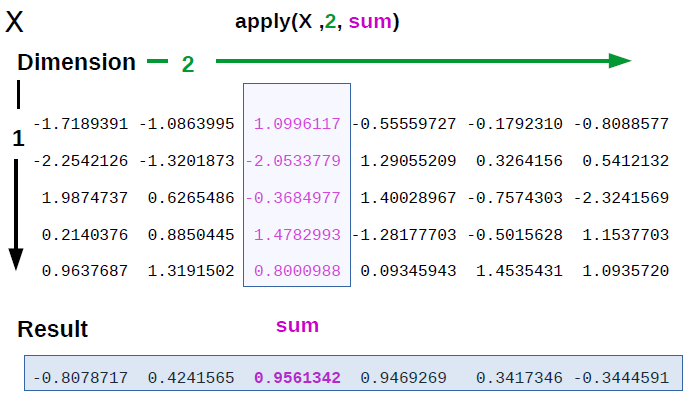

# Unidad 1: Introducción a R.

Antes de sumergirnos en las (otras) cosas divertidas (distribuciones de probabilidad, modelos lineales, pruebas de hipótesis, análisis de correlación, etc.),
vamos a aprender a usar `R` y todas sus facilidades, que utilizaremos luego en las unidades posteriores. `R` se usa tanto para el desarrollo *software* como para el análisis de datos. Durante este curso, vamos a trabajar en un área gris, en algún lugar entre estas dos tareas. Nuestro objetivo principal será analizar datos, pero también realizaremos ejercicios de programación que ayuden a ilustrar ciertos conceptos y que nos provean herramientas para poder desarrollar nuestras propias herramientas de análisis.

## Introducción
### Conociendo R
`R` es tanto un lenguaje de programación como un software útil para la manipulación y el análisis de datos. Es gratis y *open-source*, tanto la distribución base de `R` así como también un gran número de paquetes desarrollados por los usuarios están libremente disponibles bajo los términos de la licencia GNU. Esta licencia tiene dos implicaciones principales para el analista de datos que trabaja con R. Por un lado, el código fuente completo está disponible y, por lo tanto, es posible investigar los detalles de la implementación de un método especial. También se pueden realizar cambios de métodos existentes y distribuir las modificaciones hechas a sus colegas. Consecuentemente, el sistema `R` para la informática estadística está disponible para todos. Todos los científicos, tienen acceso a herramientas de vanguardia para el análisis de datos estadísticos sin costos adicionales. Con la ayuda del sistema `R`, la investigación realmente se vuelve reproducible cuando los datos y los resultados de todos los pasos de análisis de datos informados en un documento están disponibles para los lectores en un *script*.
El sistema `R` para análisis estadístico consiste de la distribución base y una colección de paquetes (*packages*). `R` está implementado en la distribución base, la cual es mantenida por un pequeño grupo de estadísticos, el *Equipo Principal de Desarrollo R* (*R core team*). Las implementaciones de los distintos métodos de análisis y funcionalidades están organizadas en los paquetes. Un paquete contiene clases, métodos, funciones, ejemplos y documentación útiles para cumplir un fin. Los paquetes son creados y mantenidos por los propios usuarios y muchas veces son gestionados en repositorios. La principal fuente de información sobre el sistema `R` está en la  [página web oficial](http://www.R-project.org) de la red mundial del proyecto.
#### Por qué usar R?
* Es libre.
* Es multiplataforma.
* Permite analizar todo tipo de datos.
* Es muy potente y rápido
* Tiene una gran capacidad gráfica.
* Es compatible con múltiples formatos de datos (.csv, .xls, .sav, .sas, .txt, etc.).
* Cuenta con una gran comunidad
### Instalación
Para comenzar es necesario instalar:

1. [`R`](http://mirror.fcaglp.unlp.edu.ar/CRAN/), el lenguaje y entorno de programación.
2. [`RStudio`](https://www.rstudio.com/products/RStudio/), un entorno de desarrollo integrado para trabajar con `R`.

Tanto `R` como `RStudio` están disponibles para Windows, Mac, y Linux. Se recomienda siempre instalar la versión más nueva. La instalación de `RStudio` no es un requisito para utilizar `R` pero sí es una muy buena ayuda, fundamentalmente para los nuevos usuarios.  

#### RStudio
`RStudio` el principal entorno de desarrollo integrado para. Está disponible en ediciones *open source* y comercial, en una versión de escritorio y una versión web  a un servidor Linux que ejecuta RStudio Server o RStudio Server Pro. La interfaz de `Rstudio` incluye una consola, un editor de texto, un gestor del espacio de trabajo y un área de soporte al ususario (Ver [Figura 1](#Figura1)). El editor de texto provee herramientas útiles para la escritura de *scripts* como el resaltado de sintaxis que admite la ejecución directa de código. En el espacio de trabajo es posible explorar tanto los objetos que están actualmente cargados o definidos así como también el historial de funciones y codigo ejecutado en la consola. En la sección de gráficos y ayuda es posible consultar los archivos, gráficos, paquetes y toda la documentación para las diferentes funciones y métodos disponibles.

 ***Figura 1***: *Interfaz gráfica de `RStudio`.*

### Comencemos
Al abrir `RStudio` o `R` desde consola, se desplegará un breve mensaje donde se informa la versión instalada, seguido de un *prompt* `>`:

```
R version 3.5.1 (2018-07-02) -- "Feather Spray"
Copyright (C) 2018 The R Foundation for Statistical Computing
Platform: x86_64-pc-linux-gnu (64-bit)

R is free software and comes with ABSOLUTELY NO WARRANTY.
You are welcome to redistribute it under certain conditions.
Type 'license()' or 'licence()' for distribution details.

  Natural language support but running in an English locale

R is a collaborative project with many contributors.
Type 'contributors()' for more information and
'citation()' on how to cite R or R packages in publications.

Type 'demo()' for some demos, 'help()' for on-line help, or
'help.start()' for an HTML browser interface to help.
Type 'q()' to quit R.
>
```
En forma resumida, el programa evalúa los comándos escritos a continuación del *prompt* y devuelve los resultados de su ejecución:

```
> 2+4
[1] 6
```
O, una operación más compleja:

```
> x<-sqrt(16)+4
```
Esta órden implica que el intérprete de `R` calcule la raíz cuadrada (`sqrt`) de 16 y luego le sume 4. El resultado de esta operación es asignado a un objeto `R` llamado `x`. El operador de asignación `<-` vincula el valor de su lado derecho a la variable `x`, cuyo valor se puede inspeccionar haciendo:

```
> x
[1] 8
```

el cual implícitamente llama a la función `print`:

```
> print(x)
[1] 8
```

#### Operaciones básicas

Algunas de las operaciones matemáticas básicas que seguramente utilizaremos en cualquier código `R` están listadas a continuación.

| Expresión   | Código R          | Resultado |
|-------------|-------------------|-----------|
| $3+2$         | $3+2$               | 5         |
| $3-2$         | $3-2$               | 1         |
| $3\cdot2$         | $3*2$               | 6         |
| $\frac{3}{2}$         | $3/2$               | 1.5       |
| $3^2$         | $3$^$2$               | 9         |
| $2^{-3}$      | $2$^($-3$)           | 0.125     |
| $27^{1/3}$    | $27$^($1/3$)          | 3         |
| $100^{1/2}$   | $sqrt(100)$         | 10        |
| $ln(e)$       | $log(exp(1))$       | 1         |
| $log_{10}(1000)$ | $log10(1000)$      | 3         |
| $log_2$(8)     | $log2(8)$           | 3         |
| $log_4$(16)    | $log(16, base = 4)$ | 2         |
| $sen(0)$      | $sin(0)$            | 0         |
| $\cos(2\pi)$  | $cos(2*pi)$          | 1         |

Es posible también utilizar operadores lógicos en `R`,
| Expresión   | Código R          | Resultado |
|-------------|-------------------|-----------|
| $2\neq4$       | $2~~!=~4$               | TRUE       |
| $3 = 2$         | $3==2$               | FALSE        |
| $5\geq8$         | $5>=8$               | FALSE        |
| $5\leq8$         | $5<=8$               | TRUE        |
| $3 < 9$         | $3<9$               | TRUE         |
| $3 > 9$         | $3>9$               | TRUE         |
| $(5 \geq 8) \land (3 <9)$         | $(5 >= 8) \&(3<9)$               | FALSE         |
| $(2 \neq  4) \lor (3=2)$         | $(2 !=4) | (3==2)$               | TRUE         |

#### Instalación de paquetes
La versión base de `R` viene con un conjunto de paquetes básicos como: `mgcv`,`KernSmooth`, `MASS`, `base`, `boot`,`datasets`, `graphics`, `lattice`, `methods`, `nlme`, `nnet`, `stats`, `tools`, `utils`, entre otros. Algunos de estos paquetes implementan funcionalidades estadísticas estándar, como los modelos lineales o las pruebas de hipotesis clásicas. Otros proveen infraestructura básica como por ejemplo para los sistemas gráficos, herramientas de análisis e interfaz, mientras que otras contienen bases de datos de prueba. Aquellos paquetes que no están incluídos en la distribución base pueden ser instalados mediante el *prompt*. Los paquetes pueden estar en repositorios, propios o comunitarios.

**Consejo**: siempre que estés tratando de hacer algo en `R` que no esté en los paquetes base, busca en los repositorios, seguramente existe un paquete que haga parte o todo lo que necesitás!.

El repositorio más popular para `R` es el de la red del proyecto, *The Comprehensive R Archive Network* ([CRAN](https://cran.r-project.org/)).
La instalación de un paquete se puede hacer de varias formas. Una de ellas es mediante la función `install.packages()`:

```
install.packages("ggplot2")
```

 Si usamos `RStudio` es posible ayudarnos con su asistente de instalación, que se encuentra en `Tools->Install Packages...`. También es posible instalar un paquete desde su archivo fuente, generalmente en formato `.tar.gz`. En una terminal, esto lo hacemos escribiendo:

```
R CMD INSTALL /ruta_al_paquete/paquete.tar.gz
```
Y en `RStudio` seleccionando la opción *Install from package archive files* que se muestra en la ventana emergente del asistente de instalación.

Los paquetes se instalan sólo una vez, luego cada vez que los necesitamos, solo debemos utilizar la función `library` para cargarla a nuestra sesión.
```
library(ggplot2)
```

Particularmente, en el área de la Bioinformática, `R` es muy utilizado, lo que ha motivado la creación de un repositorio exclusivo, [Bioconductor](http://www.bioconductor.org/). Este repositorio provee herramientas para el análisis de datos genómicos de secuenciación de alto rendimiento. Bioconductor usa el lenguaje de programación `R`, también es *open source* y *open development*. Cualquier investigador puede aportar su paquete a Bioconductor, cuyo equipo se encarga de revisar, corregir y realizar un seguimiento de los distintos aportes. Los paquetes depositados en Bioconductor se instalan utilizando funciones específicas del paquete [`BiocInstaller`](http://bioconductor.org/packages/BiocInstaller/). Por ejemplo, el paquete [`limma`](http://bioconductor.org/packages/limma/) se instala ejecutando:

```
source("https://bioconductor.org/biocLite.R")
biocLite("limma")
```

Esta ejecución lo que hace es cargar en el espacio de trabajo la función `biocLite()` de `BiocInstaller` sin instalar todo el paquete. Alternativamente, es posible instalar una vez `BiocInstaller` y luego, cada vez que se desee instalar un paquete, usar la función `biocLite()` cargando previamente el paquete, es decir:

```
library(BiocInstaller)
biocLite("limma")
```
### Funciones definidas por el usuario

`R` permite también utilizar funciones desarrolladas por los usuarios, sin importar si estas están contenidas en un paquete. La sintaxis base de las funciones de `R` es:
```
> myFunction<-function(arg1, arg2){
  statements
  return(object)
}
```
`myFunction` es el nombre de la nueva función, la cual recibe, al menos, los argumentos `arg1` y `arg2`. La definición de la función no require que se especifique el tipo de datos que será cada parámetro y puede o no devolver un objeto de cualquier clase/tipo `R`. La función `return()` siempre devuelve un único objeto, por lo que si se necesita que una función devuelva varios objetos, lo que se suele hacer es devolver una lista donde estén contenidos todos los objetos de interés. Si la función no devuelve objetos, entonces no es necesario el uso de `return()`.

Analicemos este ejemplo:
```
> myFunction<-function(x,y){
    if(x < y){
        print(paste(x, "es menor que", y, sep=" "))
    } else{
        return(x-y)
    }
  }
> myFunction(3,4)
[1] "3 es menor que 4"
> myFunction(4,3)
[1] 1
```
Como se puede apreciar, `R` asume que el primer valor con el que se ha llamado la función corresponde con el valor del primer parámetro mientras que el segundo valor, con el segundo parámetro. Veamos lo que pasa si ahora nombramos los parámetros antes de llamar a la función:
```
> x<-4
> y<-3
> myFunction(y,x)
[1] "3 es menor que 4"
```
En este caso los parámetros se llaman igual que los argumentos de la función. Sin embargo, `R` asigna los valores teniendo en cuenta el órden de los parámetros antes que su nombre. Es por ello que se recomienda siempre asignar los parámetros a cada argumento mediante el operador `=`
```
> z<-4
> myFunction(y,x=z)
[1] 1
```
Los argumentos de la función son aquellas variables que existen sólo en el ámbito de la función. Cualquier objeto o variable externa a ésta, que no haya sida incluída como argumento no será visible en el entorno de la función. El número de argumentos puede variar, incluso es posible incluir como argumento a `...` indicando que es posible pasar más cantidad que el número de argumentos especificados. También se puede utilizar valores por defecto de los argumentos en el encabezado de la función,
```

> myFunction2<-function(x,y=1){
     if(x < y){
         print(paste(x, "es menor que", y, sep=" "))
     }else{
         return(x-y)
     }
  }
> myFunction2(x)
[1] 3
```
Como se mencionó anteriormente, durante la definición de una función no se especifican las clases o tipos de datos que son sus argumentos. Por lo tanto, `R` tratará siempre de utilizar los parámetros con los que se ha llamado la función:
```
> myFunction2(x="a")
Error in x - y : non-numeric argument to binary operator
```
El error generado, es producido por el intento en ejecutar la operación $ x-y$ la cual no está definida para objetos del tipo `character` como lo es `"a"`. Dado que muchas veces estos errores no son muy específicos, se recomienda añadir un preámbulo de control interno a las funciones, definido por el usuario, según las necesidades y características de los argumentos.
```
> myFunction3<-function(x,y=1){
     if(!is.numeric(x) | !is.numeric(y)){
         stop("'x' e 'y' deben ser del tipo 'numeric'")
     }
     if(x < y){
         print(paste(x, "es menor que", y, sep=" "))
     }else{
         return(x-y)
     }
  }
> myFunction3(x="a")
Error in myFunction3(x = "a") : 'x' e 'y' deben ser del tipo 'numeric'
```
Claramente, este error es más informativo que el anterior, automáticamente generado por `R`. También es posible asignar tareas diferentes a la función dependiendo de la clase que son los argumentos:
```
> myFunction4<-function(x,y=1){
     if(!is.numeric(y)){
         stop("'y' debe ser del tipo 'numeric'")
     }
     if(is.character(x)){
         x<-1
     }

     if(x < y){
         print(paste(x, "es menor que", y, sep=" "))
     }else{
         return(x-y)
     }}
> myFunction4(x="hola", y=3)
[1] "1 es menor que 3"
> myFunction4(x="hola", y="clase")
Error in myFunction4(x = "hola", y = "clase") :
  'y' debe ser del tipo 'numeric'
```
Por último, es posible que se cuente con un conjunto de funciones definidas por el usuario, a utilizar en diversos análisis. Para simplificar el uso y carga de estas funciones, se las suele incluir en un archivo `.R` el cual es cargado luego en el *enviroment* con la función `source()`.

### Ayuda y documentación
`R` provee de un sistema de ayuda de fácil acceso útil para consultar la información de ayuda que acompaña a cada función, método, clase o base de datos. Todas las estructuras en `R` deberían tener asociado un manual donde se liste información que contribuya a la comprensión de su uso. Para acceder al ayuda de una función/clase/paquete, sólo basta con utilizar la función `help()` o el operador `?` seguido del nombre de la función/clase/paquete. Por ejemplo:

```
?sqrt
```
```
help(package="stats")
```

Si estamos usando `RStudio` la primer ejecución determinará que en la sección de gráficos y ayuda se fije la pestaña *Help* listando el manual correspondiente a la función `sqrt`. Si lo hacemos en la consola, esta información se desplegará al ejecutar la línea de código como una nueva página (**Nota**: para salir de esta página debemos ingresar el caracter `q`). La segunda ejecución abrirá el manual del paquete `stats`.

Adicionalmente, cada desarrollador puede incorporar en su paquete una *viñeta* con el objetivo de guiar al usuario en los usos comunes del paquete. Por ejemplo, la [viñeta](http://www.bioconductor.org/packages/release/bioc/vignettes/limma/inst/doc/usersguide.pdf) del paquete `limma` detalla su uso para el análisis de datos de microarreglos de ADN, RNA-seq, entre otros.
```
browseVignettes(package="limma")
```
**Consejo**: Ante cualquier duda sobre una función o paquete consultar rápidamente el manual desde `R`. Si éste no es suficiente, consultar la viñeta o visitar los foros de R (hay un montón) donde hay mucha información disponible.

## Tipos de datos y estructuras de datos

`R` trabaja con cinco tipos básicos de datos:

* *Numeric*: Tambíen conocidos como *Double*. Es el tipo de dato por defecto cuando se trabaja con números.
```
> x<-5/2
> x
[1] 2.5
> class(x)
[1] numeric
```
* *Integer*: Datos números enteros.
* *Complex*: Datos números complejos.
* *Logical*: Datos lógicos, con dos posibles valores `TRUE` o `FALSE`.
  **Importante**: los valores `NA` (*Not Available*) se consideran lógicos.
* *Character*: Caracteres o cadenas de caracteres.
```
> x<-"a"
> y<-"hola"
> class(x)
[1] character
> class(y)
[1] character
```

`R` también posee estructuras de datos básicas, que pueden ser homogéneas (todos los datos son del mismo tipo) o heterogéneas:

| Dimensión   | Homogéneas      | Heterogéneas |
|-------------|-----------------|--------------|
| 1           | *Vector*        | *List*       |
| 2           | *Matrix*        | *Data Frame* |
| 3 o más     | *Array*         |              |

### Vectores
#### Creando un vector
Los datos del tipo `vector` son muy utilizados en `R`. Son estructuras lineales, indexadas a partir de la posición `1`, es decir, la posición `[1]` en el vector indica su primer elemento. La forma más sencilla para crear un vector es usando la función `c()`, la cual *combina* los elementos que recibe como parámetros para crear un vector.

```
> x<-c(1,3,5,7)
> x
[1] 1 3 5 7
```

Como los vectores son estructuras de datos homgéneas, todos sus elementos deben ser del mismo tipo. Por lo tanto, antes de crear un vector, todos los valores recibidos son convertidos a uno de los tipos de datos que permita representar todos los valores. Por ejemplo:

```
> c(30, "hola", TRUE)
[1] "30" "hola" "TRUE"
> c(30, TRUE)
[1] 30 1
```
También es posible crear un vector a partir de una secuencia de números consecutivos utilizando el operador `:`,

```
> x<-4:10
> x
[1] 4 5 6 7 8 9 10
```
La función `seq` también es útil para crear una secuencia. A diferencia del operador `:`, esta función permite especificar la distancia numérica que existe entre cada elemento de la secuencia. La secuencia se creará tomando como primer valor el del parámetro `from` y como último, el del parámetro `to`. Por ejemplo,
```
> seq(from=0, to=1, by=0.1)
[1] 0.0 0.1 0.2 0.3 0.4 0.5 0.6 0.7 0.8 0.9 1.0
```

Otra función útil para crear un vector es `rep`, la cual replica los valores del parámetro `x` tantas veces como se indica mediante el parámetro `times`.
```
> rep(x=c("Bioingeniería", "Bioinformática"), times=3)
[1] "Bioingeniería"  "Bioinformática" "Bioingeniería"  "Bioinformática" "Bioingeniería"
[6] "Bioinformática
```

#### Funciones básicas
Una de las primeras cosas que vamos a necesitar hacer con un vector es acceder a sus elementos. Para ello, es posible utilizar el operador `[]`, lo que puede requerir conocer la posición que contiene nuestro elemento dentro del vector.
```
> x[2]
[1] 5
```
Además de seleccionar un sólo elemento es posible seleccionar un conjunto de elementos de un vector, ya sea especificando los elementos a conservar,
```
> x[2:4]
[1] 5 6 7
> x[c(1,3,5)]
[1] 4 6 8
```
O especificando cuáles elementos no queremos consevar,
```
> x[-c(2,4,6,7)]
[1] 4 6 8
```
Cabe destacar que el conjunto de los índices que se usan para seleccionar elementos de un vector es en sí otro vector, por lo tanto, es posible hacer,
```
> rmIdx<-c(2,4,6,7)
> x[-rmIdx]
[1] 4 6 8
```
`R` permite asignar un nombre a cada elemento del vector. Una forma de hacerlo es durante la creación del vector:
```
> colorsVector<-c(blue="azul", red="rojo", green="verde")
> colorsVector
blue     red   green
"azul"  "rojo" "verde"  
```
O, alternativamente, con la función `names`, durante cualquier momento luego de la creación del vector.
```
> names(colorsVector)
[1] "blue" "red" "green"
> names(colorsVector)<-c("BLUE", "RED", "GREEN")
> names(colorsVector)
[1] "BLUE" "RED" "GREEN"
```
**Nota**: `R` distingue mayúsculas de minúsculas!!.

El hecho de que los elementos del vector tengan nombre nos permite acceder a ellos prescindiendo de la posición del elemento dentro del vector,
```
colorsVector["RED"]
RED
"rojo"
```
Los vectores son unidimensionales, por lo tanto sólo presentan longitud. `R` provee la función `length` que permite obtener la longitud de un vector:
```
> length(colorsVector)
[1] 3
> y<-1
> length(y)
[1] 1
```
**Nota**: En `R` no existen los escalares. Los números, son simplemente vectores de longitud 1.

#### Vectorización
Una de las fortalezas que presenta `R` es el uso de operaciones y funciones vectorizadas, las cuales suelen ser muy rápidas y eficientes.
```
> x+1
[1]  5  6  7  8  9 10 11
> x*2
[1]  8 10 12 14 16 18 20
> log(x)
[1] 1.386294 1.609438 1.791759 1.945910 2.079442 2.197225 2.302585
> x >= 6
[1] FALSE FALSE  TRUE  TRUE  TRUE  TRUE  TRUE
```
Como muestra la última instrucción, los operadores lógicos también están vectorizados, lo que resulta muy util a la hora de seleccionar elementos de un objeto,

```
> x[x>=6]
[1]  6  7  8  9 10
```

Estas tareas también pueden involucrar el uso de la función `which` que nos indica cuáles son los elementos que cumplen cierta condición,
```
> which( x>=6)
[1] 3 4 5 6 7
> x[which( x>=6 )]
[1]  6  7  8  9 10
```
Las funciones estadísticas básicas, como cálculo de **media muestral** y **varianza muestral** son tambien funciones vectorizadas.
```
> mean(x)
[1] 7
> var(x)
[1] 4.666667
> sd(x)
[1] 2.160247
```
Muchas veces ocurre que los datos reales presentan valores faltantes como consecuencia de registros incompletos, errores de tipeo, etc. En `R`, los valores faltantes se representan con `NA` (*Not Available*). Algunas funciones admiten `NAs` en sus implementaciones mientras que otras no lo hacen.
```
> y<-c(x, NA)
> y
[1]  4  5  6  7  8  9 10 NA
> length(y) # admite NAs
[1] 8
> mean(y) # no admite NAs
[1] NA
> mean(y, na.rm=TRUE) # indicamos que los NAs sean eliminados
[1] 7
> sum(y)
[1] NA
> sum(y, na.rm = TRUE)
[1] 49
```
Los vectores también se pueden construir a partir de valores lógicos.
```
> log.vector <- c (TRUE, TRUE, FALSE, TRUE, FALSE)
> log.vector
[1] TRUE TRUE FALSE TRUE FALSE
```
En `R`, los valores lógicos pueden ser forzados a comportarse como numéricos, asignando un `1` a los valores `TRUE` y `0`a los `FALSE`. Luego, si intentamos por ejemplo sumar un vector lógico de la siguiente manera,
```
> sum (log.vector)
[1] 3
```
lo que obtenemos es la cantidad de valores `TRUE` que hay en el vector `log.vector`.

**Ejercicio**: De qué otra forma es posible obtener este número?

Hay muchas funciones en `R` que operan con vectores retornando vectores o valores lógicos. Una de ellas es la función `is.na()` la cual retorna un vector de igual longitud del vector que recibió como parámetro, que indica cuáles de los elementos de dicho vector son `NA`.
```
> is.na(y)
[1] FALSE FALSE FALSE FALSE FALSE FALSE FALSE TRUE
```
Esta función es muy utilizada en el análisis de datos, ya los datos faltantes son muy frecuentes y deben ser identificados y tratados antes de el análisis propiamente dicho. Cuando hay datos faltantes, una alternativa es eliminarlos

```
y.clean<-y[!is.na(y)]
```

En algunas ocasiones, puede que el porcentaje de `NAs` sea elevado, por lo que su simple eliminación no es recomendada. Una forma sencilla de no perder estos datos es **imputando** los datos faltantes por el valor medio o más frecuente, (dependiendo del tipo de dato):
```
> y.complete<-y
> y.complete[is.na(y.complete)]<-mean(y.complete, na.rm=TRUE)
> y.complete
[1]  4  5  6  7  8  9 10  7
```

### Matrices
#### Construccion
Las matrices en `R` se representan a traves de objetos de la clase `matrix`, los cuales contienen filas (*rows*) y columnas (*cols*) donde se guardan elementos de un mismo tipo.

La forma mas sencilla de crear una matriz es a través del constructor, la función `matrix()`. Esta función admite diversos parámetros y combinaciones de ellos. Por ejemplo, si sólo se ha ejecutado la función conteniendo un vector `x`, entonces `matrix()` crea una matriz de tantas filas como longitud de `x` y una columna donde se almacenan los valores de dicho vector:
```
> matrix(x)
[,1]
[1,]    4
[2,]    5
[3,]    6
[4,]    7
[5,]    8
[6,]    9
[7,]   10
```
Alternativamente, es posible definir el número de filas (parámetro `nrow`) y/o de columnas (parámetro `ncol`). Las siguientes ejecuciones ilustran el uso de diferentes combinaciones de dichos parámetros:
```
> datos<-1:10
> matrix(datos, nrow=2)
      [,1] [,2] [,3] [,4] [,5]
[1,]    1    3    5    7    9
[2,]    2    4    6    8   10
# es equivalente a
> matrix(datos, ncol=5)
      [,1] [,2] [,3] [,4] [,5]
[1,]    1    3    5    7    9
[2,]    2    4    6    8   10
# y a
> matrix(datos, ncol=5, nrow=2)
      [,1] [,2] [,3] [,4] [,5]
[1,]    1    3    5    7    9
[2,]    2    4    6    8   10

```

El llenado de las celdas de una matriz, por defecto, se hace por columnas. Para cambiar esto, se debe utilizar el parámetro `byrow` el cual debe ser fijado a `TRUE`,
```
> matrix(datos, ncol=5, byrow=TRUE)
      [,1] [,2] [,3] [,4] [,5]
[1,]    1    3    5    7    9
[2,]    2    4    6    8   10

```
También es posible crear matrices vacías de dimensión específica. Por defecto, una matriz vacía está llena de `NA`.
```
> matrix(nrow=2, ncol=2)
      [,1] [,2]
[1,]   NA   NA
[2,]   NA   NA
```
Las dimensiones de una matriz pueden ser indagadas con la función `dim`, la cual devuelve el número de filas y el número de columnas que forman dicha matriz. Cada una de estas cantidades puede tambien obtenerse utilizando las funciones `nrow` y `ncol`, respectivente.
```
> myMatrix<-matrix(0,nrow=2, ncol=3)
> dim(myMatrix)
[1] 2 3
> nrow(myMatrix)
[1] 2
> ncol(myMatrix)
[1] 3
```
Es posible asignar valores y/o acceder a los nombres a las filas y las columnas de una matriz, para ello se utilizan las funciones `rownames` y `colnames`
```

> rownames(myMatrix)<-c("a", "b")
> rownames(myMatrix)
[1] "a" "b"
> colnames(myMatrix)<-c("A", "B", "C")
> myMatrix
  A B C
a 0 0 0
b 0 0 0
> dimnames(myMatrix)
[[1]]
[1] "a" "b"

[[2]]
[1] "A" "B" "C"

```
Otra forma de obtener matrices es a través de funciones. Por ejemplo, las funciones `cbind` y `rbind`, se utilizan para combinar vectores en columnas y filas, respectivamente:

```
> M<-cbind(c("a", "b", "c"), c("A", "B", "C"))
> M
     [,1] [,2]
[1,] "a"  "A"
[2,] "b"  "B"
[3,] "c"  "C"
> class(M)
[1] "matrix"
> rbind(c("a", "b", "c"), c("A", "B", "C"))
     [,1] [,2] [,3]
[1,] "a"  "b"  "c"
[2,] "A"  "B"  "C"
```
#### Operaciones básicas

Como una matriz tiene dos dimensiones, para acceder a un elemento de ella es necesario especificar tanto la fila como la columna que deseamos extraer, utilizando nuevamente el operador `[]`, separando el número de fila y el de columna por una `,`:
```
> M[3,1] # acceder al elemento fila 3 columna 1
[1] "c"
```
También es posible acceder a una fila o columna completa. Para ello, sólo se debe especificar el número de fila o columna que se quiere obtener, dejando sin especificar el valor de la otra dimensión:
```
> M[3,] # acceder a la fila 3
[1] "c" "C"
> M[,1] # acceder a la columna 1
[1] "a" "b" "c"
```
**Ejercicio**: Cree un nuevo elemento (`fila2`) a partir de la fila 2 de la matriz `M`, determine su longitud e indague acerca su clase.

También es posible acceder a los elementos de una matriz mediante los nombres de las filas y/o columnas, si es que se han definido previamente.
```
> colnames(M)<-c("minúsculas", "mayúsculas")
> M[,"minúsculas"] # acceder a la columna 1
[1] "a" "b" "c"
```

Las funciones matemáticas clásicas `+`, `-`, `*` y `/` también están vectorizadas para las matrices
```
> M1<-matrix(1:9, nrow=3)
> M1
     [,1] [,2] [,3]
[1,]    1    4    7
[2,]    2    5    8
[3,]    3    6    9
> M2<-matrix(rev(1:9), nrow=3)
> M2
     [,1] [,2] [,3]
[1,]    9    6    3
[2,]    8    5    2
[3,]    7    4    1
> M1 + M2
     [,1] [,2] [,3]
[1,]   10   10   10
[2,]   10   10   10
[3,]   10   10   10
> M1 - M2
     [,1] [,2] [,3]
[1,]   -8   -2    4
[2,]   -6    0    6
[3,]   -4    2    8
> M1 * M2
     [,1] [,2] [,3]
[1,]    9   24   21
[2,]   16   25   16
[3,]   21   24    9
> M1 / M2
          [,1]      [,2]     [,3]
[1,] 0.1111111 0.6666667 2.333333
[2,] 0.2500000 1.0000000 4.000000
[3,] 0.4285714 1.5000000 9.000000

```
Observe que la operación `M1*M2` no es un producto matricial, sino que es la matriz resultante del producto, uno a uno, entre los elementos de `M1` y `M2`. El **producto matricial** puede obtenerse con el operador `%*%`.
```
> Mprod<-M1%*%M2
> Mprod
     [,1] [,2] [,3]
[1,]   90   54   18
[2,]  114   69   24
[3,]  138   84   30
```
**Nota**: La operación `M1%/%M2` no hace producto matricial entre la `M1` y la inversa de `M2` sino que obtiene la parte entera de la división, elemento a elemento, de `M1` y `M2`.

Otras operaciones útiles en `R`, son por ejemplo la obtención de la **traspuesta** y de la **inversa** de una matriz, mediante las funciones `t()` y `solve()`, respectivamente.
```
> M<-matrix(c(-1,3,-5,2,-4,6,-7,0,2), ncol=3)
> M
     [,1] [,2] [,3]
[1,]   -1    2   -7
[2,]    3   -4    0
[3,]   -5    6    2
> t(M)
     [,1] [,2] [,3]
[1,]   -1    3   -5
[2,]    2   -4    6
[3,]   -7    0    2
> solve(M)
     [,1] [,2] [,3]
[1,] -0.8 -4.6 -2.8
[2,] -0.6 -3.7 -2.1
[3,] -0.2 -0.4 -0.2
```
Si quisieramos verificar que la inversa está bien calculada, podríamos multiplicarla por la matriz y deberíamos obtener la matriz identidad de dimensión igual a la matriz `M`:
```
> M%*%solve(M)
              [,1]          [,2]          [,3]
[1,]  1.000000e+00 -8.881784e-16 -2.220446e-16
[2,]  8.881784e-16  1.000000e+00  0.000000e+00
[3,] -2.775558e-16 -5.551115e-16  1.000000e+00
```
Como se puede apreciar, el resultado obtenido no es exactamente igual a la matriz identidad de dimensión 3:
```
> diag(3)
      [,1] [,2] [,3]
[1,]    1    0    0
[2,]    0    1    0
[3,]    0    0    1

> M%*%solve(M) == diag(3)
      [,1]  [,2]  [,3]
[1,] FALSE FALSE FALSE
[2,] FALSE FALSE  TRUE
[3,] FALSE FALSE FALSE
```
Esto se debe a diferencias mínimas de los cálculos computacionales. Hay funciones en `R` que nos permiten comparar estas matrices teniendo en cuenta esos pequeños errores debidos a cálculos computacionales. Por ejemplo, la función `all.equal()`:
```
> all.equal(M%*%solve(M),diag(3))
[1] TRUE
```
**Ejercicio**: Obtenga la matriz inversa de `M` por medio de la matriz adjunta.

Anteriormente se ha usado la función `diag()` para crear una matriz identidad de dimensión 3. Esta función en particular admite otros usos, por ejemplo, es útil para extraer la diagonal principal de una matriz:
```
> diag(M)
[1] -1 -4  2
```
O para crear una matriz diagonal:
```
> diag(diag(M))
     [,1] [,2] [,3]
[1,]   -1    0    0
[2,]    0   -4    0
[3,]    0    0    2
```
`R` también está optimizado con funciones específicas que operan sobre las filas o las columnas de una matriz,
```
> rowMeans(M)
[1] -2.0000000 -0.3333333  1.0000000
> colMeans(M)
[1] -1.000000  1.333333 -1.666667
> rowSums(M)
[1] -6 -1  3
> colSums(M)
[1] -3  4 -5
```
##### Operaciones entre vectores y matrices

Ciertas funciones en `R` se comportan de forma diferente según se utilicen con vectores o con matrices. Por ejemplo, una de ellas es el operador `%*%`. En el caso de dos vectores `x` e `y`, la operación `x%*%y` se usa para calcular el **producto interno** entre estos dos vectores:

```
> x<-c(1:6)
> y<-c(rep(c(1,0.5), 3))
> x
[1] 1 2 3 4 5 6
> y
[1] 1.0 0.5 1.0 0.5 1.0 0.5
> x %*% y # producto interno entre x e y
     [,1]
[1,]   15
> x %o% y # producto externo entre x e y
     [,1] [,2] [,3] [,4] [,5] [,6]
[1,]    1  0.5    1  0.5    1  0.5
[2,]    2  1.0    2  1.0    2  1.0
[3,]    3  1.5    3  1.5    3  1.5
[4,]    4  2.0    4  2.0    4  2.0
[5,]    5  2.5    5  2.5    5  2.5
[6,]    6  3.0    6  3.0    6  3.0
```
Si ahora forzamos a que uno de estos dos vectores sean una matriz, por ejemplo `x`, la operación ahora no se podría realizar ya que los operandos no serían compatibles. Veamos lo que sucede:
```
> as.matrix(x)
     [,1]
[1,]    1
[2,]    2
[3,]    3
[4,]    4
[5,]    5
[6,]    6
> as.matrix(x) %o% y
     [,1] [,2] [,3] [,4] [,5] [,6]
[1,]    1  0.5    1  0.5    1  0.5
[2,]    2  1.0    2  1.0    2  1.0
[3,]    3  1.5    3  1.5    3  1.5
[4,]    4  2.0    4  2.0    4  2.0
[5,]    5  2.5    5  2.5    5  2.5
[6,]    6  3.0    6  3.0    6  3.0
```
`R` automáticamente identifica que el primer elemento es una matriz por lo que trata de convertir al segundo elemento, `y`, en otra matriz de manera que el producto matricial entre ellas sea conformable, es decir que `y` es transformado a una matriz con una única fila y seis columnas.

Además de los operadores `%*%` y `%o%`, los productos internos y externos entre vectores también se pueden hacer con las funciones `crossprod()` y `tcrossprod()`.
```
> crossprod(x,y)
     [,1]
[1,]   15
> tcrossprod(x,y)
     [,1] [,2] [,3] [,4] [,5] [,6]
[1,]    1  0.5    1  0.5    1  0.5
[2,]    2  1.0    2  1.0    2  1.0
[3,]    3  1.5    3  1.5    3  1.5
[4,]    4  2.0    4  2.0    4  2.0
[5,]    5  2.5    5  2.5    5  2.5
[6,]    6  3.0    6  3.0    6  3.0
```

Estas funciones también se pueden usar con matrices. Por ejemplo, la sentencia `crossprod(X,Y)` (`tcrossprod()`) calcula el producto matricial $X^T Y$ ($X Y^T$), lo que nos será de gran interés cuando estudiemos los modelos lineales.

```
> X<-matrix(rep(1:3,3),ncol=3, nrow=3)
> Y<-diag(rep(2,3))
> crossprod(X,Y)
     [,1] [,2] [,3]
[1,]    2    4    6
[2,]    2    4    6
[3,]    2    4    6
```
**Ejercicio**: Verifique el resultado de la función `crossprod()`.

### Data frames
#### Construcción y funciones básicas

Hasta ahora hemos visto dos estructuras de datos, las matrices y los vectores. La limitación que poseen estas estructuras es que sólo pueden contener un único tipo de datos. A diferencia de ellos, los objetos de la clase `data.frame` pueden contener más de un tipo de dato en una única estructura. Esta característica es fundamentalmente útil cuando trabajamos con bases de datos que combinan información de distintas fuentes.

Un `data.frame` es una colección de vectores, cada uno de los cuales contiene datos de un mismo tipo, pudiendo ser diferentes los tipos de datos entre vectores. La única limitación que tienen estos vectores es que todos deben tener la misma longitud.

```
> myDF<-data.frame(numeros=1:5, letras=c("a", "b","c", "d", "e"), logicos=c(TRUE, TRUE, FALSE, TRUE, FALSE))
> myDF
  numeros letras logicos
1       1      a    TRUE
2       2      b    TRUE
3       3      c   FALSE
4       4      d    TRUE
5       5      e   FALSE
```
Algunas de las funciones básicas para conocer las propiedades de un `data.frame` son
```
> nrow(myDF)
[1] 5
> ncol(myDF)
[1] 3
> names(myDF)
[1] "numeros" "letras"  "logicos"
> colnames(myDF)
[1] "numeros" "letras"  "logicos"
> rownames(myDF)
[1] "1" "2" "3" "4" "5"
```
Particularmente, la función `str()` resulta de gran utilidad para explorar la estructura de este tipo de datos:
```
> str(myDF)
'data.frame':	5 obs. of  3 variables:
 $ numeros: int  1 2 3 4 5
 $ letras : Factor w/ 5 levels "a","b","c","d",..: 1 2 3 4 5
 $ logicos: logi  TRUE TRUE FALSE TRUE FALSE
```
**Nota**: Preste atención al tipo de datos que presenta el vector `letras` dentro del `data.frame`. Luego trabajaremos sobre él.

Cabe destacar que, a diferencia de las matrices que poseen filas y columnas, un `data.frame` tiene *variables* y *observaciones*.

Como en las matrices, existen diversas formas de acceder a los elementos de un `data.frame`:
```
> myDF$numeros
[1] 1 2 3 4 5
> myDF[,"numeros"]
[1] 1 2 3 4 5
> myDF[,1]
[1] 1 2 3 4 5
> myDF$logicos[1]
[1] TRUE
> myDF[1,"logicos"]
[1] TRUE
> myDF[1,3]
[1] TRUE
> myDF[1,colnames(myDF)=="logicos"]
[1] TRUE
```
Agregar información a un `data.frame` también es bastante sencillo. Una forma para añadir una nueva variable es simplemente mediante el operador `$`.
```
> myDF$factor<-factor(c(rep("blue",2), "green", rep("red",2)))
> myDF
  numeros letras logicos factor
1       1      a    TRUE   blue
2       2      b    TRUE   blue
3       3      c   FALSE  green
4       4      d    TRUE    red
5       5      e   FALSE    red
> myDF[,"vacio"]<-""
> myDF
  numeros letras logicos factor vacio
1       1      a    TRUE   blue      
2       2      b    TRUE   blue      
3       3      c   FALSE  green      
4       4      d    TRUE    red      
5       5      e   FALSE    red      
```
Alternativamente, se puede usar también la función `cbind()` para agregar variables y la función `rbind()` para añadir observaciones.
```
> cbind(myDF, NAs=NA)
  numeros letras logicos factor vacio NAs
1       1      a    TRUE   blue        NA
2       2      b    TRUE   blue        NA
3       3      c   FALSE  green        NA
4       4      d    TRUE    red        NA
5       5      e   FALSE    red        NA
> rbind(myDF, c(6, "e", TRUE, "red", ""))
 numeros letras logicos factor vacio
1       1      a    TRUE   blue      
2       2      b    TRUE   blue      
3       3      c   FALSE  green      
4       4      d    TRUE    red      
5       5      e   FALSE    red      
6       6      e    TRUE    red    
```

En `R` es posible convertir matrices a `data.frames` y viceversa. Para ello, existen las funciones `as.matrix()` y `as.data.frame()`. Cabe destacar que, al convertir un `data.frame` en una matriz, los datos son todos convertidos a un tipo de dato que permita representarlos a todos, por lo general `character`.
```
> as.matrix(myDF)
     numeros letras logicos
[1,] "1"     "a"    " TRUE"
[2,] "2"     "b"    " TRUE"
[3,] "3"     "c"    "FALSE"
[4,] "4"     "d"    " TRUE"
[5,] "5"     "e"    "FALSE"
```
 Ahora bien, cuando usamos la función `as.data.frame()`, la conversión dependerá del tipo de datos que esté contenido en la matriz.
```
> myDF2<-as.data.frame(as.matrix(myDF))
> myDF2
  numeros letras logicos
1       1      a    TRUE
2       2      b    TRUE
3       3      c   FALSE
4       4      d    TRUE
5       5      e   FALSE
> str(myDF2)
'data.frame':	5 obs. of  3 variables:
 $ numeros: Factor w/ 5 levels "1","2","3","4",..: 1 2 3 4 5
 $ letras : Factor w/ 5 levels "a","b","c","d",..: 1 2 3 4 5
 $ logicos: Factor w/ 2 levels " TRUE","FALSE": 1 1 2 1 2

 > str(as.data.frame(matrix(0,ncol=2, nrow=3)))
'data.frame':	3 obs. of  2 variables:
 $ V1: num  0 0 0
 $ V2: num  0 0 0
```
Los vectores de caracteres, al ser contenidos en un `data.frame()` son convertidos a elementos del tipo `factor`. Si bien los factores no son una estructura alternativa a los vectores, vamos a dedicarles una sección aparte ya que son extremadamente útiles en el modelado estadístico.

### Factores

Los factores son un tipo de dato unidimensional, como los vectores. Lo que los distingue de ellos es que se utilizan para codificar **variables categóricas**, es decir variables cuyo valor posible pertenece a un conjunto finito de elementos. Por ejemplo, pensemos la variable *color de ojos*, cuyos valores posibles son {"*Marrón*", "*Azul*", "*Verde*", "*Negro*"}. Es por ello que cualquier columna de un `data.frame` que contenga datos del tipo `character` es automáticamente identificada como un `factor`.
```
myDF$letras
[1] a b c d e
Levels: a b c d e
```
Un vector del tipo `factor` se compone de las observaciones y de los *niveles* (*levels*), los cuales representan los valores posibles que puede tener la variable representada por ese factor. En el ejemplo anterior, el número de observaciones coincide con el número de niveles, pero esto no siempre es así. Es posible crear un `factor` por fuera de un `data.frame`. Para ello es necesario especificar, al menos, las observaciones y utilizar la función `factor()`.
```
> colorOjos<-factor(c(rep("green", 2), rep("brown",5), rep("black",2)))
> colorOjos
 [1] green green brown brown brown brown brown black black
Levels: black brown green
```
Por defecto, los niveles del `factor` se definen a partir de las observaciones y su órden se establece alfabéticamente. Ahora bien, note que en este ejemplo, no se han registrado observaciones de color de ojos azules, aunque, por conocimiento del problema, sabemos que éste es un valor posible. Muchas veces es útil conservar este valor entre los niveles del factor, por más que no se lo haya observado. Para ello, se define los valores posibles y el órden de éstos asignando un órden específico para ellos, utilizando el parámetro `levels`.
```
> colorOjos<-factor(c(rep("green", 2), rep("brown",5), rep("black",2)), levels=c("blue", "green", "brown", "black"))
> colorOjos
[1] green green brown brown brown brown brown black black
Levels: blue green brown black
```
**Nota**: Cuando se añaden observaciones a las variables del tipo `factor` es fundamental tener en cuenta que el valor a añadir debe estar definido dentro de los posibles niveles del factor, sino `R` nos informará mediante un `warning` que esto está ocurriendo y el nuevo valor será convertido a `NA`.
```
> rbind(myDF, c(6, "f", TRUE, "red", ""))
  numeros letras logicos factor vacio
1       1      a    TRUE   blue      
2       2      b    TRUE   blue      
3       3      c   FALSE  green      
4       4      d    TRUE    red      
5       5      e   FALSE    red      
6       6   <NA>    TRUE    red      
Warning message:
In `[<-.factor`(`*tmp*`, ri, value = "f") :
  invalid factor level, NA generated
```
Para evitar esto, primero debemos entonces redefinir la variable `letras` para incluir en sus niveles a la letra *f* y luego si añadir la nueva observación al `data.frame`.
```
> myDF$letras<-factor(as.character(myDF$letras), levels=c(levels(myDF$letras), "f"))
> rbind(myDF, c(6, "f", TRUE, "red", ""))
  numeros letras logicos factor vacio
1       1      a    TRUE   blue      
2       2      b    TRUE   blue      
3       3      c   FALSE  green      
4       4      d    TRUE    red      
5       5      e   FALSE    red      
6       6      f    TRUE    red    
```

La estructura y los datos de un `factor` pueden explorarse mediante diversas funciones
```
> head(colorOjos)
[1] green green brown brown brown brown
Levels: blue green brown black
> length(colorOjos)
[1] 9
> levels(colorOjos)
[1] "blue"  "green" "brown" "black"
> table(colorOjos)
colorOjos
 blue green brown black
    0     2     5     2
```
**Nota**:¿Qué le parece que hace la función `table()`? Esta función no sólo es útil para factores sino que también se puede usar con, por ejemplo, variables lógicas:
```
> table(1:10 >5)

FALSE  TRUE
    5     5
```

### Listas
Una lista es una estructura unidimensional heterogénea. Es decir, está indexada como un vector, pero cada elemento puede ser de cualquier tipo. La forma más sencilla de crear una lista es mediante el constructor (`list()`):
```
myList<-list(vector=1:4, character=c("a", "b"), matrix=matrix(,nrow=2, ncol=2), factor=factor(c(rep("a",2), rep("b",3))), dataFrame=data.frame(x=1:3, y=1:3))
> myList
$`vector`
[1] 1 2 3 4

$character
[1] "a" "b"

$matrix
     [,1] [,2]
[1,]   NA   NA
[2,]   NA   NA

$factor
[1] a a b b b
Levels: a b

$dataFrame
  x y
1 1 1
2 2 2
3 3 3

```
En este ejemplo, los elementos de la lista están nombrados, aunque esto no es necesario,
```
> list(1:4,c("a", "b"))
[[1]]
[1] 1 2 3 4

[[2]]
[1] "a" "b"
```
Para acceder a los elementos de una lista se puede usar el operador `[]`,
```
> myList["factor"]
$`factor`
[1] a a b b b
Levels: a b

> myList[1]
$`vector`
[1] 1 2 3 4
> class(myList[1])
[1] "list"
```
En cualquiera de los dos casos, el objeto que se obtiene es también una lista, en este caso, de longitud 1. Si lo que se desea es recuperar el objeto que está contenido en ese elemento, es posible usar el nombre del elemento o el operador `[[]]`:
```
> myList[["factor"]]
[1] a a b b b
Levels: a b
> myList$dataFrame
  x y
1 1 1
2 2 2
3 3 3
> myList[[1]]
[1] 1 2 3 4
> class(myList[1])
[1] "integer"
```
## Manipulación de datos en `R`

### Carga, importación y exportación de bases de datos

A lo largo de esta sección estudiaremos distintas funciones y facilidades de `R`. Para ejemplificar los contenidos usaremos el conjunto de datos de ejemplo `iris`, incluído en la versión base de `R`. Este dataset es muy famoso en el mundo del *machine learning*. El objetivo de este dataset es predecir la clase de tres especies de flores: *Sepal*, *Versicolor*, *Virginica*. Para ello, incluye información de numerosas observaciones a las cuales se les ha registrado parámetros como longitud y ancho de sépalo y pétalo.

Para cargar el paquete sólo necesitamos ejecutar la función `data()` con el nombre del dataset.
```
> data("iris")
```
Al ejecutar esta sentencia, en el espacio de trabajo de `RStudio` verán que aparece una estructura llamada `iris`.

Los datos no siempre van a poder ser cargados en `R` con la función `data()`. Muchas veces vamos a querer analizar nuestros propios datos, los cuales pueden estar en distintos formatos `.tab`, `.xls`, `.csv`, `.txt`, etc. Para ello, es posible utilizar diversas funciones disponibles en la versión base de `R` y/o en los paquetes desarrollados por la comunidad. Por ejemplo, si tenemos un archivo donde los datos están separados por tabulaciones, es posible utilizar la función `read.table()`, mientras que si los separadores son comas, entonces se usará la función `read.csv()`. También es posible utilizar la función `read.delim()` especificando el separador de elementos mediante el parámetro `sep`. Análogamente, para guardar los datos en formatos de archivos típicos como  `.tab`, `.csv` o `.txt` existen las funciones `write.table`, `write.csv` y `write.delim`.
```
iris<-read.table("iris.tab", header=TRUE)
write.csv(iris,file = "iris.csv", quote=FALSE, row.names=FALSE)
```
Cabe destacar que estas funciones reciben numerosos parámetros que especifican las características del archivo a leer/escribir. Por ejemplo, es posible especificar si el punto decimal se representa por punto o por coma, si se desean saltar líneas o leer sólo un número fijo de éstas, etc.

También es posible almacenar nuestros datos en formato `RData` para poder luego volver a utilizarlos o incluso compartirlos con otros usuarios. Para ello, se usa la función `save()`:
```
> save(iris, file="iris.RData")
```
Para volver a cargar este `data.frame` sólo es necesario utilizar la función `load()`:
```
> load("iris.RData")
```
**Nota**: Las funciones que deben, por ejemplo, crear o leer archivos por fuera de `R` requieren de la ruta completa a dichos archivos. En estos casos, se está trabajando siempre en el mismo directorio de trabajo, pero no siempre será así. Por ello, es muy importante conocer el directorio de trabajo y el directorio donde están nuestros datos. Para conocer el directorio de trabajo, basta con ejecutar la función `getwd()`. Mientras que, si queremos cambiar el directorio, deberemos usar la función `setwd()`.

La manipulación de hojas de cálculo en formato `.xls` no está optimizada en la versión base. Una alternativa muy utilizada es convertir estos archivos a `.csv` o `.tab` y luego manipularlos con las funciones anteriormente presentadas. Otra, es utilizar los paquetes desarrollados por la comunidad, por ejemplo, el paquete [`xlsx`](https://CRAN.R-project.org/package=xlsx).

### Exploración básica
Comencemos por ver de qué clase es el objeto `iris`, sus dimensiones y atributos.
```
> class(iris)
[1] "data.frame"
> dim(iris)
[1] 150   5
> names(iris)
[1] "Sepal.Length" "Sepal.Width"  "Petal.Length"
[4] "Petal.Width"  "Species"     
> str(iris)
'data.frame':	150 obs. of  5 variables:
 $ Sepal.Length: num  5.1 4.9 4.7 4.6 5 5.4 4.6 5 4.4 4.9 ...
 $ Sepal.Width : num  3.5 3 3.2 3.1 3.6 3.9 3.4 3.4 2.9 3.1 ...
 $ Petal.Length: num  1.4 1.4 1.3 1.5 1.4 1.7 1.4 1.5 1.4 1.5 ...
 $ Petal.Width : num  0.2 0.2 0.2 0.2 0.2 0.4 0.3 0.2 0.2 0.1 ...
 $ Species     : Factor w/ 3 levels "setosa","versicolor",..: 1 1 1 1 1 1 1 1 1 1 ...
```
Como se aprecia, es un `data.frame` que contiene 150 observaciones de 5 variables, llamadas *Sepal.length*, *Sepal.width*, *Petal.length*, *Petal.width* y *Species*. La función `str()` nos informa además acerca de los valores de las primeras observaciones. Alternativamente, es posible usar la función `head()` para conocer la estructura del `data.frame`,

```
> head(iris)
  Sepal.Length Sepal.Width Petal.Length Petal.Width Species
1          5.1         3.5          1.4         0.2  setosa
2          4.9         3.0          1.4         0.2  setosa
3          4.7         3.2          1.3         0.2  setosa
4          4.6         3.1          1.5         0.2  setosa
5          5.0         3.6          1.4         0.2  setosa
6          5.4         3.9          1.7         0.4  setosa
```
La función `head()` devuelve las primeras seis (valor por defecto) observaciones u elementos de la estructura que recibe como parámetro, en este caso el `data.frame`. Análogamente, se puede usar la función `tail()` para conocer los últimos seis elementos u observaciones de un objeto.

Una función muy útil en la exploración de un objeto en `R` es la función `summary()`.
```
summary(iris)
  Sepal.Length    Sepal.Width     Petal.Length    Petal.Width   
 Min.   :4.300   Min.   :2.000   Min.   :1.000   Min.   :0.100  
 1st Qu.:5.100   1st Qu.:2.800   1st Qu.:1.600   1st Qu.:0.300  
 Median :5.800   Median :3.000   Median :4.350   Median :1.300  
 Mean   :5.843   Mean   :3.057   Mean   :3.758   Mean   :1.199  
 3rd Qu.:6.400   3rd Qu.:3.300   3rd Qu.:5.100   3rd Qu.:1.800  
 Max.   :7.900   Max.   :4.400   Max.   :6.900   Max.   :2.500  
       Species  
 setosa    :50  
 versicolor:50  
 virginica :50
```
Como `iris` es un `data.frame`, la función `summary()` retorna un resumen de cada uno de los vectores que lo compone. Luego, sobre cada vector, la información que brinde el resumen dependerá del tipo de dato almacenado. Por ejemplo, para las primeras cuatro variables, que son del tipo `numeric` ya que representan  **variables continuas**, la información se corresponde con *medidas estadísticas de resumen*: valor mínimo, primer cuartil, mediana, media, tercer cuartil y el máximo. Por otro lado, para la variable `Species`, que es del tipo `factor`, el resumen consiste en la *frecuencia* observada de cada una de las categorías posibles de esta **variable categórica**.

### Estructuras de control
Suponga que estamos interesados en trabajar con un conjunto particular de las observaciones contenidas en el dataset `iris`. Nos interesa sólo analizar aquellas observaciones que se correspondan con una longitud de sépalo `>5` y una longitud de pétalo `>2`. Vamos a ver distintas formas de extraer estas observaciones en `R` mediante *estructuras de control*.
#### *if/else*

La sintaxis de la estructura *if/else* en `R` es:
```
> if(...){
    tarea 1
  } else{
    tarea 2
  }
```
Donde `...` representa la condición que debe cumplirse para que se ejecute la `tarea 1`. Si esta condición no se cumple, se ejecuta entonces la `tarea 2`. Claramente, el resultado de `...`, es un valor lógico.
Por ejemplo,
```
>  if( nrow(iris)>1 ){
      head(iris)
   } else {
      iris[1,]
   }
  Sepal.Length Sepal.Width Petal.Length Petal.Width Species
1          5.1         3.5          1.4         0.2  setosa
2          4.9         3.0          1.4         0.2  setosa
3          4.7         3.2          1.3         0.2  setosa
4          4.6         3.1          1.5         0.2  setosa
5          5.0         3.6          1.4         0.2  setosa
6          5.4         3.9          1.7         0.4  setosa
```
`R` también provee la función `ifelse`, la cuál es muy útil para operar con vectores, ya que permite evaluar la condición en múltiples elementos y retornar un valor, de los dos posibles, para cada uno de ellos.
```
> ifelse(iris$Sepal.Length[1:10] > 5, TRUE, FALSE)
  [1]  TRUE FALSE FALSE FALSE FALSE  TRUE FALSE FALSE FALSE FALSE
```
**Ejercicio**: Extraiga la información requerida utilizando ciclos *if/else* y la función `ifelse()`.

#### *for*
Los ciclos *for* en `R` tienen la siguiente sintaxis:
```
> for(...){
  tareas
}
```
En este caso, el argumento de la función `for()`, (`...`), debe especificar el nombre de la variable de iteración del ciclo y los valores que ésta tomará en las distintas iteraciones. Por ejemplo:
```
> for(i in 1:5){
  print(iris[i,])
  }
  Sepal.Length Sepal.Width Petal.Length Petal.Width Species
1          5.1         3.5          1.4         0.2  setosa
  Sepal.Length Sepal.Width Petal.Length Petal.Width Species
2          4.9           3          1.4         0.2  setosa
  Sepal.Length Sepal.Width Petal.Length Petal.Width Species
3          4.7         3.2          1.3         0.2  setosa
  Sepal.Length Sepal.Width Petal.Length Petal.Width Species
4          4.6         3.1          1.5         0.2  setosa
  Sepal.Length Sepal.Width Petal.Length Petal.Width Species
5            5         3.6          1.4         0.2  setosa
```
El ciclo mostrado arriba se ejecuta 5 veces (`1:5=(1,2,3,4,5)`), y en cada una de las ejecuciones lo que hace es imprimir en pantalla la fila `i` del `data.frame` `iris`.

Pensemos ahora en nuestro problema... Necesitamos conocer cuales de las observaciones cumplen ciertos requisitos. Lo primero que haremos es construir un índice donde almacenar la fila de las observaciones que buscamos conservar,
```
indice<-numeric()

```
Ahora llenaremos ese indice con las posiciones mediante un ciclo *for*. Lo que debemos hacer entonces es iterar sobre las filas de `iris` para encontrar aquellas observaciones que se correspondan con una longitud de sépalo `>5` y una longitud de pétalo `>2`:
```
> for(fila in 1:nrow(iris)){
    observacion<-iris[fila,]
    if(observacion$Sepal.Length > 5 & observacion$Petal.Length >2){
      indice<-c(indice, fila)
    }
 }
> head(indice)
[1] 51 52 53 54 55 56
> summary(iris[indice,c("Sepal.Length", "Petal.Length")])
Sepal.Length    Petal.Length  
Min.   :5.100   Min.   :3.000  
1st Qu.:5.800   1st Qu.:4.400  
Median :6.300   Median :4.900  
Mean   :6.317   Mean   :4.958  
3rd Qu.:6.700   3rd Qu.:5.600  
Max.   :7.900   Max.   :6.900  
```
**Nota**: Cada fila de un `data.frame` es un `data.frame` de una única observación.

#### *while*
La estructura de control *while* también está disponible en `R`. Su sintaxis es:
```
> while(...){
  tareas
  }
```
El argumento de la función `while` en este caso es una condición que se evalúa en cada iteración del ciclo *while*. Por lo tanto, dentro de la función debe alterarse, en cada iteración, un objeto que intervenga en esa condición. Por ejemplo:
```
> i=1:10
> while( i<5 ){
    print(i)
    i<-i+1
  }
[1] 1
[1] 2
[1] 3
[1] 4
```
**Ejercicio**: Teniendo en cuenta la implementación anterior para extraer los indices de las observaciones de `iris` que se desean conservar utilizando un ciclo `for`, implemente el mismo proceso con un ciclo `while`.

#### Funciones de la familia apply
`R` provee además de sus propias estructuras de control, la familia `apply()`. Este conjunto de funciones es parte de la distribución base y abarca funciones útiles para manipular matrices, listas, vectore y `data.frames` de forma repetitiva. Estas funciones evitan el uso explícito de ciclos repetitivos. Actúan sobre una lista, matriz o vector de entrada y aplican una función específica en forma iterativa. Esta función puede ser una ya implementada en `R` o una diseñada por el usuario, que devuelvan listas, vectores o matrices.

Las funciones `apply()` forman la base de combinaciones más complejas y ayudan a realizar operaciones con muy pocas líneas de código. Más específicamente, la familia se compone de las funciones `apply()`, `lapply()`, `sapply()`, `vapply()`, `mapply()`, `rapply()` y `tapply()`. Cómo y cuándo usar cada una de ellas depende de la estructura de los datos en los que desea operar y del formato de salida que necesita obtener.

##### *apply*
Comencemos con la más básica, la función `apply()`, cuya sintaxis es:
```
> apply(X, MARGIN, FUN, ...)
```
Donde `X` es una matriz, `MARGIN` es una variable que define si la función `FUN` se aplicará por filas (`MARGIN=1`) o por columnas (`MARGIN=2`). `...` indica que puede ser necesario pasar parámetros adicionales a la función. La [Figura 2](#Figura2) ilustra que sucede cuando, por ejemplo, a cada columna (`MARGIN=2`) de la matriz `X` le aplicamos la función suma (`sum()`).

 ***Figura 2***: *Ilustración funcionamiento de la función `apply()`.*

El resultado de esta operación es un vector que tiene la suma de cada una de las columnas de la matriz `X`.

**Ejercicio**: Obtenga el valor medio de longitud y ancho de pétalo y sépalo de la base de datos iris usando la función `apply()`.

La función a aplicar en las filas/columnas de la matriz también puede ser diseñada por el usuario. Lo importante, es tener en cuenta que el el elemento sobre el que se opera e itera es una fila o una columna, no un indice. Es así que la forma de extraer las observaciones que buscamos conservar en el `data.frame` `iris` es:

```
Obs<-apply(as.matrix(iris),1,function(observacion){
      if(observacion["Sepal.Length"] > 5 & observacion["Petal.Length"] >2){

          }else{
              observacion<-NULL
          }

      return(observacion)}
 )
> ObsMatrix<-do.call(rbind, Obs)
> head(ObsMatrix)
     Sepal.Length Sepal.Width Petal.Length Petal.Width Species     
[1,] "7.0"        "3.2"       "4.7"        "1.4"       "versicolor"
[2,] "6.4"        "3.2"       "4.5"        "1.5"       "versicolor"
[3,] "6.9"        "3.1"       "4.9"        "1.5"       "versicolor"
[4,] "5.5"        "2.3"       "4.0"        "1.3"       "versicolor"
[5,] "6.5"        "2.8"       "4.6"        "1.5"       "versicolor"
[6,] "5.7"        "2.8"       "4.5"        "1.3"       "versicolor"
```
**Ejercicio**: Analice el código anterior, qué piensa acerca de la implementación utilizando `apply`? Compare los resultados con los obtenidos anteriormente. Qué sucede con el objeto `ObsMatrix`? Estudie la función `do.call()`. Por qué la usamos?

##### *lapply*

Cuando se desea aplicar una función a lo largo de los elementos de una lista y obtener una lista como resultado, la función indicada es `lapply()`. Su sintaxis es muy similar a la de `apply()`. La diferencia es que además de listas, los objetos de entrada también pueden ser `data.frames` o vectores. El objeto devuelto siempre es una lista (por eso la `l` en el nombre de la función), que tiene la misma longitud que el objeto que se recibió como parámetro.

A modo de ejemplo, apliquemos la función `class()` a cada uno de los elementos de la lista de ejemplo creada anteriormente:
```
> lapply(myList, class)
$`vector`
[1] "integer"

$character
[1] "character"

$matrix
[1] "matrix"

$factor
[1] "factor"

$dataFrame
[1] "data.frame"
```
Ahora retomemos el problema de identificación de las observaciones de interes del dataset `iris`. `lapply()` permite que el parámetro de entrada sea un vector, por lo tanto podemos pensar en un vector numérico que recorra el `data.frame`, observación a observación y en cada iteración buscaremos determinar si la observación corresponde o no con las de interés. De esta manera, esta función nos devolverá una lista que contendrá los índices de las observaciones buscadas:
```
> indice2<-lapply(seq(1,nrow(iris)),function(fila){
      observacion<-iris[fila,]
      if(observacion[,"Sepal.Length"] > 5 & observacion[,"Petal.Length"] >2){

          }else{
              fila<-NULL
          }

      return(fila)}
 )
> head(indice2)
[[1]]
NULL

[[2]]
NULL

[[3]]
NULL

[[4]]
NULL

[[5]]
NULL

[[6]]
NULL
> indice2<-do.call(c, indice2)
> table(indice2==indice)
 TRUE
  96
```
#### *sapply*

La función `sapply()` funciona como `lapply()` pero, a diferencia de ella, siempre trata de simplificar la estructura elemental del elemento. Es decir que `sapply()` simplemente es un *wrapper* de la función `lapply()`.
```
> sapply(myList, class)
      vector    character       matrix       factor    dataFrame
   "integer"  "character"     "matrix"     "factor" "data.frame"
```

#### *mapply*

La función `mapply()` sirve para utilizar la función `apply()` de manera *multivariada*. El objetivo es vectorizar los argumentos para una función que generalmente no acepta vectores como argumentos. Es decir, `mapply()` aplica una función a múltiples argumentos. Observe el siguiente ejemplo:
```
> mapply(rep, x=1:4, times=4:1)
[[1]]
[1] 1 1 1 1

[[2]]
[1] 2 2 2

[[3]]
[1] 3 3

[[4]]
[1] 4

```
La función a aplicar es `rep`, la cual recibe dos parámetros, `x` y `times`. `mapply` toma el primer elemento de cada una de los parámetros y les aplica la función `rep`, luego hace lo mismo con el segundo, con el tercero y finalmente con el cuarto.
Luego, en nuestro ejemplo:

```
> indice3<-mapply(function(fila){
    observacion<-iris[fila,]
    if(observacion[,"Sepal.Length"] > 5 & observacion[,"Petal.Length"] >2){

    }else{
        fila<-NULL
    }

    return(fila)}, 1:nrow(iris))
    )
)
> indice3<-do.call(c,indice3)
> table(indice3==indice2)

TRUE
  96
```

#### *tapply*

La función `tapply()` es exclusiva para trabajar con factores, ya que aplica una función sobre cada uno de los niveles del factor especificado en los argumentos. Por ejemplo,
```
> tapply(iris$Sepal.Length,iris$Species,median)
    setosa versicolor  virginica
       5.0        5.9        6.5
```

En la práctica, a la hora de decidir que función de la familia `apply()` se usará deben considerarse distintos aspectos:
- Tipo de dato de entrada: es el objeto sobre el que se ejecutará la función, puede ser un vector, una matriz, un `data.frame`, una lista.
- Qué es lo que se quiere hacer: es la función a ejecutar
- El conjunto de datos sobre los que se quiere operar: se trabajará sobre algunas columnas, algunas filas, un subconjunto de elementos, todos?
- El tipo de dato que se desea obtener de la función: se quiere una lista, un vector, una matriz?

Hasta aquí hemos visto diferentes alternativas de obtener un indice referente de un subconjunto de datos de un `data.frame` utilizando estructuras de control clásicas, como los ciclos *for* o funciones propias de `R` como las de la familia `apply()`. Ahora bien, son éstas las únicas formas de hacerlo? La respuesta es **NO**, más aún, existen infinitas maneras de ejecutar una misma tarea. Cuando esto sucede, la sugerencia es utilizar la manera más *optima*. En este sentido, las funciones de la familia `apply()` están optimizadas para ser más rápidas que las estructuras de control clásicas. Sin embargo, debemos recordar que en `R` hay muchas funciones y operadores que están *vectorizados* es decir, optimizados para operar en forma vectorial. Habiendo dicho esto, ¿De qué otra forma se podría obtener el índice buscado?
