# Unidad 2: Herramientas de análisis exploratorio

Esta unidad está diseñada para cumplir varios objetivos. Por un lado, se estudiará el uso de los métodos y conceptos estadísticos previamente estudiados, en el entorno `R`. Por otro, se presentarán herramientas de análisis disponibles que facilitarán en gran medida el análisis tanto gráfico como analítico de bases de datos.

Vamos a comenzar repasando algunos conceptos claves. Una de las definiciones de _**estadística**_ dice que es la aplicación del método científico en el análisis de datos, para facilitar la toma de decisiones ante situaciones de *incertidumbre*. La estadística abarca la recolección, presentación y caracterización de la información de manera de colaborar en el análisis de datos y el proceso de toma de decisiones. Además, también comprende otros procesos como el diseño del experimento o las estrategias de muestreo.

La estadística puede dividirse en dos ramas:
  - *Estadística descriptiva*: está relacionada con los métodos que incluyen la recolección, organización y análisis de los datos paar lograr una descripción de sus características;
  - *Estadística inferencial*: está relacionada con el proceso de utilizar datos de una muestra para la toma de decisiones o estimación de características respecto de la población de la cual estos provienen mediante una generalización de los resultados.

## 2.1 Conceptos básicos

Uno de los instrumentos fundamentales de la estadística es la _**probabilidad**_, la cual es una medida de incertidumbre en el resultado de un *experimento* que no puede ser predicho con exactitud. Pensemos en el experimento de tirar dos dados en simultáneo. Su resultado no puede conocerse antes de que los dados sean lanzados.

Un **experimento** es cualquier acción o proceso que genera *observaciones*. El **espacio muestral** de un experimento, *S*, es el conjunto de todos los resultados posibles de un experimento. Aunque el resultado de un experimento estadístico no puede ser conocido antes de hacer el experimento sí es posible definir *S*. Pensemos en una cadena de producción que genera a diario un número finito de productos, *N*. El número de productos con fallas en un día, *n*, no se puede conocer hasta que el día transcurre, pero *a priori* se sabe que $n \in S=\{n~/~ 0 \leq n \leq N\}$. Esto no quiere decir que *S* tenga que ser finito. Si ahora pensamos en *n* como el número de hora que puede durar una lámpara, entonces el espacio muestral tendrá como cota superior al infinito.

Por otro lado, cuando hablamos de una **población**, referimos a la totalidad de elementos o individuos vinculados al estudio. Mientras, una **muestra** es una parte de una población que se selecciona para su análisis, la cual debe ser *aletoria* y *representativa*.

En estadística se llama **variables de interés** a aquellas características del tema sobre el cual se está investigando que deben relevarse para responder a los objetivos del estudio. Las variables pueden ser:
  - *Variables cualitativas*: cuando se representan a través de categorías o atributos. Por ejemplo, la variable color de ojos, cuyos valores pueden ser $\{azul, verde, marrón, negro\}$
  - *Variables cuantitativas*: cuando se representan a través de números. Éstas, a su vez pueden ser:
    - *Discretas*: son del tipo entero, como por ejemplo el número de latidos por minuto en un deportista de alto rendimiento.
    - *Continuas*: son mediciones, representada mediante números reales, como por ejemplo la cantidad de azúcar en sangre de una persona.

A menudo resulta útil asociar los resultados de un experimento aleatorio, el espacio muestral, a un conjunto de números reales, lo cual se logra mediante las **variables aleatorias**. Una *variable aleatoria* (VA) es una función que asocia a cada elemento del conjunto *S* un número real. Las VA pueden ser *continuas* o *discretas* dependiendo del experimento. Por ejemplo, retomemos el experimento aleatorio de arrojar dos dados en simultáneo. El espacio muestral tendrá dimensión dada por la combinatoria de las 6 posibles caras de los dados, tomadas de a 2, con posibilidad de repetición. Es decir,
<center>

${n+r-1 \choose r}=\frac{(n+r-1)!}{r!(n-1)!}=\frac{(6+2-1)!}{2!(6-1)!}=21$

</center>

Cada uno de los 21 resultados posibles del experimento estará conformado por los dos valores observados en los dados. Como ámbos se arrojan en simultáneo, el órden no interesa. Teniendo en cuenta este resultado, es posible definir, por ejemplo, una VA, *X*, igual al número de veces que se obtienen dos números iguales en los dados. Alternativamente, podría ser útil definir otra VA, *Y*, igual a la cantidad de veces que se debe repetir el experimento hasta obtener dos resultados iguales.

Es común que cuando trabajemos en un experimento no nos preocupemos tanto ni por el espacio muestral *S* ni por la función *X*, sino que estemos interesados en conocer la probabilidad de que el valor de la VA pertenezca a un conjunto *A*, lo que escribimos como $P(X~\in~A)$. Cómo obtenemos estas probabilidades depende del conocimiento acerca de la VA *X* que tengamos y del tipo de VA que sea *X*.

En el caso de **variables aleatorias discretas**, es decir VAs que sólo toman un conjunto finito o infinito numerable de valores reales, $x_1,~x_2,~...,~x_n$, cada uno con probabilidades $f_X(x_1),~f_X(x_2),~...,~f_X(x_n)$, entonces si $A \subseteq\{x_1,~x_2,~...,~x_n\}$, luego:

<center>

 $P(X~\in~A)=\sum\limits_A f_X(x)$

</center>

$f_X(x)$ se llama **función de densidad** y se caracteriza por ser:
- $f_X(x_1)~\geq~0~~ \forall~i=1,~2,~...,~n$
- $\sum\limits_{i=1}^n f_X(x_i)=1$

Las **variables aleatorias continuas** pueden tomar cualquier valor dentro del conjunto de los números reales. Como el número de valores posibles de estas VAs es infinito, la *función de densidad* se vuelve una función continua. Particularmente, $X$ será una VA continua si existe $f_X(x)$ tal que:
- $f_X(x)~\geq~0~~\forall~x\in~\Re$
- $\int\limits_{-\infty}^\infty~f_X(x)dx=1$
De manera que:

<center>

 $P(X~\in~A)=\int\limits_A f_X(x)dx$

</center>

Para ambas VA también se define la **función de distribución acumulada** o simplemente **función de distribución**, $F_X$:
- $F_X(x)=P(X\leq x)=\sum\limits_{i \leq x} f_X(i)$ si *X* es VA discreta.
- $F_X(x)=P(X\leq x)=\int\limits_{-\infty}^x f_X(i)di$ si *X* es VA continua.

En cualquier caso, la dsitribución $F_X$ puede resultar muy complicada e irregular, por lo que es común utilizar aproximaciones mediante funciones relativamente sencillas mediante la *modelación*. Específicamente, se llama *modelo de la distribución de una VA en una población* al conjunto de hipótesis que se suponen válidas para la distribución de la VA en cuestión. Formalmente, si suponemos que $F_X$ pertence a una familia $\mathcal{F}$, al fijar un modelo se establecen hipótesis sobre esa familia que se cumplirán en forma aproximada. Los modelos pueden ser de dos tipos, *paramétricos* y *no paramétricos*.

Los **modelos no paramétricos** suponen que $F_X(x)$ pertenece a una familia de funciones de distribución $\mathcal{F}$, pero esta familia no puede ser descrita mediante un número finito de parámetros reales.

Los **modelos paramétricos** suponen que $F_X$ pertenece a una familia de distribuciones que dependen de un número finito de parámetros reales, es decir $F_X(x)~\in~ \mathcal{F}=\{F_X(x, \theta_1, \theta_2,..., \theta_k)~con~\boldsymbol{\theta}~\in~\Theta \}$ donde $\boldsymbol{\theta}$ es el vector de parámetros que caracteriza a la familia tomando valores en un conjunto $\Theta~\subset \Re^k$. Es decir, que lo que se busca es un valor $\boldsymbol{\theta_0}$ tal que $F_X(x,$\boldsymbol{\theta_0}$)$ coincide con la $F_X(x)$ buscada.

Algunos de los modelos paramétricos más conocidos son:

- $F_X(x)$ pertenece a la familia $N(\mu,~\sigma^2)$
- $F_X(x)$ pertenece a la familia $Bi(p,~n)$
- $F_X(x)$ pertenece a la familia $Po(\lambda)$
- $F_X(x)$ pertenece a la familia $\varepsilon(\lambda)$

En el contexto de estos modelos es que se llevan a cabo los *procesos inferenciales*, que permiten obtener información acerca de los parámetros de una distribución a partir de estadísticos obtenidos de una muestra de la población bajo estudio.

Como los parámetros poblacionales generalmente se desconocen, se utilizan datos muestrales para estimarlos junto con **estadísticos**. Los *estadísticos* son VA, es decir son funciones. Particularmente, dada una *muestra aleatoria* $X_1,~X_2,~...,~X_n$, (muestra de VAs iid), un estadístico es una función medible *T* que asigna un número $T(X_{1},X_{2},...,X_{n})$, útil para estimar un determinado parámetro de la distribución de la que procede la muestra. Un valor particular de un estadístico se conoce como **estimador**.

Un aspecto importante que se debe tener en cuenta en el análisis descriptivo, es la presencia de *datos faltantes* (*missing data*) y la estrategia a utilizar para removerlos. Por un lado, si el número de datos faltantes no es elevado, se puede simplemente eliminar las observaciones y/o las variables que los contengan. Mientras que, si se desea mantener el total de las observaciones, la estrategia será asignarles un valor determinado, proceso conocido como *imputación*. Existen distintos métodos de imputación, los cuales, al igual que la decisión de qué hacer con los datos faltantes, deberán ser analizado en cada estudio en particular en función de características como número de observaciones, cantidad de variables con datos faltantes, importancia de las variables con datos faltantes, etc. 

## 2.2 Estadística Descriptiva

La exploración de los datos es un ciclo iterativo en el cual:
 - Se generan preguntas sobre los datos.
 - Se buscan respuestas visualizando, transformando y modelando los datos.
 - Usa lo observado para refinar las preguntas y/o generar nuevas preguntas.

El análisis exploratorio no es un proceso formal con un conjunto estricto de reglas sino más bien un estado mental. Durante las fases iniciales se debe sentirse libre de investigar cada idea que se le ocurra. Algunas de estas ideas funcionarán, y algunas serán callejones sin salida. A medida que continúe la exploración, se dirigirá a algunas áreas particularmente productivas que eventualmente serán informadas o comunicadas a pares.

La estadística descriptiva es una parte importante de cualquier análisis de datos, ya que siempre se debe investigar la calidad de los datos.

## 2.3 Simulación de datos aleatorios y funciones estadísticas útiles en `R`

Muchas veces puede ser necesario contar con conjuntos de datos simulados aleatoriamente a partir de una distribución conocida que se desea estudiar. `R` provee herramientas útiles para la generación aleatoria de datos. Por ejemplo, la función `rnorm(n, mean=1, sd=0)` es útil para generar `n` observaciones con distribución normal de media y desvío definidos por el usuario mediante los parámetros `mean` y `sd`, respectivamente. Suponga que queremos obtener cuatro observaciones de una distribución $ N(\mu=2, \sigma=1)$, entonces debemos escribir:

```
> x<-rnorm(4, mean=2, sd=1)
> x
[1] 1.928841 3.383108 1.486535 2.872653
```

**Ejercicio**: Repita esta ejecución varias veces en su espacio de trabajo. Qué sucede?

Además de la función `rnorm()`, también se dispone, entre otras, de las funciones `runif()`, `rbinom()`, `rpois()`, `rt()`, `rchisq()`, `rexp()` para generar datos bajo distribución uniforme, binomial, Poisson, T-student, $\Chi^2$ y exponencial, respectivamente. Complementando este conjunto de funciones, `R` provee además de un conjunto de funciones útiles para obtener el valor de la función de densidad de probabilidad, de la distribución acumulada y de un cuantil específico de una distribución. Siguiendo con el  ejemplo de la distribución $ N(\mu=2, \sigma=1)$, el valor de probabilidad asociado a cada observación, definido mediante la función de probabilidad, lo obtenemos con la función `dnorm()`:

```
> x
[1] 1.928841 3.383108 1.486535 2.872653

> dnorm(x, mean=2, sd=1)
[1] 0.3979335 0.1532886 0.3496713 0.2726134
```

Entonces, por ejemplo, $f(1,928841)= 0,3979335$. El valor correspondiente a la función de distribución acumulada, para cada valor del vector observado podemos obtenerlo mediante la función `pnorm()`:

```
> pnorm(x, mean=2, sd=1)
[1] 0.4716357 0.9166842 0.3038131 0.8085740
```

El resultado nos dice que $P(X \leq 1,928841)= 0,4716357$ mientras que $P(X \leq 3,383108)= 0,9166842$. Si lo que nos interesa es saber el valor correspondiente a un cuantil particular, podemos averiguarlo mediante la función `qnorm()`. Por ejemplo, los valores correspondientes a los cuantiles 0,05 y 0,95 de nuestra distribución son:

```
> qnorm(c(0.05, 0.95), mean=2, sd=1)
[1] 0.3551464 3.6448536
```


## 2.4 Análisis exploratorio en `R`: Análisis de mortalidad debida a melanomas
Vamos a estudiar diversas estrategias y herramientas del análsis exploratorio en `R` mediante su aplicación a un conjunto de datos reales. Para esto, vamos a usar las bases de datos trabajadas en el libro [*A handbook of statistical analysis using R*](http://www.ecostat.unical.it/tarsitano/Didattica/LabStat2/Everitt.pdf), los cuales están disponibles en el paquete [`HSAUR2`](https://cran.r-project.org/web/packages/HSAUR2/index.html). Lo primero que debemos hacer es instalar el paquete, y luego cargarlo en `R`.

```
> install.packages("HSAUR2") # el 2 indica 2ª edición
> library("HSAUR2")
```       
El primer dataset que vamos a usar se llama `USmelanoma` y reporta las tasas de mortalidad debidas a la presencia de melanomas malignos en la piel de hombres blancos durante el período 1950-1969, para cada uno de los estado de Estados Unidos. Lo primero que vamos va a ser cargar los datos y observar rapidamente su estructura:
```
> data("USmelanoma")
> class(USmelanoma)
[1] "data.frame"
> dim(USmelanoma)
[1] 49  4
> head(USmelanoma)
             mortality latitude longitude ocean
Alabama           219     33.0      87.0   yes
Arizona           160     34.5     112.0    no
Arkansas          170     35.0      92.5    no
California        182     37.5     119.5   yes
Colorado          149     39.0     105.5    no
Connecticut       159     41.8      72.8   yes
```
Los datos se presentan en un `data.frame`, el cual se compone de cuatro variables y 49 observaciones. Las variables son:
  - `mortality`: *Mortalidad*, número de muertes debidas a melanoma maligno.
  - `latitude`: *Latitud* del centro geográfico de cada estado.
  - `longitude`: *Longitud* del centro geográfico de cada estado.
  - `ocean`: *Oceano*, variable binaria indicando si el estado está (`yes`) o no (`no`) rodeado total o parcialmente por algún oceano.

Algunas de las preguntas de interés que motivaron este estudio son: ¿Qué sucede con la tasa de mortalidad entre estados que están y no en contacto con el océano? ¿Cómo afectan la latitud  la longitud a la mortalidad?
### 2.4.1 Descripción de los datos
La primer tarea que vamos a ejecutar es el análisis global de los datos. Como se mencionó anteriormente, el dataset cuenta de cuatro variables. De la descripción de las mismas podemos deducir que una de ellas es *categórica*, `ocean` mientras que las otras tres son *cualitativas*. Particularmente, `mortality` es del tipo *discreta*, con dos categorías posibles, `yes` y `no`, mientras que `latitude` y `longitude` son *continuas*. Veamos si esto se corresponde con los datos en `R`.
```
> sapply(USmelanoma, class)
 mortality  latitude longitude     ocean
 "integer" "numeric" "numeric"  "factor"
> levels(USmelanoma$ocean)
[1] "no"  "yes"
```
**Pregunta**: Por qué no usamos la función `apply()`?
Como podemos observar, los tipos de datos en la base de datos se corresponden con los esperados según el tipo de variable anteriormente descrito.
### 2.4.2 Exploración de variables cualitativas
Cuando analizamos datos cuanttativos, hay valores específicos que son de interés ya que permiten caracterizar el fenómeno bajo estudio. Uno de ellos es la *media* o el *promedio* ($\overline{X}$). En nuestro caso, que estamos trabajando con muestras, es decir parte de la población, la media se llama *media muestral* y se define como:

<center>

$\overline{X}=\frac{\sum\limits_{i=1}^nX_i}{n}$

</center>

donde $n$ es el número observaciones de la variable de interés que componen la muestra bajo estudio. Aunque la implementación de la ecuación anterior es sencilla, `R` proporciona diversas funciones para calcular la media muestral.
```
> apply(USmelanoma[,-4], 2, mean)
  mortality  latitude longitude
  152.87755  39.53265  90.93673
> colMeans(USmelanoma[,-4])
  mortality  latitude longitude
  152.87755  39.53265  90.93673
> meanF<-function(x){
    return(sum(x)/length(x))
  }
> apply(USmelanoma[,-4], 2, meanF)
  mortality  latitude longitude
  152.87755  39.53265  90.93673
```
Un detalle a tener en cuenta es el tipo de variable cuantitativas que estamos analizando. Las funciones `mean()` y `colMeans()` ignoran si la variable es discrta o continua y reportan el valor continuo resultado de la operación. En nuestro caso, sabemos que la variable `mortality` es discreta, por lo tanto, su valor medio también lo es. Es decir, que a la hora de reportarlo, debemos informar un número entero, en este caso 153, si se elije redondear hacia arriba los decimales $\geq~0.5$.

**Ejercicio**: redefina la función `meanF` para que, en el caso de los vectores de enteros, el valor medio que se retorne también sea un entero.

La media muestral es un estadístico de forma muy popular aunque no es muy robusto ya que es altamente influenciable por los *valores atípicos* más conocidos como *outliers*. Particularmente, la media es un buen descriptor de la tendencia central cuando la distribución que caracteriza a la variable es *simétrica* y *unimodal*, como lo es la **distribución normal**.

En el caso de las distribuciones asimétricas, el estadístico de forma comúnmente utilizado es la *mediana*, $X_{50}$.  La mediana de un conjunto de datos de longitud *n*, es el valor que se corresponde con la posición $\frac{n+1}{2}$ de ese conjunto ordenado en forma creciente. Es decir, si tenemos el conjunto $\{1,3,5,7,9\}$ la mediana es 5. Una forma de hallar la mediana de una variable cuantitativa es con la función `median`:
```
> apply(USmelanoma[,-4], 2, median)
mortality  latitude longitude
  147.0      39.5      89.5
```
Si quisieramos implementar una función en `R` para calcular la mediana, deberíamos tener en cuenta que si el número de elementos del conjunto es par, entonces la mediana se calcula como el promedio entre las dos observaciones centrales del conjunto ordenado.

```
> medianF<-function(x){
    y<-sort(x, decreasing = FALSE)
    n<-length(y)
      if(n%/%2!=0){
          med<-y[(n+1)/2]
      } else {
          med<-mean(y[n/2], y[(n+1)/2])
      }
      return(med)
 }

> apply(USmelanoma[,-4], 2, medianF)
 mortality  latitude longitude
 147.0      39.5      89.5
```
Otro estadístico de forma, muy utilizado fundamentalmente en las variables discretas, es la *moda* (*Mo*), el cual es simplemente el valor más frecuente. La versión base de `R` no cuenta con una funión implementada para obtener directamente la moda, aunque si provee herramientas para su obtención, que estudiaremos más en detalle cuando analicemos las variables discretas.

Cuando la distribución de la variable en cuestión es simétrica, la media, la mediana y la moda son coincidentes [Figura 1b](#Figura1), mientras que si la distribución es sesgada a la izquierda o simétrica negativa $\overline{X}\leq X_{50} \leq Mo$ mientras que si la distribución es sesgada a la derecha, $Mo\leq X_{50} \leq \overline{X}$.

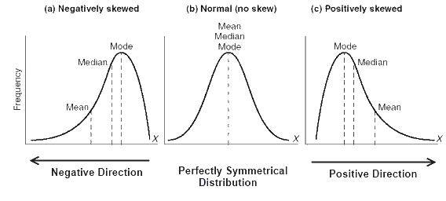
***Figura 1***: *Relación entre la media, la mediana y la moda en de una distribución.*

Veamos ahora que pasa con nuestros datos. En el caso de la variable `mortality` la media muestral es 153, mientras que la mediana es 147. Para la variable `latitude`, ambos estadísticos valen 39,5 mientras que para la variable `longitude` la media es 90.94 y la mediana 89.5. Esto indica, en un primer análisis, que la variable `latitude` parece provenir de una distribución simétrica, mientras que las otras dos, lo hacen de distribuciones sesgadas a la derecha.    

Otros dos estadísticos importantes para la descripción de variables son el *mínimo*, $X_{min}$, y el *máximo*, $X_{max}$.
```
> apply(USmelanoma[,-4],2,min)
 mortality  latitude longitude
       86        28        69
> apply(USmelanoma[,-4],2,max)
 mortality  latitude longitude
    229.0      47.5     121.0
```
Adicionalmente, resulta útil caracterizar las variables en términos de variabilidad. Para ello, se utiliza el estadístico **varianza muestral** como medida de dispersión entre las observaciones y el valor medio:

<center>

$S^2= \frac{\sum\limits_{i=1}^n(X_i-\overline{X})^2}{n-1}$
</center>

O el *desvío estándar muestral*, $S$, ya que comparte escala con la variable de interés. Ambos estadísticos están implementados en `R`, mediante las funciones `var` y `sd`.

```
> apply(USmelanoma[,-4],2,var)
 mortality   latitude  longitude
 1117.44303   21.26016  221.01237
> apply(USmelanoma[,-4],2,sd)
 mortality  latitude longitude
 33.428177  4.610874 14.866485
```
A la hora de comparar variables, en términos de variabilidad, la varianza o el desvío estándar no son muy indicativos si las escalas de dichas variables son diferentes. Es por ello que se suele utilizar el *coeficiente de variación*, *CV*, dado por el cociente entre $S$ y $\overline{X}$.
```
> coefVar<-function(x){
    media<-meanF(x)
    n<-length(x)
    varianza<-sum((x-media)^2)/(n-1)
    cv<-sqrt(varianza)/media
    return(cv)
 }
> apply(USmelanoma[,-4],2,coefVar)
 mortality  latitude longitude
 0.2186598 0.1166346 0.1634816  
```
**Ejercicio**: Implemente una función que permita obtener la varianza, el desvío y el coeficiente de variación a partir de las observaciones de una variable.

Estos valores permiten extraer algunos resultados importantes. Por un lado, al menos 86 personas se han muerto en cada estado por causa de melanoma maligno, siendo 229 el número máximo de personas fallecidas por esta causa. Adicionalmente, en la mitad de los estados se han muerto a lo sumo 147 personas, mientras que la mortalidad promedio es 153.

**Ejercicio**: realice un análisis de resultados para las variables longitud y latitud.

La forma adecuada de presentar los resultados numéricos obtenidos anteriormente es mediante una tabla, también conocida como *tabla resumen*. En `R` es posible obtener una tabla conteniendo algunas medidas resumen, con una función que usamos anteriormente, `summary()`.
```
> summary(USmelanoma[,-4])
   mortality        latitude       longitude     
 Min.   : 86.0   Min.   :28.00   Min.   : 69.00  
 1st Qu.:128.0   1st Qu.:36.00   1st Qu.: 78.50  
 Median :147.0   Median :39.50   Median : 89.50  
 Mean   :152.9   Mean   :39.53   Mean   : 90.94  
 3rd Qu.:178.0   3rd Qu.:43.00   3rd Qu.:100.00  
 Max.   :229.0   Max.   :47.50   Max.   :121.00  

```
Complementariamente, se utilizan gráficos descritpivos específicos, entre los cuales se destacan el *diagrama de cajas* (*boxplot*) y el *histograma*.

Como ya saben, para construir un diagrama de cajas es necesario obtener ciertos valores a partir de los datos. Por un lado, los *quartiles* y por otro, el *mínimo* y el *máximo*. Los primeros podemos obtenerlos numéricamente utilizando la función `summary()`, como se muestra en el bloque de código anterior o también utilizando la función `quantile()`.
```
> apply(USmelanoma[,-4],2,quantile)
     mortality latitude longitude
 0%          86     28.0      69.0
 25%        128     36.0      78.5
 50%        147     39.5      89.5
 75%        178     43.0     100.0
 100%       229     47.5     121.0
```
Esta función, por defecto, nos devuelve el mínimo (0%) y los cuatro cuartiles de un vector de datos. Como su nombre lo indica, la función es útil para obtener cuantiles, por lo que es posible especificar que cuantiles se desean computar. Por ejemplo,
```
> quantile(USmelanoma$mortality, probs=seq(from=0, to=1, by=0.1))
   0%   10%   20%   30%   40%   50%   60%   70%   80%   90%  100%
 86.0 116.0 123.2 131.0 136.2 147.0 159.0 168.4 183.6 199.2 229.0
```
Ahora bien, obtener el diagramas de cajas es bastante sencillo en `R` mediante la función `boxplot()` incluida en la distribución base.
```
> boxplot(USmelanoma[,-4])
```
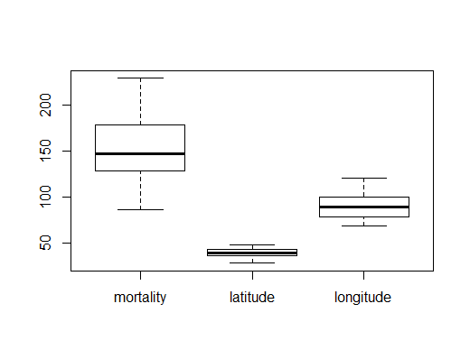

***Figura 2***: *Diagrama de cajas de las variables cuantitativas de la base de datos USmelanoma.*
Lo únicon que necesitamos pasar como argumento a la función es el vector o conjunto de vectores con los datos a graficar. Ahora bien, también es posible modificar varios aspectos de la gráfica utilizando la misma función. Por ejemplo, es posible especificar un color para cada variable, cambiar los nombres de éstas, etc.
```
> boxplot(USmelanoma[,-4], col=c("green", "red", "blue"), border=c("green4", "darkred", "darkblue"), notch = TRUE, names = c("Mortalidad", "Latitud", "Longitud"))
```
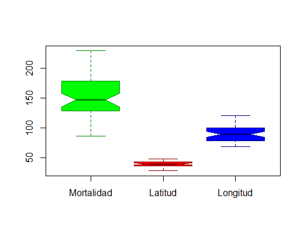

***Figura 3***: *Diagrama de cajas personalizados de las variables cuantitativas de la base de datos USmelanoma.*

En algunos casos, como en el nuestro, las variables tienen escalas diferentes. Como podemos apreciar, la variable *Mortalidad* tiene valores mayores y más dispersos (mayor CV) que las restantes. En estos casos, el rango de graficación es bastante amplio y sucede que, apra aquellas variables de menor CV, los boxplots no se aprecian bien. Es por ello que se recomienda utilizar intervalos de graficación adaptados a cada una de ellas. Es decir, graficarlas independientemente, como lo hace este fragmento de código:
```
> nombres<-c("Mortalidad", "Latitud", "Longitud")
> colores<-c("green", "red", "blue")
> bordes<-c("green4", "darkred", "darkblue")
> par(mfrow=c(1,3))
> sapply(1:3,function(columna){
    varID<-nombres[columna]
    x<-USmelanoma[,columna]
    boxplot(x, col=colores[columna], border=bordes[columna], notch = TRUE, names = varID)
    title(varID)
    return(NULL)
  })
```
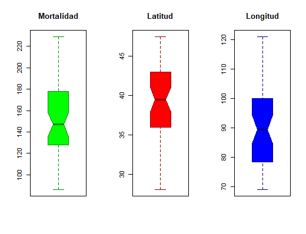

***Figura 4***: *Diagrama de cajas personalizados de las variables cuantitativas de la base de datos USmelanoma, graficadas en forma independiente.*

**Pregunta**: ¿Qué característica previamente mencionada respecto de las distribuciones pueden apreciarse en estas gráficas?

Otra herramienta gráfica para describir variables cuantitativas es el *histograma*. En `R` lo podemos obtener facilmente con la función `hist()`. A diferencia de la función `boxplot()`, esta no admite un `data.frame` como parámetro, por lo que hay que utilizarla tantas veces como variables de interés se quiera explorar. Los histogramas pueden presentarse con frecuencias relativas o absolutas.
```
> sapply(1:3,function(columna){
    varID<-nombres[columna]
    x<-USmelanoma[,columna]
    hist(x, col=colores[columna], border=bordes[columna], main=NULL,freq=FALSE )
    title(varID)
    return(NULL)
})
```
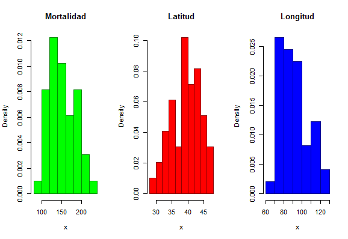

***Figura 5***: *Histogramas personalizados de las variables cuantitativas de la base de datos USmelanoma.*

Los intervalos utilizados para determinar las frecuencias que componenen el histograma no son fijos y pueden ser modificados por el usuario. Según el `help`, la función `hist()` determina los `breaks` que determinan los intervalos de la siguiente forma. Por un lado, utiliza la regla de *Sturges* para determinar el número de intervalos a considerar, $c$, está definido por $c=1+log_2n$, donde $n$ es el tamaño de la muestra. Luego, los datos y el número recomendado, es utilizado para llamar a la función `pretty()` que intenta calcular una secuencia de aproximadamente *n+1* valores equidistantes que cubren el rango de los valores observados. Éstos se eligen de modo que sean 1, 2 o 5 veces una potencia de 10.

Por supuesto que hay diferentes alternativas para definir los intervalos de un histograma. Otra podría ser, por ejemplo, considerar los cuantiles *0, 0.1, 0.2,..., 1*. El número de intervalos no es una elección menor ya que impacta directamente en los resultados obtenidos y es por eso que siempre se debe complementar este gráfico con otros como, diagramas de caja, y con resultados numéricos de las medidas resumen.

### 2.4.3 Exploración de variables cualitativas
La exploración descriptiva de las variables cualitativas está dirigida a explorar las diferentes categorías o clases asociadas a cada una de ellas y su distribución a lo largo de la muestra. En este sentido, una función que ya utilizamos anteriormente, `table()`, resulta muy útil.
```
> table(USmelanoma$ocean)
 no yes
 27  22
```
Esta función nos informa que la variable categórica `ocean` tiene dos valores posibles, `yes` y `no`, cada uno de los cuales se presenta con una *frecuencia absoluta* de 22 y 27 observaciones en la muestra, respectivamente. Es decir, de los 49 estados involucrados, 22 están parcial o totalmente rodeados por un océano mientras que los 27 restantes no lo están.

Estos resultados pueden ser presentados también en forma de gráfica. Para ello, la distribución base de `R` incluye la función `barplot()`.
```
> barplot(xtabs(~ocean, data=USmelanoma), names.arg = c("No", "Si"), col = c("orange4", "orange"), border = c("darkorange", "orange3"), main = "Contacto con Océano")
```
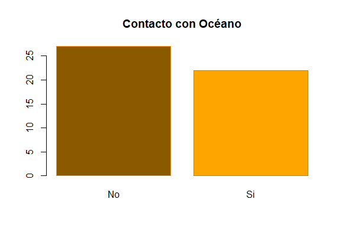

***Figura 6***: *Gráfico de barras para la variable cualitativa `ocean` de la base de datos USmelanoma.*

Una alternativa al gráfico de barras, es el gráfico de tortas:
```
> pie(table(USmelanoma$ocean), labels=c("No", "Si"), col = c("orange4", "orange"), border = c("darkorange", "orange3"), main = "Contacto con Océano")
```
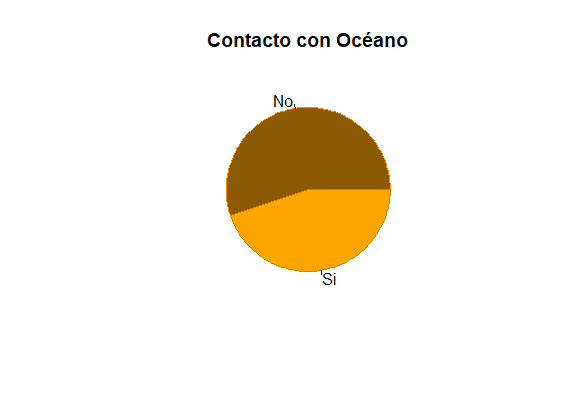

***Figura 7***: *Gráfico de tortas para la variable cualitativa `ocean` de la base de datos USmelanoma.*

La función `pie()` no ofrece entre sus opciones incluir en la gráfica las frecuencias absolutas y/o relativas de cada categoría. Sin embrago, esto es posible, por ejemplo, si incluímos éstos en los nombres de cada categoría. ¿Cómo lo harían?

Hasta este punto hemos visto como analizar las variables en forma independiente (aunque no sabemos si esto es cierto!), sin embargo, nos interesa saber que pasa cuando las consideramos a todas o algunas de ellas en forma simultánea.

### 2.4.4 Descripción multivariada
Cuando queremos estudiar las posibles asociaciones y/o relaciones que existen entre las distintas variables que conforman nuestra base de datos es importante considerar el tipo de variables que vamos a contrastar.
#### 2.4.4.1 Relaciones entre variables cuantitativas
Si nuestras variables a estudiar son cuantitativas, los *diagramas de dispersión* (también conocido como *scatterplot*) son una de las herramientas más utilizadas ya que rápidamente permiten explorar la posible existencia de una relación entre dos variables numéricas. Un diagrama de dispersión es un gráfico de puntos bidimensionales cuyas coordenadas en los ejes x e y quedan definidas por los valores de las variables contrastadas. Cuando existe una relación *positiva* entre estas variables, la mayoría de los puntos se distribuyen como si pertenecieran a una recta con pendiente positiva. Cuando la relación es *negativa*, los puntos se ubican en torno a una recta imaginaria con pendiente negativa. Mientras más fuerte sea la relación más clara va a ser la distribución de los puntos en una recta. Si no hay relación entre las variables, entonces los puntos estan dispersos en una región plana.
Tomemos en cuenta, por ejemplo, la *mortalidad* y relacionémosla con las variables *latitud* y *longitud* utilizando la función `plot()`.
```
> par(mfrow=c(1,2))
> plot(mortality~latitude, data=USmelanoma, xlab="Latitud", ylab="Mortalidad")
> plot(mortality~longitude, data=USmelanoma, xlab="Longitud", ylab="Mortalidad")
```
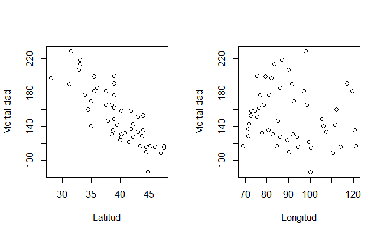

***Figura 8***: *Gráfico de dispersión de la variable Mortalidad contra las variables latitud y longitud.*

**Ejercicio**: Discuta las gráficas. Explore la función `pairs()`

Una medida numérica de la relación existente entre variables cuantitativas es la **covarianza**. Para cada par de vectores $(\boldsymbol{X},~\boldsymbol{Y})$ se define la covarianza como:

<center>

$COV(\boldsymbol{X},~\boldsymbol{Y})=\frac{\sum\limits_{i=1}^n(X_i-\overline{X})(Y_i-\overline{Y})}{(n-1)}$

</center>

De la fórmula misma se desprende que la covarianza está definida para dos vectores de igual longitud. Si la covarianza es 0 mientras que si es positiva (negativa) la relació nes directa (inversa). En `R`la función `cov` implementa el cálculo de esta medida:

```
> cov(USmelanoma$mortality, USmelanoma$latitude)
 [1] -127.0855
> cov(USmelanoma$mortality, USmelanoma$longitude)
 [1] -72.64957
```
Por sí sola esta medida es compleja de interpretar, más aún cuando las escalas de las variables comparadas son diferentes. Alternativamente, es posible obtener otra medida de variación y relación entre variables, el **coeficiente de correlación lineal**, comúmente conocida como *correlación de Pearson*. Este coeficiente resulta de escalar la covarianza entre dos vectores, por sus desvíos estándares:

<center>

$cor(\boldsymbol{X},\boldsymbol{Y})=r_{\boldsymbol{X},\boldsymbol{Y}}=\frac{cov(\boldsymbol{X},\boldsymbol{Y})}{S_XS_Y}$

</center>

Obtengamos la correlación entre nuestras variables,

```
> cor(USmelanoma$mortality, USmelanoma$latitude)
 [1] -0.8245178
> cor(USmelanoma$mortality, USmelanoma$longitude)
 [1] -0.1461881
```
Al ser una medida escalada, el coeficiente de correlación toma valores entre $-1$ y $1$. Particularmente, si vale 0 no hay relación *lineal* entre las variables mientras los valores más próximos a 1 (-1) indican alto grado de relación lineal directa (inversa)
**Ejercicio**: Analice las correlaciones e interprete en conjunto con los correspondientes diagramas de dispersión.

Cabe destacar que el coeficiente de correlación de Pearson indica el grado de relación *lineal* entre dos variables (analice la fórmula de cálculo). Hay otros coeficientes de correlación que son más indicados cuando las relaciones son no lineales, uno de los más populares el *coeficiente de correlación de Spearman*. Este coeficiente, usualmente denotado por $\rho_{\boldsymbol{X},\boldsymbol{Y}}, se obtiene calculando la correlación de Pearson de los vectores conteniendo los rankings de las observaciones de las variables de interés.
```
> cor(USmelanoma$mortality, USmelanoma$latitude, method="spearman")
 [1] -0.8349851
> cor(USmelanoma$mortality, USmelanoma$longitude, method="spearman")
 [1] -0.1749349
> cor(rank(USmelanoma$mortality), rank(USmelanoma$longitude))
 [1] -0.1749349
```
Al tener en cuenta los rankings, la correlación de Spearman evalúa la relación monotónica entre dos variables continuas. En una relación monotónica,
las variables tienden a cambiar juntas, no necesariamente a una tasa constante (lineal). El coeficiente $\rho$ es utilizado a menudo para evaluar relaciones con variables ordinales.

####2.4.4.2 Relaciones entre variables cuantitativas y cualitativas

Cuando las variables a estudiar son cualitativas y cuantitativas, es útil estudiar lo que se llama *distribuciones marginales*, como un indicador del comportamiento de la variable cuantitativa en los distintos grupos de la variable cualitativa. Por ejemplo, vamos a analizar lo que sucede con la *mortalidad* en los dos grupos de estados, definidos según se rodeen o no por un océano.
```
> par(mfrow=c(1,1))
> plot(mortality~ocean, data=USmelanoma, col=c("green1", "green4"), border=c("green4", "darkgreen"), ylab = "Mortalidad", xlab="Contacto con Océano" )
```
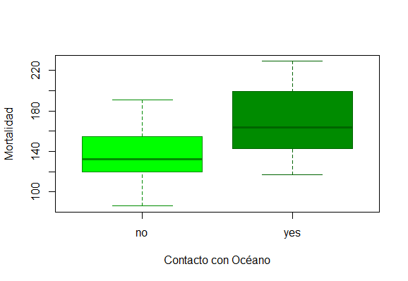

***Figura 9***: *Diagrama de cajas de la variable Mortalidad en cada una de las categorías de la variable Océano.*

**Ejercicio**: ¿Qué información nos dan estos diagramas? Repita las gráficas para relacionar las otras dos variables cuantitativas con la variable *Océano*. Elabore una lista de al menos tres hipótesis que relacionen las variables entre sí.

También es posible combinar más de dos variables en un mismo análisis, por ejemplo, en el *diagrama de dispersión*  es posible asignar distintas formas a los puntos graficados según si el valor de la variable *Océano* es `yes` o `no`.
```
> par(mfrow=c(1,2))
> plot(mortality~latitude, data=USmelanoma, xlab="Latitud", ylab="Mortalidad",
     pch=as.integer(ocean))
> legend("topright", legend=c("No", "Si"), pch=1:2)
> plot(mortality~longitude, data=USmelanoma, xlab="Longitud", ylab="Mortalidad",
     pch=as.integer(ocean))
> legend("topright", legend=c("No", "Si"), pch=1:2)
```

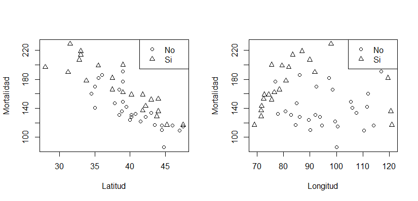

***Figura 10***: *Gráfico de dispersión de la variable Mortalidad contra las variables latitud y longitud, incluyendo información de la variable Océano.*

**Ejercicio**: Discuta las gráficas.

####2.4.4.3 Relaciones entre variables cualitativas
En nuestra base de datos no contamos con dos variables categóricas a contrastar. Para demostrar el uso de los métodos descriptivos de variables categóricas vamos a considerar una nueva variable, que será una versión categorizada de la *Mortalidad*. Esto no es sólo a modo de ejemplo, ya que en muchos casos puede ser muy útil transformar una variable en otra. Para definir nuestra nueva variable vamos a tener en cuenta los quartiles que obtuvimos anteriormente. Nuestras categorías de interés las llamaremos *Baja*, *Media*, *Alta* y *Muy alta* en referencia al rango de valores de mortalidad que representan. La primera de ellas abarcará los valores entre el mínimo y el $Q_1$, la segunda entre el $Q_1$ y el $Q_2$, la tercera entre $Q_2$ y $Q_3$ y la cuarta entre el $Q_3$ y el máximo. Esto lo haremos con la función `cut()` de `R`.
```
> mortalityCat<-cut(x=USmelanoma$mortality, breaks = quantile(USmelanoma$mortality), include.lowest = TRUE)
> table(mortalityCat)
  mortalityCat
  [86,128] (128,147] (147,178] (178,229]
  13        12        12        12
```

Ahora podemos estudiar la relación entre nuestra nueva variable categórica `mortalityCat` y la variable `ocean`. Para ello usamos las tablas de frecuencias de doble entrada, que podemos obtener facilmente con la función `table()`
```
> table(mortalityCat, USmelanoma$ocean)
  mortalityCat no yes
     [86,128] 11  2
    (128,147]  8   4
    (147,178]  5   7
    (178,229]  3   9
```
Esta tabla es útil para encontrar las frecuencias observadas para cada combinación de categorías de ambas variables, es decir para estudiar la *distribución conjunta*, $F_{X,Y}$.
Cuando estudiamos varias variables también es de interés obtener sus distribuciones univariantes, es decir, al considerarla individualmente ignorando los valores de las otras variables. Estas distribuciones se llaman *marginales* y pueden estimarse mediante las *frecuencias marginales*. Sean $X$ e $Y$ dos VA categóricas con $l$ y $k$ valores posibles, respectivamente, y con función de densidad conjunta dada por $f_{X,Y}$, la funciones de densidad marginal de $X$ y $Y$ están dadas por:

<center>

$f_X(x)=\sum\limits_{i=1}^kf_{X,Y}(x,y_i)$ y $f_Y(y)=\sum\limits_{j=1}^lf_{X,Y}(x_j,y)$

</center>

Adicionalmente, también es posible obtener la función de densidad de una de las variables categóricas *condicionada* a una categoría específica de la otra variable, es decir, la función de *densidad condicional* ya que
<center>

$f_{X|Y=y}(x)=\frac{f_{X,Y}(x,y)}{f_X(x)}$

</center>

**Ejercicio**: Obtenga las distribuciones marginales y condicionadas para las variables `mortalityCat` y `ocean`:
```
> tableMortalityOcean
              no   yes margMortality
  [86,128]  0.224 0.041  0.265
  (128,147] 0.163 0.082  0.245
  (147,178] 0.102 0.143  0.245
  (178,229] 0.061 0.184  0.245
  margOcean 0.551 0.449  1.000
```

## 2.5 La librería `ggplot2`
En esta sección estudiaremos brevemente la librería de graficación `ggplot2`. Para mayor profundidad se recomienda el libro online [*R for data science*](http://r4ds.had.co.nz/).
### 2.5.1 Por qué usar `ggplot2`

El lenguaje `R` tiene muchas capacidades gráficas. Existen diferentes formas y paquetes para crear gráficos, aunque la librería más versátil y utilizada es `ggplot2`. Este paquete provee un sistema de grafiación intuitivo que permite generar rapidamente gráficos de nivel científico.

`ggplot2` se basa en un conjunto de reglas que describen una sintaxis consitente para la construcción de un amplio rangos de gráficos complejos mediante una descripción consisa de sus componentes. La sintaxis estructurada y el alto nivel de abstracción del paquete permiten al usuario concentrarse en los resultados gráficos más que en el código que se usó para obtenerlos.  
Además de esta filosofía central `ggplot2` tiene:
- Mayor flexibilidad en muchos sistemas de graficación.
- Un sistema avanzado para gráficos de nivel profesional/científico.
- Gran base de desarrolladores ya que muchas bibliotecas amplían su flexibilidad. Ejemplo: [`cowplot`](https://CRAN.R-project.org/package=cowplot), [`ggbio`](	http://bioconductor.org/packages/ggbio/).
- Gran base de usuarios: gran [documentación](https://ggplot2.tidyverse.org/) y [lista de correo activa](https://groups.google.com/forum/?fromgroups#!forum/ggplot2).

Algo que será muy útil para cuando querramos utilizar el paquete es la [hoja de datos](https://github.com/rstudio/cheatsheets/blob/master/data-visualization-2.1.pdf)

### 2.5.2 Creando gráficos en `ggplot2`
Para crear un objeto gráfico con `ggplot2` necesitamos al menos tres cosas:
- El conjunto de datos (`DATA`) sobre los que se graficará.
- Mapear (<MAPPINGS>) los datos al gráfico mediante un `aesthetic` (`aes()`)
- Decidir que tipo de gráfico queremos usar deiniendo el `geom` (`GEOM_FUNCTION()`).

En términos generales la plantilla básica para crear cualquier gráfico es:
```
> ggplot(data = <DATA>) + <GEOM_FUNCTION>(mapping = aes(<MAPPINGS>))
```
Un gráfico en `ggplot2` siempre se inicia con la función `ggplot()`, la cual crea un sistema de coordenadas. El primer argumento de esta función, `data`, se corresponde con el conjunto de datos sobre el que se graficará. La sintáxis se basa en sumar capas (`layers`) a ese objeto mediante las `GEOM_FUNCTION()` que definen el tipo de gráficos que se harán. Las propiedades de estos gráficos como valores en eje *x*, e *y*, color de línea o de relleno, tamaño, forma se definen mediante las *aesthetic*. La función `aes()` es la encargada de establecer cómo es el mapeo entre las propiedades gráficas y las variables del conjunto de datos. Las *aesthetic* pueden ser comunes para todas las capas, si se definen dentro de la función `ggplot()` o específicas si se definen en cada `GEOM_FUNCTION()`.

Por ejemplo, construyamos el diagrama de dispersión de las variables *mortalidad* y *latitud* del dataset `USmelanoma`.

```
> library(ggplot2)
> g<-ggplot(data=USmelanoma, aes(x=mortality, y=latitude))+geom_point()
> g
```

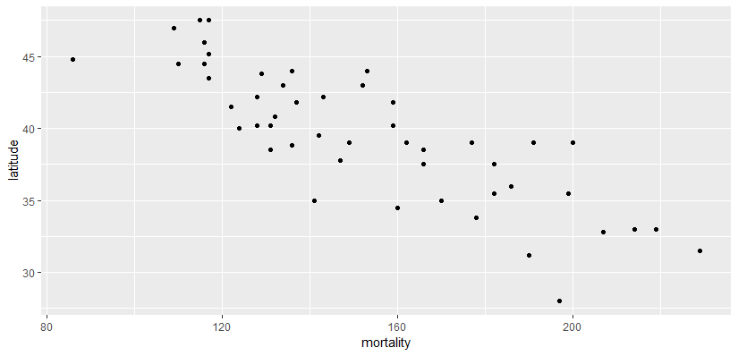

***Figura 11***: *Gráfico de dispersión de las variables mortalidad y latitud construído con `ggplot2`.*

### 2.5.3 Mapeo entre variables y propiedades gráficas

Un *aesthetic* es una propiedad visual de los objetos en los gráficos. *Aesthetics* incluyen cosas como tamaño, forma o color de puntos. En el gráfico anterior hemos utilizado dos parámetros básicos de un *aesthetic*, `x` e `y`. Estos dos parámetros sirven para especificar cuáles dos variables del `data.frame` `USmelanoma` serán graficadas en los ejes *x* e *y*, respectivamente. Ahora bien, estas no son las únicas propiedades gráficas que pueden modificarse en un objeto `ggplot`. Por ejemplo, podríamos estar interesados en agregar una tercer vaiable, asociada a una clase particular de cada observación, como la variable `Ocean`. Hay diferentes formas de incluir la información de esta tercer variable, una de ellas podría ser mediante la forma de los puntos:

```
> g1<-g+geom_point(aes(shape=ocean, size=2))
> g1
```

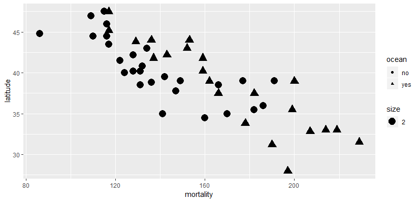

***Figura 12***: *Gráfico de dispersión de las variables mortalidad y latitud, clasificados según la variable océano, construído con `ggplot2`.*

El nuevo objeto `g1` incorpora ahora una capa de diagrama de puntos cuyas formas dependen del valor de la variable `ocean`. Además de modificar la forma de los puntos (`shape`) también hemos aumentado su tamaño a un valor fijo, aunque también es posible hacerlo a valores que dependan de otras variables contenidas en el conjunto de datos.

**Ejercicio**: incorpore la información de la longitud al gráfico de dispersión anterior como parámetro de tamaño de los puntos.

También es posible incorporar más variables mediante la modificación del color de los puntos:

```
> g<-ggplot(data=USmelanomaExpanded, aes(x=latitude, y=longitude, shape=ocean,    color=mortalityCat))+geom_point(size=2)
> g
```
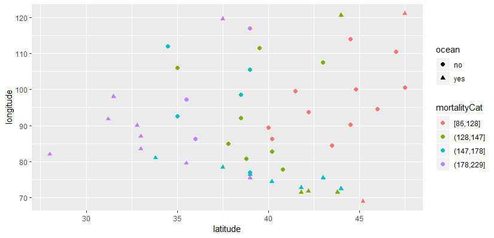

***Figura 13***: *Gráfico de dispersión de las variables latitud y longitud, clasificados según la variable océano y coloreados según el rango de mortalidad observada.*

**Ejercicio**: Discuta los gráficos generados.

El mapeo de un *aesthetic* a una variable es asociar el nombre de la variable con el del *aesthetic* dentro de la función `aes()`. Automáticamente `ggplot2` asignará un único nivel del *aesthetic* a un único valor de la variable. En el caso de los colores, las formas, los tamaños, también agregará leyendas gráficas que expliquen la asociación entre los niveles del *aesthetic* y los valores de la variable.

La función `aes()` reúne cada una de las asignaciones estéticas utilizadas por una capa y las pasa al argumento de mapeo de la capa. Una vez que un *aesthetic* ha sido mapeada, `ggplot2` se encarga del resto. Esto implica elegir escalas adecuadas, construir legendas explicativas, establecer los ejes con sus nombres, etc. Estas propiedades también pueden ser modificadas manualmente. Por ejemplo, haciendo `geom_point(size=2)`.

### 2.5.4 Uso de *facets*

Una alternativa para agregar variables adicionales a un gráfico, principalmente del tipo categóricas, es el uso de *facets*. Una *facet* basada en una variable categórica de *k* valores posibles indicará la creación de *k* gráficos, uno para cada subconjunto de los datos correspondientes con cada uno de los valores posibles de la variable categórica. Las facetas basadas en una única variable pueden construirse con la función `facet_wrap()`. El primer argumento de esta función debe ser del tipo `formula`, el cual se crea con ~ seguido del nombre de la variable categórica que definirá las facetas.

```
> g<-ggplot(data=USmelanomaExpanded, aes(x=latitude, y=longitude, color=mortalityCat))+geom_point(size=2)+facet_wrap(~ocean)
> g
```

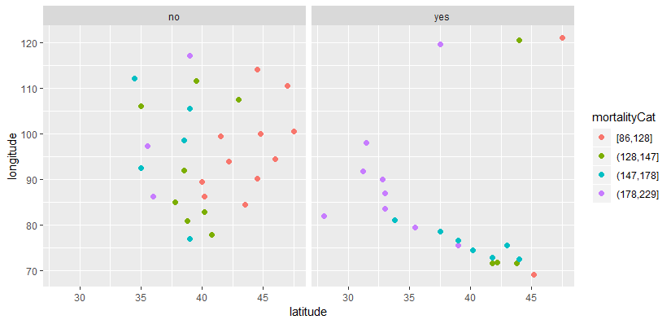

***Figura 14***: *Gráfico de dispersión de las variables latitud y longitud, coloreados según el rango de mortalidad observada y presentados en dos `facets` según los valores de la variable océano.*

Muchas veces el gráfico en facetas resulta más adecuado para apreciar ciertos comportamientos en los datos. Por ejemplo, en este caso, es facil notar que los estados que no están rodeados por océanos concentran los niveles de mortalidad más bajos, mientras que los que si están rodeados por océanos concentran los valores más altos de mortalidad debida a melanoma.

Es posible tambien construir facetas a partir de la combinación de dos variables categóricas, utilizando la función `facet_grid()`. El argumento de esta función también debe ser del tipo `formula` y debe contener el nombre de las dos variables separados por ~.

```
> g<-ggplot(data=USmelanomaExpanded, aes(x=latitude, y=longitude))+geom_point(
    size=2, color="blue")+facet_grid(mortalityCat~ocean)
> g
```
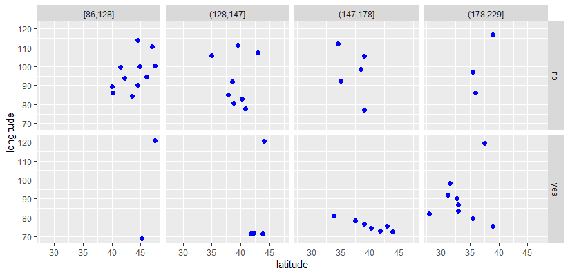

***Figura 15***: *Gráfico de dispersión de las variables latitud y longitud, faceteados según los valores de la variable océano y los grupos de mortalidad definidos previamente.*

###2.5.5 Objetos geométricos

Un *geom* es un objeto geométrico que es utilizado por un gráfico `ggplot` para representar datos. Es común describir los gráficos en base al tipo de *geom* que se usa para obtenerlos. Por ejemplo, un gráfico de barras *bar chart* usa *bar geoms*, un diagrama de líneas *line chart* usa *line geoms*, los diagramas de cajas *boxplots* usan *boxplot geoms*, etc. Aunque no se cumple esto para todos los tipos de gráficos. En nuestro ejemplo anterior construímos un diagrama de dispersión *scatterplot* utilizando *point geom*.
Para cambiar un `geom` en un gráfico es necesario cambiar la `GEOM_FUNCTION()` agregada a `ggplot()`. Adicionalmente, muchas veces es posible representar gráficamente las mismas variables *x* e *y* en gráficos diferentes que representan la misma información. Por ejemplo:

```
> ggplot(data = USmelanoma) + geom_point(aes(x =latitude, y = mortality))
> ggplot(data = USmelanoma) + geom_smooth(mapping = aes(x = latitude, y = mortality))
```
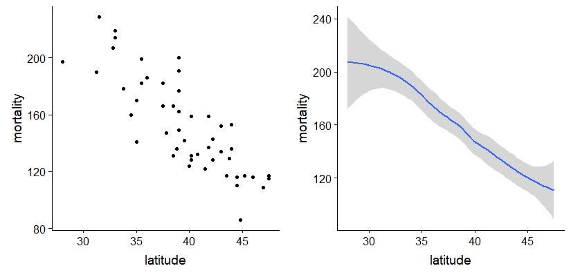

***Figura 16***: *Diferentes gráficos generados a partir de los mismos datos para x e y. En la izquierda, diagrama de dispersión de las variables mortalidad y latitud. En la derecha, recta de regresión y bandas de confianza.*

Estas dos gráficas utilizan las mismas variables para *x* e *y* pero las presentan en diferentes formas. La gráfica de la izquierda, en un diagrama de dispersión y la de la derecha, mediante una curva de *regresión lineal* y las correspondientes *bandas de confianza*.

Cada *geom* admite un mapeo a un *aesthetic* diferente. Sin embargo, no cualquier *aesthetic* funciona con cualquier *geom*. Por ejemplo, es posible fijar la forma de un punto pero no de una línea, a la cual sí se le puede especificar manualmente un trazado (`linetype`) particular. Por ejemplo,

> ggplot(data = USmelanoma) + geom_smooth(mapping = aes(x = latitude, y = mortality))
```
> g<-ggplot(data = USmelanoma) + geom_smooth(mapping = aes(x = latitude, y = mortality, linetype=ocean))
> g
```

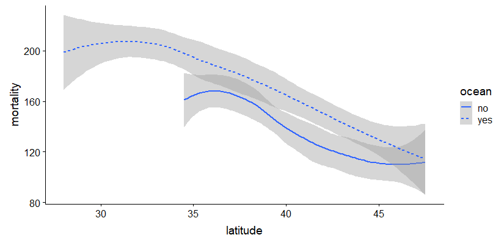

***Figura 17***: *Recta de regresión y bandas de confianza para la mortalidad en función de la latitud en los grupos rodeado y no por océano.*

Note que el uso del argumento `linetype` implica la construcción de dos líneas de regresión, una para cada grupo de observaciones, definidos por el valor de la variable categórica `ocean`.

Una de las ventajas de utilizar `ggplot2` es que nos permite combinar diferentes *geoms* en un mismo gráfico.

```
> g<-ggplot(data = USmelanoma) + geom_smooth(mapping = aes(x = latitude, y = mortality, linetype=ocean, color=ocean))+geom_point(mapping=aes(x=latitude, y=mortality, color=ocean, shape=ocean), size=2)
> g
```

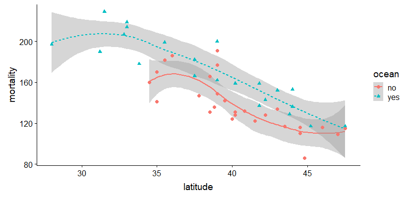

***Figura 18***: *Recta de regresión con bandas de confianza y diagrama de dispersión para la mortalidad en función de la latitud en los grupos rodeado y no por océano.*

`ggplot2` provee cerca de 30 *geoms* diferentes, algunas de ellas son:

- `geom_point()`
- `geom_line()`
- `geom_smooth()`
- `geom_bar()`
- `geom_boxplot()`
- `geom_jitter()`
- `geom_histogram()`
- `geom_density()`
- `geom_text()`
- `geom_errorbar()`
- `geom_violin()`

Muchos *geoms*, como `geom_smooth()`, usan un único objeto geométrico para mostrar múltiples filas de datos. Para éstos, es posible definir el *aesthetic* del grupo mediante una variable categórica como lo hicimos al especificar el color de las cuvrvas regresoras con la variable `ocean`.

Como se mencionó anteriormente, si un *aesthetic* se define dentro de un *geom*, `ggplot2` lo tratará como un mapeo local para la capa ylo utilizará estas asignaciones para extender o sobrescribir las asignaciones globales solo para esa capa. Esto es lo que hace posible mostrar diferentes *aesthetics* en diferentes capas.

```
> g<-ggplot(data = USmelanoma,mapping = aes(x = latitude, y = mortality)) + geom_smooth(mapping = aes(linetype=ocean), color="green")+geom_point(mapping=aes(color=ocean, shape=ocean), size=2)
> g
```

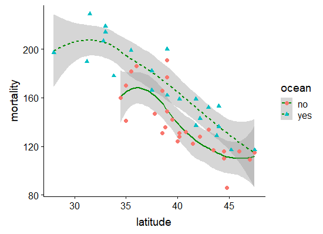

***Figura 19***: *Recta de regresión con bandas de confianza y diagrama de dispersión para la mortalidad en función de la latitud en los grupos rodeado y no por océano.*

**Pregunta**: ¿Por qué el color está especificado por fuera del *aesthetic* del `geom_smooth()`?

**Ejercicios**:

### 2.5.6 Transformaciones estadísticas

Muchos gráficos, como los diagramas de dispersión, grafican directamente los datos como aparecen en las tablas mientras que otros grafican valores obtenidos a partir de operaciones sobre los datos. Por ejemplo, los gráficos de barra, histogramas y polígonos de frecuencia agrupan los datos y luego grafican los grupos y el total de observaciones que caen en cada uno de ellos. Otro ejemplo lo constituyen `geom_smoth()`, que realiza un ajuste de los datos para luego graficar los resultados del modelo ajustado o `geom_boxplot()` que primero obtiene medidas estadísticas de resumen y luego las grafica en forma de caja.

El algoritmo utilizado para calcular los nuevos valores en un gráfico se llama `stat`, como abreviación de *statistical transformation*. Veamos como es este proceso ejemplificado en el caso de `geom_bar()`.


***Figura 20***: *Ilustración del proceso de transformación estadística utilizado por `geom_bar()`.*

Dependiendo del *geom* los *stats* disponibles pueden variar. Por ejemplo, en el caso de `geom_bar()` el *stat* por defecto es `count` lo que significa que este *geom* usa `stat_count()`. Toda la información referente tanto a `geom_bar()` como a `stat_count()` puede obtenerse en el manual correspondiente. Particularmente, hay una sección llamada *Computed variables* donde se explica como se obtienen las nuevas variables a partir de los datos. Veamos como funcionan estas dos funciones combinadas

```
> g<-ggplot(data=USmelanoma, aes(x=ocean))+geom_bar(stat="count")
> g
```

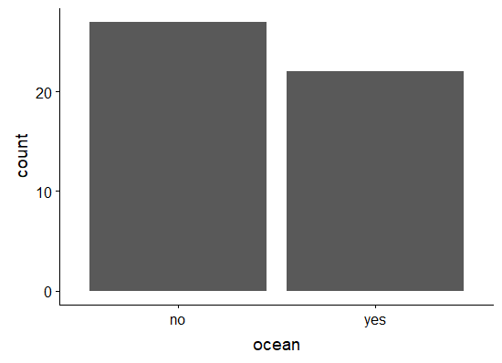

***Figura 21***: *Diagrama de barras para la variable océano.*

**Ejercicio**: Obtenga el diagrama de cajas para la variable *mortalidad* para cada uno de los grupos de observaciones definidos mediante la variable *océano*.

`counts` determina que la nueva variable, `count`, contiene la cantidad de observaciones registradas para cada categoría de la variable `ocean`.  En el caso de tener variables continuas, aunque `stat_count` puede utilizarse, también se cuenta con `stat_bin()`. Esta transformación agrupa valores observados en *bins* y luego cuenta la cantidad de elementos en cada uno de ellos.

```
> g<-ggplot(data=USmelanoma, aes(x=mortality))+geom_bar(stat="bin")
> g
```
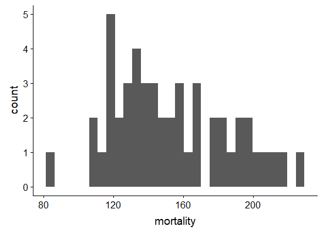

***Figura 22***: *Diagrama de barras para la variable mortalidad.*

**Ejercicio**: Explore `stat_bin()` y grafique un histograma con 15 bins y otro con bins equidistantes, separados por 10 unidades.

Cada *geom* tiene un *stat* asociado por defecto y cada  *stat* tiene un *geom* por defecto. Sin embargo hay ocasiones en las que resulta útil cambiar el *stat*. Por ejemplo, cuando queremos mapear los valores del eje *y* a una columna específica del conjunto de datos:

```
> df<-as.data.frame(table(USmelanomaExpanded$mortalityCat))
> names(df)<-c("MortalityInterval", "Counts")
> ggplot(df, aes(x=MortalityInterval, y=Counts))+geom_bar(stat="identity")
```

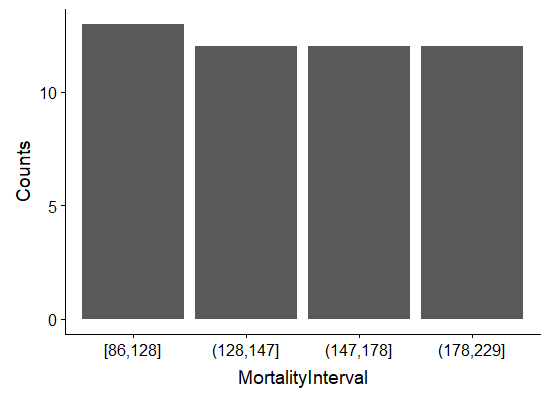

***Figura 23***: *Diagrama de barras para la variable mortalidad categorizada a cuatro intervalos definidos por los cuartiles.*

**Ejercicio**: ¿Qué piensa de los resultados gráficos obtenidos?
smoothers fit a model to your data and then plot predictions from the model.

boxplots compute a robust summary of the distribution and then display a specially formatted box.


### 2.5.7 Sistemas de coordenadas

Probablemente, son la parte más complicada de `ggplot2`. Por defecto, el sistema de coordenadas es el Cartesiano donde las posiciones en los ejes *x* e *y* definen en forma independiente la ubicación de cada punto. Sin embargo, `ggplot2` incluye otros sistemas de coordenadas que pueden ser útiles.

Por un lado `coord_flip()` intercambia los ejes entre sí, lo cual por ejemplo, puede ser util para graficar diagramas de caja horizontales.

```
> g<-ggplot(data=USmelanoma, aes(x=ocean, y=mortality))+geom_boxplot()+coord_flip()
> g
```

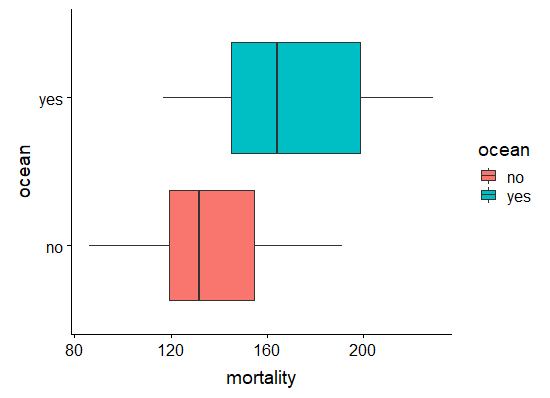

***Figura 24***: *Diagrama de cajas para la variable mortalidad para los dos grupos de estados, definidos por la variable océano.*

Por otro lado, `coord_polar()` utiliza coordenadas polares.

```
> ggplot(USmelanoma, aes(x=ocean, fill=ocean))+geom_bar()+theme(element_blank(),
  legend.position="none")+coord_polar()+labs(x="", y="")
```

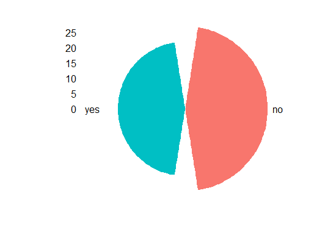

***Figura 25***: *Diagrama de barras en coordenadas polares para la variable océano.*

### 2.5.8 Escalas y leyendas

Las escalas tanto de los ejes como de otras *aesthetic* pueden ser manualmente controladas y manipuladas. Para ello, `ggplot2` ofrece funcionalidades que permiten controlar tanto las escalas como sus leyendas. Básicamente, los métodos de escala se pueden agrupar en función del *aesthetic* que controlan, del tipo de dato mapeado a la escala y del tipo de escala. Algunos ejemplos de métodos de escala son:

- `scale_x_continuous()`
- `scale_color_brewer()`
- `scale_fill_manual()`
- `scale_y_log10()`

Entre MUCHOS otros.

Las diferentes funciones de escala aceptan diferentes argumentos, aunque por lo general estos inclueyen argumentos comunes como:
- `name` - Título del eje o de la leyenda
- `limits` - Valores mínimo y máximo de la escala
- `breaks` - Posición de las marcas en el eje o etiqueta
- `labels` - Nombres o etiquetas para cada *break*

#### 2.5.8.1 Control de escala en los ejes x/y

Tanto las escalas continuas como las discretas pueden controlarse en `ggplot2` usando:

`scale_(x/y)_(continous/discrete)`

```
> g<-ggplot(USmelanoma, aes(x=latitude, y=mortality, color=ocean))+geom_point(size=2)
> g+scale_x_continuous(name="Latitud",limits = c(25,50), breaks = seq(25,50,5))+scale_y_continuous(name="Mortalidad", limits=c(0,230))
```

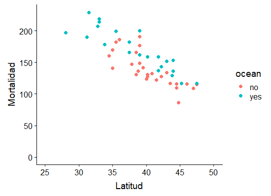

***Figura 26***: *Diagrama de dispersión mortalidad vs latitud con ajuste de escalas.*

En el ejemplo anterior hemos controlado la escala continua en ambos ejes definiendo los límites y el nombre para cada uno de ellos. Adicionalmente, en el eje *x* hemos establecido que las marcas aparezcan de 5 en 5, comenzando en el mínimo establecido (25) y finalizando en el máximo (50).

```
> g<-ggplot(data=USmelanoma, aes(x=ocean, y=mortality, fill=ocean))+geom_boxplot()+coord_flip()
> g+scale_x_discrete(name="Frontera con océano", breaks=c("no", "yes"), labels=c("No", "Si"))+scale_y_continuous(name="Mortalidad")+theme(legend.position="none")
```

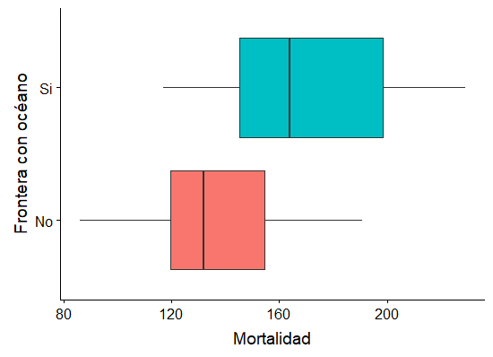
1
***Figura 27***: *Diagrama de cajas para la variable mortalidad, agrupando los estados según la variable océano y con ajuste de escalas.*

#### 2.5.8.2 Control de escala de colores/formas/tamaños

El control de la escala y las leyendas de los colores, colores de relleno, formas, tamaños, también es posible con `ggplot2`. Dependiendo de la escala del *aesthetic* y las distintas facilidades, la sintaxis variará pero en forma general podemos decir que las funciones son del tipo
`scale_aestheticName_facilityToScale()`

Por ejemplo, veamos este gráfico.

```
> g<-ggplot(data=USmelanoma, aes(x=ocean, y=mortality, fill=ocean)) + geom_jitter(
  aes(color=latitude,shape=ocean),size=2)+geom_boxplot(alpha=0.5)+coord_flip()
> g+scale_color_gradient("Latitud",low="orchid", high="orange")+scale_fill_manual(
  "Proximidad Océano", values = c("cyan", "green"), breaks=c("no", "yes"), labels=
  c("No", "Si"))+scale_shape_discrete("Proximidad Océano", breaks=c("no", "yes"), labels=
  c("No", "Si"))+labs(x="Mortalidad")+scale_x_discrete("", breaks=c("no", "yes"), labels=c("",""))
```

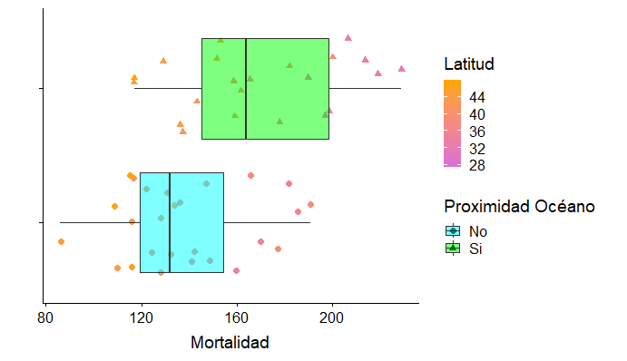

***Figura 28***: *Diagrama de cajas para la variable mortalidad, agrupando los estados según la variable océano y con ajuste de escalas gráficas.*

Un detalle importante es que aquellas escalas que se corresponden con la misma variable y cuyas leyendas comparten títulos y etiquetas se homologan, como se muestra para la forma de los puntos y el color de los diagramas de cajas.

### 2.5.9 Temas

La función `theme()` se utiliza para especificar los detalles gráficos que son independientes a los datos. Entre ellos, el título, el color de fondo, formato de los ejes, fuentes y tamaño de los textos, etc.

Por defecto, los gráficos se crean con un tema, `theme_grey()`, pero los usuarios podemos elegir otros temas predefinidos o crear nuestros propios temas.

#### 2.5.9.1 Temas predefinidos

Estos temas pueden utilizarse mediante una familia de funciones del tipo `theme_style()`. Por ejemplo,

```
> g<-ggplot(data=USmelanoma, aes(x=ocean, y=mortality, fill=ocean))+
  geom_jitter(aes(color=latitude,shape=ocean),size=2)+geom_violin(alpha=0.5)
> g<-g+scale_color_gradient("Latitud",low="orchid", high="orange")+
  scale_fill_manual("Proximidad Océano", values = c("cyan", "green"), breaks=c("no", "yes"), labels=c("No", "Si"))+scale_shape_discrete("Proximidad Océano", breaks=c("no", "yes"), labels=c("No", "Si"))+labs(y="Mortalidad")+scale_x_discrete("Proximidad Océano", breaks=c("no", "yes"), labels=c("No","Si"))
> g+theme_linedraw()
```

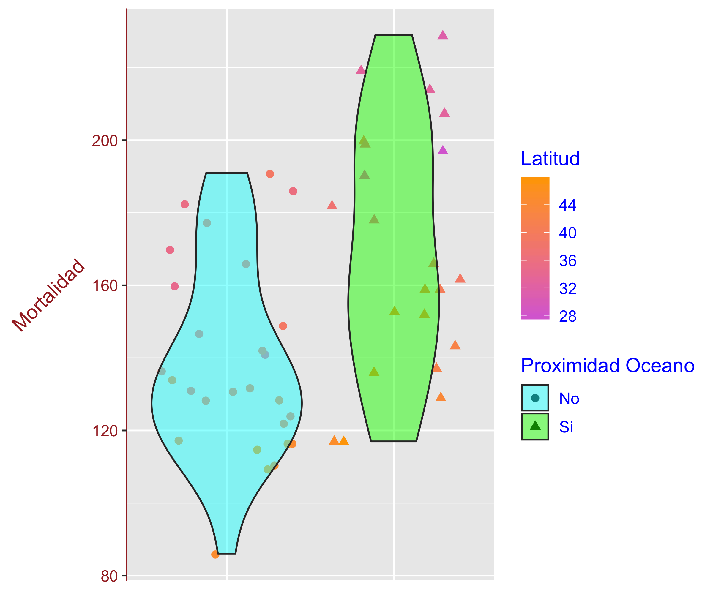

***Figura 29***: *Diagrama de violín para la variable mortalidad, agrupando los estados según la variable océano y con ajuste de escalas gráficas y de tema.*

En este ejemplo, se ha utilizado el tema *linedraw* que especifica el trazado de líneas paralelas a los ejes *x* e *y* así como los bordes del gráfico.

**Nota**: El *violin plot* es un gráfico muy útil ya que permite graficar dos aspectos distribucionales en una misma gráfica: la densidad y el diagrama de cajas de una variable. Estudie el *geom* correspondiente con el uso del *help* de `R`.

Hay varios temas predefinidos dentro de `ggplot2`, entre ellos:

- `theme_bw()`
- `theme_classic()`
- `theme_dark()`
- `theme_gray()`
- `theme_light()`
- `theme_linedraw()`
- `theme_minimal()`


***Figura 30***: *Temas definidos en `ggplot2`.*

También es posible utilizar otros temas definidos dentro de paquetes complementarios como [`ggthemes`](https://CRAN.R-project.org/package=ggthemes).

#### 2.5.9.2 Creando temas propios

`ggplot2` permite controlar todos los atributos y elementos dentro de un gráfico mediante un conjunto de funciones específicas.

`theme()` es la función global que se usa para establecer valores a los atributos de los elementos o componentes de un gráfico. Dentro de ella, se destacan cuatro tipos de elementos gráficos que pueden ser controlados:

- *rect*
- *line*
- *text*
- *title*
 y cinco grupos de elementos asociados:

- *axis*
- *legend*
- *strip*
- *panel*
- *plot*

Los elementos pueden especificarse mediante el uso de funciones apropiadas como:

- `element_line()`
- `element_text()`
- `element_rect()`
- `element_blank()`

Veamos algunas utilidades mediante el siguiente ejemplo:

```
> g+theme(text = element_text(colour="blue", size = 12), axis.text.y = element_text(colour="brown"),
  axis.title.y = element_text(vjust = 0.5, angle = 45, colour="brown"),
  axis.line.x = element_line(linetype = 0),axis.line.y=element_line(colour="brown"),
  axis.ticks.x = element_blank(), axis.text.x = element_blank(), axis.title.x = element_blank())
```

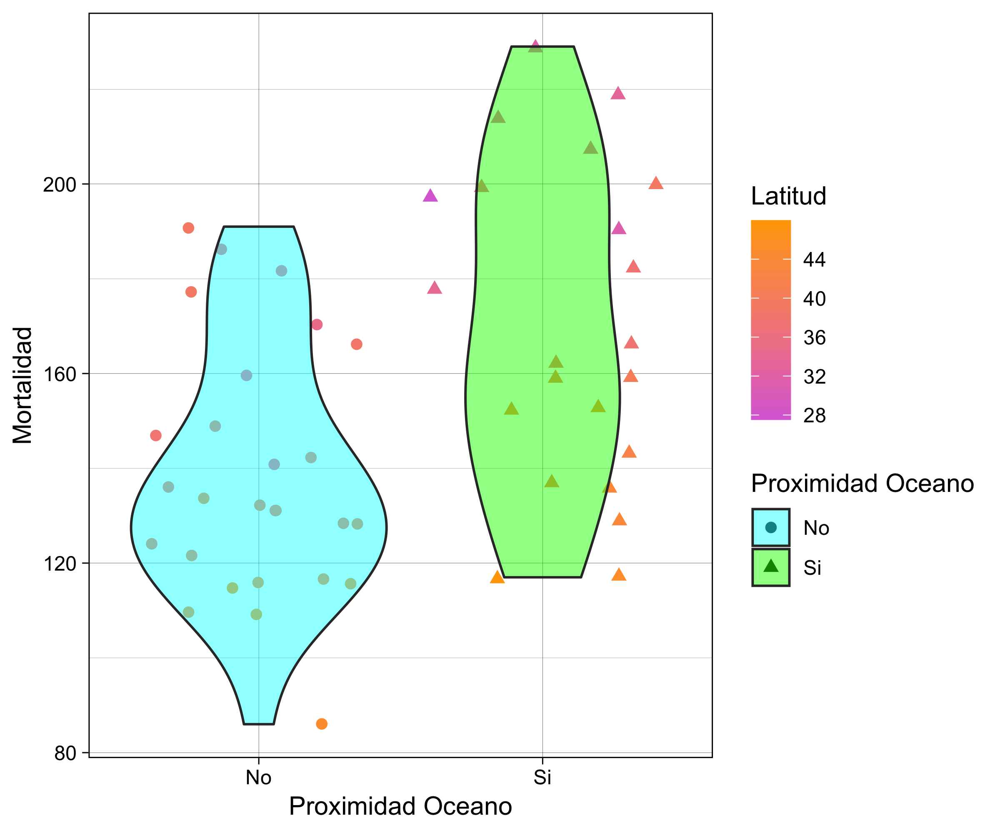

***Figura 31***: *Diagrama de violín para la variable mortalidad, agrupando los estados según la variable océano y con ajuste de escalas gráficas y de tema personalizado.*

También es posible controlar las leyendas con la función `theme()`.
```
> g+theme(legend.position="none")
```
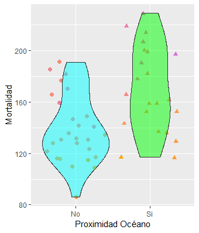

***Figura 32***: *Diagrama de violín para la variable mortalidad, agrupando los estados según la variable océano y con ajuste de escalas gráficas y sin leyendas.*

Lo que debemos tener en cuenta que el control es sobre todas las leyendas en el gráfico. Por lo que para controlarlas individualmente debemos combinarla con las funciones `scale_*` o utilizar la función `guides()`.

```
> g<-ggplot(data=USmelanoma, aes(x=ocean, y=mortality, fill=ocean))+
  geom_jitter(aes(color=latitude,shape=ocean),size=2)+geom_violin(alpha=0.5)
> g<-g+scale_color_gradient("Latitud",low="orchid", high="orange")+scale_fill_manual(
  "Proximidad Océano", values = c("cyan", "green"), breaks=c("no", "yes"), labels=c("No", "Si"))+scale_shape_discrete("Proximidad Océano", breaks=c("no", "yes"), labels=c("No", "Si"))+labs(y="Mortalidad")+scale_x_discrete("Proximidad Océano", breaks=c("no", "yes"),
   labels=c("No","Si"))
> g+guides(fill=FALSE, shape=FALSE)+theme(legend.position = "bottom")
```

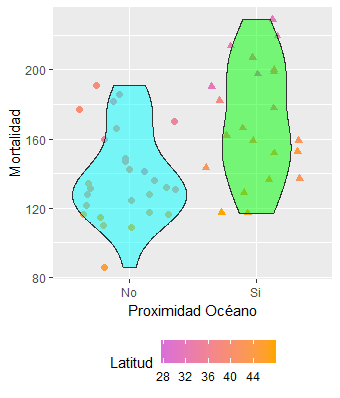

***Figura 33***: *Diagrama de violín para la variable mortalidad, agrupando los estados según la variable océano y con ajuste de escalas gráficas y conservando sólo la leyenda para la latitud.*

### 2.5.10 Agregado de títulos y etiquetas

Los títulos de los gráficos y las etiquetas de los ejes pueden ser añadidos utilizando la función `labs()`.

```
> g<-ggplot(USmelanoma, aes(x=mortality, color=ocean, fill=ocean))+geom_density(alpha=0.5)+
  scale_color_hue("Proximidad Océano", breaks=c("no", "yes"), labels=c("No", "Si"))+
  scale_fill_hue("Proximidad Océano", breaks=c("no", "yes"), labels=c("No", "Si"))+
  theme(legend.position="bottom", plot.title=element_text(hjust = 0.5))+
  labs(x="Mortalidad", y="Densidad", title="Función de densidad estimada")
> g
```

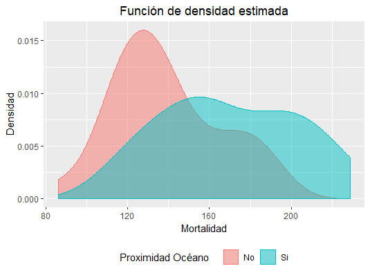

***Figura 34***: *Función de densidad estimada de la variable mortalidad, agrupando los estados según la variable océano.*

### 2.5.11 Guardar gráficos

Los gráficos de `ggplot2` pueden guardarse en `RStudio` interactivamente o utilizando la función `ggsave()`. Ésta proporciona más flexibilidad a la hora de guardar gráficos ya que permite especificar el formato (`.jpg`, `.pdf`, `.tiff`, `.bmp`, entre otros), la resolución y el tamaño del gráfico.

También es posible guardar los gráficos con la función `save()` de `R` si es que los queremos conservar para reutilizarlos o transferirlos a otro usuario.

## 2.6 Análisis Exploratorio con ggplot2

En esta sección utilizaremos las herramientas del análisis exploratorio y la librería `ggplot2` para estudiar el conjunto de datos `epilepsy` del paquete [`HSAUR2`](https://cran.r-project.org/web/packages/HSAUR2/index.html). En un ensayo clínico reportado por Thall y Vail (1990), 59 pacientes con epilepsia fueron asignados al azar a grupos que recibieron el medicamento antiepiléptico Progabide o un placebo. El número de convulsiones sufridas en cada uno de los cuatro períodos de dos semanas se registró para cada paciente, junto con un recuento inicial de crisis convulsivas durante las 8 semanas previas a la asignación aleatoria al tratamiento, y la edad. El objetivo del estudio es determinar si la administración de Progabide reduce el número de ataques epilépticos en comparación con el placebo.

```
> data("epilepsy")
> head(epilepsy)
      treatment base age seizure.rate period subject
1     placebo   11  31            5      1       1
110   placebo   11  31            3      2       1
112   placebo   11  31            3      3       1
114   placebo   11  31            3      4       1
2     placebo   11  30            3      1       2
210   placebo   11  30            5      2       2
> dim(epilepsy)
[1] 236   6
> summary(epilepsy)
   treatment        base             age         seizure.rate     period    subject   
placebo  :112   Min.   :  6.00   Min.   :18.00   Min.   :  0.000   1:59   1      :  4  
Progabide:124   1st Qu.: 12.00   1st Qu.:23.00   1st Qu.:  2.750   2:59   2      :  4  
                Median : 22.00   Median :28.00   Median :  4.000   3:59   3      :  4  
                Mean   : 31.22   Mean   :28.34   Mean   :  8.263   4:59   4      :  4  
                3rd Qu.: 41.00   3rd Qu.:32.00   3rd Qu.:  9.000          5      :  4  
                Max.   :151.00   Max.   :42.00   Max.   :102.000          6      :  4  
                                                                          (Other):212  
> apply(epilepsy[,c(1,5:6)],2,table)
  $`treatment`

  placebo Progabide
      112       124

  $period

   1  2  3  4
  59 59 59 59

  $subject

  1 10 11 12 13 14 15 16 17 18 19  2 20 21 22 23 24 25 26 27 28 29  3 30 31 32 33 34 35 36 37 38 39  4
  4  4  4  4  4  4  4  4  4  4  4  4  4  4  4  4  4  4  4  4  4  4  4  4  4  4  4  4  4  4  4  4  4  4
 40 41 42 43 44 45 46 47 48 49  5 50 51 52 53 54 55 56 57 58 59  6  7  8  9
  4  4  4  4  4  4  4  4  4  4  4  4  4  4  4  4  4  4  4  4  4  4  4  4  4                                       
```

El conjunto de datos contiene 236 observaciones y 6 variables:
- `treatment`: es una variable categórica que indica el tratamiento que recibió el paciente, `placebo` o `Progabide`;
- `base`: es una variable cuantitativa discreta que contiene el número de crisis convulsivas tenidas en las 8 semanas previas al inicio del ensayo;
- `age`: edad del paciente;
- `seizure.rate`: variable cuantitativa discreta indicando el número de ataques registrados en las dos semanas correspondientes a uno de los cuatro períodos del estudio;
- `period`: es una variable categórica que contiene el número de período del estudio en el que se registró la observación, puede ser 1, 2, 3 o 4.
- `subject`: es una variable categórica que identifica a qué sujeto corresponde cada observación.

### 2.6.1 Exploración de las variables en forma independiente

**Ejercicio**: Construya los diagramas de caja, gráficos de barra, histogramas, o gráficos de frecuencia para describir el comportamiento de las distintas variables en forma univariada. Encuentre además medidas resumen que complementen la descripción de las variables.

###2.6.2 Exploración multivariada

¿Cómo elegimos qué gráficos analizar? Siempre debemos tener en cuenta el objetivo del estudio!

En este caso, el objetivo es determinar si el tratamiento con Progabide es efectivo para reducir el número de ataques epilépticos. Para ello se seleccionaron 59 personas y se las dividió en dos grupos, uno que recibió el tratamiento con Progabide y el otro con placebo. Un aspecto que debe verificarse en las primeras etapas del análisis es que la principal característica que diferencie a los sujetos de cada grupo sea justamente el tratamiento recibido. Es decir, que no haya otra variable que me permita agrupar a los sujetos en los mismos grupos.

Analicemos por ejemplo lo que sucede con la edad de los sujetos. Según la tabla resumen previamante obtenida, la edad de los sujetos varía entre 18 y 42 años. Un buen diseño del experimento aseguraría que este rango etáreo este representado en los dos grupos experimentales (placebo y Progabide). Por el contrario, un mal diseño consideraría por ejemplo, administrar placebo a los pacientes de 18 a 35 años y Progabide a los que tienen entre 36 y 42. Este mal diseño implicaría que se *confundan* las variables *tratemiento* y *edad*.

Utilicemos los gráficos descriptivos para confirmar que se ha realizado un buen diseño del experimento. Para ello, obtengamos el diagrama de violín de la variable edad, para cada uno de los grupos experimentales.

```
> ggplot(data=unique(epilepsy[,c("treatment", "age", "subject")]), aes(x=treatment, y=age))+geom_violin(aes( fill=treatment), alpha=0.5, draw_quantiles = c(0.25, 0.5, 0.75))+labs(x="Tratamiento", y="Edad", fill="Tratamiento")+theme_bw()
```

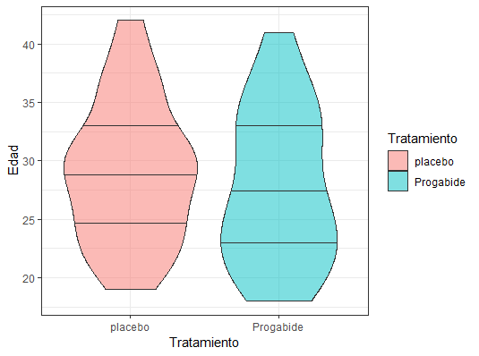

***Figura 35***: *Diagrama de violin de la edad de los pacientes para los dos grupos experimentales.*

Este gráfico nos permite confirmar que los pacientes, según su edad, han sido aleatoriamente distribuídos en los dos grupos de estudios, ya que ambos diagramas presentan características muy similares entre sí.

**Ejercicio**: Indague las distribuciones del número de ataques previos al experimento entre los dos grupos de estudios.

Ahora sí, analicemos que sucede con la variable objetivo del estudio, el número de ataques en los diferentes períodos. Grafiquemos los diagramas de cajas de esta variable en los cuatro instantes de tiempo, distinguiendo en cada uno de ellos el grupo experimental.

```
> ggplot(data=epilepsy)+geom_boxplot(aes(x=period, y=seizure.rate, color=treatment))+labs(x="Período", y="Ataques registrados", color="Tratamiento")+theme_bw()
```

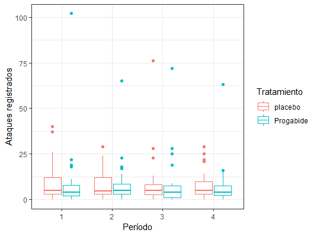

***Figura 36***: *Diagrama de cajas del número de ataques registrados durante el tratamiento, en los cuatro períodos comprendidos y para los dos grupos experimentales.*

En esta gráfica se pueden destacar varios aspectos. Por un lado, las distribuciones del *número de convulsiones* registrados durante el experimento aparentan ser similares tanto entre grupos experimentales como entre los distintos períodos que abarcó el estudio. Particularmente, se aprecian diagramas de caja más anchos para los pacientes tratados con placebo, fundamentalmente en los primeros dos períodos. Las medianas por grupo de tratamiento y por período también resultan similares.

```
> by(epilepsy$seizure.rate, epilepsy[, c("treatment", "period")], median)
treatment: placebo
period: 1
[1] 5
------------------------------------------------------------------------------
treatment: Progabide
period: 1
[1] 4
------------------------------------------------------------------------------
treatment: placebo
period: 2
[1] 4.5
------------------------------------------------------------------------------
treatment: Progabide
period: 2
[1] 5
------------------------------------------------------------------------------
treatment: placebo
period: 3
[1] 5
------------------------------------------------------------------------------
treatment: Progabide
period: 3
[1] 4
------------------------------------------------------------------------------
treatment: placebo
period: 4
[1] 5
------------------------------------------------------------------------------
treatment: Progabide
period: 4
[1] 4
```
**Ejercicio**: implemente una función que permita para cada grupo de obaservaciones definido según el tratamiento y el período en el que se registró, obtener el valor medio, desvío, coeficiente de variación, mínimo y máximo para el número de convulsiones registradas.

A priori, y sin otros resultados, parecería que no hay diferencias en el número de ataques registrados entre los pacientes que fueron tratados con placebo y con Progabide.

En los diagramas de caja es posible apreciar ciertos valores que escapan de ellos, comunmente llamados *valores atípicos* o *outliers*. Qué hacer con los *outliers* es una gran decisión cuya respuesta no es única. Muchos investigadores los identifican, pero de igual manera los trabajan como el resto de los datos, mientras que otros los eliminan o sustituyen por valores característicos de la variable como la media, mediana, moda, etc. La importancia de un *outlier* depende de varias cuestiones. Por ejemplo, en este estudio, donde se analizan varias observaciones de un mismo paciente, es importante identificar dos tipos de *outliers*. Por un lado las observaciones por sí mismas pueden interpretarse como *atípicas*, pero por otro, puede que los sujetos también muestren un comportamiento atípico. Es decir, no es lo mismo que una observación de un sujeto sea atípica a que todas las observaciones de un mismo sujeto lo sean.

Veamos que pasa si asociamos el número de ataques registrado a los sujetos.

```
> ggplot(data=epilepsy, aes(x=period, y=seizure.rate, color=subject,
  group=subject))+geom_point()+geom_line()+labs(x="Período", y="Ataques registrados", color="Tratamiento")+theme_bw()+theme(legend.position="none")+facet_wrap(~treatment)
```

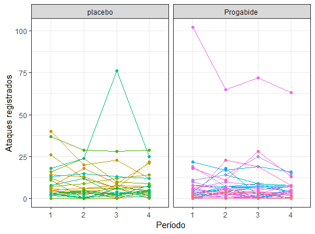

***Figura 37***: *Diagrama de líneas y puntos para el número de ataques registrados durante el tratamiento, en los cuatro períodos comprendidos.*

**Ejercicio**: Discuta la gráfica anterior e identifique datos atípicos.

Decidir que hacer con los datos atípicos depende también del análisis a posteriori que se realizará sobre los datos. Hay metodologías que son más robustas que otras respecto de los *outliers*, por eso dependerá de cuál utilicemos y cuál es nuestro objetivo. En la etapa de análisis descriptivo lo importante es identificar estos posibles valores atípicos.

`ggplot2` nos permite estudiar relaciones entre más de dos variables en un mismo gráfico. Por ejemplo, analicemos que sucede si consideramos el diagrama de dispersión del número de ataques registrados antes del estudio y en cada uno de los periódos que éste involucro en forma separada identificando además los pacientes tratados con placebo y los tratados con Progabide.

```
> ggplot(data=epilepsy, aes(x=base, y=seizure.rate, color=treatment))+
  geom_point(alpha=0.5, size=2)+labs(x="Ataques previos al estudio", y="Ataques registrados", color="Tratamiento", title="Diagrama de dispersión del número de ataques previos \n y por período de estudio")+theme_bw()+theme(legend.position="bottom")+facet_wrap(~period)+theme(plot.title = element_text(hjust=0.5))
```

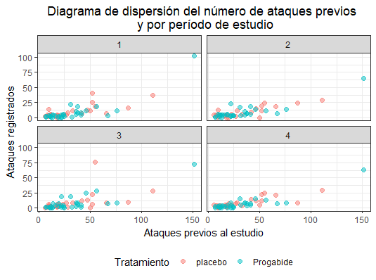

***Figura 38***: *Diagrama de dispersión del número de ataques registrados  previos y durante el tratamiento, en los cuatro períodos comprendidos.*

El gráfico obtenido permite formular varias afirmaciones sobre los datos, que deberán ser confirmadas o refutadas durante el procesamiento de los mismos. La primera de ellas es que no hay un efecto del tratamiento sobre número de ataques registrados, ya que en todos los períodos los puntos rosas y los celestes están mezclados. Por otro lado, parecería que el número de ataques registrados durante el experimento está directamente relacionado con el número de ataques previos que se registró para cada paciente.

Veamos que sucede con el número de ataques y la edad de los pacientes. Primero relacionemos la edad con el número de ataques registrados antes del estudio y luego con los registrados en los cuatro períodos analizados.

```
> ggplot(data=epilepsy, aes(x=age, y=base))+geom_point(aes(color=treatment),
  alpha=0.5)+labs(x="Edad", y="Ataques previos al estudio", color="Tratamiento")+theme_bw()
> ggplot(data=epilepsy, aes(x=age, y=seizure.rate))+
  geom_point(aes(color=treatment), alpha=0.5)+labs(x="Edad", y="Ataques registrados", color="Tratamiento")+theme_bw()+facet_wrap(~period)
```

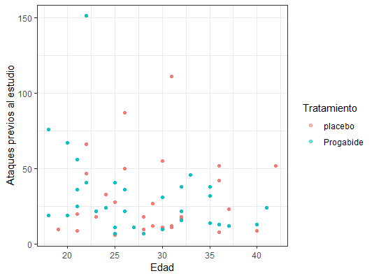

***Figura 39***: *Diagrama de dispersión del número de ataques registrados  previos al experimento y la edad de los pacientes.*

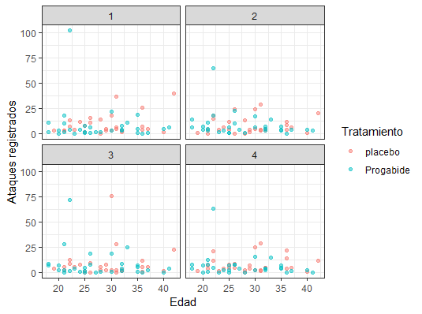

***Figura 40***: *Diagrama de dispersión del número de ataques registrados   durante el tratamiento y la edad de los pacientes, en los cuatro períodos comprendidos.*

Las gráficas indican que, a priori, no existe un claro efecto de la edad sobre el número de ataques sufridos por los pacientes ni antes ni durante el tratamiento.
