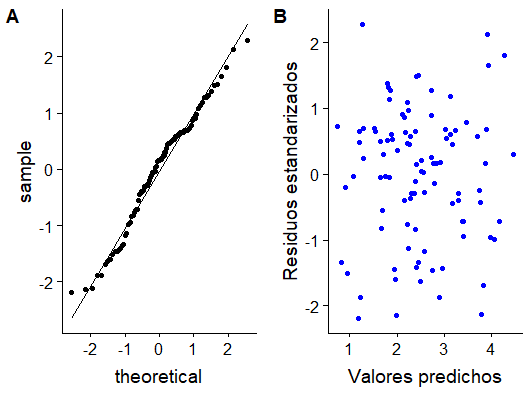

# Unidad 3: Modelos lineales en R

En esta unidad se estudiarán los modelos lineales, su uso, ajuste e implementación así como también su evaluación en el entorno `R`.

## Conceptos previos

Un vector n-dimensional, $\boldsymbol{Y}$, es un *Vector Aleatorio* si cada uno de sus elementos es una *Variable Aleatoria*. La *función de distribución* de un vector aleatorio es la *función de distribución conjunta* de sus elementos. Es así que la *esperanza* de un vector aleatorio es el vector de las esperanzas de sus elementos:

<center>

$E(\boldsymbol{Y})=\begin{bmatrix} E(Y_1) \\ E(Y_2) \\ ...\\ E(Y_n) \end{bmatrix}=\begin{bmatrix} \mu_1\\ \mu_2 \\ ... \\ \mu_n\end{bmatrix}=\boldsymbol{\mu}$

</center>

La *varianza* de un vector aleatorio se define como:

<center>

$V(\boldsymbol{Y})= E((\boldsymbol{Y}-E(\boldsymbol{Y}))(\boldsymbol{Y}-E(\boldsymbol{Y}))^T)=\boldsymbol{\Sigma}=\begin{bmatrix} \sigma_{11} & \sigma_{12} & ... & \sigma_{1n} \\ \sigma_{12} & \sigma_{22} & ... & \sigma_{2n} \\ ... & ... & ... & ... \\ \sigma_{1n} & \sigma_{2n} & ... & \sigma_{nn} \end{bmatrix}$

</center>

$\boldsymbol{\Sigma}$ es una matriz simétrica de $n$x$n$ conocida como *matriz de varianzas y covarianzas*, $\sigma_{ii}=\sigma^2_i$, con $i=1,~...,~n$ es la varianza de la i-ésima variable aleatoria del vector $\boldsymbol{Y}$ y $\sigma_{ij}$ es la covarianza entre el i-ésimo y el j-ésimo elemento de $\boldsymbol{Y}$.

Las propiedades básicas de la esperanza y varianza de transformaciones lineales se
pueden anticipar desde el caso univariado. Si $\boldsymbol{A}$ es una matriz $q$x$n$ y $\boldsymbol{c}$ un vector de constantes $q$x$1$, entonces:

<center>

$E(\boldsymbol{A}\boldsymbol{Y}+\boldsymbol{c})= \begin{bmatrix} E(\sum\limits_{j=1}^n a_{1j}Y_j + c_1) \\ E(\sum\limits_{j=1}^n a_{2j}Y_j + c_2) \\ ... \\ E(\sum\limits_{j=1}^n a_{nj}Y_j +c_n)\end{bmatrix}=\begin{bmatrix} \sum\limits_{j=1}^n a_{1j}E(Y_j) + c_1 \\ \sum\limits_{j=1}^n a_{2j}E(Y_j) + c_2 \\ ... \\ \sum\limits_{j=1}^n a_{nj}E(Y_j) +c_n\end{bmatrix}=\begin{bmatrix} \sum\limits_{j=1}^n a_{1j}\mu_j + c_1 \\ \sum\limits_{j=1}^n a_{2j}E\mu_j + c_2 \\ ... \\ \sum\limits_{j=1}^n a_{nj}\mu_j +c_n\end{bmatrix}= \boldsymbol{A}\boldsymbol{\mu}+\boldsymbol{c}$

</center>

<center>

$V(\boldsymbol{A}\boldsymbol{Y}+\boldsymbol{c})= E(((\boldsymbol{A}\boldsymbol{Y}+\boldsymbol{c})-E(\boldsymbol{A}\boldsymbol{Y}+\boldsymbol{c}))((\boldsymbol{A}\boldsymbol{Y}+\boldsymbol{c})-E(\boldsymbol{A}\boldsymbol{Y}+\boldsymbol{c}))^T)=\boldsymbol{A}\boldsymbol{\Sigma}\boldsymbol{A}^T$

</center>

Particularmente, si las variables aleatorias que conforman el vector aleatorio $\boldsymbol{Y}$ son independientes y todas se distribuyen según $Y_i \sim N(\mu_i, \sigma^2)$, el vector aleatorio tiene distribución *normal multivariada* tal que $\boldsymbol{Y} \sim N(\boldsymbol{\mu}, \boldsymbol{\Sigma})$. Además, la independencia de los elementos del vector aleatorio determina que $\boldsymbol{\Sigma}$ sea una matriz diagonal, definida positiva. La función de densidad conjunta de los elementos de $\boldsymbol{y}$ está dada por:

<center>

$f(\boldsymbol{Y})=f(Y_1)f(Y_2)...f(Y_n)=\prod\limits_{i=1}^n( (2\pi)^{-\frac{1}{2}}\sigma_ie^{-\frac{(Y_i-\mu_i)^2}{2\sigma^2_i}})=(2\pi)^{-\frac{n}{2}}\prod\limits_{i=1}^n(\sigma_i)e^{-\frac{1}{2}\sum\limits_{i=1}^n\frac{(Y_i-\mu_i)^2}{\sigma^2_i}})= (2\pi)^{-\frac{n}{2}}|\Sigma|^{-\frac{1}{2}}e^{-\frac{1}{2}[(\boldsymbol{Y}-\boldsymbol{\mu})^T \boldsymbol{\Sigma}(\boldsymbol{Y}-\boldsymbol{\mu})]})$

</center>


## Introducción a los Modelos lineales

Un *modelo estadístico* es una representación idealizada para explicar un proceso que genera datos. Usualmente, está representado mediante una ecuación o series de ecuaciones que involucra un número de *parámetros*. En términos generales, los modelos pueden utilizarse tanto para *predecir* el valor de una VA  o para *inferir* las relaciones existentes entre ciertas variables y una VA. Supongamos que queremos modelar el valor de una *variable respuesta* continua, $Y$ en función de los valores de $l$ variables *predictoras*, *regresoras* o *covariables*, $x_1$, $x_2$, ..., $x_l$, para lo cual es posible definir la ecuación:

<center>

$Y=f(x_1,~x_2,~...,~x_l)+\epsilon$

</center>

$f$ es la función que relaciona la variable respuesta con las predictoras y $\epsilon$ es el término de *error* que comete el modelo al representar el fenómeno real. Particularmente, pensemos en un modelo cuya ecuación define una *relación* entre un valor de la variable respuesta y valores de las predictoras o funciones de éstas, mediada por *coeficientes desconocidos*, $\beta_1$, $\beta_2$, ..., $\beta_p$:

<center>

$Y_i=\mu_i(\boldsymbol{x}_i\boldsymbol{\beta})+\epsilon_i$

</center>

Más específicamente este modelo nos dice que el valor de $Y$, $Y_i$, resulta de sumarle un término aleatorio $\epsilon_i$ a su esperanza $\mu$, la cual depende tanto de los valores observados para las covariables ($\boldsymbol{x}_i$) como de un vector de parámetros desconocidos ($\boldsymbol{\beta}$). En base a esta ecuación es posible definir entonces un **modelo lineal**.

### Formulación del modelo lineal

Este tipo de modelo se caracteriza por varios aspectos:

- $Y_i$ se asume con distribución normal.

- la relación existente entre $Y_i$ y las covariables o funciones de éstas es *lineal* en término de los parámetros del modelo, es decir:

<center>

$Y_i=q_0(\boldsymbol{x}_i)\beta_0+q_1(\boldsymbol{x}_i)\beta_1+q_2(\boldsymbol{x}_i)\beta_2+...+q_{p-1}(\boldsymbol{x}_i)\beta_{p-1}+\epsilon_i$

</center>

- el término de error se asume con distribución normal de esperanza 0 y varianza $\sigma^2$, usualmente desconocida.

**Pregunta**: Cuál sería un ejemplo de un modelo no lineal? Considere la ecuación $Y_i=\beta_0+\beta_1x_1+\beta_2x_1^2$, representa un modelo lineal?

Cabe destacar que los $x_i$ se asumen constantes fijas y conocidas, por eso se denotan con letras minúsculas. Mientras, la variable respuesta, $Y_i$ es una VA, debido a que depende de $\epsilon_i$, que es una VA. Es por eso que a la variable respuesta se denota con mayúsculas.

Tomemos como ejemplo un caso sencillo, $\mu_i(\boldsymbol{x}_i\boldsymbol{\beta})=\beta_0+\beta_1x_i=E(Y_i|x_i)$, esto es $q_0=1$ y $q_1=x$. En este caso, $E(Y_i|\boldsymbol{x}_i)$ tendrá la forma de una recta con ordenada al origen $\beta_0$ y pendiente $\beta_1$. Aunque este es un ejemplo sencillo, las curvas y superficies que pueden modelarse mediante los modelos lineales pueden ser muy diversas. El problema de encontrar, expresiones para superficies muy estructurada radica en la dificultad de identificar las funciones q_j (.), que no siempre pueden justificarse. Las formas más comunes de $q_j(.)$ son $q_0(.)=1$ y $q_j(\boldsymbol{x}_i)=x_{ij}$, $j>0$. De esta manera, el modelo lineal queda expresado como:

<center>

$Y_i=\beta_0+x_{i1}\beta_1+x_{i2}\beta_2+...+x_{ip-1}\beta_{p-1}+\epsilon_i$


</center>

Otras formas comúnes son:

<center>

$Y_i=\beta_0+x_{i1}\beta_1+x_{i1}^2\beta_2+...+x_{i\frac{p-1}{2}}\beta_{p-2}+x_{i\frac{p-1}{2}}^2\beta_{p-1}+\epsilon_i$

$Y_i=\beta_0+x_{i1}\beta_1+x_{i2}\beta_2+x_{i1}x_{i2}\beta_3...+x_{il}x_{il-1}\beta_{p-1}+\epsilon_i$


</center>

La elección de las funciones $q_j(.)$ depende del objetivo del modelo lineal, *predicción* o *inferencia*. En el primer caso, la elección de dichas funciones es menos restrictiva ya que lo que se trata es de ajustar un modelo que permita predecir confiablemente los valores de la variable respuesta. Mientras, en el segundo caso, las funciones propuestas no pueden ser cualesquiera sino que deben responder a una característica del fenómeno bajo estudio.

Un modelo se construye a partir de *n* observaciones del tipo $(\boldsymbol{x}_i, Y_i)$ con $i=1,...,n$. Es por ello que se lo suele formular en términos matriciales:

<center>

$\boldsymbol{Y}= \begin{bmatrix}  Y_1 \\...\\Y_i \\ ... \\ Y_n\end{bmatrix}=\begin{bmatrix} q_0(\boldsymbol{x}_1) & ...& q_j(\boldsymbol{x}_1) & ... & q_{p-1}(\boldsymbol{x}_1) \\ ... & ... & ... & ... & ...\\ q_0(\boldsymbol{x}_i) & ...& q_j(\boldsymbol{x}_i) & ... & q_{p-1}(\boldsymbol{x}_i) \\ ... & ... & ... & ... & ... \\
q_0(\boldsymbol{x}_n) & ...& q_j(\boldsymbol{x}_n) & ... & q_{p-1}(\boldsymbol{x}_n) \end{bmatrix} \begin{bmatrix} \beta_0 \\ ... \\ \beta_j \\ ... \\ \beta_{p-1} \end{bmatrix}+\begin{bmatrix} \epsilon_0 \\ ... \\ \epsilon_j \\ ... \\ \epsilon_{p-1} \end{bmatrix}=\boldsymbol{X}\boldsymbol{\beta}+\boldsymbol{\epsilon}$

</center>

En esta expresión, $\boldsymbol{\beta}$ es el *vector de parámetros* cuyos valores son desconocidos, $\boldsymbol{\epsilon}$ es el vector de error, con distribución $N(0,\boldsymbol{\Sigma})$ y $\boldsymbol{X}$ es la **matriz de diseño**. Luego,

<center>

$E(\boldsymbol{Y}|\boldsymbol{x})=E(\boldsymbol{X}\boldsymbol{\beta}+\boldsymbol{\epsilon})=E(\boldsymbol{X}\boldsymbol{\beta})+E(\boldsymbol{\epsilon})=\boldsymbol{X}\boldsymbol{\beta}$

$V(\boldsymbol{Y})=V(\boldsymbol{X}\boldsymbol{\beta}+\boldsymbol{\epsilon})=V(\boldsymbol{\epsilon})=\boldsymbol{\Sigma}$

</center>

Es decir, $\boldsymbol{Y}|\boldsymbol{x}\sim N(\boldsymbol{\mu}, \boldsymbol{\Sigma})$. $\boldsymbol{\mu}$ tiene $n$ elementos y $\boldsymbol{\Sigma}$, $n(n-1)/2$, mientras que $\boldsymbol{\beta}$ tiene $p$ elementos. Generalmente, el número de observaciones disponibles es menor que el total de parámetros que deben estimarse, por lo que se suelen fijar los valores de ciertos parámetros a la hora de definir el modelo.

### Modelos lineales clásicos

En el caso de los *modelos lineales* clásicos, que son los que estudiaremos en este capítulo, se asume que $\boldsymbol{\mu}=\boldsymbol{X}\boldsymbol{\beta}$ y que $\boldsymbol{\Sigma}=\sigma^2\boldsymbol{I}_n$ siendo $\boldsymbol{\beta}$ un vector de parámetros de *efectos fijos* con $p$ elementos. Particularmente, la ecuación $E(\boldsymbol{Y}|\boldsymbol{x})=\boldsymbol{X\beta}$ es la *ecuación del modelo*, el cual por asumir varianza constante, se dice *homocedástico*. Además, como $\boldsymbol{\Sigma}$ resulta simétrica ya que los pares $(\epsilon_i, \epsilon_j),~i=1,...,n$ y $j=1,...,n$ con $i\neq j$ son no correlacionados (independientes). La *matriz de diseño* o *matriz del modelo*, $\boldsymbol{X}$ puede contener todos elementos 0 o 1, caso en el que recibe el nombre de *matriz de incidencia* o puede también contener valores numéricos reales.
En el primer caso, la matriz se corresponde con un experimento en donde se analiza el *efecto* de los distintos *niveles* de diversos *factores experimentales*.

Por ejemplo, supongamos un estudio donde se ha determinado el número glóbulos rojos en un conjunto de pacientes, algunos de ellos que han recibido una dieta reforzada en Hierro, otros han combinado su dieta normal con intermitencias de suplementos de hierro y otros han continuado con su alimentación normal. En este experimento, la *variable respuesta* es el número de glóbulos rojos, mientras que la *variable predictora* es la `dieta`. La variable predictora, en este caso también se denomina *variable de clasificación* o *factor* ya que permite categorizar a los individuos bajo estudio en distintos grupos, según sus distintos *niveles*. En este caso, el factor `dieta` tiene tres niveles, `reforzada`, `intermitente` y `normal`.

En el segundo caso, la matriz de diseño se corresponde con un experimento en donde al menos una de las *variables independientes* son del tipo continuas, comúnmente denominadas como *regresoras*. Suponga por ejemplo, que en el experimento anterior además de la dieta de cada paciente se ha registrado el peso de cada uno de ellos. Esta variable actía ahora como una *covariable* continua.

### Estimación de los parámetros del modelo

El ajuste de un modelo lineal clásico consiste en estimar el valor del vector de parámetros $\boldsymbol{\beta}$ y de la matriz de varianzas y covarianzas $\boldsymbol{\Sigma}=\sigma^2\boldsymbol{I}_n$, es decir el valor de $\sigma^2$. Generalmente, los estimadores que se utilizan son los obtenidos mediante el método de *mínimos cuadrados ordinarios* (*ordinary least square, OLS*) o el método de *máxima verosimilitud* (*maximum likelihood, ML*).

#### Estimadores OLS

La estimación mediante el método *OLS* tiene como objetivo minimizar el error que comete el modelo al realizar las estimaciones. Para ello, busca los valores de los parámetros del modelo que minimicen la *suma de cuadrados del error o residual*:

<center>

$RSS=\sum\limits_{i=1}^n e_i^2=\sum\limits_{i=1}^n(y_i-\hat{y_i})^2$

</center>

o en forma matricial

<center>

$RSS=\sum\limits_{i=1}^n e^2_i=\boldsymbol{e}^T\boldsymbol{e}=(\boldsymbol{y}-\boldsymbol{X\beta})^T(\boldsymbol{y}-\boldsymbol{X\beta})$

</center>

Donde $\boldsymbol{e}$ son los *residuos* del modelo.

Al derivar esta ecuación respecto a $\boldsymbol{\beta}$ e igualarla a 0 se obtiene que el valor buscado, $\hat{\boldsymbol{\beta}}$ satisface:

<center>

$\boldsymbol{X}^T\boldsymbol{X}\boldsymbol{\beta}=\boldsymbol{X}^T\boldsymbol{y}$

</center>

Que es lo que se conoce como *ecuaciones normales*. La solución de este sistema existe siempre y cuando $\boldsymbol{X}^T\boldsymbol{X}$ es de rango completo. El estimador del vector de parámetros será

<center>

$\hat{\boldsymbol{\beta}}=(\boldsymbol{X}^T\boldsymbol{X})^{-1}\boldsymbol{X}^T\boldsymbol{y}$

</center>

Adicionalmente, de estas ecuaciones se desprende que:

<center>

$\hat{\boldsymbol{y}}=\boldsymbol{X}\boldsymbol{\beta}=\boldsymbol{X}(\boldsymbol{X}^T\boldsymbol{X})^{-1}\boldsymbol{X}^T\boldsymbol{Y}=\hat{\boldsymbol{H}}\boldsymbol{y}$

</center>

donde $\hat{\boldsymbol{H}}$ es la *matriz hat*, que no es más que la matriz de proyección ortogonal de $\boldsymbol{y}$ sobre el espacio generado por las columnas de $\boldsymbol{X}$.

Además, $\hat{\boldsymbol{\beta}}$ es un estimador *insesgado* para $\boldsymbol{\beta}$ ya que:

<center>

$E(\hat{\boldsymbol{\beta}})=E((\boldsymbol{X}^T\boldsymbol{X})^{-1}\boldsymbol{X}^T(\boldsymbol{X\beta}+\boldsymbol{\epsilon}))=E(\boldsymbol{\beta})+E((\boldsymbol{X}^T\boldsymbol{X})^{-1}\boldsymbol{X}^T\boldsymbol{\epsilon})=\boldsymbol{\beta}$

</center>

 y tiene varianza dada por:

<center>

$Var(\hat{\beta})=E((\hat{\beta}-\beta)(\hat{\beta}-\beta)^T)=E((\boldsymbol{X}^T\boldsymbol{X})^{-1}\boldsymbol{X}^T\boldsymbol{\epsilon}\boldsymbol{\epsilon}^T\boldsymbol{X}(\boldsymbol{X}^T\boldsymbol{X})^{-1})=\sigma^2(\boldsymbol{X}^T\boldsymbol{X})^{-1}$

</center>

Además, el estimador de $\sigma^2$, $\hat{\sigma}^2$, es:

<center>

$\hat{\sigma}^2=\frac{\boldsymbol{e}^T\boldsymbol{e}}{n-p}=\frac{RSS}{n-p}$

</center>

Cabe destacar que $\hat{\sigma}^2$ es un estimador *insesgado* para $\sigma^2$, $p$ es el rango de la matriz $\boldsymbol{X}$ y $n-p$ son los *grados de libertad* del modelo.

Finalmente, el *error estandar* de $\beta_{i-1}$ está dado por $EE_{i-1}=\sqrt{(\boldsymbol{X}^T\boldsymbol{X}_{ii})^{-1}\hat\sigma^2}$.


####Estimadores de máxima verosimilitud

Los estimadores ML se basan en maximizar la función de verosimilitud del vector de variables respuestas $\boldsymbol{Y}$. Como se especifico anteriormente, este vector se asume con distribución normal multivariada, $\boldsymbol{Y}|\boldsymbol{x}\sim N(\boldsymbol{\mu},\sigma^2\boldsymbol{I}_n)$. La función de verosimilitud para dicha distribución es:

<center>

$L(\boldsymbol{\beta}, \sigma^2:\boldsymbol{y}|\boldsymbol{x})=(2\pi)^{-\frac{n}{2}}(\sigma^2)^{-\frac{n}{2}}e^{-\frac{1}{2\sigma^2}[(\boldsymbol{y}-\boldsymbol{X\beta})^T(\boldsymbol{y}-\boldsymbol{X\beta})]}$

</center>

Como los valores de la variable respuesta se consideran fijos, el objetivo es encontrar el valor de $\boldsymbol{\beta}$ y $\sigma^2$ que maximice la función de verosimilitud $(L(\boldsymbol{\beta}, \sigma^2:\boldsymbol{y}|\boldsymbol{x}))$. Trabajar con esta expresión en búsqueda de una maximización no es sencillo, por ello se busca utilizar una función monótona creciente de dicha función. Para ello, se considera la función logaritmo natura de $L$ $(ln(L(\boldsymbol{\beta}, \sigma^2:\boldsymbol{y}|\boldsymbol{x})))$ conocida como función  *log-verosimilitud*.

La búsqueda del máximo de $ln(L)$ se realiza mediante el método de las derivadas primeras. Se determina la derivada de la función respecto a cada uno de los parámetros y luego se iguala las expresiones obtenidas a 0. De esta manera se resuelve el sistema para encontrar los valores de $\boldsymbol{\beta}$ y $\sigma^2$ que maximizan la función en simultáneo.

Al realizar este procedimiento se llega al mismo conjunto de ecuaciones normales para el método OLS, por lo que, por un lado

<center>

$\hat{\boldsymbol{\beta}}=(\boldsymbol{X}^T\boldsymbol{X})^{-1}\boldsymbol{X}^T\boldsymbol{y}$

</center>

nuevamente, resultando $\hat{\boldsymbol{\beta}}$ un estimador *insesgado* para el vector de parámetros. Mientras, el estimador para $\sigma^2$ está dado por:

<center>

$\tilde{\sigma}^2=\frac{\boldsymbol{e}^T\boldsymbol{e}}{n}=\frac{RSS}{n}$

</center>

Cabe destacar que, en este caso, el estimador $\tilde{\sigma}^2$ es *sesgado*, por lo que se suele utilizar una corrección sobre el para obtener un estimador *insesgado*:

<center>

$\hat{\sigma}^2=\tilde{\sigma}^2\frac{n}{n-p}$

</center>

donde $\hat{\sigma}^2$ no es más que el estimador de $\sigma^2$ obtenido por el método OLS.

### Implicancias del modelo lineal general

A continuación vamos a analizar algunas implicancias del modelo lineal y los métodos de estimación de los parámetros, útiles a la hora de evaluar el ajuste de un modelo.

Recordemos, tanto el estimador MV como el OLS para el vector de parámetros resultó ser:

<center>

$\boldsymbol{\hat{\beta}}=(\boldsymbol{X}^T\boldsymbol{X})^{-1}\boldsymbol{X}^T\boldsymbol{y}$

</center>

Por lo tanto,

<center>

$\boldsymbol{X}^T\boldsymbol{X}\boldsymbol{\hat{\beta}}=\boldsymbol{X}^T\boldsymbol{y}$

$\boldsymbol{X}^T\boldsymbol{X}\boldsymbol{\hat{\beta}}=\boldsymbol{X}^T(\boldsymbol{X}\hat{\boldsymbol{\beta}}+\boldsymbol{\epsilon})$

</center>

Luego,

<center>

$\boldsymbol{X}^T\boldsymbol{\epsilon}=\boldsymbol{0}$

</center>

Lo cual implica que:

1. Los valores observados de $\boldsymbol{X}$ **NO** están correlacionados con los residuos del modelo.

Si nuestro modelo incluye un término constante, entonces la primer columna de la matriz $\boldsymbol{X}$ se compone de todos 1 y se verifica que,

2. La suma de los residuos es $0$.
3. La media muestral de los residuos, $\boldsymbol{\overline{e}}=\frac{\sum\limits_{i=1}^ne_i}{n}=0$
4. Los *valores predichos* de la variable respuesta **NO** están correlacionados con los residuos del modelo

Cabe destacar además que $\boldsymbol{e}\sim N(\boldsymbol{0}, \hat\sigma^2(\boldsymbol{I}_n-\boldsymbol{H}))$ ya que:

<center>

$\boldsymbol{e}=\boldsymbol{y}-\boldsymbol{\hat{y}}=\boldsymbol{y}-\boldsymbol{X\hat{\beta}}=(\boldsymbol{I}_n-\boldsymbol{H})\boldsymbol{y}$

$E(\boldsymbol{e})=E(\boldsymbol{y}-\boldsymbol{\hat{y}})=0$

$Var(\boldsymbol{e})=Var((\boldsymbol{I}_n-\boldsymbol{H})\boldsymbol{y})=\hat{\sigma}^2(\boldsymbol{I}_n-\boldsymbol{H})$

</center>

Además, se define el *residuo estandarizado* a

<center>

$r_i=\frac{e_i}{\sqrt{\hat{\sigma}^2(1-h_{ii})}}$
</center>

### Pruebas de hipótesis

Muchas veces será necesario realizar diferentes pruebas de hipótesis para, por ejemplo, decidir si un modelo es mejor que otro o para identificar aquellos coeficientes que no tienen efecto en la variable respuesta.

#### Pruebas de hipótesis sobre los coeficientes

El caso más sencillo a probar es si el coeficiente $\beta_{i}$ es nulo, lo que implicaría que no hay relación lineal entre $\boldsymbol{Y}$ y la variable $\boldsymbol{x}_{i+1}$, es decir formular el test de hipótesis:

<center>

$H_0:~\beta_{i}=0$

$H_1:~\beta_{i} \neq 0$

</center>

cuyo estadístico de prueba es

<center>

$t_{i}=\frac{\hat{\beta_{i}}}{EE(\hat{\beta_{i}})}$, con $t_i \sim t_{n-p}$

</center>

Si quisiera por ejemplo evaluar si $\beta_i=b$ entonces simplemente se plantea el test $H_0:~\beta_i=b~vs~H_1:~\beta_i\neq b$ cuyo estadístico es:

<center>

$t_{i}=\frac{\hat{\beta_{i}}-b}{EE(\hat{\beta_{i}})}$, con $t_i \sim t_{n-p}$

</center>

En forma general, es posible plantear una prueba de hipótesis para *contrastes* más complejos de la forma $\boldsymbol{H\beta}=\boldsymbol{h}$, donde $\boldsymbol{H}$ es una matriz $q$x$p$ donde $q$ es el rango de $\boldsymbol{H}$ y representa un número de coeficientes fijos especificados para el test. En el ejemplo anterior, el test se plantearía utilizando $\boldsymbol{H}=[0,...,1,...,0]$ y $\boldsymbol{h}=[b]$. Otro ejemplo puede ser aquel que plantea que todos los parámetros del modelo son nulos a la vez, es decir:

<center>

$\boldsymbol{H}_{(p-1)xp}=\begin{bmatrix} 1 & 0 & 0 & ... & 0 \\ 0 & 1 & 0 & ... & 0 \\ 0 & 0 & 1 & ... & 0 \\ ... & ... & ... & ... & ...\\ 0 & 0 & 0 & ... & 1 \end{bmatrix}$ y $\boldsymbol{h}_{p-1}=\begin{bmatrix} 0 \\0 \\0\\...\\ 0\end{bmatrix}$

</center>

Ahora bien, cómo determinamos el estadístico de prueba para evaluar esta hipótesis nula? Esto lo hacemos con la *prueba del cociente de verosimilitudes* conocido por su nombre en inglés, *likelihood ratio test* (LRT). La prueba consiste en evaluar el cambio en la función de verosimilitud al asumir cierta la hipótesis nula. Para ello se define el *cociente de verosimilitudes*:

<center>

$V=L(h)/L(M)$

</center>

donde $L(h)$ refiere a la función de verosimilitud bajo hipótesis nula cierta, es decir cuando se cumple que $\boldsymbol{H\beta}=\boldsymbol{h}$ y $L(M)$, al valor máximo de la función de verosimilitud, es decir, cuando los parámetros valen $\hat{\boldsymbol{\beta}}_{MV}$ y $\hat{\sigma}^2_{MV}$. Siempre se cumplirá que $L(h)\leq L(M)$, de manera que $V \to 1$ mientras $L(h) \to L(M)$, caso en que no debería rechazarse la hipótesis nula. De lo contrario si $L(h)$ se aleja de $L(M)$ el cociente se alejará de 1, lo que indica que hay evidencias suficientes para rechazar la hipótesis nula, por ser significativo el cambio en la función de verosimilitud. Como la función de log-verosimilitud sigue el mismo comportamiento que $L$, suele utilizarse ésta

En el contexto de los modelos lineales generales, la forma de $V$ es:

<center>

$V=(\frac{\hat{\sigma}_h^2}{\hat{\sigma}})^{-\frac{n}{2}}$

</center>

Este estadístico no tiene distribución conocida, pero a partir de el se construye el estadístico $w$ de la prueba, el cual si tiene distribución conocida:

<center>

$W=(V^{-\frac{2}{n}}-1)(\frac{n-p}{q})=(\frac{n-p}{q})\frac{(\boldsymbol{H\hat{\beta}}-\boldsymbol{h})^T(\boldsymbol{H}(\boldsymbol{X}^T\boldsymbol{X})^{-1}\boldsymbol{H}^T)^{-1}(\boldsymbol{H\hat{\beta}}-\boldsymbol{h})}{\boldsymbol{y}^T(\boldsymbol{I}-\boldsymbol{X}(\boldsymbol{X}^T\boldsymbol{X})^{-1}\boldsymbol{X}^T)\boldsymbol{y}}$

</center>

Como $W$ es el cociente de dos variables $\chi^2$, $W$ tiene distribución $F_{q,n-p,\lambda}$ con $\lambda$ parametro de no centralidad cuyo valor bajo hipótesis nula es 0.

Las pruebas de hipótesis también se suelen construir mediante la utilización de las *sumas de cuadrados*. Para ello se descompone la *suma de cuadrados totales (TSS)*, $(\boldsymbol{y}-\overline{\boldsymbol{y}})^T(\boldsymbol{y}-\overline{\boldsymbol{y}})$, en la:
- *suma de cuadrados del modelo (RMS)*, $(\boldsymbol{y}-\overline{\boldsymbol{y}})^T( \boldsymbol{X}(\boldsymbol{X}^T\boldsymbol{X})^{-1}\boldsymbol{X}^T)(\boldsymbol{y}-\overline{\boldsymbol{y}})$
- *suma de cuadrados residual (RSS)*, $\boldsymbol{y}^T( \boldsymbol{I}-\boldsymbol{X}(\boldsymbol{X}^T\boldsymbol{X})^{-1}\boldsymbol{X}^T)\boldsymbol{y}$

De manera entonces que el estadístico del test es:

<center>

$W=\frac{n-p}{q}\frac{RMS}{RSS}$
</center>

el cual tiene distribución $F_{q,n-p,\lambda}$, con $\lambda=0$ bajo $H_0$.

Es posible también analizar las sumas de cuadrados parciales asociadas a algunos de los coeficientes del modelo. Para ello, se debe considerar las submatrices de $\boldsymbol{X}$ correspondientes a tales coeficientes a la hora de determinar las sumas de cuadrados. Este análisis es muy común ya permite descomponer la varianza total de los datos según el porcentaje de ésta que explica cada una de las variables del modelo, para así poder distinguir cuales de las variables aportan al poder explicativo y cuales no. Comúnmente, en el contexto de los modelos de clasificación se conoce este análisis como *ANOVA* o *Análisis de la Varianza*.


## Modelos de regresión lineal

Los *modelos de regresión* se utilizan para explicar o modelar la relación entre una variable respuesta $Y$ y un conjunto de variables *explicativas*, *predictoras* o *regresoras*, $x_1$, $x_2$, ..., $x_n$, donde al menos una de ellas es del tipo continua. El caso en el que $n=1$, el modelo se llama de *regresión simple* mientras que si $n>1$ el modelo se llama de *regresión múltiple*.

### Base de datos `prostate`

A lo largo de esta unidad vamos a trabajar sobre un conjunto de datos del paquete `R` `faraway`, conteniendo los datos de ejemplo del libro *Linear Models with R, Julian J Faraway, Chapman & Hall, 2009*. Para poder utilizarlo, primero instalaremos el paquete:

```

> install.packages("faraway")

```

El conjunto de datos se llama `prostate` y contiene los registros de pacientes con cáncer de próstata sometidos a una prostatectomía radical.

```
> data(prostate, package="faraway")
> head(prostate)
        lcavol  lweight age   lbph   svi    lcp     gleason pgg45   lpsa
  1 -0.5798185  2.7695  50 -1.386294   0 -1.38629       6     0 -0.43078
  2 -0.9942523  3.3196  58 -1.386294   0 -1.38629       6     0 -0.16252
  3 -0.5108256  2.6912  74 -1.386294   0 -1.38629       7    20 -0.16252
  4 -1.2039728  3.2828  58 -1.386294   0 -1.38629       6     0 -0.16252
  5  0.7514161  3.4324  62 -1.386294   0 -1.38629       6     0  0.37156
  6 -1.0498221  3.2288  50 -1.386294   0 -1.38629       6     0  0.76547
> summary(prostate)
     lcavol           lweight           age             lbph              svi        
 Min.   :-1.3471   Min.   :2.375   Min.   :41.00   Min.   :-1.3863   Min.   :0.0000  
 1st Qu.: 0.5128   1st Qu.:3.376   1st Qu.:60.00   1st Qu.:-1.3863   1st Qu.:0.0000  
 Median : 1.4469   Median :3.623   Median :65.00   Median : 0.3001   Median :0.0000  
 Mean   : 1.3500   Mean   :3.653   Mean   :63.87   Mean   : 0.1004   Mean   :0.2165  
 3rd Qu.: 2.1270   3rd Qu.:3.878   3rd Qu.:68.00   3rd Qu.: 1.5581   3rd Qu.:0.0000  
 Max.   : 3.8210   Max.   :6.108   Max.   :79.00   Max.   : 2.3263   Max.   :1.0000  
      lcp             gleason          pgg45             lpsa        
 Min.   :-1.3863   Min.   :6.000   Min.   :  0.00   Min.   :-0.4308  
 1st Qu.:-1.3863   1st Qu.:6.000   1st Qu.:  0.00   1st Qu.: 1.7317  
 Median :-0.7985   Median :7.000   Median : 15.00   Median : 2.5915  
 Mean   :-0.1794   Mean   :6.753   Mean   : 24.38   Mean   : 2.4784  
 3rd Qu.: 1.1786   3rd Qu.:7.000   3rd Qu.: 40.00   3rd Qu.: 3.0564  
 Max.   : 2.9042   Max.   :9.000   Max.   :100.00   Max.   : 5.5829  
```
La base de datos se compone de registros obtenidos en biopsias de prostata de 97 pacientes. Particularmente, las nueve variables registradas son:

- `lcavol`: logarítmo del volúmen tumoral (cc)
- `lweight`: logarítmo del peso de la próstata (g)
- `age`: edad del paciente (año)
- `lbph`: logarítmo de la cantidad de hiperplasia prostática benigna ($cm^2$)
- `svi`: presencia (1) o ausencia (0) de invasión de la vesícula seminal
- `lcp`: logarítmo del grado de penetración del tumor en la cápsula de la próstata (cm)
- `gleason`: Escore de *Gleason*
- `pgg45`: porcentaje del Escore de *Gleason*, indicador patólógico.
- `lpsa`: logarítmo de la concentración de antígeno prostático específico (mg/ml)

El interés de este estudio se centra en la concentración de antígeno prostático específico (*prostatic specific antygen*, PSA), indicador útil para el diagnóstico y durante el tratamiento del cáncer de próstata ya que en estos casos se encuentra en valor aumentado respecto de los pacientes sanos. El objetivo es explicar la relación entre la variable `lpsa` y las covariables.

**Ejercicio**: Realice un análisis exploratorio de la base de datos `prostate`. Redefina las variables `svi` y `Gleason` como factores. Complemente el análisis con resultados gráficos y analíticos.

### Regresión lineal simple

Un modelo sencillo para comenzar a explorar la relación entre las variables de interés es el *modelo de regresión simple*. La ecuación del modelo de regresión lineal simple es:

<center>

$Y_i = \beta_0 + \beta_1x_i + \epsilon_i$

</center>

donde, $\beta_0$ se conoce como *intercepto* y $\beta_1$ es la *pendiente*. Estos dos coeficientes se denominan *coeficientes de regresión*, mientras que $\epsilon_i$ es el término de error asociado a la i-ésima observación y representa la diferencia que existe entre el valor observado de *Y_i* y su valor esperado

<center>

$\epsilon_i=Y_i - (\beta_0 + \beta_1x_i)=Y_i-E(Y_i|X_i=x_i)$

</center>

recordemos además que $\epsilon_i~\sim~N(0,\sigma^2)$ es decir, siendo $\epsilon_i,~i=1,...,n$ VAs *iid*.

Para comprender el concepto estadístico detrás del modelo de regresión lineal simple, observemos la [Figura 1](#Figura1).

 ***Figura 1***: *Modelo de regresión lineal simple. Extraído de Introductory Statistics (Shafer and Zhang), UC Davis Stat Wikn.*

Este modelo tiene tres parámetros a estimar, los cuales son fijos pero desconocidos: $\beta_0$, $\beta_1$ y $\sigma^2$.

En el caso de nuestro conjunto de datos *prostate* la variable respuesta es la concentración de antígeno prostático. En este caso, esta variable se encuentra en escala logarítmica (`lpsa`).  ¿Qué piensa de esto?

#### Construcción del modelo
Veamos que sucede con la distribución de la variable respuesta en su escala natural y en la escala logarítmica.

```
> df<-data.frame(psa=exp(prostate$lpsa), lpsa=prostate$lpsa)
> g1<-ggplot(df, aes(x=1, y=psa))+geom_violin(fill="blue", color="blue", alpha=0.2,
  draw_quantiles =  c(0.25, 0.5, 0.75))+labs(x="")
> g2<-ggplot(df, aes(x=1, y=lpsa))+geom_violin(fill="red", color="red", alpha=0.2,
  draw_quantiles  = c(0.25, 0.5, 0.75))+labs(x="")
> p<-plot_grid(g1,g2, labels=c("A", "B"),nrow=1)
> p

```

 ***Figura 2***: *Diagramas de violín de la variable concentración de antígeno prostático específico (psa) en su escala natural (__A__) y en escala logarítmica (__B__).*

Según los diagramas, la distribución de la variable *psa* en escala logarítmica (`lpsa`) aparenta ser simétrica y unimodal, como lo es la distribución normal, requisito fundamental para considerar esta variable como respuesta de un modelo lineal. Existen diversas pruebas, gráficas y analíticas, para soportar este comportamiento, las cuales profundizaremos más adelante.

Buscamos construir un modelo de regresión simple que explique la concentración de psa en los pacientes. Para seleccionar que variable utilizaremos como regresora, podemos estudiar la correlación entre las distintas columnas del `data.frame` `prostate`.

```
> cor(prostate[,-c(5,7)])
             lcavol   lweight       age        lbph         lcp     pgg45      lpsa
  lcavol  1.00000000 0.1941284 0.2249999  0.02734971  0.67531058 0.4336522 0.7344603
  lweight 0.19412839 1.0000000 0.3075247  0.43493174  0.10023889 0.0508462 0.3541218
  age     0.22499988 0.3075247 1.0000000  0.35018592  0.12766778 0.2761124 0.1695929
  lbph    0.02734971 0.4349317 0.3501859  1.00000000 -0.00699944 0.0784600 0.1798095
  lcp     0.67531058 0.1002389 0.1276678 -0.00699944  1.00000000 0.6315281 0.5488132
  pgg45   0.43365224 0.0508462 0.2761124  0.07846000  0.63152807 1.0000000 0.4223157
  lpsa    0.73446028 0.3541218 0.1695929  0.17980950  0.54881316 0.4223157 1.0000000  
```

Como se puede notar en la tabla de correlaciones, el valor más alto es para las variables `lpsa` y`lcavol`. Exploremos el diagrama de dispersión entre estas variables:


***Figura 3***: *Diagrama de dispersión entre las variables concentración de antígeno prostático específico y volumen tumoral, ambas en escala logarítmica.*

Del gráfico es posible apreciar la relación lineal existente entre estas variables, por lo tanto usaremos a `lcavol` como variable regresora.

####Ajuste e interpretación
Para ajustar el modelo simplemente utilizaremos la función `lm()` del paquete `stats` que se distribuye con la versión base de `R`. Para utilizarla debemos especificar la fórmula que representa la ecuación del modelo. La sintaxis para expresarla es relacionar la variable respuesta con la variable regresora mediante el operador `~`:

```
> modelo<-lm(lpsa~lcavol, data=prostate)
```

Los resultados del ajuste del modelo pueden explorarse con diversas funciones. La más común es la función `summary()`, que resume el modelo ajustado:

```
> summary(modelo)
  Call:
  lm(formula = lpsa ~ lcavol, data = prostate)

  Residuals:
      Min       1Q   Median       3Q      Max
  -1.67625 -0.41648  0.09859  0.50709  1.89673

  Coefficients:
            Estimate Std. Error t value Pr(>|t|)    
  (Intercept)  1.50730    0.12194   12.36   <2e-16 ***
  lcavol       0.71932    0.06819   10.55   <2e-16 ***
  ---
  Signif. codes:  0 ‘***’ 0.001 ‘**’ 0.01 ‘*’ 0.05 ‘.’ 0.1 ‘ ’ 1

  Residual standard error: 0.7875 on 95 degrees of freedom
  Multiple R-squared:  0.5394,	Adjusted R-squared:  0.5346
  F-statistic: 111.3 on 1 and 95 DF,  p-value: < 2.2e-16
```

Analicemos ahora los resultados del ajuste del modelo. La información retornada por la función `summary()` se agrupa en cuatro bloques. Por un lado, el primer bloque muestra cómo se ha utilizado la función para ajustar el modelo. El segundo bloque de información resume los valores mínimo, máximo y los cuartiles Q1, Q2 y Q3 para los *residuos* del modelo. El tercer bloque especifica los detalles del ajuste de los parámetros del modelo y el cuarto refiere a los estadísticos útiles para evaluar la *bondad de ajuste*.

La información contenida en estos bloques puede ser obtenida a partir de los resultados del ajuste, almacenados en la variable `modelo`. Por ejemplo, si queremos reproducir los resultados del segundo bloque informativo bastará con hacer:

```
> summary(modelo$residuals)
Min.  1st Qu.   Median     Mean  3rd Qu.     Max.
-1.67625 -0.41648  0.09859  0.00000  0.50709  1.89673
```

Los residuos del modelo también pueden obtenerse mediante la función `residuals()`. ¿Qué piensa acerca de los valores obtenidos para las medidas resumen estudiadas? Según las hipótesis del modelo lineal, los residuos deben tener distribución $N(0,\sigma^2\boldsymbol{I})$. Antes de entrar en el análisis diagnóstico del modelo ¿Piensa que esto se cumple?

**Ejercicio**: Explore los otros elementos de `modelo` a los cuales puede acceder mediante el operador `$`. Determine otra forma de obtener los residuos del modelo ajustado.

##### Diagnóstico
Al formular el modelo lineal general establecimos ciertas implicancias que se deben cumplir para que el modelo ajustado realmente pueda ser una representación del fenómeno real bajo estudio. Verificar que esto se cumpla es parte del análisis diagnóstico del modelo. Existen diversas estrategias para hacerlo, las más sencillas se basan en el uso de gráficos diagnósticos:

- QQplot de los residuos, dirigido a la comparación de los cuantiles de los residuos estandarizados con los de una distribución normal estándar.
- Dispersión residuos vs predichos, para visualizar la independencia entre éstos.
- Dispersión de residuos vs índice, para visualizar un posible patrón y/o correlación
- Dispersión de residuos vs variables no incluídas en el modelo.
- Dispersión de predichos vs variables incluídas/no incluídas en el modelo.

Entre las técnicas analíticas, se destaca el *Test de Shapiro-Wilk*, útil para evaluar la normalidad de un conjunto de datos, en este caso, de los residuos del modelo. La hipótesis nula de la prueba es que los datos provienen de una distribución normal. Por lo tanto, un valor p menor que el umbral de significancia $\alpha$ indica que hay evidencias suficientes para rechazar la hipótesis nula de normalidad, mientras que valores p más elevados indican que no se puede rechazar $H_0$. Justamente esto último es lo que buscamos en el contexto de la prueba de normalidad de los residuos del modelo lineal.

Comencemos por obtener el QQ-plot para los residuos. Lo que vamos a hacer primero es estandarizarlos:

```
> X<-model.matrix(modelo) #Matriz del modelo
> RSS<-sum(residuals(modelo)^2) # Suma de cuadrados residual
> sigma2Hat<-RSS/(modelo$df.residual) # Estimador de sigma^2
> hatXX<-X%*%solve(t(X)%*%X)%*%t(X) # Matriz Hat
> estudRes<-residuals(modelo)/sqrt(sigma2Hat*(1-diag(hatXX))))
```
**Ejercicio**: Obtenga los residuos estandarizados utilizando la función `rstandard()`.

Ahora construimos el gráfico:

```
> ggplot(data.frame(residuals=estudRes), aes(sample=residuals))+stat_qq(distribution = qnorm)+ stat_qq_line()
> shapiro.test(residuals(modelo))

	Shapiro-Wilk normality test

data:  residuals(modelo)
W = 0.97985, p-value = 0.1419
```


***Figura 4***: *QQ-plot para los residuos estandarizados del modelo de regresión simple.*

Obtengamos ahora el diagrama de dispersión de los residuos y los valores predichos:

```
> ggplot(data.frame(residuals=dfResiduals, predicted=fitted(modelo)), aes(x=predicted, y=residuals))+geom_point(color="blue")+labs(x="Valores predichos", y="Residuos estandarizados")
```


***Figura 5***: *Diagrama de dispersión de los residuos estandarizados y los valores predichos por el modelo de regresión simple .*

**Ejercicio**: obtenga el resto de los gráficos, y concluya sobre si se cumplen o no las hipótesis del modelo lineal. ¿Qué debemos hacer si esto no sucede?

#####Estimaciones
Continuemos analizando el modelo ajustado. La reproducción de los resultados del tercer bloque de la función `summary()` es algo más laboriosa ya que implica calcular algunos de los valores. Comencemos por los valores estimados de los parámetros del modelo, los cuales podemos obtenerlos mediante la función `coefficients()`.

```
> coeficientes<-coefficients(modelo)
> coeficientes
  (Intercept)      lcavol
    1.5072979    0.7193201
```

Según los resultados, nuestro modelo de regresión establece que

<center>

$\hat{lpsa}_i=1.507+0.719lcavol_i$

</center>

es decir, que la recta de regresión entre las variables `lcavol` y `lpsa` tiene una ordenada al orígen (`Intercept`) que vale $1.5073$ y una pendiente de $0.7193$. Este bloque nos dice además que el *error estándar* asociado al intercepto, $EE_0$, es $0.1219$ y el asociado al coeficiente *lcavol*, $EE_1$, es $0.0682$.

**Ejercicio**: Interprete los valores de los coeficientes en el contexto del problema y construya un invervalo de confianza para  $\hat{lcavol}$. Obtenga en `R` los errores estándar asociados a los coeficientes del modelo.

Grafiquemos los datos y la recta de regresión:

```
> ggplot(prostate, aes(x=lcavol, y=lpsa))+
  geom_point(color="red")+geom_abline(intercept=1.057, slope=0.7193, color="blue")
```


***Figura 5***: *Diagrama de dispersión entre las variables concentración de antígeno prostático específico y volumen tumoral, ambas en escala logarítmica y recta de regresión.*


o utilizando la funcion `geom_smooth()`:

```
> ggplot(prostate, aes(x=lcavol, y=lpsa))+
  geom_point(color="red")+geom_smooth(method="lm")
```


***Figura 6***: *Diagrama de dispersión entre las variables concentración de antígeno prostático específico y volumen tumoral, ambas en escala logarítmica y recta de regresión.*

Note que esta recta de regresión tiene asociada una *banda de confianza*, cuyos valores podemos obtener ejecutando `predict(modelo, interval="confidence")`.

**Ejercicio**: Investigue el uso de la función `predict()` para predecir valores de la variable independiente. Encuentre el intervalo de confianza de la cantidad `lpsa` para un valor de `lcavol`$=2$.

##### Pruebas de hipótesis
Otra información contenida en este mismo bloque es el valor del estadístico $t$ y de la probabilidad asociada a éste para las pruebas de hipótesis sobre los coeficientes del tipo $H_0:~\hat{\beta}_i=0~vs~H_A:~\hat{\beta}_i \neq 0$. Se incluye además una especie de código que refiere a la significancia de dichas probabilidades respecto de diversos umbrales. En este ejemplo, para ambos coeficientes, el valor de probabilidad asociado al test es $<2 10^{-16}$, lo cual indica que hay evidencias suficientes en los datos para rechazar las $H_0$s correspondientes, por lo que el modelo debe contener el intercepto y la pendiente.

Para obtener estos valores podemos usar el siguiente fragmento de código:

```
> EEB<-sqrt(diag(solve(t(X)%*%X))*sigma2Hat)
> tB<-coeficientes/EEB
> pB<-2*pt(abs(tB), modelo$df.residual,lower.tail=FALSE)
> tB;pB
  (Intercept)      lcavol
   12.36130       10.54832
  (Intercept)      lcavol
  1.722234e-21  1.118616e-17
```

El cuarto bloque de información de la función `summary()` contiene el error estándar residual, RSS, anteriormente calculado y los grados de libertad ($n-p$). También contiene el valor de $R^2$ también llamado *coeficiente de determinación* y su valor ajustado, $R^2_{adj}$. Este coeficiente es una de las medidas de *bondad de ajuste* más utilizadas en los modelos de regresión, ya que mide la proporción de la variabilidad observada que es explicada por el modelo ajustado:

<center>

$R^2=1-\frac{RSS}{TSS_{corr}}=1-\frac{\sum\limits_{i=1}^n(\hat{y}_i-y_i)^2}{\sum\limits_{i=1}^n(\hat{y}_i-\overline{\boldsymbol{y}})^2}$

$R_{adj}=1-(1-R^2)\frac{n-1}{n-p}$
</center>

Mientras más cercano a 1 esté, mejor será el ajuste del modelo a los datos, mientras que cuanto más se acerque dicho coeficiente a 0, menor será el ajuste. Dependiendo del área de aplicación y de las características del experimento (nivel de control sobre los datos, conocimiento del problema, etc) podrán aceptarse diferentes niveles de  $R^2$

```
> Yobs<-matrix(prostate$lpsa, ncol=1)
> TSS<-t(Yobs-mean(Yobs))%*%(Yobs-mean(Yobs))
>
> R2<-1-RSS/TSS
> R2
          [,1]
[1,] 0.5394319
> n<-nrow(prostate)
> R_adj<-1-(1-R2)*(n-1)/(modelo$df.residual)
> R_adj
          [,1]
[1,] 0.5345838
```
**Pregunta**: Qué indica estos valores de $R^2$?

Finalmente, el último elemento del cuarto bloque devuelto por la función `summary()` son los resultados de la prueba de hipótesis del modelo. En el caso del modelo de regresión lineal simple, la prueba *t* de significancia sobre el coeficiente `lcavol` es equivalente a la prueba *F* de significancia de la regresión. Particularmente, el estadístico de esta prueba $W$ será igual al estadístico $t^2$ y tendrá distribución $F_{1, n-p}$.

```
> W<-tB[2]^2
> pW<-1-pf(W, 1, modelo$df.residual)
> W;pW
lcavol
111.267
lcavol
    0
```

El estadístico $F$ será igual al cociente entre el *cuadrado medio de la regresión* y el *cuadrado medio residual*. Ambos cuadrados medios, se obtienen al dividir la suma de cuadrados respectivas por los correspondientes grados de libertad.
```
> RMS
         [,1]
[1,] 69.00283

> RSS
[1] 58.91476
> RSS/95
[1] 0.6201553

> (RMS/1)/(RSS/95)
        [,1]
[1,] 111.267
```
Estos mismos resultados se pueden visualizar en la tabla de ANOVA:
```
> anova(modelo)
 Analysis of Variance Table
 Response: lpsa
          Df Sum Sq Mean Sq F value    Pr(>F)    
 lcavol     1 69.003  69.003  111.27 < 2.2e-16 ***
 Residuals 95 58.915   0.620                      
 ---
 Signif. codes:  0 ‘***’ 0.001 ‘**’ 0.01 ‘*’ 0.05 ‘.’ 0.1 ‘ ’ 1
 ```
Hay una alternativa para obtener este resultado, la cual es útil además para comparar modelos anidados. En este caso estamos interesados en evaluar si el modelo que incorpora la variable regresora $y_i=\mu_0+lcavol_i+\epsilon_i$ es más adecuado que el modelo que no la incorpora $y_i=\mu_0+\epsilon_i$.

```
> anova(lm(lpsa ~ 1, data = prostate), lm(lpsa~lcavol, data=prostate))

Analysis of Variance Table

Model 1: lpsa ~ 1
Model 2: lpsa ~ lcavol
  Res.Df     RSS Df Sum of Sq      F    Pr(>F)    
1     96 127.918                                  
2     95  58.915  1    69.003 111.27 < 2.2e-16 ***
---
Signif. codes:  0 ‘***’ 0.001 ‘**’ 0.01 ‘*’ 0.05 ‘.’ 0.1 ‘ ’ 1
```

### Regresión lineal múltiple
#### Generalidades
El *modelo de regresión múltiple* admite la presencia de más de una regresora como variable predictiva. La ecuación general del modelo de regresión lineal múltiple es:

<center>

$Y_i = \beta_0 + x_{i1}\beta_1+x_{i2}\beta_2+...+x_{ip-1}\beta_{p-1}+ \epsilon_i$

</center>

donde, $\beta_0$ es el *intercepto* y $\beta_i$ es el coeficiente de regresión asociado a la i-ésima regresora. Las variables regresoras podrán o no ser todas del tipo continuas. Cada uno de estos coeficientes representan el cambio en la variable respuesta debido a un cambio en una unidad de la variable regresora correspondiente, mientras el resto permanecen fijas. Recordemos además que $\epsilon_i$ es el término de error, que se distribuye $\sim~N(0,\sigma^2)$,es decir $\epsilon_i,~i=1,...,n$ VAs *iid*.

#### Regresión lineal múltiple para lpsa
Ajustemos un modelo de regresión lineal múltiple para `lpsa`, considerando como regresoras las variables `lcavol`, `lweight`, `age`, `lbph`, `lcp` y `pgg45`

```
> multipleReg<-lm(lpsa~lcavol+lweight+age+lbph+lcp+pgg45, data=prostate)
> summary(multipleReg)
Call:
lm(formula = lpsa ~ lcavol + lweight + age + lbph + lcp + pgg45,
    data = prostate)

Residuals:
     Min       1Q   Median       3Q      Max
-1.41989 -0.44616 -0.01308  0.40366  1.76377

Coefficients:
             Estimate Std. Error t value Pr(>|t|)    
(Intercept)  0.833707   0.868392   0.960  0.33960    
lcavol       0.628344   0.089299   7.036 3.75e-10 ***
lweight      0.496270   0.175106   2.834  0.00567 **
age         -0.018302   0.011593  -1.579  0.11791    
lbph         0.078998   0.060145   1.313  0.19237    
lcp          0.013881   0.086208   0.161  0.87244    
pgg45        0.006034   0.003590   1.681  0.09625 .  
---
Signif. codes:  0 ‘***’ 0.001 ‘**’ 0.01 ‘*’ 0.05 ‘.’ 0.1 ‘ ’ 1

Residual standard error: 0.7386 on 90 degrees of freedom
Multiple R-squared:  0.6161,	Adjusted R-squared:  0.5905
F-statistic: 24.08 on 6 and 90 DF,  p-value: < 2.2e-16
```
**Ejercicio**: Realice un análisis diagnóstico para evaluar si se cumplen las hipótesis del modelo.

**Ejercicio**: Analice los valores de los coeficientes de regresión y los resultados de las correspondientes pruebas de hipótesis simples.

La ecuación del modelo de regresión múltiple es:

<center>

$\hat{lpsa}_i=0.834+0.628\hat{lcavol}_i+0.496\hat{lweight}-0.018\hat{age}_i+0.079\hat{lbph}_i+0.014\hat{lcp}_i+0.006\hat{pgg45}_i$

</center>

En base a este modelo, podemos afirmar que un incremento de una unidad en la variable `lcavol`, mientras el resto permanecen constantes, incrementará en 0.628 unidades a la variable `lpsa`. Similarmente, un incremento de una unidad en `lweight` resultará en un aumento de 0.496 unidades de `lspa`, manteniendo las otras variables constantes. Los coeficientes asociados al resto de las variables regresoras son muy pequeños ($<0.08$), lo que implica que un cambio en dichas variables repercutirá muy poco en el valor de `lpsa`. Ajustemos un modelo entonces considerando como regresoras sólo a las variables `lweight` y `lcavol`:

```
> multipleRegSimpl<-lm(lpsa~lcavol+lweight, data=prostate)
> summary(multipleRegSimpl)
Call:
lm(formula = lpsa ~ lcavol + lweight, data = prostate)

Residuals:
     Min       1Q   Median       3Q      Max
-1.61965 -0.50778 -0.02095  0.52291  1.89885

Coefficients:
            Estimate Std. Error t value Pr(>|t|)    
(Intercept) -0.30262    0.56904  -0.532  0.59612    
lcavol       0.67753    0.06626  10.225  < 2e-16 ***
lweight      0.51095    0.15726   3.249  0.00161 **
---
Signif. codes:  0 ‘***’ 0.001 ‘**’ 0.01 ‘*’ 0.05 ‘.’ 0.1 ‘ ’ 1

Residual standard error: 0.7506 on 94 degrees of freedom
Multiple R-squared:  0.5859,	Adjusted R-squared:  0.5771
F-statistic: 66.51 on 2 and 94 DF,  p-value: < 2.2e-16
```

Nuevamente, las pruebas de hipótesis simples asociadas a los coeficientes de las regresoras han resultado en valores-p significativos. Lo mismo sucede con la prueba *F*, de ajuste del modelo. La ecuación correspondiente a este modelo es:

<center>

$\hat{lpsa}=-0.303+0.678\hat{lcavol}+0.511\hat{lweight}$

</center>
#### Datos influyentes
Es posible que entre los datos, existan algunos que son más influyentes que otros a la hora del ajuste, lo que puede producir cierto grado de sesgo. Para determinar la presencia de valores influyentes, se suele analizar la *palanca* o el *leverage* de cada observación. Recordemos que $\hat{y}_{i}=h_{i1}y_1+...+h_{ii}y_i+...+h_{in}y_n$, luego, el coeficiente $h_{ii}$ es la contribución del i-ésimo elemento sobre su valor esperado. Es por ello que $h_{ii}$ se le conoce como *leverage* de la i-ésima observación, siendo $h_{ii}$ el i-ésimo elemento de la diagonal principal de la matriz $\boldsymbol{H}=\boldsymbol{X}(\boldsymbol{X}^T\boldsymbol{X})^{-1}\boldsymbol{X}^T$. Estos elementos son mayores o iguales que cero y menores o iguales a uno y por lo tanto su valor es un indicador directo de la contribución que cada observación tiene sobre su valor esperado. Si la palanca de una observación es grande (cercano a 1) entonces la observación determina su valor esperado sin importar demasiado el resto de las observaciones. Si en cambio las palancas son pequeñas y parecidas, todas las observaciones contribuyen equitativamente en la construcción de
los valores esperados. Existe un criterio heurístico que establece que un dato se considera influyente si su *leverage* supera a la cantidad $\frac{2p}{n}$, donde $p$ es la traza de $\boldsymbol{H}$, la cual a su vez coincide con el rango de $\boldsymbol{X}. Veamos si en nuestros datos hay alguna observación muy influyente.

```
> X<-model.matrix(multipleRegSimpl)
> P<-X%*%solve(t(X)%*%X)%*%t(X)
> leverage<-diag(P)
> sum(leverage)
# [1] 3
> 2*mean(leverage) # punto de corte
> [1] 0.06185567
> plot(leverage)
> abline(h=0.06185567, col="violet", lwd=3)
```
**Ejercicio**: Obtenga los *leverages* usando la función `hatvalues()`.


#### Pruebas de hipótesis para comparar modelos
En la regresión lineal múltiple, la prueba F de significancia de la regresión tiene como hipótesis nula a $H_0:~\beta_1= \beta_2 = · · · = \beta_{p−1}= 0$. Es por ello que podemos ver esta prueba como la comparación de dos modelos, el *modelo nulo* o modelo bajo hipótesis nula ($y_i=\mu_0+\epsilon_i$) y el *modelo completo* o modelo bajo hipótesis alternativa ($y_i=\mu_0+x_{i1}\beta_1+x_{i2}\beta_2+...+x_{ip-1}\beta_{p-1}+\epsilon_i$), correspondiente a $H_1:Al~menos~un~\beta_i\neq 0,~con~i=1,2,...,p-1$ . De manera que bajo $H_0$, $\hat{y}_{0i}=\overline{y}$, mientras que según el modelo alternativo, $\hat{y}_{1i}=\mu_0+x_{i1}\beta_1+x_{i2}\beta_2+...+x_{ip-1}\beta_{p-1}$. La tabla de ANOVA para descomponer la varianza es:

| Fuente   | Suma de Cuadrados          | Grados de libertad| Cuadrado Medio | F|
|-------------|-------------------|-----------|-----------|-----------|
| Regresión   | $RMS=\sum\limits_{i=1}^n(\hat{y}_{1i}-\overline{y})^2$|$p-1$| $CMR=\frac{RMS}{p-1}$| $\frac{CMR}{CMRR}$|
|Error   | $RSS=\sum\limits_{i=1}^n(y_i-\hat{y}_{1i})^2$|$n-p$| $CMRR=\frac{RSS}{n-p}$|     |
|Total   | $\sum\limits_{i=1}^n(y_i-\overline{y})^2$|$n-1$|   |     |

Para hacer el test en `R` vamos a usar la función `anova()`:

```
> null_model <- lm(lpsa ~ 1, data = prostate)
> full_model <- multipleRegSimpl
> anova(null_model, full_model)
Analysis of Variance Table

Model 1: lpsa ~ 1
Model 2: lpsa ~ lcavol + lweight
  Res.Df     RSS Df Sum of Sq      F    Pr(>F)    
1     96 127.918                                  
2     94  52.966  2    74.951 66.509 < 2.2e-16 ***
---
Signif. codes:  0 ‘***’ 0.001 ‘**’ 0.01 ‘*’ 0.05 ‘.’ 0.1 ‘ ’ 1

```

Los resultados del ANOVA no se presentan de la misma forma que en la tabla de varianzas, pero en escencia son los mismos. Según los resultados el valor del estadístico $F$ es lo suficientemente grande para rechazar la $H_0$, y por lo tanto asumir como correcto el modelo completo. Notemos que el valor del estadístico $F$ del ANOVA es el mismo que obtuvimos al hacer `summary(multipleRegSimpl)`. Las sumas de cuadrados correspondientes son:

```
> RMS<-sum((fitted(full_model)-fitted(null_model))^2)
> RMS
 [1] 74.95133
> RSS<-sum(residuals(full_model)^2)
> RSS
 [1] 52.96626
> total<-sum(residuals(null_model)^2)
> total
 [1] 127.9176
> GDL_regresion<-length(coef(full_model))-length(coef(null_model))
> GDL_regresion
 [1] 2
> GDL_error<-length(residuals(full_model))-length(coef(full_model))
> GDL_error
 [1] 94
> GDL_total<-length(residuals(null_model))-length(coef(null_model))
> GDL_total
 [1] 96
> F_stat<-(RMS/GDL_regresion)/(RSS/GDL_error)
> F_stat
> p_val<-pf(F_stat, GDL_regresion, GDL_error)
> p_val
 [1] 0
```

Ahora bien, cómo podemos decidir objetivamente entre los dos modelos de regresión multivariada? Una alternativa es comparar los valores de $R^2$ ajustado. Tomemos el caso del modelo `multipleReg` y el modelo `multipleRegSimpl`. En el primer caso, el $R^2$ ajustado fue $0.5905$ mientras que en el segundo, $0.5771$. Según este criterio, el modelo más completo sería más adecuado ya que permite explicar mayor proporción de la variabilidad total del modelo. Alternativamente, podemos utilizar una prueba estadística $F$ para comparar modelos anidados. Si consideramos el modelo completo

<center>

$y_i=\mu_0+x_{i1}\beta_1+x_{i2}\beta_2+...+x_{ip-1}\beta_{p-1}+\epsilon_i$

</center>

Este modelo tiene $p-1$ variables regresoras para un total de $p$ parámetros y sus valores ajustados los denotamos por $\hat{y}_{1i}. Un modelo anidado o reducido de este modelo completo será

<center>

$y_i=\mu_0+x_{i1}\beta_1+x_{i2}\beta_2+...+x_{ij-1}\beta_{j-1}+\epsilon_i$

</center>

donde $j<p$. Este modelo tiene $j-1$ variables predictoras para un total de $j$ parámetros. Los valores ajustados por este modelo los denotaremos por $\hat{y}_{0i}$. La diferencia entre estos dos modelos se puede escribir en forma de hipótesis nula de una prueba F:

<center>

$H_0:~\beta_j=\beta_{j+1}=...=\beta_{p-1}=0$

</center>

Podemos realizar la prueba de hipótesis usando una prueba F cuya tabla ANOVA es:

| Fuente   | Suma de Cuadrados          | Grados de libertad| Cuadrado Medio | F|
|-------------|-------------------|-----------|-----------|-----------|
| Diferencia   | $SSD=\sum\limits_{i=1}^n(\hat{y}_{1i}-\hat{y}_{0i})^2$|$p-j$| $MSD=\frac{SSD}{p-j}$| $\frac{MSD}{MSE}$|
|Completo   | $SSE=\sum\limits_{i=1}^n(y_i-\hat{y}_{1i})^2$|$n-p$| $MSE=\frac{SSE}{n-p}$|     |
|Nulo   | $\sum\limits_{i=1}^n(y_i-\hat{y}_{0i})^2$|$n-j$|   |     |

Cabe destacar que la fila correspondiente a la *diferencia* de los modelos compara la diferencia en la suma de cuadrados de los valores ajustados, cuyos grados de libertad se corresponden con la diferencia entre los grados de libertad del modelo completo y los del modelo nulo o anidado.

En nuestro caso, la hipótesis nula de la prueba será $H_0:~\beta_{age}=\beta_{lbph}=\beta_{lcp}=\beta_{pgg45}=0$, equivalente a $y_i=\mu_0+\beta_{lcavol}lcavol_i+\beta_{lweight}lweight_i+\epsilon_i$, mientras que la alternativa es $H_1:~Al~menos~uno~de~\beta_{age},\beta_{lbph},\beta_{lcp},\beta_{pgg45}~es \neq 0$.

La prueba en `R` resultan

```
> anova(multipleRegSimpl, multipleReg)
Analysis of Variance Table

Model 1: lpsa ~ lcavol + lweight
Model 2: lpsa ~ lcavol + lweight + age + lbph + lcp + pgg45
  Res.Df    RSS Df Sum of Sq      F Pr(>F)
1     94 52.966                           
2     90 49.103  4    3.8635 1.7704 0.1417
```

**Ejercicio**: obtenga las sumas de cuadrados de los distintos términos del ANOVA.

Los resultados obtenidos indican que, a un nivel de significancia $\alpha$ rasonable, no hay evidencias suficientes para rechazar la $H_0$ de la prueba, por lo que es posible asumir que los coeficientes de las variables `age`, `lbph`, `lcp` y `pgg45` son nulos, para quedarnos entonces con el modelo reducido. Teniendo en cuenta además las transformaciones logarítmicas, es posible escribir la ecuación del modelo como:

<center>

$\hat{psa}_i=e^{-0.30262}(\hat{cavol}^{0.67753}_i\hat{weight}_i^{0.51095})$
</center>

#### Predicción y bandas de confianza
Este modelo no sólo nos permite explicar la variación en la concentración de `psa` debida a los cambios en el volumen tumoral y el peso de la próstata sino que también puede ser utilizado para predecir los valores de `psa` ante nuevos conjuntos de valores de las dos regresoras. En estos casos, resulta fundamental definir la incertidumbre en las predicciones que se realicen con el modelo, mediante bandas de confianza.

Hay dos tipos de predicciones posibles a partir de un conjunto nuevo de observaciones $\boldsymbol{x}_0=(cavol_0,~weight_0)$:
- Predecir el valor de `psa` para un paciente cuyos valores de las variables `cavol` y `weight` están dados por $\boldsymbol{x}_0$. En este caso, $lpsa_0=\boldsymbol{x}_0^T\beta+\epsilon_0$, como se desconoce el valor de $\epsilon_0$, $\hat{lpsa}_0=\boldsymbol{x}_0^T\hat{\beta}$, pero se debe considerar la varianza de $\epsilon_0$ para estimar la varianza de $\hat{lpsa}_0$. Luego $V(\hat{lpsa}_0)=V(\boldsymbol{x}_0^T\hat{\beta}+\epsilon_0)=V(\boldsymbol{x}_0^T\hat{\beta})+V(\epsilon_0)=\hat{\sigma}^2(\boldsymbol{x}_0(\boldsymbol{X}^T\boldsymbol{X})^{-1}\boldsymbol{x}_0^T+1)$.

- Predecir el valor medio de `psa` para todos aquellos pacientes cuyos valores de las variables `cavol` y `weight` están dados por $\boldsymbol{x}_0$. En este caso, $\overline{lpsa}_0=\boldsymbol{x}_0^T\beta$, que será estimado por $\boldsymbol{x}_0^T\hat{\beta}$. De manera entonces que  $V(\overline{lpsa}_0)=V(\boldsymbol{x}_0^T\hat{\beta})=\hat{\sigma}^2\boldsymbol{x}_0(\boldsymbol{X}^T\boldsymbol{X})^{-1}\boldsymbol{x}_0^T$.

Luego, un intervalo de confianza de nivel $100(1-\alpha)%$ para una futura respuesta ante la observación $\boldsymbol{x}_0$ será:

<center>

$\boldsymbol{x}_0^T\hat{\beta}\pm t^{\frac{\alpha}{2}}_{n-p}\hat{\sigma}\sqrt{1+\boldsymbol{x}_0(\boldsymbol{X}^T\boldsymbol{X})^{-1}\boldsymbol{x}_0^T}$

</center>


Mientras que un intervalo de confianza de nivel $100(1-\alpha)%$ para la respuesta promedio dado $\boldsymbol{x}_0$ será:

<center>

$\boldsymbol{x}_0^T\hat{\beta}\pm t^{\frac{\alpha}{2}}_{n-p}\hat{\sigma}\sqrt{\boldsymbol{x}_0(\boldsymbol{X}^T\boldsymbol{X})^{-1}\boldsymbol{x}_0^T}$

</center>

Construyamos los intervalos de confianza para cada uno de los pares observados.

```
> X<-model.matrix(multipleRegSimpl)
> RSS<-sum(residuals(multipleRegSimpl)^2)
> sigma2Hat<-RSS/(multipleRegSimpl$df.residual)
> hatXX<-diag(X%*%solve(t(X)%*%X)%*%t(X))
> pred<-X%*%matrix(coef(multipleRegSimpl), ncol=1)
> EE_pred<-sqrt(sigma2Hat*(1+hatXX))
> t_IC<-qt(0.975,multipleRegSimpl$df.residual, lower.tail = TRUE)
> IC_upper<-pred+t_IC*EE_pred
> IC_lower<-pred-t_IC*EE_pred
> predictions<-data.frame(lower=IC_upper, predicted=pred, upper=IC_upper)
> head(predictions)
      lower   predicted   upper
 1 -0.8158328 0.7196150 2.255063
 2 -0.8090749 0.7198989 2.248873
 3 -0.8117645 0.7263521 2.264469
 4 -0.9757429 0.5590050 2.093753
 5  0.4592342 1.9602684 3.461303
 6 -0.8955677 0.6358548 2.167277
```

Si tomamos particularmente el primer caso,

```
> X[1,]
  (Intercept)     lcavol lweight
1           1 -0.5798185  2.7695
> predictions[1,]
      lower   predicted   upper
 1 -0.8158328 0.7196150 2.255063
```

El valor de `lpsa` para el paciente se encontrará entre $-0.816$ y $2.255$ con un nivel de confianza del $95%$. En términos de `psa`, el IC será $[0.442,9.536]$.

#### Regresión múltiple con covariables cualitativas

Hasta este momento, los modelos que hemos propuesto sólo se han basado en relaciones aditivas entre covariables numéricas. Sin embargo, los modelos lineales pueden incorporar tanto covariables del tipo categóricas e *interacciones* entre las covariables para modelar un fenómeno.

En el dataset `prostate` tenemos dos variables del tipo categóricas: `svi` y `gleason`. Observemos por ejemplo la relación entre las variables `lcavol` y `lpsa` cuando tenemos en cuenta las categorías de `svi` y `gleason`.

```
> table(prostate$svi)
  0  1
 76 21
> table(prostate$gleason)
  6  7  8  9
 35 56  1  5
> ggplot(prostate, aes(x=lcavol, y=lpsa, color=gleason, shape=svi))+geom_point(size=2, alpha=0.7)+scale_color_manual("Gleason", values = c("6"="red", "7"="blue", "8"="green4", "9"="orange"))
```


**Figura 8**: Diagrama de dispersión de `lpsa` y `lcavol` incorporando el `svi` y el índice *Gleason* de cada paciente.


El diagrama de dispersión de la [Figura 8](Figura8) devela que, por un lado, los pacientes con `svi=0` presentan, en su mayoría, los valores de `lcavol` y `lpsa` más pequeños, mientras que los que tienen `svi=1`, presentan los valores más elevados de dichas variables. A su vez, si bien el patrón de agrupamiento no es tan claro, parecería ser que los valores de índice Gleason también conglomeran a los pacientes. ¿Qué pasa si queremos incluirl estas variables categóricas en el modelo? ¿Qué implicaría incluirlas  respecto de las rectas de regresión?

Retomemos el modelo de regresión lineal simple:

<center>

$lpsa_i=\mu_0+\beta_1lcavol_i+\epsilon_i$

</center>

Consideremos la recta de regresión y el diagrama de dispersión entre las variables, teniendo en cuenta además el `svi` de cada observación.

```
> modelo<-lm(lpsa~lcavol, data=prostate)
> coefficients(modelo)
  (Intercept)      lcavol
  1.5072979   0.7193201
> ggplot(prostate, aes(x=lcavol, y=lpsa, shape=svi))+geom_point(size=2, color="red")+geom_abline(intercept = 1.5072979, slope = 0.7193201, color="blue", lwd=1.5, alpha=0.7)
```


**Figura 9**: Diagrama de dispersión de `lpsa` y `lcavol` incorporando el `svi` de cada paciente y la recta de regresión.

**Pregunta**: ¿Qué piensa de la recta de regresión y el ajuste en los extremos?

La incorporación de la variable `svi` permitiría corregir el efecto observado en la recta de regresión. En el modelo, esto se representa mediante la creación de una variable *dummy*, `svid`:

<center>

$svid=\begin{cases}
      0 & si~svi=No \\
      1 & si~svi=Yes
   \end{cases}$

</center>

**Nota** el primer nivel del factor se asume como valor *por defecto* de la variable y se lo codifica con $0$.

Luego, si `svid=0`, el modelo de regresión será:

<center>

$lpsa_i=\mu_0+\beta_1 lcavol_i+\epsilon_i$

</center>

Mientras que si `svid=1`, el modelo será:

<center>

$lpsa_i=\mu_0+\beta_1 lcavol_i+\beta_2+\epsilon_i$

</center>

De esta manera, se tendrán dos rectas de regresión, una para el grupo de pacientes con `svid=0` (svi=*No*) y otra para el grupo de pacientes `svid=1` (svi=*Yes*). En el primer caso, el intercepto será $\mu_0$ mientras que en el segundo caso, el intercepto estará dado por $\mu_0+\beta_2$. Cabe destacar que en este modelo, las pendientes de las rectas de regresión se mantendrán iguales. Si quisieramos permitir que las rectas de regresión de  los grupos definidos por la variable `svi` sean diferentes, lo que debemos agregar es un término de *interacción* entre la regresora `lcavol` y la variable categórica `svi`. En este caso, la ecuación del modelo será:

<center>

$lpsa_i=\mu_0+\beta_1 lcavol_i+\beta_2 svid_i+\beta_3 svid_i lcavol_i+\epsilon_i$
</center>

 Luego, si `svid_i=0`, el modelo de regresión con interacción será:

<center>

$lpsa_i=\mu_0+\beta_1 lcavol_i+\epsilon_i$

</center>

Mientras que si `svid_i=1`, el modelo será:

<center>

$lpsa_i=\mu_0+\beta_1 lcavol_i+\beta_2+\beta_3 lcavol_i+\epsilon_i$

</center>

De esta manera, para aquellos pacientes en los cuales `svi=Yes`, $\beta_2$ y $\beta_3$ representan, respectivamente, la cantidad a adicionar en el intercepto y en la pendiente de la recta de regresión entre `lpsa` y `lcavol` correspondiente a los pacientes con `svi=No`.

Ajustemos estos dos modelos en `R`:

```
> modeloAditivo<-lm(lpsa~lcavol+svi, data=prostate)
> modeloInteraccion<-lm(lpsa~lcavol+svi+lcavol*svi, data=prostate)
```

Veamos que sucede con el modelo aditivo.

```
> summary(modeloAditivo)
Call:
lm(formula = lpsa ~ lcavol + svi, data = prostate)

Residuals:
    Min      1Q  Median      3Q     Max
-1.6206 -0.5293  0.1201  0.4850  1.6937

Coefficients:
            Estimate Std. Error t value Pr(>|t|)    
(Intercept)  1.53343    0.11733  13.070  < 2e-16 ***
lcavol       0.59256    0.07768   7.628 1.91e-11 ***
sviYes       0.66975    0.22115   3.029  0.00317 **
---
Signif. codes:  0 ‘***’ 0.001 ‘**’ 0.01 ‘*’ 0.05 ‘.’ 0.1 ‘ ’ 1

Residual standard error: 0.7557 on 94 degrees of freedom
Multiple R-squared:  0.5804,	Adjusted R-squared:  0.5714
F-statistic: 65.01 on 2 and 94 DF,  p-value: < 2.2e-16

> dfResiduals<-rstandard(modeloAditivo)

> shapiro.test(dfResiduals)
#Shapiro-Wilk normality test
#
# data:  dfResiduals
# W = 0.97843, p-value = 0.1109

> g1<-ggplot(data.frame(residuals=dfResiduals), aes(sample=residuals))+stat_qq(distribution = qnorm)+ stat_qq_line()
> g2<-ggplot(data.frame(residuals=dfResiduals, predicted=fitted(modeloAditivo)), aes(x=predicted, y=residuals))+geom_point(color="blue")+labs(y="Residuos estandarizados", x="Valores predichos")
> plot_grid(g1,g2, labels=c("A", "B"))
```
**Ejercicio**: repita el análisis diagnóstico para el modelo con interacción.



**Figura 10**: Gráficos diagnóstico para el modelo aditivo. **A)** QQ-plot de los residuos estandarizados. **B)** Diagrama de dispersión de los residuos estandarizados vs. los valores predichos por el modelo.

Los resultados del ajuste del modelo indican que éste permite explicar un $57.14%$ de la varianza total de los datos. Resultando significativos el intercepto, la pendiente de la recta de regresión de `lpsa` con `lcavol` y el coeficiente asociado a la variable dummy correspondiente a `svi`. De esta manera, las ecuaciones del modelo de regresión son:

- `svi=No`, $\hat{lpsa}_i=1.533+0.5926 lcavol_i$

- `svi=Yes`, $\hat{lpsa}_i=1.533+0.5926 lcavol_i+0.67$

Y la gráfica correspondiente a las rectas de regresión es la dada por la [Figura 11](Figura11).


**Figura 11**: Rectas y bandas de regresión para el modelo aditivo.

Analicemos ahora el modelo de interacción.

```
> summary(modeloInteraccion)

Call:
lm(formula = lpsa ~ lcavol + svi + lcavol * svi, data = prostate)

Residuals:
    Min      1Q  Median      3Q     Max
-1.6305 -0.5007  0.1266  0.4886  1.6847

Coefficients:
              Estimate Std. Error t value Pr(>|t|)    
(Intercept)    1.53970    0.12070  12.757  < 2e-16 ***
lcavol         0.58640    0.08207   7.145 1.98e-10 ***
sviYes         0.51385    0.67784   0.758    0.450    
lcavol:sviYes  0.06479    0.26614   0.243    0.808    
---
Signif. codes:  0 ‘***’ 0.001 ‘**’ 0.01 ‘*’ 0.05 ‘.’ 0.1 ‘ ’ 1

Residual standard error: 0.7595 on 93 degrees of freedom
Multiple R-squared:  0.5806,	Adjusted R-squared:  0.5671
F-statistic: 42.92 on 3 and 93 DF,  p-value: < 2.2e-16
```

Los resultados de las pruebas simples para los coeficientes del modelo indican que la interacción entre las variables `lcavol` y `svi` no es significativa, por lo que incorporarla al modelo no sería necesario. Probemos esto, es decir, si el cambio en la pendiente de la recta de regresión debido al cambio en el grupo definido por `svi` es o no significativo haciendo una prueba F para modelos anidados. Para ello, debemos tomar como modelo nulo al modelo aditivo y como modelo completo al modelo con interacción.

```
> anova(modeloAditivo, modeloInteraccion)
Analysis of Variance Table

Model 1: lpsa ~ lcavol + svi
Model 2: lpsa ~ lcavol + svi + lcavol * svi
  Res.Df    RSS Df Sum of Sq      F Pr(>F)
1     94 53.677                           
2     93 53.643  1  0.034187 0.0593 0.8082
```
El valor del estadístico $F$ de la prueba es lo suficientemente chico para asegurar que no hay evidencias significativas que demuestren que los modelos son diferentes, por lo tanto se asume la hipótesis nula que establece que el modelo reducido es indicado, es decir que se asume $H_0:~\beta_3=0$. Note que el resultado de la prueba t para $\beta_3$ es el mismo que el obtenido por esta prueba.

Teniendo en cuenta que el modelo de regresión lineal múltiple incluyendo las regresoras `lcavol` y `lweight` resultó mejor que el modelo de regresión lineal simple, también es posible plantear un modelo múltiple aditivo que incorpore la variable categórica `svi`.

```
> modeloAditivoMultiple<-lm(lpsa~lcavol+lweight+svi, data=prostate)
> summary(modeloAditivoMultiple)

Call:
lm(formula = lpsa ~ lcavol + lweight + svi, data = prostate)

Residuals:
     Min       1Q   Median       3Q      Max
-1.72964 -0.45764  0.02812  0.46403  1.57013

Coefficients:
            Estimate Std. Error t value Pr(>|t|)    
(Intercept) -0.26809    0.54350  -0.493  0.62298    
lcavol       0.55164    0.07467   7.388  6.3e-11 ***
lweight      0.50854    0.15017   3.386  0.00104 **
sviYes       0.66616    0.20978   3.176  0.00203 **
---
Signif. codes:  0 ‘***’ 0.001 ‘**’ 0.01 ‘*’ 0.05 ‘.’ 0.1 ‘ ’ 1

Residual standard error: 0.7168 on 93 degrees of freedom
Multiple R-squared:  0.6264,	Adjusted R-squared:  0.6144
F-statistic: 51.99 on 3 and 93 DF,  p-value: < 2.2e-16

> anova(modeloAditivo, modeloAditivoMultiple)
Analysis of Variance Table

Model 1: lpsa ~ lcavol + svi
Model 2: lpsa ~ lcavol + lweight + svi
  Res.Df    RSS Df Sum of Sq      F   Pr(>F)   
1     94 53.677                                
2     93 47.785  1    5.8924 11.468 0.001039 **
---
Signif. codes:  0 ‘***’ 0.001 ‘**’ 0.01 ‘*’ 0.05 ‘.’ 0.1 ‘ ’ 1

```
**Ejercicio**: Analice los resultados y concluya acerca de qué modelo es más adecuado para estimar `lpsa`. Escriba la ecuación del modelo elegido.

## Modelos lineales para experimentos factoriales

Los experimentos factoriales son aquellos que intentan determinar el efecto de los niveles o combinaciones de niveles de distintos factores sobre una o más variables respuestas. En el caso de los modelos lineales, la variable respuesta siempre es numérica y se asume con distribución normal y los factores son variables categóricas, nominales u ordinales, con más de una categoría o nivel. Un experimento factorial involucra un *diseño factorial*, es decir un diseño experimental basado en los niveles de los factores a evaluar. Un buen diseño factorial buscará evaluar todos los niveles y/o combinaciones de niveles de los distintos factores en al menos más de una unidad experimental. El diseño podrá ser balanceado o desbalanceado, según las posibilidades y el objetivo del estudio.

El ejemplo más sencillo de un experimento factorial es aquel donde sólo se considera un factor con dos niveles. A menudo uno de estos dos niveles es el *control* o *referencia* mientras que el otro es el *tratamiento*. Los sujetos experimentales son asignados aleatoriamente a uno de estos dos grupos, reciben el tratamiento correspondiente, y luego se les mide alguna cantidad indicadora que será la variable respuesta. Matemáticamente, se puede definir el modelo para la variable respuesta $y_{ij}\sim N(\mu_i,\sigma^2)$, donde $i=1,~2$ indica el nivel del factor experimental y $j=1,~2,...,~n_i$, donde $n_i$ es el número de individuos que del grupo correspondiente al i-ésimo nivel del factor. Este modelo asume que las observaciones de la variable respuesta siguen una distribución normal, con media diferente para cada grupo experimental, y misma varianza, y además que asume independencia entre las observaciones. La pregunta razonable sería ¿son iguales las medias de la variable respuesta de los grupos experimentales?, es decir, $H_0:~\mu_1=\mu_2~vs. ~H_1: \mu_1 \neq \mu_2$. Esta pregunta puede ser respondida con una prueba de hipótesis t para la media de dos poblaciones, cuyo estadístico sigue distribución t con $n_1+n_2-1$ grados de libertad.

Tomemos como ejemplo el conjunto de datos `melatonin`, el cual contiene un experimento realizado para evaluar los efectos de la melatonina en la duración del sueño. Para ello se estudió un grupo aleatorio de 20 sujetos adultos de sexo masculino, 10 de los cuales fueron aleatoriamente seleccionados como grupo control mientras que los 10 restantes conformaron el grupo tratado. A los sujetos del grupo control se les administró placebo y a los del grupo tratado 5mg de melatonina antes de ir a dormir y luego se midió a todos ellos la duración del sueño en horas. A un nivel de significancia $\alpha=0.1$ los investigadores quieren saber si hubo un efecto de la melatonina sobre la duración del sueño.

```
> melatonin<-data.frame(sleep=c(8.145150,7.522362,6.935754,8.959435,6.985122, 8.072651,8.313826,8.086409, 8.922108, 8.124743,8.065844, 10.943974, 4.833367, 7.865453, 6.340014, 8.963140, 6.158896, 5.012253, 3.571440, 9.784136 ), group = factor(rep(c("control", "treatment"),10)))
> ggplot(melatonin, aes(x=group, y=sleep, fill=group))+geom_boxplot()+theme(legend.position = "none")+labs(x="Grupo", y="Horas de sueño")+scale_x_discrete(labels=c("control"="Control", "treatment"="Tratados"))

```


**Figura 12**: Diagrama de cajas para las horas de sueño en los grupos control y tratado con melatonina.

Buscamos probar si $H_0:~\mu_T=\mu_C$ vs $H_1:~\mu_T\neq \mu_C$. Para ello, usamos la función `t.test()` de `R`, especificando que las varianzas se asumen iguales (`var.equal=TRUE`).

```
> t.test(sleep~group, data=melatonin, var.equal=TRUE)
# Two Sample t-test
#
# data:  sleep by group
# t = -2.0854, df = 18, p-value = 0.05154
# alternative hypothesis: true difference in means is not equal to 0
# 95 percent confidence interval:
#     -3.02378251  0.01117551
# sample estimates:
#     mean in group control mean in group treatment
# 6.827152                8.333456
```
A un nivel de significancia $\alpha=0.1$ hay evidencias suficientes para rechazar $H_0$, asumiendo entonces que la melatonina tienen un efecto significativo en las horas de sueño de los sujetos. Más aún, los sujetos tratados con melatonina duermen, en promedio, 1.5 hs más que los del grupo control. Ahora bien, cómo lo haríamos si tuviesemos más de dos grupos experimentales? Para ello se utilizan los *modelos lineales de clasificación*.

### Modelo de clasificación unifactorial

Consideremos el modelo lineal

<center>

$y_{ij}=\mu_0+\beta_i x_{ij}+\epsilon_{ij}$

</center>

donde $\beta_i$ es el coeficiente asociado a una variable *dummy*, $x_i$, que indica si la observación pertenece (1) o no (0) al grupo $i$ y $\epsilon_{ij} \sim N(0, \sigma^2)$, $i=1,2,..., g$ donde $g$ indica el número de grupos y $j=1, 2, ..., n_i$, donde $n_i$ es el número de observaciones del grupo $i$ de manera que $N=\sum n_i$ es el tamaño muestral.

Este modelo se puede escribir de la forma

<center>

$y_{ij}=\mu_0+\alpha_i+\epsilon_{ij}$

</center>

donde $\sum \alpha_i=0$. De manera que las observaciones del grupo $i$ siguen distribución normal,

<center>

$y_{ij}\sim N(\mu_i=\mu_0+\alpha_i, \sigma^2)$

</center>

Luego, $\alpha_i$ es el efecto del grupo $i$ que representa la diferencia entre la media general $\mu_0$ y la media del grupo $i$. Las hipítesis de este modelo son las mismas que las de la prueba t para dos grupos, sólo que ahora tenemos más grupos. La hipótesis nula de la prueba que evalua si las medias grupales son iguales es:

<center>

$H_0:~\mu_1=\mu_2=...=\mu_g$ vs $H_1:~No~todas~las~\mu_i~son~iguales.$

</center>

O, equivalentemente,

<center>

$H_0:~\alpha_1=\alpha_2=...=\alpha_g=0$ vs $H_1:~Al~menos~un~\alpha_i\neq 0.$

</center>

Esta prueba es en sí un *Análisis de la Varianza* (ANOVA) ya que compara las medias de diferentes grupos mediante el análisis de la variabilidad *entre* grupos y de la variabilidad *dentro* de los grupos. Teniendo en cuenta que:

- $\overline{y}_i$ es la media del grupo $i$
- $\overline{y}$ es la media general
- $s_i^2$ es la varianza mustral del grupo $i$

es posible descomponer la varianza, como lo hicimos anteriormente en los modelos de regresión. La variabilidad total mide la dispersión entre las observaciones y la media general ignorando los distintos grupos:

<center>

$SST=\sum\limits_{i=1}^g\sum\limits_{j=1}^{n_i}(y_{ij}-\overline{y})^2$

</center>

La variabilidad *entre* grupos explica cuanto se alejan las medias muestrales de cada grupo respecto de la media general:

<center>

$SSB=\sum\limits_{i=1}^g\sum\limits_{j=1}^{n_i}(\overline{y}_{i}-\overline{y})^2=\sum\limits_{i=1}^g n_i(\overline{y}_{i}-\overline{y})^2$

</center>

La variabilidad *dentro*  de los grupos explica cuanto se alejan las observaciones de la media muestral de su grupo:

<center>

$SSW=\sum\limits_{i=1}^g\sum\limits_{j=1}^{n_i}(y_{ij}-\overline{y}_i)^2=\sum\limits_{i=1}^g (n_i-1)s_{i}^2$

</center>

Para desarrollar la prueba ANOVA, arreglemos estos valores en una tabla:

| Fuente   | Suma de Cuadrados          | Grados de libertad| Cuadrado Medio | F|
|-------------|-------------------|-----------|-----------|-----------|
| Entre   | $SSB$|$g-1$| $MSB=\frac{SSB}{g-1}$| $\frac{MSB}{MSW}$|
| Dentro   | $SSW$ |$N-g$| $MSW=\frac{SSW}{N-g}$|     |
| Total | $SST$|$N-1$|   |     |

Bajo hipótesis nula, el estadístico F de la prueba tiene distribución $F$ con $g-1$, $N-g$ grados de libertad. Por lo que rechazaremos la hipótesis nula (igualdad de medias) si F es lo suficientemente grande.

Tomemos como ejemplo el conjunto de datos `coagulation` del paquete `faraway`. Este dataset se corresponde con un experimento donde se administró en forma aleatoria cuatro dietas diferentes (`A`, `B`, `C`, `D`) a una muestra aleatoria de 24 animales. Luego se midió a cada uno de ellos el tiempo de coagulación de la sangre (en segundos) con el objetivo de determinar si la dieta tiene efecto sobre éste.

```
> data(coagulation, package="faraway")
> head(coagulation)
# coag diet
# 1   62    A
# 2   60    A
# 3   63    A
# 4   59    A
# 5   63    B
# 6   67    B

> table(coagulation$diet)
# A B C D
# 4 6 6 8

> ggplot(coagulation, aes(x=diet, y=coag, fill=diet))+geom_boxplot()+theme(legend.position = "none")+labs(x="Dieta", y="Tiempo de coagulación")
```

La [Figura 13](Figura13) ilustra los diagramas de caja del tiempo de coagulación para los cuatro grupos de animales. ¿Cómo hacemos para comparar estadísticamente las distribuciones del tiempo de coagulación en estos cautro grupos?


**Figura 13**: Diagramas de caja para el tiempo de coagulación de los cuatro grupos de animales correspondientes a cuatro dietas diferentes.

Buscamos probar si $H_0:~\mu_A=\mu_B=\mu_C=\mu_D$, donde, por ejemplo, $\mu_A$ es el tiempo de coagulación promedio para un animal que sigue la dieta `A`. La [Figura 13](Figura13) sugiere una posible diferencia de medias, la cual podemos probar mediante un ANOVA del modelo lineal

<center>

$coag_{ij}=\mu_0+\alpha_i+\epsilon_{ij}$

</center>

donde $i= 1, 2, 3, 4$, $j=1, ..., 24$ y $\epsilon_{ij} \sim N(0, \sigma^2)$. Ajustemos el modelo lineal utilizando la función `lm()`.

```
> modelo<-lm(coag~diet, data=coagulation)
> summary(modelo)
Call:
lm(formula = coag ~ diet, data = coagulation)

Residuals:
   Min     1Q Median     3Q    Max
 -5.00  -1.25   0.00   1.25   5.00

Coefficients:
             Estimate Std. Error t value Pr(>|t|)    
(Intercept) 6.100e+01  1.183e+00  51.554  < 2e-16 ***
dietB       5.000e+00  1.528e+00   3.273 0.003803 **
dietC       7.000e+00  1.528e+00   4.583 0.000181 ***
dietD       2.991e-15  1.449e+00   0.000 1.000000    
---
Signif. codes:  0 ‘***’ 0.001 ‘**’ 0.01 ‘*’ 0.05 ‘.’ 0.1 ‘ ’ 1

Residual standard error: 2.366 on 20 degrees of freedom
Multiple R-squared:  0.6706,	Adjusted R-squared:  0.6212
F-statistic: 13.57 on 3 and 20 DF,  p-value: 4.658e-05

> model.matrix(modelo)
(Intercept) dietB dietC dietD
1            1     0     0     0
2            1     0     0     0
3            1     0     0     0
4            1     0     0     0
5            1     1     0     0
6            1     1     0     0
7            1     1     0     0
8            1     1     0     0
9            1     1     0     0
10           1     1     0     0
11           1     0     1     0
12           1     0     1     0
13           1     0     1     0
14           1     0     1     0
15           1     0     1     0
16           1     0     1     0
17           1     0     0     1
18           1     0     0     1
19           1     0     0     1
20           1     0     0     1
21           1     0     0     1
22           1     0     0     1
23           1     0     0     1
24           1     0     0     1
attr(,"assign")
[1] 0 1 1 1
attr(,"contrasts")
attr(,"contrasts")$`diet`
[1] "contr.treatment"

```
**Nota**: La formulación `coag~diet` permite que la función `lm()` asuma un grupo por defecto, por lo que el coeficiente `intercept` en realidad refiere a la suma de la media general más el $\alpha_i$ correspondiente al grupo por defecto, que siempre será el primer nivel del factor que especifica el tratamiento. Para obtener los resultados discriminando el $\mu_0$ de los $\alpha_i$ se debe usar la fórmula `coag~diet-1`.

Los resultados de la prueba $F$ indican que hay una diferencia significativa en el valor promedio del tiempo de coagulación entre los distintos grupos. El grupo de referencia es el de la dieta `A`, que tiene una media del tiempo de coagulación de 60 segundos. Los coeficientes asociados a las dietas `B` y `C` son significativos, mientras que el de la dieta `D` no lo es, lo cual indica que no hay diferencias significativas en el tiempo de coagulación promedio de aquellos individuos con dieta `D` respecto de los individuos con dieta `A`.

El ANOVA del modelo puede obtenerse con la función `anova()` o con la función `aov()`

```
> anova(modelo)
Analysis of Variance Table

Response: coag
          Df Sum Sq Mean Sq F value    Pr(>F)    
diet       3    228    76.0  13.571 4.658e-05 ***
Residuals 20    112     5.6                      
---
Signif. codes:  0 ‘***’ 0.001 ‘**’ 0.01 ‘*’ 0.05 ‘.’ 0.1 ‘ ’ 1

> aov(coag~diet, data=coagulation)
Call:
   aov(formula = coag ~ diet, data = coagulation)

Terms:
                diet Residuals
Sum of Squares   228       112
Deg. of Freedom    3        20

Residual standard error: 2.366432
Estimated effects may be unbalanced

> summary(aov(coag~diet, data=coagulation))
            Df Sum Sq Mean Sq F value   Pr(>F)    
diet         3    228    76.0   13.57 4.66e-05 ***
Residuals   20    112     5.6                     
---
Signif. codes:  0 ‘***’ 0.001 ‘**’ 0.01 ‘*’ 0.05 ‘.’ 0.1 ‘ ’ 1
```

Realicemos algunas pruebas diagnóstico sobre el modelo.

```
> g1<-ggplot(data.frame(residuals=dfResiduals), aes(sample=residuals))+stat_qq(distribution = qnorm, color="blue")+ stat_qq_line()
> g2<-ggplot(data.frame(residuals=dfResiduals, predicted=fitted(modelo)), aes(x=predicted, y=residuals))+geom_point(color="blue")+labs(y="Residuos estandarizados", x="Valores predichos")
> p<-plot_grid(g1,g2, labels=c("A)", "B)"), nrow=1)
> shapiro.test(residuals(modelo))

# Shapiro-Wilk normality test
#
# data:  residuals(modelo)
# W = 0.97831, p-value = 0.8629
```


**Figura 14**: Gráficos diagnósticos del modelo de tiempo de coagulación en función de la dieta. **A)** QQ-plot de los residuos estandarizados. **B)** Diagrama de dispersión de valores predichos vs. residuos estandarizados.

La [Figura 14](Figura14) contiene gráficos dignósticos para el modelo de clasificación. Cabe destacar que como los tiempos de coagulación están medidos en segundos enteros, los valores ajustados también son enteros por lo que aparece cierto patron discreto obvio tanto en el qqplot ([Figura 14A](Figura14)) como en el gráfico de dispersión de los residuos vs. valores predichos ([Figura 14B](Figura14)). Por supuesto que esta característica discreta no es propia de la distribución normal, sin embargo, los residuos estandarizados ajustan lo suficiente a una distribución normal.

La hipótesis de homogeneidad de la varianza del error puede examinarse en la [Figura 14B](Figura14) y complementarse con la prueba de Levene. Esta prueba calcula los valores absolutos de los residuos y los utiliza como salida de un nuevo modelo de clasificación unifactorial. Un valor significativo del estadístico $F$ del modelo indica ausencia de homogeneidad de varianza. Aplicado a nuestro ejemplo, la prueba de Levene es

```
> med <- with (coagulation, tapply (coag, diet, median))
> ar <- with (coagulation, abs (coag-med[diet] ) )
> anova (lm(ar~diet, coagulation))
# Analysis of Variance Table
#
# Response: ar
# Df Sum Sq Mean Sq F value Pr(>F)
# diet       3  4.333  1.4444  0.6492 0.5926
# Residuals 20 44.500  2.2250
```

Como se puede apreciar, a un nivel de significancia $\alpha$ razonable, el estadístico $F$ es lo suficientemente grande para no rechazar la hipótesis nula de homogeneidad de varianza, por lo que asumimos que los residuos son homocedásticos.  

Finalmente, es de interés conocer las diferencias específicas que existen entre las medias de los distintos grupos, comparados de a pares. Para ello, es necesaria una prueba de comparaciones múltiples como la *prueba de Tuckey HSD* (*Honest Significant Diference*). Esta prueba se basa en la distribución del rango estudentizado que es la distribución que sigue la diferencia del máximo y del mínimo de las diferencias entre la media muestral y la media poblacional de g variables normales estándar independientes e idénticamente distribuidas. Para realizarla podemos usar la función `TukeyHSD()`.

```
> TukeyHSD(aov(coag~diet, data=coagulation), conf.level = 0.95)
Tukey multiple comparisons of means
95% family-wise confidence level

Fit: aov(formula = coag ~ diet, data = coagulation)

$`diet`
diff         lwr       upr     p adj
B-A    5   0.7245544  9.275446 0.0183283
C-A    7   2.7245544 11.275446 0.0009577
D-A    0  -4.0560438  4.056044 1.0000000
C-B    2  -1.8240748  5.824075 0.4766005
D-B   -5  -8.5770944 -1.422906 0.0044114
D-C   -7 -10.5770944 -3.422906 0.0001268

plot(TukeyHSD(coag_aov, conf.level = 0.95))
```


**Figura 15**: Intervalos de confianza para la diferencia de media entre grupos, comparados de a dos, en base a los resultados de la Prueba de Tukey.

En base a los resultados podemos concluir que hay diferencias siginificativas entre las medias de los grupos `A` y `C`, `A` y `B`, `B` y `D`, `C` y `D`.

### Modelo de clasificación bifactorial

¿Qué sucede si tenemos más de un factor en nuestro experimento? Supongamos un experimento donde tenemos dos factores `A` y `B`, con $I$ y $J$ niveles, respectivamente. Ahora, consideremos el modelo:

<center>

$y_{ijk}=\mu_0+\alpha_i+\beta_j+\delta_{ij}+\epsilon_{ijk}$

</center>

donde $\epsilon_{ijk}$ son variables iid. con distribución $\sim N(0,\sigma^2)$, $\delta_{ij}=(\alpha_i\beta_j)$, $\sum \alpha_i =\sum \beta_j =0$ y:
- $i=1,...,I$
- $j=1,...,J$
- $k=1, ..., K$, donde $K$ es el número de *réplicas* por grupo experimental.

En este modelo, los grupos experimentales están definidos por las diferentes combinaciones de cada uno de los niveles de los factores experimentales. Esta configuración es conocida como un *Diseño Factorial* $IxJ$ con $K$ réplicas. De este modo, $\alpha_i$ mide el efecto del *i-ésimo* nivel del factor `A` sobre la variable respuesta y $\beta_j$ mide el efecto del *j-ésimo* nivel del factor `B` sobre la variable respuesta. Estos efectos se conocen como *efectos principales*. $\delta_{ij}$ mide el efecto de la interacción entre dos efectos principales sobre la variable respuesta. A partir de esta configuración se desprenden un conjunto de diferentes modelos que pueden ser comparados.

Tomemos como ejemplo un diseño factorial $3x2$, es decir, el factor `A` tiene 3 niveles (1, 2 y 3) y el factor `B` tiene 2 niveles (1, 2). A partir de este diseño podemos construir los siguientes modelos, cuyas medias por grupo se muestran en las tablas contiguas:

**Modelo de interacción**: $y_{ijk}=\mu_0+\alpha_i+\beta_j+\delta_{ij}+\epsilon_{ijk}$.

|                     |          Factor `B`, nivel 1         | Factor `B`, nivel 2 |
|---------------------|--------------------------------------|---------------------|
| **Factor** `A`, **nivel 1** | $\mu_0+\alpha_1+\beta_1+\delta_{11}$ | $\mu_0+\alpha_1+\beta_2+\delta_{12}$|
| **Factor `A`, nivel 2** | $\mu_0+\alpha_2+\beta_1+\delta_{21}$ |$\mu_0+\alpha_2+\beta_2+\delta_{22}$|
| **Factor `A`, nivel 3** | $\mu_0+\alpha_3+\beta_1+\delta_{31}$ | $\mu_0+\alpha_3+\beta_2+\delta_{32}$|

**Modelo aditivo**: $y_{ijk}=\mu_0+\alpha_i+\beta_j+\epsilon_{ijk}$.

|                     |          Factor `B`, nivel 1         | Factor `B`, nivel 2 |
|---------------------|--------------------------------------|---------------------|
| **Factor `A`, nivel 1** | $\mu_0+\alpha_1+\beta_1$ | $\mu_0+\alpha_1+\beta_2$|
| **Factor `A`, nivel 2** | $\mu_0+\alpha_2+\beta_1$ |$\mu_0+\alpha_2+\beta_2$|
| **Factor `A`, nivel 3** | $\mu_0+\alpha_3+\beta_1$ | $\mu_0+\alpha_3+\beta_2$|

**Modelo un sólo factor, A**: $y_{ijk}=\mu_0+\alpha_i+\epsilon_{ijk}$.

|                     |          Factor `B`, nivel 1         | Factor `B`, nivel 2 |
|---------------------|--------------------------------------|---------------------|
| **Factor `A`, nivel 1** | $\mu_0+\alpha_1$ | $\mu_0+\alpha_1$|
| **Factor `A`, nivel 2** | $\mu_0+\alpha_2$ |$\mu_0+\alpha_2$|
| **Factor `A`, nivel 3** | $\mu_0+\alpha_3$ | $\mu_0+\alpha_3$|


**Modelo un sólo factor, B**: $y_{ijk}=\mu_0+\beta_j+\epsilon_{ijk}$.

|                     |          Factor `B`, nivel 1         | Factor `B`, nivel 2 |
|---------------------|--------------------------------------|---------------------|
| **Factor `A`, nivel 1** | $\mu_0+\beta_1$ | $\mu_0+\beta_2$|
| **Factor `A`, nivel 2** | $\mu_0+\beta_1$ | $\mu_0+\beta_2$|
| **Factor `A`, nivel 3** | $\mu_0+\beta_1$ | $\mu_0+\beta_2$|

**Modelo nulo**: $y_{ijk}=\mu_0+\epsilon_{ijk}$.

|                     |          Factor `B`, nivel 1         | Factor `B`, nivel 2 |
|---------------------|--------------------------------------|---------------------|
| **Factor `A`, nivel 1** | $\mu_0$ | $\mu_0$|
| **Factor `A`, nivel 2** | $\mu_0$ | $\mu_0$|
| **Factor `A`, nivel 3** | $\mu_0$ | $\mu_0$|

La pregunta que surge entonces es ¿cuál de estos modelos debemos usar? Lo primero que debemos cuestionarnos es si debemos usar o no el modelo de interacción. Es el mismo el efecto del factor `A` sobre todos los niveles del factor `B`? En el modelo aditivo si lo es, pero no lo es en el modelo de interacción.

Tomemos como ejemplo el conjunto de datos `rats` del paquete `faraway`. Este conjunto de datos consiste de observaciones de 48 ratas que fueron aleatoriamente seleccionadas y divididas en 12 grupos experimentales, cada uno de los cuales contó con 4 réplicas. Cada grupo experimental consistió de la combinación de tres venenos y cuatro posibles tratamientos. Luego, se determinó el tiempo de sobrevida en las ratas en decenas de horas.

```
> data(rats, package="faraway")
> head(rats)
    time poison treat
 1 0.31      I     A
 2 0.82      I     B
 3 0.43      I     C
 4 0.45      I     D
 5 0.45      I     A
 6 1.10      I     B
> table(rats[,-1])
         treat
poison  A B C D
    I   4 4 4 4
   II   4 4 4 4
  III   4 4 4 4
```

Realicemos algunos gráficos para explorar las posibles relaciones entre los factores y la variable respuesta.

```
> g1<-ggplot(rats, aes(x = poison, y = time, color =treat, group = treat)) +
    stat_summary(fun.y = mean, geom = "point", size=2) +
    stat_summary(fun.y = mean, geom = "line", size=2)+labs(x="Veneno", y="Tiempo sobrevida", color="Tratamiento")

> g2<-ggplot(rats, aes(x = treat, y = time, color =poison, group = poison)) +
    stat_summary(fun.y = mean, geom = "point", size=2) +
    stat_summary(fun.y = mean, geom = "line", size=2)+labs(x="Tratamiento", y="Tiempo sobrevida", color="Veneno")
> p<-plot_grid(g1,g2, labels=c("A)", "B)"), nrow=1)
> p
```


**Figura 16**: Gráficos de interacción entre la variable respuesta, *Tiempo de sobrevida*, y los factores experimentales, *Veneno* y *Tratamiento*.

Si no hubiese interacción entre los factores *Veneno* y *Tratamiento*, en los gráficos de la [Figura 16](Figura16) esperaríamos ver todas líneas paralelas, caso en el que un modelo aditivo sería el adecuado. Según los resultados de las gráficas, parece ser que cuando cambia el nivel de un factor, entonces cambia el valor de la variable respuesta, *Tiempo de sobrevida*. Además los cambios en los niveles de los dos factores parece que modifican en diferente forma a la variable respuesta. Lo que resta saber si estos cambios son o no significativos. Para determinar esto, vamos a construir los diferentes modelos y luego comprarlos entre sí.

```
> interactionModel<-lm(time~poison+treat+poison:treat, data=rats)
> additiveModel<-lm(time~poison+treat, data=rats)
> poisonModel<-lm(time~poison, data=rats)
> treatModel<-lm(time~treat, data=rats)
> nullModel<-lm(time~1, data=rats)
```

Exploremos ahora las medias de cada grupo estimadas por los diferentes modelos:

```
> rats_table <-expand.grid(poison = unique(rats$poison), treat = unique(rats$treat))
> rats_table
   poison treat
1       I     A
2      II     A
3     III     A
4       I     B
5      II     B
6     III     B
7       I     C
8      II     C
9     III     C
10      I     D
11     II     D
12    III     D
> get_est_means = function(model, table) {
      mat = matrix(predict(model, table), nrow = 4, ncol = 3, byrow = TRUE)
      colnames(mat) = c("I", "II", "III")
      rownames(mat) = c("A", "B", "C", "D")
      mat
  }

> get_est_means(model = interactionModel, table = rats_table)
       I     II   III
A 0.4125 0.3200 0.210
B 0.8800 0.8150 0.335
C 0.5675 0.3750 0.235
D 0.6100 0.6675 0.325
> get_est_means(model = additiveModel, table = rats_table)
          I        II       III
A 0.4522917 0.3791667 0.1110417
B 0.8147917 0.7416667 0.4735417
C 0.5306250 0.4575000 0.1893750
D 0.6722917 0.5991667 0.3310417
> get_est_means(model = poisonModel, table = rats_table)
       I       II     III
A 0.6175 0.544375 0.27625
B 0.6175 0.544375 0.27625
C 0.6175 0.544375 0.27625
D 0.6175 0.544375 0.27625
> get_est_means(model = treatModel, table = rats_table)
          I        II       III
A 0.3141667 0.3141667 0.3141667
B 0.6766667 0.6766667 0.6766667
C 0.3925000 0.3925000 0.3925000
D 0.5341667 0.5341667 0.5341667
> get_est_means(model = nullModel, table = rats_table)
         I       II      III
A 0.479375 0.479375 0.479375
B 0.479375 0.479375 0.479375
C 0.479375 0.479375 0.479375
D 0.479375 0.479375 0.479375

```

Para poder comparar los modelos anidados debemos crear primero la tabla de ANOVA:


| Fuente   | Suma de Cuadrados          | Grados de libertad| Cuadrado Medio | F|
|-------------|-------------------|-----------|-----------|-----------|
| Factor A   | $SSA$|$I-1$| $MSA=\frac{SSA}{I-1}$| $\frac{MSA}{MSE}$|
| Factor B   | $SSB$|$J-1$| $MSB=\frac{SSB}{J-1}$| $\frac{MSB}{MSE}$|
| Interacción AB   | $SSAB$|$(I-1)(J-1)$| $MSAB=\frac{SSAB}{(I-1)(J-1)}$| $\frac{MSAB}{MSE}$|
| Error |$SSE$ | $IJ(K-1)$| $MSE=\frac{SSE}{IJ(K-1)}$| |
| Total | $SST$|$IJK-1$|   |     |

De esta manera, para evaluar la interacción `AB`, la hipótesis nula de la prueba es $H_0:~todos~\delta_{ij}=0$ vs. $H_1:~al~menos~un~\delta_{ij} \neq 0$, siendo:
- Modelo nulo: $y_{ijk}=\mu_0+\alpha_i+\beta_j+\epsilon_{ijk}$
- Modelo alternativo: $y_{ijk}=\mu_0+\alpha_i+\beta_j+\delta_{ij}+\epsilon_{ijk}$

Rechazaremos esta hipótesis nula cuando el estadístico F sea lo suficientemente grande. Bajo $H_0$ $F\sim F_{(I-1)(J-1),IJ(K-1)}$.

De manera análoga, la prueba para evaluar el factor `B` será $H_0:~todos~\beta_j=0$ vs. $H_1:~al~menos~un~\beta_j \neq 0$, siendo:
- Modelo nulo: $y_{ijk}=\mu_0+\alpha_i+\epsilon_{ijk}$
- Modelo alternativo: $y_{ijk}=\mu_0+\alpha_i+\beta_j+\epsilon_{ijk}$
Rechazaremos esta hipótesis nula cuando el estadístico F sea lo suficientemente grande. Bajo $H_0$ $F\sim F_{J-1,IJ(K-1)}$.

Para llevar a cabo las distintas pruebas se puede seguir el órden jerárquico. Primero se evalúa la interacción, si ésta no es significativa, entonces se evaluará el modelo aditivo. De no ser significativo, se evaluarán los modelos simples.

```
> anova(additiveModel, interactionModel)
Analysis of Variance Table

Model 1: time ~ poison + treat
Model 2: time ~ poison + treat + poison:treat
  Res.Df     RSS Df Sum of Sq      F Pr(>F)
1     42 1.05086                           
2     36 0.80073  6   0.25014 1.8743 0.1123

```
**Ejercicio**: compare estos resultados con los del anova sobre el modelo de  interacción.

A un nivel de significancia $\alpha=0.05$ la interacción de los factores *Veneno* y *Tratamiento* no es significativa. Si comparamos ahora el modelo aditivo contra los dos modelos unifactoriales, veremos que este resulta significativo a dicho nivel.

```
> anova(additiveModel )
Analysis of Variance Table

Response: time
          Df  Sum Sq Mean Sq F value    Pr(>F)    
poison     2 1.03301 0.51651  20.643 5.704e-07 ***
treat      3 0.92121 0.30707  12.273 6.697e-06 ***
Residuals 42 1.05086 0.02502                      
---
Signif. codes:  0 ‘***’ 0.001 ‘**’ 0.01 ‘*’ 0.05 ‘.’ 0.1 ‘ ’ 1
```

Exploremos los resultados del modelo aditivo, y las medias estimadas para la diferencia entre los niveles de los efectos principales según la prueba de Tukey.

```
> summary(additiveModel)

Call:
lm(formula = time ~ poison + treat, data = rats)

Residuals:
     Min       1Q   Median       3Q      Max
-0.25167 -0.09625 -0.01490  0.06177  0.49833

Coefficients:
            Estimate Std. Error t value Pr(>|t|)    
(Intercept)  0.45229    0.05592   8.088 4.22e-10 ***
poisonII    -0.07312    0.05592  -1.308  0.19813    
poisonIII   -0.34125    0.05592  -6.102 2.83e-07 ***
treatB       0.36250    0.06458   5.614 1.43e-06 ***
treatC       0.07833    0.06458   1.213  0.23189    
treatD       0.22000    0.06458   3.407  0.00146 **
---
Signif. codes:  0 ‘***’ 0.001 ‘**’ 0.01 ‘*’ 0.05 ‘.’ 0.1 ‘ ’ 1

Residual standard error: 0.1582 on 42 degrees of freedom
Multiple R-squared:  0.6503,	Adjusted R-squared:  0.6087
F-statistic: 15.62 on 5 and 42 DF,  p-value: 1.123e-08
> TukeyHSD(aov(time ~ poison + treat, data = rats))
  Tukey multiple comparisons of means
    95% family-wise confidence level

Fit: aov(formula = time ~ poison + treat, data = rats)

$`poison`
            diff        lwr        upr     p adj
II-I   -0.073125 -0.2089936  0.0627436 0.3989657
III-I  -0.341250 -0.4771186 -0.2053814 0.0000008
III-II -0.268125 -0.4039936 -0.1322564 0.0000606

$treat
           diff         lwr         upr     p adj
B-A  0.36250000  0.18976135  0.53523865 0.0000083
C-A  0.07833333 -0.09440532  0.25107198 0.6221729
D-A  0.22000000  0.04726135  0.39273865 0.0076661
C-B -0.28416667 -0.45690532 -0.11142802 0.0004090
D-B -0.14250000 -0.31523865  0.03023865 0.1380432
D-C  0.14166667 -0.03107198  0.31440532 0.1416151

```


**Figura 17**: Intervalos de confianza del 95% para la diferencia de media entre grupos, comparados de a dos, en base a los resultados de la Prueba de Tukey.
