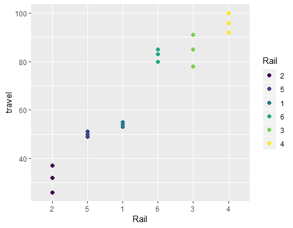
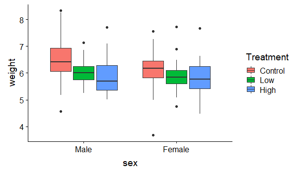
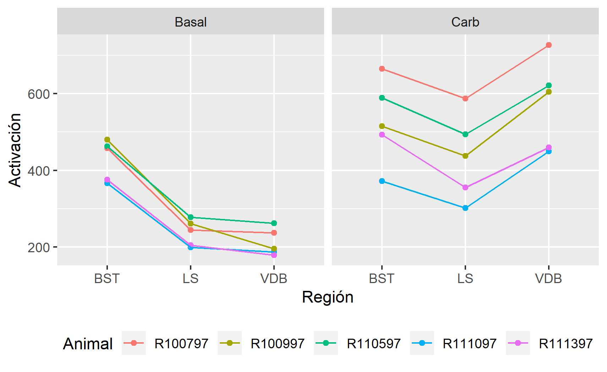
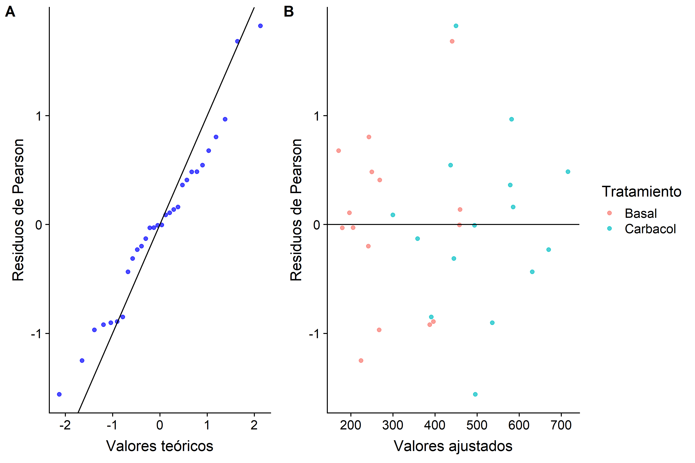
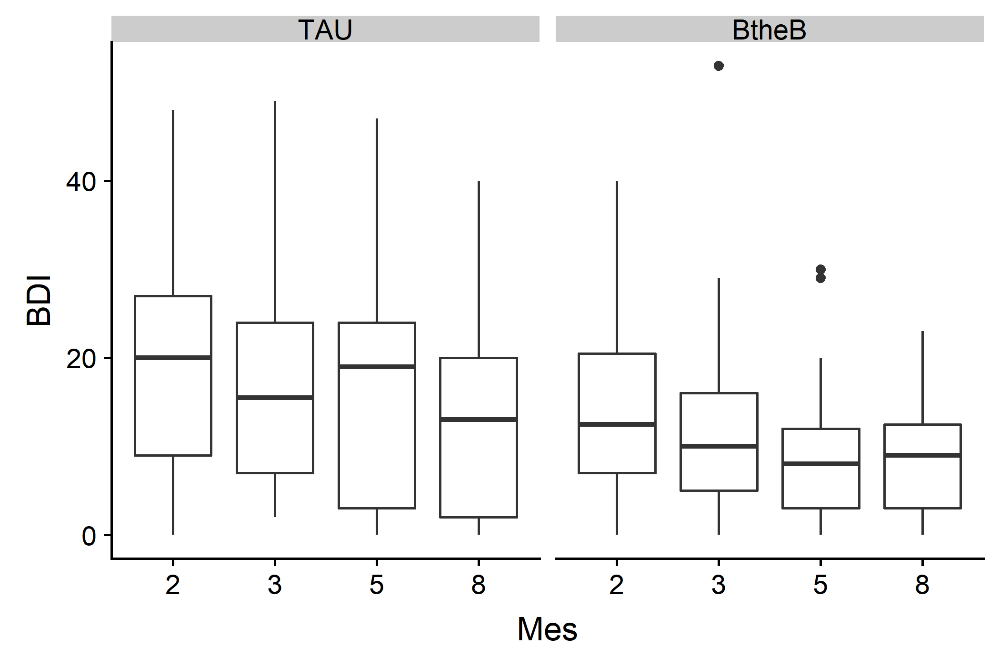
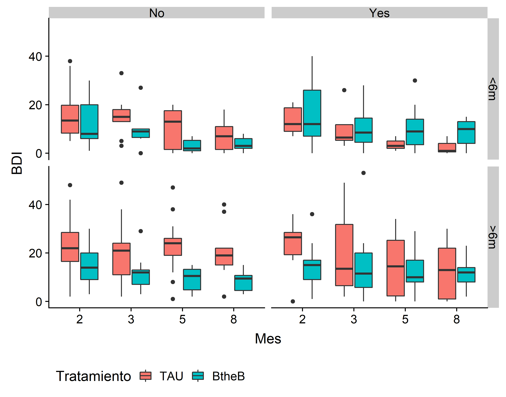
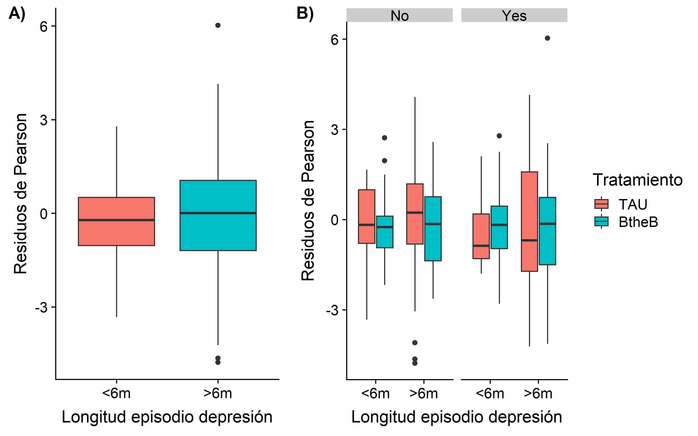
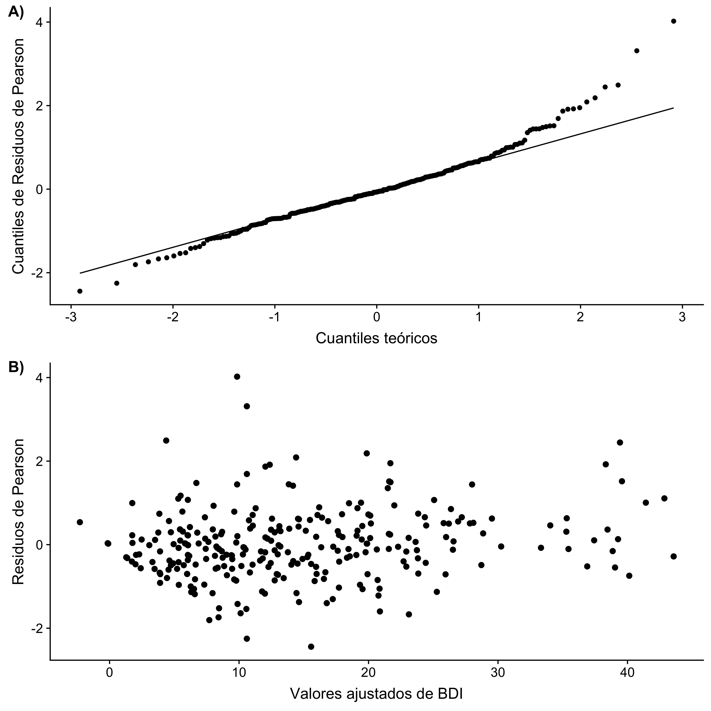

# Unidad 4: Modelos lineales avanzados

En esta unidad se estudiarán modelos lineales avanzados, su uso, ajuste e implementación así como también su evaluación en el entorno `R`. Particularmente, nos enfocaremos en los *Modelos Lineales Mixtos* (MLM).

## 1. Modelos lineales mixtos.

Hasta ahora hemos estudiado modelos útiles para analizar experimentos basados en *diseños completamente aleatorizados* (DCA).
Es decir, experimentos donde se selecciona aleatoriamente las *unidades observacionales*, a las cuales se les asigna,
en forma aleatoria, un tratamiento específico.

Un *Modelo Lineal Mixto* (MLM) es un modelo lineal paramétrico que permiten cuantificar las relaciones
entre una variable dependiente del tipo continua y varias variables predictoras. Los datos a analizar mediante un MLM poseen ciertas características que determinan que los residuos
posean distribución normal pero no presenten varianza constante o estén correlacionados entre sí. Este tipo de datos aparecen en muchas situaciones, sobre todo en experimentos donde se realiza algún tipo de muestreo cuyo diseño experimental no es el DCA. Por ejemplo, el caso de *Datos agrupados* como los
generados en experimentos con *Diseño en Bloque*, estudios
longitudinales o de medidas repetidas, etc. Este tipo de diseños se pueden encontrar en diferentes áreas como Medicina, Biología, Ciencias Sociales, Agronomía, etc.

### 1.1 Tipo y estructura de los datos

La estructura de los datos que debemos analizar es el factor determinante para saber cuándo y qué MLM debemos utilizar. Los datos a analizar con MLMs presentan una estructura jerárquica determinada por la estrategia de muestreo y/o por el diseño experimental.

1.1.1 Datos agrupados

En este tipo de datos la variable respuesta se mide una sóla vez en cada individuo (unidad de análsis),
y los individuos están a su vez agrupados (o anidados) en unidades mayores (grupos de unidades) aleatoriamente seleccionadas.
Muchos tipos de datos que seguramente usted conoce tienen una estructura jerárquica:

- Alumnos en escuelas
- Personas en municipios
- Pacientes en hospitales
- Plantas en una parcela

Las jerarquías son una forma de representar la relación de dependencia que hay entre las
unidades de análisis y los grupos a los que pertenecen.
Por ejemplo, supongamos que hacemos un estudio para determinar el efecto del tratamiento con una droga sobre pacientes internados en diferentes hospitales, tendríamos una estructura
a dos niveles: muchos individuos en el **nivel 1** (pacientes) que están agrupados en pocas unidades de **nivel 2** (hospitales).

Las estructuras multinivel pueden aparecer también como consecuencia del diseño experimental.
Por ejemplo, un estudio sobre el rendimiento de distintas variedades agronómicas puede dar lugar a un diseño a tres niveles: primero muestreamos provincias,
luego parcelas y después individuos.
En cada nivel de la jerarquía es posible medir variables y/o aplicar tratamientos. Algunas estarán medidas en su
nivel *natural*, por ejemplo en el nivel parcelas podriamos registrar los milímetros de lluvia mensual, y al nivel
de las plantas podríamos medir su tamaño de hoja. Otras podrán estar agregadas/disagregadas en distintos niveles. Mientras, en simultáneo, los MLMs
permiten obtener estimaciones de la variabilidad total o asociada a los distintos grupos o jerarquías.

1.1.2 Medidas repetidas

En este tipo de datos la variable dependiente se mide más de una vez en una misma unidad de análisis. Por ejemplo,
un experimento donde se desea contrastar la expresión de genes en tejido tumoral contra tejido tumoral. Para ello, se seleccionan aleatoriamente un conjunto de pacientes con tumor, y se extrae, a cada uno de ellos, dos muestras, una de tejido normal y otra de tejido tumoral.
Este tipo de datos también puede ser considerado como datos multinivel (o jerárquicos) donde el  **nivel 2** son los individuos y el **nivel 1** representa
a las diferentes medidas tomadas. Dado que los registros se hacen sobre un mismo individuo,
es de esperar que dichas medidas no sean independientes, por lo que utilizar un modelo lineal
ordinario no sería apropiado.

Un caso particular de los experimentos con medidas repetidas son los estudios longitudinales. Es decir, aquellos en los que la variable dependiente se ha
medido en distintos instantes de tiempo en cada una de las unidades de análisis. Por ejemplo, consideremos un experimento donde se desea establecer el efecto de diferentes dietas, para lo cual se ha seleccionado aleatoriamente un número de individuos, los cuales son aleatoriamente asignados a diferentes regimenes alimenticios. Durante un año, se registra una vez al mes el peso de los individuos con el objetivo de determinar si hubo un desenso de peso motivado por la dieta.

En algunos casos, cuando la variable dependiente se mide a lo largo del tiempo, puede ser difícil identificar
si los datos son medidas repetidas o datos longitudinales. Desde el punto de vista del análisis de los datos mediante MLMs esta distinción no es un elemento crítico. Lo importante es que
en ambos tipos de datos la variable dependiente se ha medido repetidas veces en la misma unidad observacional, y que por tanto las observaciones estarán correlacionadas.

### 1.2 Tipos de factores y efectos en los MLMs

El nombre de *Modelo Lineal Mixto*  surge del hecho de que los MLMs son modelos lineales
en los parámetros, donde las covariables o variables independientes pueden representar una mezcla de
efectos fijos y efectos aleatorios. Distinguir entre factores fijos y aleatorios y sus respectivos efectos sobre
la variable dependiente es crítico para la formulación correcta del MLM.

#### 1.2.1 Factores Fijos

El concepto de *factor fijo* proviene del ANOVA. Un *factor fijo* es una variable de clasificación o categórica
que abarca distintos niveles o condiciones experimentales que son de interés en el estudio. Los *factores fijos* pueden incluir covariables cualitativas como el sexo o el género,
 variables de clasificación vinculadas al proceso de muestreo, como la región o provincia, o factores del diseño experimental,
 como el tratamiento con una determinda droga. Los niveles de un *factor fijo* se eligen ya que representan condiciones o contrastes (combinaciones) específicas que son de interés del estudio.

#### 1.2.2 Factores Aleatorios

Un *factor aleatorio* es una variable de clasificación cuyos niveles pueden pensarse como aleatoriamente muestreados
de una población de niveles a estudiar. No todos los niveles posibles de un factor aleatorio estarán representados en el estudio, pero se tiene la intención de hacer inferencia sobre todos ellos.
Las variables de clasificación asociadas a los niveles 2, 3, etc, en los datos agrupados/medidas repetidas
se suelen considerar factores aleatorios. Considerar los factores aleatorios en el análisis permite evaluar
la variabilidad de la respuesta a través de los niveles de los factores aleatorios, permitiendo que los resultados
sean generalizables a una mayor población de niveles del factor aleatorio.

Los niveles de los factores aleatorios no representan condiciones específicamente diseñadas
o elegidas para cumplir con los objetivos del estudio. Sin embargo, dependiendo del experimento,
un mismo factor puede ser considerado tanto fijo como aleatorio. Por ejemplo, consideremos un experimento
que registra la frecuencia cardíaca en sujetos que tienen diversas afecciones cardíacas, con el
objetivo de determinar si cierto ejericio físico produce un cambio dicha variable. Suponga además que, para cada sujeto,
se registró la afección cardíaca que posee.
Un enfoque de análisis permite asumir que la afección cardíaca que presenta cada uno de los sujetos es una muestra aleatoria
de todas las afecciones cardíacas posibles. En este caso, el análisis permitirá generalizar los resultados,
a una población hipotética de pacientes con diferentes fallas cardíacas. Ahora bien, si
el objetivo es determinar las diferencias de frecuencia cardíaca entre los pacientes que poseen distintas fallas cardíacas,
 entonces la *falla cardíaca* debe ser considerada como un factor fijo, con distintos niveles. Cabe destacar
que, en este caso, las conclusiones aboradas serán válidas sólo para aquellas fallas cardíacas consideradas durante todo el estudio.

#### 1.2.3 Efectos Fijos y Efectos Aleatorios
Un *efecto fijo* es un coeficiente de regresión o parámetro constante desconocido asociado
al efecto de las covariables o factores categóricos de un modelo lineal. Los efectos fijos pueden describir
contrastes o diferencias entre los niveles de un factor fijo, en términos de la respuesta media de la variable respuesta, o
pueden describir la relación entre una covariable continua y la respuesta. Como son desconocidos, los efectos
fijos se estiman en un MLM en base a las observaciones recolectadas.

Un *efecto aleatorio* es un valor aleatorio asociado a los niveles de un factor aleatorio en un MLM. Los efectos aleatorios
representan desviaciones aleatorias de la relación entre la respuesta y los efectos fijos. Contrario a lo que sucede
con los efectos fijos, los efectos aleatorios se representan en un MLM como variables aleatorias normalmente distribuidas.

#### 1.2.4 Factores Cruzados, Anidados y sus efectos.
Cuando un nivel de un factor (fijo o aleatorio) puede medirse sólo dentro de un único nivel
de otro factor, los niveles de estos dos factores se dicen que están *anidados*. Pensemos por ejemplo en órganos
dentro de pacientes, donde se mide cierta variable. En este caso, los niveles del factor *tejido* están anidados
dentro de los niveles del factor *paciente*. Los efectos de este factor anidado sobre la respuesta también
están anidados dentro de los niveles del segundo factor.

Ahora bien, cuando un nivel dado de un factor (fijo o aleatorio) puede medirse en múltiples niveles de otro factor, se dice
que ambos factores estan *cruzados*, y los efectos de estos factores sobre la respuesta se llaman *efectos cruzados*.
Por ejemplo, pensemos en sujetos, de ambos sexos, aleatoriamente asignados a dos tratamientos, y a los que posteriormente se les registra cierta variable.
Los factores *sexo* y *tratamiento* estan cruzados, ya que cada tratamiento se ha asignado a pacientes de ambos sexos.

### 1.3 Por qué usar MLMs?

Tomemos este ejemplo de Pinheiro and Bates (2000). Un ingeniero desea evaluar la tensión longitudinal en
una prueba de ingeniería destinada a determinar el esfuerzo longitudinal en rieles. Para ello,
 se ha registrado el tiempo que tardan ciertas ondas ultrasónicas en viajar a lo largo de los rieles.
 Para el experimento se seleccionó aleatoriamente seis rieles, los cuales fueron evaluados en tres oportunidades, siendo el riel lo único que cambia entre distintas observaciones.

 ```
 > library(nlme)
 > data(Rail)
 > class(Rail)
 [1] "nffGroupedData" "nfGroupedData"  "groupedData"    "data.frame"
 > head(Rail)
 Grouped Data: travel ~ 1 | Rail
   Rail travel
 1    1     55
 2    1     53
 3    1     54
 4    2     26
 5    2     37
 6    2     32
```

La estructura de la base de datos es simple, ya que cada fila se corresponde con una observación.
Los ingenieros desean estimar el tiempo promedio de viaje de la onda a lo largo de un riel, la variabilidad entre los tiempos promedios de viaje entre los rieles (variabilidad entre rieles)
y la variabilidad en los tiempos de viaje observados para un único riel (variabilidad intra-riel).

Los datos de este experimento pueden analizarse mediante modelos lineales o mediante MLMs, dependiendo si el factor `riel` se considera fijo o aleatorio.
En este experimento, hay una estructura de agrupamiento de los datos ya que se han registrado varias observaciones en un mismo riel. Esto implica que
las observaciones de un mismo riel sean más similares entre ellas, que el tiempo promedio de viaje varíe entre rieles y también entre medidas.

Veamos esto gráficamente:
```
> library(ggplot2)
> ggplot(Rail, aes(x=Rail, y=travel, color=Rail))+geom_point(size=2)
```




***Figura 1***: Tiempo de propagación de una onda ultrasónica (nanosegundos) para seis rieles.

El análisis de la [Figura 1](Figura1) deja en evidencia la necesidad de considerar
la estructura de agrupamiento de los datos, según el riel en el cual se han registrado. Para demostrar esta necesidad, consideremos
primero un modelo lineal simple que ignore este agrupamiento. Si  $y_{ij}$ representa el tiempo de propagación
 para el i-ésimo riel registrado en la j-ésima oportunidad, entonces el modelo lineal correspondiente será:

$$
\begin{equation}
y_{ij}=\mu_0+\epsilon_{ij},~i=1,...,M,~j=1,..., n_i,~\boldsymbol{\epsilon}\sim N(0, \sigma^2\boldsymbol{I})  \label{Ec1}
\tag{1}
\end{equation}
$$

En nuestro caso, $M=6$, y $n_1=n_2=...=n_6=3$, por lo que el total de observaciones, $N$, es $18$.

```
> table(Rail$Rail)
 2 5 1 6 3 4
 3 3 3 3 3 3
```

Ajustemos ahora el modelo lineal, donde según la teoría de la estadística muestral, los estimadores serán $\hat{\mu}=\overline{\boldsymbol{y}}$ y $\hat{\sigma}^2=s^2$.

```
> LMIntercept<-lm(travel~1, data=Rail)
> summary(LMIntercept)

 Call:
     lm(formula = travel ~ 1, data = Rail)

 Residuals:
     Min     1Q Median     3Q    Max
 -40.50 -16.25   0.00  18.50  33.50

 Coefficients:
     Estimate Std. Error t value Pr(>|t|)
 (Intercept)   66.500      5.573   11.93  1.1e-09 ***
     ---
     Signif. codes:  0 ‘***’ 0.001 ‘**’ 0.01 ‘*’ 0.05 ‘.’ 0.1 ‘ ’ 1

 Residual standard error: 23.65 on 17 degrees of freedom
```
**Ejercicio:** Verifique los resultados de ajuste del modelo.

El intercepto es significativo, ya que, claramente, la media no es 0. Veamos lo que
sucede con los gráficos diagnósticos del modelo.

```
> df<-data.frame(residuals=rstandard(LMIntercept), rail=Rail$Rail)
> g1<-ggplot(df, aes(sample=rstandard(LMIntercept)))+stat_qq(distribution = qnorm)+ stat_qq_line()
> g2<-ggplot(df, aes(x=rail, y=residuals, color=rail))+geom_point()
> library(cowplot)
> plot_grid(g1, g2, nrow=1, labels=c("A)", "B)"))
```


***Figura 2***: *Gráficos de los residuos estandarizados del modelo. **A)** QQ-plot. **B)** Residuos según riel.

De la [Figura 2](Figura2) resulta evidente la estructura de agrupamiento de los datos, reflejada en el agrupamiento de los residuos.
Por lo tanto, es necesario incorporar el efecto de riel en el modelo. Ahora bien, lo que interesa saber, no es el efecto particular de esos seis rieles,
sino qué sucede con el tiempo de propagación para cualquier riel.
Es por ello que el efecto `riel` debe incorporarse al modelo permitiendo que el valor medio de cada riel pueda ser
representado por un parámetro diferente, es decir, considerandolo como un efecto fijo, lo que deriva en un modelo ANOVA de una vía, el cual puede escribirse como:

$$
\begin{equation}

\mu_{ij}=\alpha_i+\epsilon_{ij},~i=1,...,M,~j=1,..., n_i,~\boldsymbol{\epsilon}\sim N(0, \sigma^2\boldsymbol{I}) \label{EC2}
\tag{2}
\end{equation}
$$

En la [Ecuación 2](EC2), cada $\alpha_i$ representa el tiempo promedio de propagación para el i-ésimo riel. Ajustemos este modelo

```
> LMEffect<-lm(travel~Rail-1, data=Rail)
> summary(LMEffect)
Call:
    lm(formula = travel ~ Rail - 1, data = Rail)

Residuals:
    Min      1Q  Median      3Q     Max
-6.6667 -1.0000  0.1667  1.0000  6.3333

Coefficients:
    Estimate Std. Error t value Pr(>|t|)
    Rail2   31.667      2.321   13.64 1.15e-08 ***
    Rail5   50.000      2.321   21.54 5.86e-11 ***
    Rail1   54.000      2.321   23.26 2.37e-11 ***
    Rail6   82.667      2.321   35.61 1.54e-13 ***
    Rail3   84.667      2.321   36.47 1.16e-13 ***
    Rail4   96.000      2.321   41.35 2.59e-14 ***
    ---
    Signif. codes:  0 ‘***’ 0.001 ‘**’ 0.01 ‘*’ 0.05 ‘.’ 0.1 ‘ ’ 1

Residual standard error: 4.021 on 12 degrees of freedom
Multiple R-squared:  0.9978,	Adjusted R-squared:  0.9967
F-statistic: 916.6 on 6 and 12 DF,  p-value: 2.971e-15
```

Como es de esperar, la varianza residual, $\hat{\sigma}^2$, resultó menor que la del modelo anterior,
ya que hemos agregado la estructura de grupos en los datos.

**Ejercicio**: Explore los gráficos de los residuos de este nuevo modelo.

El problema que presenta este modelo es que no cumple con los objetivos del estudio ya que
los resultados no son generalizables a cualquier riel,
sino que son específicos para los seis rieles analizados. Para poder superar este inconveniente es que
surgen los MLMs. Particularmente, en este caso, necesitamos modelar la variabilidad debida a los distintos rieles mediante la inclusión del riel como *efecto aleatorio*  de manera de poder explicar las fluctuaciones de los
tiempos de propagación en torno a una media poblacional. La ecuación correspondiente a este modelo será:

$$
\begin{equation}

y_{ij}=\mu+u_i+\epsilon_{ij},~u_i\sim N(0, \sigma_u^2),~\epsilon_{ij}\sim N (0, \sigma^2),~cov(u_i, \epsilon_{ij})=0 \label{EC3}
\tag{3}
\end{equation}
$$

El modelo descrito por la [Ecuación 3](EC3), conocido como *modelo de intercepto aleatorio*, reemplaza el parámetro fijo $\mu_i−\mu=u_i$, con un
efecto aleatorio, $u_i$, que es una variable aleatoria específica para el i-ésimo riel, con media 0 y varianza $\sigma_u^2$. Note que en este modelo, las observaciones registradas en el mismo riel están representadas mediante el mismo efecto aleatorio, $u_i$, por lo que están
correlacionadas, contrario a lo que sucede en el modelo de efectos fijos. La covarianza entre las observaciones del mismo riel es $\sigma^2_u$. En este modelo, los parámetros a estimar son $\mu$, $\sigma_u^2$, y $\sigma^2$. Cabe destacar que siempre serán tres, independientemente
del número de rieles evaluados, mientras que en el modelo lineal de efectos fijos, tiene 8 parámetros a estimar.

### 1.4 Formulación del Modelo Lineal Mixto

El nombre los MLMs surge del hecho de que estos modelos son lineales en los parámetros, y en las covariables,
y pueden implicar efectos fijos o aleatorios, por lo que se los considera una extensión de los modelos lineales ya estudiados.

En general el MLM se representa mediante la [Ecuación 4](EC4), donde $\boldsymbol{y}$ es el vector de observaciones de la variable respuesta, $\boldsymbol{X}$ es una matriz de $n$x$k$,
donde $k$ es el número de efectos fijos del modelo, llamada matriz de incidencia de los efectos fijos,
$\boldsymbol{\beta}$ es el vector de efectos fijos a estimar, $\boldsymbol{Z}$, matriz de $n$x$p$, es la
matriz de incidencia de los efectos aleatorios, $\boldsymbol{u}$
es el vector de efectos aleatorios y $\boldsymbol{\epsilon}$ es el vector de error.

$$
\begin{equation}

\boldsymbol{y} = \boldsymbol{X}\boldsymbol{\beta} + \boldsymbol{Z}\boldsymbol{u} +\boldsymbol{\epsilon} \label{EC4}
\tag{4}
\end{equation}
$$

Tanto $\boldsymbol{u}$ como $\boldsymbol{\epsilon}$ son vectores aleatorios no observados, con $\boldsymbol{u} \sim N(\boldsymbol{0}, \boldsymbol{G})$ y $\boldsymbol{\epsilon} \sim N(\boldsymbol{0}, \boldsymbol{R})$. Además se asume
que $cov(\boldsymbol{u}, \boldsymbol{\epsilon})=0$. Un punto no menor es que los efectos aleatorios y los residuos pueden estar correlacionados, por lo que las matrices de varianza y covarianza $\boldsymbol{G}$ y $\boldsymbol{R}$ no serán matrices diagonales.
De esta manera,


$$

\begin{equation}

Var(\boldsymbol{y})= \boldsymbol{V}=\boldsymbol{Z}\boldsymbol{G}\boldsymbol{Z}'+ \boldsymbol{R}
\label{EC5}
\tag{5}
\end{equation}

$$

pudiendo ser $\boldsymbol{V}$ una matriz no diagonal.

#### 1.4.1 Estimación de los efectos fijos

Para estimar los efectos fijos, conviene considerar al MLM mediante la [Ecuación 6](EC6), donde $\boldsymbol{\epsilon^*}=\boldsymbol{Z}\boldsymbol{u} +\boldsymbol{\epsilon}$. Este modelo presenta errores que, a diferencia de un modelo lineal,
pueden estar correlacionados entre sí.

$$

\begin{equation}

\boldsymbol{y} = \boldsymbol{X}\boldsymbol{\beta} +\boldsymbol{\epsilon^*}
\label{EC6}
\tag{6}
\end{equation}

$$

Dada la matriz $\boldsymbol{V}$, el estimador de $\boldsymbol{\beta}$ se obtiene por
el método de *Mínimos Cuadrados Generalizados* (*Generalized Least Square, GLS*) según la [Ecuación 7](EC7).

$$

\begin{equation}

\hat{\boldsymbol{\beta}}=(\boldsymbol{X}'\boldsymbol{V}^{-1}\boldsymbol{X})^{-1}\boldsymbol{X}'\boldsymbol{V}^{-1}\boldsymbol{y}
\label{EC7}
\tag{7}
\end{equation}

$$

El estimador *GLS* de $\beta$ también se corresponde con el EMV de dicho parámetro, y para el cual además se cumple que $\hat{\boldsymbol{\beta}} \sim N(\boldsymbol{\beta},(\boldsymbol{X}'\boldsymbol{V}^{-1}\boldsymbol{X})^{-1})$.

#### 1.4.2 Predicción de los efectos aleatorios

En el caso de los efectos aleatorios hablamos de *predicción* porque los tales efectos son variables aleatorias.
Existen diversas alternativas para encontrar predictores de $\boldsymbol{u}$ que tengan la propiedad de
ser el mejor (menor error cuadrático medio de predicción) predictor lineal insesgado (*Best Linear Unbiased Predictor*, *BLUP*).
Una forma de hacerlo es considerando la esperanza condicional de $\boldsymbol{u}$ dado un conjunto de observaciones de la respuesta:

$$
\begin{equation}

\hat{\boldsymbol{u}}=E(\boldsymbol{u}|_{\boldsymbol{Y}=\boldsymbol{y}})=\boldsymbol{G}\boldsymbol{Z}'\boldsymbol{V}^{-1}(\boldsymbol{y}-\boldsymbol{X\hat{\boldsymbol{\beta}}})

\label{EC8}
\tag{8}

\end{equation}
$$

Los valores predichos en la [Ecuación 8](EC8) son los valores esperados de los efectos aleatorios, $u_i$, asociados con el í-esimo nivel de un factor aleatorio, dado $\boldsymbol{y}_i$. Estas esperanzas condicionales se suelen conocer también como *EBLUPs* (o BLUPs empíricos), porque se basan en los estimadores de $\sigma^2$ y $\boldsymbol{\beta}$.
Tanto el estimador de $\boldsymbol{\beta}$ como los *EBLUPs* dependen de $\boldsymbol{V}$, quien a su vez depende de $\boldsymbol{G}$ y $\boldsymbol{R}$, matrices desconocidas
que deberán ser estimadas a partir de los datos.

#### 1.4.3 Estimación de los componentes de varianza

Analicemos la estructura de la matriz de varianzas y covarianzas de $\boldsymbol{y}$, $\boldsymbol{V}= \boldsymbol{Z}'\boldsymbol{G}\boldsymbol{Z}+\boldsymbol{R}$.

$$
\begin{equation}

\boldsymbol{V}=\begin{bmatrix}  Z_{11} & ... & Z_{i1} &...& Z_{n1}\\ \vdots & & \vdots & & \vdots \\Z_{1i} & ... & Z_{ii} &...& Z_{ni}\\ \vdots & & \vdots & & \vdots \\Z_{1l} & ... & Z_{il} &...& Z_{nl}\end{bmatrix}\begin{bmatrix}  G_{11} & ... & G_{j1} &...& G_{p1}\\ \vdots & & \vdots & & \vdots \\G_{j1} & ... & G_{jj} &...& G_{pj}\\ \vdots & & \vdots & & \vdots \\G_{p1} & ... & G_{pj} &...& G_{pp}\end{bmatrix}\begin{bmatrix}  Z_{11} & ... & Z_{1i} &...& Z_{1l}\\ \vdots & & \vdots & & \vdots \\Z_{i1} & ... & Z_{ii} &...& Z_{il}\\ \vdots & & \vdots & & \vdots \\Z_{n1} & ... & Z_{ni} &...& Z_{nl}\end{bmatrix} + \begin{bmatrix}  R_{11} & ... & R_{i1} &...& R_{n1}\\ \vdots & & \vdots & & \vdots \\R_{i1} & ... & R_{ii} &...& R_{ni}\\ \vdots & & \vdots & & \vdots \\R_{n1} & ... & R_{ni} &...& R_{nn}\end{bmatrix}
\label{EC9}
\tag{9}
\end{equation}
$$

Los elementos que conforman la diagonal principal de $\boldsymbol{G}$ representan las varianzas de los
efectos aleatorios contenidos en $\boldsymbol{u}$, mientras que los elementos fuera de esta diagonal representan las covarianzas entre dos efectos aleatorios. Además, dado que los efectos aleatorios
son variables aleatorios, la matriz $\boldsymbol{G}$ resulta ser simétrica y definida positiva. Análogamente, la matriz $\boldsymbol{R}$ también es una matriz simétrica y definida positiva, cuya diagonal
principal representa las varianzas de los residuos del modelo y los elementos fuera de ella, las respectivas covarianzas.

Las matrices $\boldsymbol{G}$ y $\boldsymbol{R}$ pueden presentar ciertas estructuras, como por ejemplo ser matrices diagonales, o no, matrices no estructuradas. Las matrices estructuradas permiten representar
la estructura de varianza mediante un conjunto de funciones o parámetros de menor tamaño que el total de los elementos de la matriz, disminuyendo la cantidad de parámetros a estimar. Usualmente, el conjunto de parámetros o funciones a estimar
asociados a las componentes de varianza se denota por $\boldsymbol{\theta}$

Consideremos la matriz $\boldsymbol{G}$. Si no imponemos estructura, $\boldsymbol{G}$ contiene $\frac{p(p+1)}{2}$ varianzas/covarianzas a determinar. Mientras, si consideramos el caso en que se asumen los efectos aleatorios independientes
entre sí (caso *componentes de varianza*), $\boldsymbol{G}$ resulta ser una matriz diagonal con sólo $p$ elementos a estimar, las varianzas de los $p$ efectos aleatorios contenidos en $\boldsymbol{u}$. Estos dos casos son los más utilizados en la práctica
para definir la estructura de $\boldsymbol{G}$, aunque no son los únicos.

En el caso de la matriz $\boldsymbol{R}$, las estructuras de covarianzas más comunes se detallan a continuación. Por un lado,
el caso más simple, residuos no correlacionados y de varianza constante (caso ML). Es decir, $\boldsymbol{R}=\sigma^2\boldsymbol{I}_{n}$, siendo $\sigma^2$ el único parámetro a estimar.

Otra aletarnativa es la estructura de *simetría compuesta*, la cual asume que la varianza y la covarianza son constantes y están relacionadas:

$$
\begin{equation}

\boldsymbol{R}=\begin{bmatrix}  \sigma^2+\sigma_1 & ... & \sigma_1 &...& \sigma_1\\ \vdots & & \vdots & & \vdots \\\sigma_1 & ... & \sigma^2+\sigma_1 &...&\sigma_1\\ \vdots & & \vdots & & \vdots \\\sigma_1 & ... & \sigma_1 &...& \sigma^2+\sigma_1\end{bmatrix}
\label{EC10}
\tag{10}

\end{equation}
$$

En esta estructura, se necesita estimar dos parámetros, $\sigma^2$ y $\sigma_1$, para poder estimar $\boldsymbol{R}$.
En problemas donde es posible asumir iguales correlaciones, como por ejemplo en el caso de experimentos repetidos bajo las mismas condiciones, se suele usar la estructura de simetría compuesta.

No ahondaremos detalles en los métodos, pero es importante saber que la estimación de $\boldsymbol{R}$ y $\boldsymbol{G}$ generalmente se obtienen por ML o por ML restringida (*Restricted Maximum Likelihood*, *REML*) . Este último método suele ser preferido ya que proporciona estimadores insesgados de las matrices de varianza y covarianza.

###1.5 Ajuste de MLMs en R

Existen varios paquetes `R` útiles para el ajuste de MLMs, de los cuales `nlme` y `lme4` son dos de los más utilizados.

####1.5.1 Ajuste con `nlme`

La función principal del paquete `nlme` es `lme()`. Las llamadas a esta función son similares a las que utilizamos anteriormente para la función `lm()` sólo que ahora debemos agregar argumentos extras para especificar la estructura de la parte aleatoria del MLM. `lme()` asume
que los datos están agrupados bajo cierta estructura de grupos definida mediante los niveles de alguna variable categórica (`factor`), por lo que dicha estructura es la que se deberá especificar para cada grupo mediante el uso de efectos aleatorios independientes para cada grupo.

La estructura clásica de un llamado a `lme()` es:

```
> lme(respuesta ~ predictoras,random= ,correlation=, method=,data= )

```
La forma más sencilla de especificar la estructura de los efectos aleatorios es utilizando objetos de la clase `formula`
Supongamos un conjunto de datos `df` con observaciones de una variable respuesta `y`, predictoras `x` y `z` y con agrupamiento de datos especificado por el `factor` `g`. La llamada correspondiente
al MLM con *intercepto aleatorio* será:

```
> lme(y ~ x+z,random = ~1|g, data= df) # default method = "REML"
```
Si el efecto aleatorio sólo tiene influencia sobre alguno de las predictoras, por ejemplo `x`, entonces deberemos especificar `~x|g` como componente aleatoria del modelo:

```
> lme(y ~ x+z,random = ~x|g, data= df)
```

Si el efecto aleatorio influencia tanto la predictora `x` como la media general, entonces deberemos especificar `~1+x|g` como componente aleatoria del modelo:

```
> lme(y ~ x+z,random = ~1+x|g, data= df)
```
Si tenemos más de un efecto aleatorio, supongamos dos tipos de agrupamiento dados por `g1` y `g2`, entonces la llamada será:

```
> lme(y ~ x+z,random =list(~1|g1,~1|g2),data= df)
```
En el caso que `g2` esté anidado en `g1`, podemos entonces especificarlo de la siguiente manera:

```
> lme(y ~ x+z,random =~1|g1/g2,data= df)
```

Retomemos el ejemplo de la determinación del tiempo promedio de propagación de onda en rieles. Ajustemos el MLM anteriormente propuesto, donde la variable `riel` representa un efecto aleatorio.

```
> library(nlme)
> randomModel <- lme(travel~1,random=~1|Rail,data=Rail)
# or equivalently
# randomModel <- lme(travel~1,random=list(Rail=~1),data=Rail)
> summary(randomModel)
Linear mixed-effects model fit by REML
 Data: Rail
      AIC      BIC   logLik
  128.177 130.6766 -61.0885

Random effects:
 Formula: ~1 | Rail
        (Intercept) Residual
StdDev:    24.80547 4.020779

Fixed effects: travel ~ 1
            Value Std.Error DF  t-value p-value
(Intercept)  66.5  10.17104 12 6.538173       0

Standardized Within-Group Residuals:
        Min          Q1         Med          Q3         Max
-1.61882658 -0.28217671  0.03569328  0.21955784  1.61437744

Number of Observations: 18
Number of Groups: 6

```

Los tres parámetros estimados por este modelo son $\hat{E(y_{ij})}=66.5$, $\hat{\sigma}_u=24.81$ y $\hat{\sigma}=4.02$. Las componentes de varianza tambien se pueden obtener con la función `VarCorr()`.
```
> VarCorr(randomModel)
Rail = pdLogChol(1)
Variance  StdDev
(Intercept) 615.31111 24.805465
Residual     16.16667  4.020779
```

Conocer las varianzas estimadas resulta útil además para determinar el *Coeficiente de Correlación Intraclase* (*Intraclass Correlation Coefficient, ICC*). Este coeficiente es una medida de
la homogeneidad o similaridad de la variable respuesta dentro de un grupo de observaciones. En el caso de modelos con intercepto aleatorio, este coeficiente se obtiene mediante la [Ecuación 11](EC11).

$$\begin{equation}

ICC=\frac{\hat{\sigma}^2_u}{\hat{\sigma}^2_u+\hat{\sigma}^2}
\label{EC11}
\tag{11}
\end{equation}
$$

**Ejercicio**: Obtenga el ICC para el MLM previamente ajustado y concluya sobre el valor obtenido.


#### 1.5.2 Ajuste con `nlme4`

La función principal del paquete `nlme` es `lmer()`. La ecuación del MLM para `lmer()` se especifica mediante un objeto del tipo `formula` donde los efectos aleatorios se incluyen en paréntesis.

```
> lmer( y ~ x + (1|g), data=df)
```

La principal diferencia con `lme()` es la limitada flexibilidad para definir la estructura de la matriz $\boldsymbol{G}$.

```
> library(lme4)
> rail.lmer <- lmer(travel ~1+(1|Rail),data=Rail)
> summary(rail.lmer)
 Linear mixed model fit by REML ['lmerMod']
 Formula: travel ~ 1 + (1 | Rail)
 Data: Rail

 REML criterion at convergence: 122.2

 Scaled residuals:
     Min       1Q   Median       3Q      Max
 -1.61883 -0.28218  0.03569  0.21956  1.61438

 Random effects:
     Groups   Name        Variance Std.Dev.
 Rail     (Intercept) 615.31   24.805
 Residual              16.17    4.021
 Number of obs: 18, groups:  Rail, 6

 Fixed effects:
     Estimate Std. Error t value
 (Intercept)    66.50      10.17   6.538
```

### 1.6 Evaluación y comparación de modelos

Por lo general, el análisis de datos jerarquizados con MLMs requiere del ajuste de varios modelos. Una vez que se ha determinado que
los modelos propuestos son válidos en sus supestos, éstos deben ser comparados con cierto criterio para establecer
cuál de ellos es el mejor a la hora de predecir/explicar la variación en la respuesta. La elección del mejor modelo
implica considerar los objetivos del estudio, el diseño experimental y la estrategia de muestreo utilizada,
el conocimiento *a priori* del problema y de las variables involucradas en el experimento, etc. En término de los modelos estadísticos, el *mejor modelo* es aquel que logra predecir/explicar la variabilidad de la variable respuesta de la forma más simple. Es decir, estamos interesados en el modelo que tenga el mejor ajuste con el menor número posible de parámetros estimados. En este curso estudiaremos la selección
de modelos en base a *pruebas de hipótesis* y a *criterios de información*.

#### 1.6.1 Diagnóstico de los residuos

La evaluación diagnóstica de los residuos se suele llevar a cabo mediante pruebas informales basadas en gráficas que intentan develar la existencia o ausencia de
patrones específicos en los residuos de un MLM. En el contexto de los MLMs existen distintos tipos de residuos útiles para evaluar los supuestos del modelo.

##### 1.6.1.1 Residuos crudos o condicionales

Los residuos *crudos* o *condicionales* están dados por la diferencia entre los valores
observados y la predicción condicional de la variable respuesta generada con el modelo ajustado, es decir:

$$
\begin{equation}
10=2

\label{EC12}
\tag{12}
\end{equation}
$$

Los residuos condicionales en su forma básica pueden no resultar adecuados para evaluar los supuestos
del modelo o detectar observaciones atípicas ya que suelen estar correlacionados y con varianzas diferentes para cada
subgrupo de observaciones.

##### 1.6.1.2 Residuos estandarizados y estudentizados.

Una alternativa a los residuos crudos son los residuo *estandarizados*,  los cuales se obtienen al dividir los residuos crudos por el valor de su desviación estándar. Dado que la desviación estándar no se suele conocer, se divide a los residuos crudos
por el estimador de la desviación, obteniendo así los residuos *estudentizados*. Una alternativa a estos residuos son los obtenidos al escalar los residuos crudos
por la desviación estándar de la variable respuesta, llamados *residuos de Pearson*.

##### 1.6.1.1 Residuos crudos o condicionales

Los residuos *marginales* están dados por la diferencia entre los valores
observados y la predicción marginal de la variable respuesta generada con el modelo ajustado, es decir:

$$
\begin{equation}
\hat{\boldsymbol{\epsilon}}^{\ast}=\boldsymbol{y}-\boldsymbol{X}\hat{\boldsymbol{\beta}}
\label{EC12}
\tag{12}
\end{equation}
$$


Los residuos marginales son residuos *puros* ya que, a diferencia de los residuos condicionales, se basan en las estimaciones de las medias marginales.

##### 1.6.1.3 Gráficos diagnóstico

Al igual que en los modelos lineales, dos gráficos que serán de gran utilidad para evaluar los supuestos de un MLM son el QQ-plot de los residuos y el diagrama de residuos vs. valores ajustados/predichos. Por lo general, se prefieren las verciones estudentizadas, o los residuos de Pearson en estos gráficos. Ahora bien, el tipo de residuos a explorar es un debate de continua discusión. Diversos autores sugieren el uso de los residuos condicionales para evaluar los supuestos del modelo [Faraway, Galetik, Brown & PResscot]. Por su parte, Santos Nobre y da Motta Singer (2007) sugieren que dichos residuos pueden no ser útiles para evaluar los supuestos de normalidad. En particular, estos autores recomienda el uso de los residuos marginales para la exploración de la hipótesis de linealidad respecto de las covariables, mientras que los residuos condicionales se sugieren para explorar los patrones de heterocedasticidad y detección de outliers.

#### 1.6.2 Modelos anidados
Previo a la definición de los criterios de comparación de modelos definamos que entendemos por modelos anidados. Supongamos dos modelos $M_1$ y $M_2$ que explican una variable respuesta a partir de un conjunto de predictoras/variables de clasificación. Decimos que $M_1$ está *anidado* en $M_2$, si $M_1$ es un caso particular de $M_2$. En el contexto de los MLMs, el anidamiento se puede dar a nivel de los efectos fijos y/o de las componentes de varianza.

#### 1.6.3 Pruebas de hipótesis

Las hipótesis sobre los parámetros de un MLM pueden plantearse mediante la formulación de una hipótesis nula ($H_0$) y una alternativa ($H_1$) que involucre los parámetros
en cuestión. También es posible hacerlo mediante la formulación de las hipótesis en término de dos modelos anidados. Por un lado, se debe definir un *modelo general*, que abarque las dos hipótesis, nula y alternativa,
y por otro, un *modelo nulo*, más simplificado, que satisface la $H_0$. Es decir, el modelo general (o de referencia) y el nulo difieren en que el modelo de referencia contiene los parámetros que
desean testearse mientras que el modelo nulo no los contiene.

##### 1.6.3.1 Prueba del Cociente de Verosimilitudes (LRT)

La Prueba del Cociente de Verosimilitudes (*Likelihood Ratio Test*, *LRT*) es un tipo de prueba
basada en la comparación de los valores de la función de verosimilitud de
dos modelos (por ejemplo, el modelo general y el modelo anidado). El LRT se puede usar para hacer pruebas
sobre los parámetros de efecto fijo o sobre las componentes de varianza de los MLMs. En general, el LRT
requiere que tanto el modelo anidado como el general asociados a cierta hipótesis nula se hayan ajustado
con el mismo conjunto de datos. El estadístico de la prueba se calcula según la [Ecuación 13](EC13), donde $L_{anidado}$ y $L_{referencia}$ refieren a los valores de la función de verosimilitud de la respuesta, calculados con las estimaciones de los parámetros del modelo, las cuales pueden hacerse con ML o REML.

$$
\begin{equation}
W_{LRT}=-2ln(\frac{L_{anidado}}{L_{referencia}}),~W_{LRT} \sim~ \chi^2_{df}
\label{EC13}
\tag{13}
\end{equation}
$$

 El estadístico de la prueba tiene distribución asintótica $\chi^2_{df}$, donde $df$ refiere a los grados de libertad, los cuales se
obtienen restando al número de parámetros del modelo general, el número de parámetros del modelo nulo. De esta manera, la significancia del
LRT se puede determinar en función de este estadístico y la distribución $\chi^2$ correspondiente. Si $W_{LRT}$ es
lo suficientemente grande, hay evidencia suficiente para rechazar la hipótesis nula, en favor del modelo general. Si las
verosimilitudes de ambos modelos son muy próximas, el estadístico será pequeño, y no habrá suficiente evidencia para rechazar $H_0$, favoreciendo entonces al modelo nulo o anidado.

###### 1.6.3.1.1 LRT para los efectos fijos

Para evaluar hipótesis lineales definidas para los efectos fijos de un MLM se recomienda utilizar las estimaciones por MV.
En el LRT para los efectos fijos de un MLM, los modelos nulo y de referencia difieren en los parámetros de efectos fijos pero comparten el mismo
conjunto de parámetros de varianza. Además, en este caso, el estadístico de la prueba, $W_{LRT}$ tiene distribución $\chi^2_{df}$ con grados de libertad (df)
igual a la diferencia en el número de parámetros de efecto fijo de los modelos nulo y general.

###### 1.6.3.1.2 LRT para los efectos aleatorios

En el caso del uso del LRT para evaluar hipótesis vinculadas a los parámetros de covarianza de un MLM, se recomienda la estimación REML para los modelos nulo y general.
Esta prueba asume que ambos modelos son iguales en efectos fijos pero difieren en el conjunto de parámetros de covarianza. La evaluación de la prueba requiere del cálculo
de $W_{LRT}$ con las funciones de verosimilitud calculadas a partir de las estimaciones REML.

La distribución del estadístico depende de si la hipótesis nula involucra valores de los parámetros de covarianza que están en la frontera del espacion de parámetros o no. Si esto no sucede, por ejemplo en el caso de
que se quiera compara un modelo con varianza residual variable vs. un modelo con varianza residual constante o evaluar si la covarianza entre dos efectos aleatorios es nula, el estadístico del
LRT se distribuye $\chi^2_{df}$ con grados de libertad igual a la diferencia en el número de parámetros de covarianza entre el modelo general y el nulo.
Ahora bien, cuando la hipótesis nula involucra valores de los parámetros de covarianza en la frontera del espacio paramétrico (por ejemplo, si queremos contrastar si un efecto aleatorio es
necesario, estaríamos contrastando si la varianza del efecto alearorio es cero o no), entonces el estadístico tiene distribución asintótica
$\chi^2_p$ y $\chi^2_{p-1}$ donde $p$ es el número de parámetros de la varianza que se hacen cero bajo $H_0$.

#####1.6.3.2 Prueba F

En el contexto de los MLMs es posible utilizar una prueba-F para evaluar hipótesis lineales definidas sobre los efectos fijos del modelo. En general, la prueba de hipótesis será de la forma:

$$
\begin{equation}
H_0:~\boldsymbol{L}\boldsymbol{\beta}=\boldsymbol{0}~vs.~H_1:~\boldsymbol{L}\boldsymbol{\beta} \neq \boldsymbol{0}
\label{EC14}
\tag{14}
\end{equation}
$$

donde $\boldsymbol{L}$ es una matriz de contrastes conocida. El estadístico $F$ asociado a dicha prueba está dado por la [Ecuación 15](EC15).

$$
\begin{equation}
F=\frac{\hat{\boldsymbol{\beta}}' \boldsymbol{L}'(\boldsymbol{L}(\sum\limits_i{\boldsymbol{X}_i'\boldsymbol{V}_i^{-1}\boldsymbol{X}_i})^{-1}\boldsymbol{L}')^{-1}\boldsymbol{L}\hat{\boldsymbol{\beta}}}{rango(\boldsymbol{L})}
\label{EC15}
\tag{15}
\end{equation}
$$

El estadístico de la prueba tiene distribución aproximada $F$, con grados de libertad del numerador igual al rango de la matriz $\boldsymbol{L}$ y grados de libertad del denominador aproximados mediante diversas estrategias que deben tener en cuenta la presencia de efectos aleatorios y residuos correlacionados.


#### 1.6.4 Criterios de Información

Los criterios de información son útiles para evaluar el ajuste de un modelo en base al valor óptimo de la función de log-verosimilitud
luego de aplicar una penalización por el número de parámetros que debe estimar el modelo. No sólo permiten evaluar un único modelo, sino que
además resultan útiles para comparar varios modelos ajustados utilizando el mismo conjunto de datos, que no necesariamente deben estar anidados, ya que
mientras más chico sea el valor que indica el criterio mejor será el ajuste.

#####1.6.4.1 Criterio de Información de Akaike (AIC)

El índice del *Criterio de Información de Akaike* (AIC) se obtiene a partir de la siguiente ecuación:

$$
\begin{equation}
AIC=-2ln(L(\hat{\boldsymbol{\beta}}, \hat{\boldsymbol{\theta}}))+2q
\label{EC16}
\tag{16}
\end{equation}
$$

donde $L(\hat{\boldsymbol{\beta}}, \hat{\boldsymbol{\theta}})$ es la función de verosimilitud del modelo ajustado vía ML o REML y $q$ representa el número de parámetros que se
estiman en el modelo tanto para los efectos fijos como los aleatorios.

##### 1.6.4.2 Criterio de Información de Bayes (BIC)

El índice del *Criterio de Información de Bayes* (BIC) se obtiene a partir de la [Ecuación 17](EC17), donde $n$ refiere al total de las observaciones que se utilizan en la estimación del modelo. La penalización aplicada por el BIC es mayor
que la que aplica el AIC ya que al número de parámetros estimados los multiplica por un número positivo $(ln(n))$ que suele ser mayor que $2$.


$$
\begin{equation}
BIC=-2ln(L(\hat{\boldsymbol{\beta}}, \hat{\boldsymbol{\theta}}))+qln(n)
\label{EC17}
\tag{17}
\end{equation}
$$

### 1.7 Funciones útiles
La siguiente tabla lista un conjunto de funciones de los paquetes `nlme` y `lme4` útiles para extrer información de un modelo ajustado mediante la función `lme()`.

| Resultado | Función sobre `lmeFit` de clase `lme`| Función sobre `lmerFit` de clase `lmer`|
|-------------|-------------------|------------------|
| Método de estimación |  `lmeFit['method']` |   `isREML(lmerFit)`  |
| $\hat{\boldsymbol{\beta}}$ | `fixef(lmeFit)`| `fixef(lmerFit)`|
|$\hat{\boldsymbol{\beta}}$ , $EE(\hat{\boldsymbol{\beta}})$, prueba t | `summary(lmeFit)['tTable']`| `summary(lmerFit)$coefficients`|
|$\hat{Var}(\hat{\boldsymbol{\beta}})$ | `vcov(lmeFit)`| `vcov(lmerFit)`|
| I.C. del 95% para $\boldsymbol{\beta}$| `intervals(lmeFit, which='fixed')`| `confint.merMod(lmerFit, parm ='beta_')`|
| $\hat{\sigma}$ | `summary(lmeFit)['sigma']`| `summary(lmerFit)$sigma` |
| $\hat{\boldsymbol{u}}$| `ranef(lmeFit)`| `randomeffects(lmerFit)`|
| $\hat{\boldsymbol{\beta}}_0+\hat{\boldsymbol{u}}$ | `coef(lmeFit)`| `coef(lmerFit)`|
| $\hat{\boldsymbol{G}}$ | `getVarCov(lmeFit)` | |
| $\hat{\boldsymbol{G}}$ y $\hat{\sigma}$| `VarCorr(lmeFit)` | `print(VarCorr(lmerFit), comp=c('Variance', 'Std.Dev.')`|
| $\hat{\boldsymbol{R}}$ | `getVarCov(lmeFit,type='conditional')` | |
| $\hat{\boldsymbol{V}}$ | `getVarCov(lmeFit,type='marginal')` | |
| log-Verosimilitud vía ML | `logLik(lmeFit,REML=FALSE)`|`logLik(lmerFit,REML=FALSE)`|
| log-Verosimilitud vía REML | `logLik(lmeFit,REML=TRUE)`| `logLik(lmerFit,REML=TRUE)`|
| AIC | `AIC(lmeFit)`|`AIC(lmerFit)`|
| BIC | `BIC(lmeFit)`|`BIC(lmerFit)`|
|$\hat{\boldsymbol{y}}$ | `fitted(lmeFit, level=0)`| `fitted(lmerFit)`|
| Residuos crudos o condicionales: $\boldsymbol{y}-\hat{\boldsymbol{y}}$ | `residuals(lmeFit)` o `resid(lmeFit)`| `residuals(lmerFit)` o `resid(lmerFit)`|
| Residuos marginales: $\boldsymbol{y}-\boldsymbol{X}\hat{\boldsymbol{\beta}}$ |  `resid(lmeFit, type="response", level=0)`| `resid(lmerFit, type="response", level=0)`|
| Residuos de Pearson|  `resid(lmeFit, type="pearson")`| `resid(lmerFit, type="pearson")`|
| Valores condicionales predichos para un nuevo conjunto de datos | `predict(lmeFit, newdata)` |  `predict(lmerFit, newdata)` |
| Valores marginales predichos para un nuevo conjunto de datos | `predict(lmeFit, newdata, level=0)` | `predict(lmerFit, newdata, level=0)` |

### 1.8 Estrategias de construcción de modelos

El objetivo principal del proceso de selección de modelos es elegir el modelo más simple que proporcione
el mejor ajuste a los datos observados. En general, suelen existir diversas posibilidades acerca de cuál/cuales
efectos fijos y/o aleatorios deben incluirse en el MLM y de qué estructura se debe adoptar
para las matrices de covarianza. Todas estas consideraciones tinen un impacto tanto en la estimación de la media marginal como en la esimación de la
matriz de varianzas y covarianzas del modelo. El proceso de construir un MLM es iterativo, ya que requiere un conjunto de pasos de ajuste,
evaluación y selección de estructuras apropiadas para los datos observados, es por ello que no existe una única estrategia para llevarlo a cabo.

#### 1.8.1 La estrategia *Top-Down*

Esta estrategia ha sido sugerida por Verbeke & Molenberghs (2000) para la construcción de
MLMs a partir de un conjunto de datos. Se la suele llamar estrategia *Top-Down* porque plantea
iniciar el ajuste a partir de un modelo maxima del efectos fijos. La estrategia consiste en:

I. **Comenzar con una estructura adecuada para la media del modelo**: Este paso implica considerar todos los efectos fijos de interés (y sus interacciones) como sea posible, asegurándose de que las variaciones
sistemáticas en la respuesta sean bien explicadas por las covariables.

II. **Elegir una estructura para los efectos aleatorios**: Se debe optar por una configuración para la estructura de efectos
fijos, la cual debe ser evaluada para determinar si su inclusión en el modelo es o no útil.

III. **Elegir una estructura de covarianza para los residuos del modelo**: Una vez definidos los efectos
fijos y aleatorios, se debe optar por una estructura de covarianza apropiada para explicar la mayor cantidad de  la variabilidad residual de la respuesta.

IV. **Reducir el modelo**: Determinar, mediante pruebas estadísticas, qué efectos fijos son o no necesarios en el modelo.

Por lo general, el proceso de selección implica iterar entre los pasos 2 y 4.

#### 1.8.2 La estrategia *Step-Up*

Una estrategia alternativa, desarrollada en el contexto de los modelos lineales jerárquicos, es la llamada *Step-Up*, definida por
Raudenbush & Bryk (2002) y Snijders & Bosker (1999). La estrategia consiste en:

I. **Comenzar con un modelo de nivel 1**: Ajustar un modelo para los datos de nivel 1, con el intercepto
como único efecto fijo e incluyendo los efectos aleatorios asociados a los niveles superiores. El objetivo de este
modelo es evaluar la variabilidad a lo largo de los diferentes niveles de los datos
agrupados/longitudinales.

II. **Construir el modelo añadiendo las covariables de nivel 1. En el modelo de nivel 2, agregar efectos aleatorios a las
ecuaciones de los coeficientes de nivel 1**: Las covariables de nivel 1 y sus efectos fijos se agregan al modelo de nivel 1.
Estas covariables pueden contribuir a explicar la variación residual asociada a las observaciones en dicho nivel. El modelo de nivel 2
también se modifica para inluir efectos aleatorios a las ecuaciones de los coeficientes de las covariables del nivel 1. De esta manera, se busca representar
las variaciones aleatorias en los efectos de nivel 1 a lo largo de las unidades del nivel 2.

III. **Construir el modelo añadiendo las covariables de nivel 2 al modelo de nivel 2.
Para los modelos a tres niveles, agregar los efectos aleatorios debidos a las covariables de nivel 2 en el modelo de nivel 3.**:
En este paso se añaden las covariables de nivel 2 y sus efectos fijos asociados al modelo de nivel 2. De esta manera, se intenta explicar parte de la variabilidad en los efectos de las covariables de nivel 1, que es captirada por los efectos aleatorios
en el nivel 2. Si el modelo involucra tres niveles, los efectos de las covariables de nivel 2 se pueden incorporar en el modelo de nivel 2 pudiendo además variar aleatoriamente en las unidades de nivel 3.
Después de que se hayan especificado las ecuaciones apropiadas para los efectos de las covariables de nivel 1 en el modelo de nivel 2, se pueden evaluar los supuestos sobre los efectos aleatorios
en el modelo de nivel 2 (por ejemplo, normalidad y varianza constante). Este proceso se repite para el modelo de nivel 3 en el caso de un análisis de tres niveles.

Los pasos de creación de modelos aquí presentados son sólo directrices y no son reglas estrictas para la selección de modelos.

## 2. Modelo a dos niveles para datos agrupados
A continuación vamos a ilustrar el análisis de un conjunto de datos agrupados a dos niveles, siguiendo la estrategia *Top-Down*. El conjunto de
 datos que analizaremos forma parte del libro *Mixed-Effects Models in S and S-PLUS* (2000), de los autores
 Jose Pinheiro y Douglas Bates, quienes además son los desarrolladores del paquete `nlme`.

### 2.1 Descripción del conjunto de datos

Los datos se originaron mediante un estudio en el cual 30 ratas fueron aleatoriamente asignadas a tres
tratamientos, caracterizados por tres niveles de dosis (alta, baja, control) de cierto compuesto.
El objetivo del estudio fue comparar los pesos, en el momento del nacimiento, de las crías de camadas de las ratas
que recibieron las dosis alta y baja con los pesos de las crías de las ratas que recibieron el tratamiento control.
Aunque al iniciar el experimento cada nivel de dosis se asignó a 10 ratas diferentes, el conjunto de datos cuenta con observaciones de 27 ratas ya que tres de las 10 ratas
que recibieron la dosis alta murieron en el transcurso del experimento. Cabe destacar además que el
número de crías paridas en cada camada varía ampliamente, entre 2 y 18 crías, por lo que el
estudio presenta un diseño desbalanceado.

Este conjunto de datos es un claro ejemplo de un experimento con datos agrupados a dos niveles. El nivel 1
está conformado por las crías, y el nivel dos por las camadas que parió cada rata, cada una de las cuales fue aleatoriamente asignada
a uno de los tres tratamientos. Es por ello que, es de esperar, los pesos de las crías de la misma camada estén correlacionadas
ya que compartieron el mismo ambiente materno.

```
> data(RatPupWeight, package="nlme")
> head(RatPupWeight)
  Grouped Data: weight ~ 1 | Litter
  weight  sex Litter Lsize Treatment
1   6.60 Male      1    12   Control
2   7.40 Male      1    12   Control
3   7.15 Male      1    12   Control
4   7.24 Male      1    12   Control
5   7.10 Male      1    12   Control
6   6.04 Male      1    12   Control
> summary(RatPupWeight)
    weight          sex          Litter        Lsize         Treatment
Min.   :3.680   Male  :171   7      : 18   Min.   : 2.00   Control:131
1st Qu.:5.650   Female:151   9      : 17   1st Qu.:12.00   Low    :126
Median :6.055                8      : 17   Median :14.00   High   : 65
Mean   :6.081                11     : 16   Mean   :13.33
3rd Qu.:6.397                20     : 16   3rd Qu.:16.00
Max.   :8.330                14     : 15   Max.   :18.00
```
Entre las variables registradas, identificamos las variables asociadas a los grupos de nivel 1, las crías, que son el peso (`weight`) y el sexo (`sex`) y las
variables asociadas a los grupos de nivel 2 (camadas): identificador de camada (`Litter`), cantidad de crías de la camada (`Lsize`) y tratamiento recibido (`Treatment`).

Ignorando los efectos aleatorios anidados en este conjunto de datos, podemos explorar como se comporta la variable respuesta ante los dos factores de clasificación de interés
`sex` y `Treatment`.

```
> ggplot(RatPupWeight, aes(x=sex, y=weight, fill=Treatment))+geom_boxplot()

```


***Figura 3***: Diagramas de caja del peso de las crías, según el tratamiento de la rata y el sexo de la cría.

Ahora bien, las características del problema sugieren que las observaciones están agrupadas en una estructura a dos niveles, la cual puede tener cierto efecto sobre la variabilidad de la respuesta.

```
> g1<-ggplot(RatPupWeight)+geom_jitter(aes(x=Treatment, y=weight, color=Litter))+facet_wrap(~sex)+theme(legend.position="none")

> g2<-ggplot(RatPupWeight, aes(x=Litter, y=weight, fill=Litter))+geom_boxplot()+facet_wrap(sex~Treatment, nrow = 2, scales="free_x")+theme(legend.position = "bottom", legend.justification = "center", legend.direction = "horizontal")

> plot_grid(g1,g2, labels=c("A)", "B)"), nrow=2, rel_heights = c(0.65,1))
```


***Figura 4***: Diagramas exploratorios para el conjunto de datos de las crías de ratas.

**Ejercicio**: Formule hipótesis acerca del peso de las crías de ratas a partir de lo observado en las gráficas anteriores.

###2.2 Ajuste de los modelos estadísticos

####2.2.1 Modelo maximal en efectos fijos

De acuerdo a la estrategia elegida, el primer modelo que ajustaremos debe ser
un modelo completo, en término de efectos fijos, donde además consideraremos al efecto camada como un efecto aleatorio. En nuestro caso este modelo a dos niveles es:

$$
\begin{equation}
\begin{gathered}
Nivel~1: y_{ijkl}=\mu_{0j}+\alpha_k+\beta_l+\delta * nSize_{j}+\gamma_{kl}+\epsilon_{ijkl},~\epsilon_{ijkl} \sim N(0, \sigma^2) \\

Nivel~2: \mu_{0j}=\mu_0 + u_j,~u_j \sim N(0, \sigma^2_u)
\end{gathered}
\label{EC18}
\tag{18}

\end{equation}
$$

donde $\alpha_k$ representa el efecto del k-ésimo tratamiento, $\beta_l$ refiere al
efecto del l-ésimo sexo, $\delta$ es el coeficiente de regresión para el tamaño (*nSize*) de la j-ésima camada,
y $\gamma_{kl}$ representa el efecto de la interacción del k-ésimo tratamiento
con el l-ésimo nivel de la variable sexo.

```
> FEModel<-lme(weight~Treatment+sex+Lsize+Treatment:sex, random=~1|Litter, data=RatPupWeight)
> summary(FEModel)
Linear mixed-effects model fit by REML
 Data: RatPupWeight
       AIC      BIC    logLik
  419.1043 452.8775 -200.5522

Random effects:
 Formula: ~1 | Litter
        (Intercept) Residual
StdDev:   0.3106722 0.404337

Fixed effects: weight ~ Treatment + sex + Lsize + Treatment:sex
                            Value  Std.Error  DF   t-value p-value
(Intercept)              8.323340 0.27333009 292 30.451605  0.0000
TreatmentLow            -0.467040 0.15818328  23 -2.952521  0.0071
TreatmentHigh           -0.906057 0.19154238  23 -4.730320  0.0001
sexFemale               -0.411688 0.07315410 292 -5.627679  0.0000
Lsize                   -0.128382 0.01875336  23 -6.845819  0.0000
TreatmentLow:sexFemale   0.083866 0.10568189 292  0.793568  0.4281
TreatmentHigh:sexFemale  0.107023 0.13176318 292  0.812239  0.4173
 Correlation:
                        (Intr) TrtmnL TrtmnH sexFml Lsize  TrtL:F
TreatmentLow            -0.297
TreatmentHigh           -0.562  0.404
sexFemale               -0.111  0.191  0.158
Lsize                   -0.916  0.022  0.363  0.001
TreatmentLow:sexFemale   0.044 -0.320 -0.096 -0.692  0.036
TreatmentHigh:sexFemale  0.043 -0.106 -0.323 -0.555  0.020  0.385

Standardized Within-Group Residuals:
        Min          Q1         Med          Q3         Max
-7.47250744 -0.50014749  0.02911668  0.57348178  3.00962055

Number of Observations: 322
Number of Groups: 27
```
**Ejercicio:** Establezca hipótesis sobre los coeficientes del modelo.

Sobre los resutlados  del ajuste podemos utilizar diferentes funciones de `nlme`. Por ejemplo,
podemos explorar *EBLUPs*, o el ANOVA sobre los
coeficientes del modelo.

```
> ranef(FEModel)
> anova(FEModel)
              numDF denDF  F-value p-value
(Intercept)       1   292 9093.772  <.0001
Treatment         2    23    5.082  0.0149
sex               1   292   52.602  <.0001
Lsize             1    23   47.374  <.0001
Treatment:sex     2   292    0.466  0.6282
```

#### 2.2.2 Selección de la estructura de los efectos aleatorios

Ahora continuemos con la estrategia, definiendo la estructura de los efectos aleatorios. Para ello, lo primero que haremos será evaluar si es adecuada la inclusión de la camada (`litter`) como efecto aleatorio. Es decir,
buscamos evaluar el contraste de hipótesis planteado en la [Ecuación 19](EC19).

$$
\begin{equation}
\begin{gathered}
H_0:~y_{ijkl}=\mu_0+u_j+\alpha_k+\beta_l+\delta * nSize_{j}+\gamma_{kl}+\epsilon_{ijkl} \\

H_1:~y_{ijkl}=\mu_0+\alpha_k+\beta_l+\delta * nSize_{j}+\gamma_{kl}+\epsilon_{ijkl}

\end{gathered}

\label{EC19}

\tag{19}

\end{equation}
$$

Directamente no evaluamos estas hipótesis, ya que los efectos aleatorios son variables aleatorias, sino que evaluamos la hipótesis asociada a su variabilidad:

$$
\begin{equation}
\begin{gathered}
H_0:~\sigma^2_u=0 \\

H_1:~\sigma^2_u > 0

\end{gathered}

\label{EC20}

\tag{20}

\end{equation}
$$

Para evaluar esta hipótesis vamos a utilizar el LRT basado en las estimaciones REML, donde
el estadístico es construído mediante el cálculo de menos dos veces la diferencia de log-verosimilitud
que existe entre el modelo que incluye el efecto aleatorio ($H_1$) y el modelo que no lo incluye ($H_0$), ambos modelos ajustados con estimaciones
REML. La distribución asintótica de este estadístico es una mezcla de dos distribuciones $\chi^2$ con $0$ y $1$ grados de libertad
e igual peso (0.5).

Ajustemos entonces el modelo nulo, y construyamos la prueba. Para ajustar el modelo utilizando las estimaciones REML emplearemos
la función `gls()` del paquete `nlme` útil para ajustar modelos de efectos fijos (marginales).

```
> LMModelGLS<-gls(weight~Treatment+sex+Lsize+Treatment:sex, data=RatPupWeight)
> stat<- (-2*logLik(LMModelGLS, REML=TRUE)+2*logLik(FEModel, REML=TRUE))[1]
> stat
[1] 89.40562
> pval<- mean(pchisq(stat,df=c(0,1),lower.tail=FALSE))
> pval
[1] 1.60811e-21
```

Una alternativa a la construcción del estadístico y posterior obtención del valor-p es el uso
de la función `anova()` de `nlme`. Una particularidad que se debe tener en cuenta es que el resultado
que otorga la prueba se basa en una distribución $\chi^2_1$, y que, además, la distribución $\chi^2_0$ tiene toda su masa concentrada en 0,
por lo que para obtener el valor correcto, el valor-p del ANOVA se debe dividir por 2.

```
> anova(LMModelGLS, FEModel)
            Model df      AIC      BIC    logLik   Test  L.Ratio p-value
LMModelGLS     1  8 506.5099 536.5305 -245.2550
FEModel        2  9 419.1043 452.8775 -200.5522 1 vs 2 89.40562  <.0001
> anova(LMModelGLS, FEModel)$'p-value'[2]/2
[1] 1.60811e-21
```

Ambos resultados sugieren que la incorporación del identificador de la camada como efecto aleatorio es adecuada, por lo que
se decide conservar tal efecto en los modelos posteriores.

#### 2.2.3 Definición de la estructura de correlación de R

El siguiente paso es determinar la estructura de correlación para la matriz de varianzas y covarianzas residual. El MLM planteado en la [Ecuación 16](EC16) propone residuos no correlacionados con varianza residual homogénea. Ahora bien, de acuerdo a lo ilustrado en la [Figura 4](Figura4), la varianza dentro de las camadas en el grupo control parece ser mayor que la varianza intra-camada en los grupos de tratamiento `high` y `low`. Es por ello que debemos evaluar la posibilidad de contar con una estructura heterogénea en la matriz de varianzas y covarianzas residuales.

Una alternativa es considerar varianzas residuales heterogéneas para cada uno de los grupos definidos por el tratamiento (`high`, `low`, `control`). Por lo tanto, en vez de un parámetro de varianza residual, tendremos tres: $\sigma^2_{high}$, $\sigma^2_{low}$ y $\sigma^2_{control}$. El ajuste del modelo con tal estructura de varianza lo haremos añadiendo a la llamada de la función `lme()` la definición de los parámetro`weights`:

```
> FEModelHetVar<-lme(weight~Treatment+sex+Lsize+Treatment:sex, random=~1|Litter, weights = varIdent(form = ~1 | Treatment), data=RatPupWeight)
> summary(FEModelHetVar)
Linear mixed-effects model fit by REML
 Data: RatPupWeight
       AIC     BIC    logLik
  381.8847 423.163 -179.9423

Random effects:
 Formula: ~1 | Litter
        (Intercept)  Residual
StdDev:   0.3134846 0.5147948

Variance function:
 Structure: Different standard deviations per stratum
 Formula: ~1 | Treatment
 Parameter estimates:
  Control       Low      High
1.0000000 0.5649830 0.6394383
Fixed effects: weight ~ Treatment + sex + Lsize + Treatment:sex
                            Value  Std.Error  DF   t-value p-value
(Intercept)              8.345294 0.27464753 292 30.385468  0.0000
TreatmentLow            -0.466292 0.15908908  23 -2.931013  0.0075
TreatmentHigh           -0.903277 0.19215903  23 -4.700672  0.0001
sexFemale               -0.408131 0.09303486 292 -4.386865  0.0000
Lsize                   -0.130007 0.01848708  23 -7.032332  0.0000
TreatmentLow:sexFemale   0.076013 0.10811858 292  0.703053  0.4826
TreatmentHigh:sexFemale  0.094666 0.12919527 292  0.732737  0.4643
 Correlation:
                        (Intr) TrtmnL TrtmnH sexFml Lsize  TrtL:F
TreatmentLow            -0.362                                   
TreatmentHigh           -0.598  0.466                            
sexFemale               -0.140  0.241  0.200                     
Lsize                   -0.905  0.056  0.376  0.000              
TreatmentLow:sexFemale   0.100 -0.303 -0.164 -0.860  0.022       
TreatmentHigh:sexFemale  0.087 -0.173 -0.304 -0.720  0.015  0.620

Standardized Within-Group Residuals:
        Min          Q1         Med          Q3         Max
-5.88670114 -0.52493419  0.02123518  0.57307286  2.56409983

Number of Observations: 322
Number of Groups: 27
```

Al especificar el parámetro `weights` mediante una fórmula, lo que hacemos es indicar que las varianzas dependen de los niveles del factor `Treatment`. El resultado del ajuste indica que la desviación estándar residual es $0.515$. Los parámetros estimados que se indican a continuación indican el coeficiente por el que se debe multiplicar la desviación estándar residual para obtener la desviación estándar para cada grupo, es decir:  $\hat{\sigma}_{control}=1$, $\hat{\sigma}_{high}=0.515*0.639=0.329$ y $\hat{\sigma}_{low}=0.515*0.565=0.291$. Las correspondientes varianzas residuales pueden obtenerse elevando al cuadrado tales desviaciones.

Para determinar si esta estructura es preferible sobra la estructura de varianza residual homogénea, podemos usar el LRT. En este caso, las hipótesis a constrastar son las siguientes:

$$
\begin{equation}
\begin{gathered}
H_0:~\sigma^2_{control}=\sigma^2_{high}=\sigma^2_{low}=\sigma^2 \\
H_1:~Al~menos~un~par~de~varianzas~residuales~no~son~iguales
\end{gathered}
\label{EC21}
\tag{21}
\end{equation}
$$

```
> anova( FEModel, FEModelHetVar)
              Model df      AIC      BIC    logLik   Test  L.Ratio p-value
FEModel           1  9 419.1043 452.8775 -200.5522                        
FEModelHetVar     2 11 381.8847 423.1630 -179.9423 1 vs 2 41.21964  <.0001
```
**Ejercicio:** construya el estadístico de la prueba y obtenga el valor-p correspondiente mediante el cálculo de las log-verosimilitudes de los modelos comparados.

Note que en este caso, como estamos evaluando valores de varianzas residuales dentro del espacio paramétrico y no en la frontera, el valor-p que obtenemos es el adecuado, sin tener que promediar ni dividirlo por 2. El resultado del LRT indica que hay evidencias suficientes para rechazar la $H_0$ de homogeneidad de varianzas residuales.

Otra alternativa a este modelo, teniendo en cuenta que las estimaciones de los desvíos estándar residuales de los grupos `high` y `low` son similares, es considerar un modelo con varianza residual homogénea para las crías de tales grupos, y una varianza residual diferente para las del grupo `control`.
Para ajustar este modelo, primero vamos a definir el agrupamiento de los distintos tratamientos añadiendo una variable nueva a la base de datos, que contemple dos niveles, `C` si las crías son del grupo `control` y `T` si son de los grupos `high` o `low`.

```
> RatPupWeight$trtGroup[RatPupWeight$Treatment=="Control"]<-"C"
> RatPupWeight$trtGroup[RatPupWeight$Treatment!="Control"]<-"T"
```
**Nota**: Como la definición del nivel de referencia sigue orden alfanumérico, el nivel `C` es el de referencia para el factor `trtGroup`, si no está seguro de esto, añada una línea re-definiendo los niveles del factor para fijar como referencia el deseado.

Ahora sí, ajustamos el modelo incorporando la estructura de varianzas definida según el nuevo agrupamiento de los tratamientos:

```
> FEModelHetVar2<-lme(weight~Treatment+sex+Lsize+Treatment:sex, random=~1|Litter, weights = varIdent(form = ~1 | trtGroup), data=RatPupWeight)
> summary(FEModelHetVar2)
Linear mixed-effects model fit by REML
 Data: RatPupWeight
       AIC      BIC    logLik
  381.0807 418.6065 -180.5404

Random effects:
 Formula: ~1 | Litter
        (Intercept)  Residual
StdDev:   0.3145679 0.5147878

Variance function:
 Structure: Different standard deviations per stratum
 Formula: ~1 | trtGroup
 Parameter estimates:
        C         T
1.0000000 0.5905487
Fixed effects: weight ~ Treatment + sex + Lsize + Treatment:sex
                            Value  Std.Error  DF   t-value p-value
(Intercept)              8.350351 0.27567833 292 30.290197  0.0000
TreatmentLow            -0.466596 0.15999337  23 -2.916347  0.0078
TreatmentHigh           -0.901844 0.19140145  23 -4.711793  0.0001
sexFemale               -0.408195 0.09303540 292 -4.387529  0.0000
Lsize                   -0.130383 0.01856367  23 -7.023574  0.0000
TreatmentLow:sexFemale   0.076397 0.10939797 292  0.698337  0.4855
TreatmentHigh:sexFemale  0.092026 0.12461723 292  0.738473  0.4608
 Correlation:
                        (Intr) TrtmnL TrtmnH sexFml Lsize  TrtL:F
TreatmentLow            -0.358                                   
TreatmentHigh           -0.605  0.466                            
sexFemale               -0.140  0.240  0.201                     
Lsize                   -0.906  0.054  0.382  0.000              
TreatmentLow:sexFemale   0.097 -0.306 -0.162 -0.850  0.023       
TreatmentHigh:sexFemale  0.092 -0.178 -0.292 -0.747  0.013  0.635

Standardized Within-Group Residuals:
        Min          Q1         Med          Q3         Max
-5.88725877 -0.52398495  0.01731334  0.56412341  2.55014746

Number of Observations: 322
Number of Groups: 27
```

En este modelo, el coeficiente estimado por el cual se debe multiplicar la varianza residual para obener la varianza de los grupos `high` y `low` resultó ser $0.591$. Para determinar si este modelo es preferible sobre el modelo de varianzas completamente heterogéneas entre los tres grupos tratamientos, planteemos un LRT cuyas hipótesis son:

$$
\begin{equation}
\begin{gathered}
H_0:~\sigma^2_{high}=\sigma^2_{low}\\
H_1:~\sigma^2_{high} \neq \sigma^2_{low}
\end{gathered}
\tag{22}
\label{EC22}
\end{equation}
$$

Esta prueba la logramos al comparar las verosimilitudes del modelo actual con el modelo de varianzas heterogéneas anteriormente ajustado:

```
> anova( FEModelHetVar2, FEModelHetVar)
               Model df      AIC      BIC    logLik   Test  L.Ratio p-value
FEModelHetVar2     1 10 381.0807 418.6065 -180.5404                        
FEModelHetVar      2 11 381.8847 423.1630 -179.9423 1 vs 2 1.196053  0.2741
```

El resultado de esta prueba indica que no hay evidencias suficientes para rechazar la hipótesis nula, por lo que asumimos que el modelo de varianzas residuales homogéneas para los sujetos de los grupos `high` y `low`, y diferente para los sujetos del grupo `control` es el más adecuado.

Por último, comparemos este modelo, con el modelo de varianzas homogéneas, inicialmente definido en la [Ecuación 18](EC18).

```
> stat<- (-2*logLik(FEModel, REML=TRUE)+2*logLik(FEModelHetVar2, REML=TRUE))[1]
> pval<- pchisq(stat,df=1,lower.tail=FALSE)
> pval
# [1] 2.509153e-10
```

#### 2.2.4 Reducción del modelo

La última etapa de la estrategia de análisis elegida consiste en analizar los efectos fijos del modelo con el objetivo de eliminar aquellos efectos que no tengan una aporte significativo. Si analizamos los resultados de la función `summary()` sobre el modelo elegido hasta el momento (`FEModelHetVar2`), podemos apreciar que los resultados de las pruebas-*t* para los coeficientes del modelo indicarían que la interacción `Treatment` con `Sex` no es significativa. Es por ello que comenzaremos planteando una prueba adecuada para evaluar la hipótesis dada por la [Ecuación 23](EC23), donde $\beta_5$ y $\beta_6$ son los coeficientes asociados a las interacciones `TreatmentLow:sexFemale` y `TreatmentHigh:sexFemale`, respectivamente.

$$
\begin{equation}
\begin{gathered}

H_0:~\beta_5=\beta_6=0 \\

H_1:~\beta_5\neq 0~y/o~\beta_6 \neq 0
\end{gathered}
\label{EC23}
\tag{23}
\end{equation}
$$

Una alternativa para evaluar estas hipótesis es utilizar una prueba-$F$, mediante la función `anova()`, para evaluar la significancia de la interacción `Treatment:Sex`. La otra, es usar un LRT, comparando el modelo actual con un modelo donde se ha removido dicha interacción, ambos ajustados mediante el método MV.

```
> anove(FEModelHetVar2)
numDF denDF  F-value p-value
(Intercept)       1   292 9027.740  <.0001
Treatment         2    23    4.241  0.0271
sex               1   292   61.568  <.0001
Lsize             1    23   49.577  <.0001
Treatment:sex     2   292    0.317  0.7288
```

La llamada a la función `anova()` permite obtener los resultados de pruebas-$F$ secuenciales sobre los distintos efectos del modelo. Particularmente, el término de la interacción `Treatment:Sex` resulta ser no significativo, por lo cual no se puede rechazar la $H_0$ planteada en la [Ecuación 23](EC23). Si utilizamos el LRT, obtendremos resultados análogos como lo muestra el siguiente cuadro:

````
> FEModelHetVar3LM<-lme(weight~Treatment+sex+Lsize, random=~1|Litter,  weights = varIdent(form = ~1 | trtGroup), data=RatPupWeight, method = "ML")
> FEModelHetVar2LM<-lme(weight~Treatment+sex+Lsize+Treatment:sex, random=~1|Litter, weights = varIdent(form = ~1 | trtGroup), data=RatPupWeight, method = "ML")
> anova(FEModelHetVar3LM,FEModelHetVar2LM)
Model df      AIC      BIC    logLik   Test   L.Ratio p-value
FEModelHetVar3LM     1  8 353.7734 383.9698 -168.8867                         
FEModelHetVar2LM     2 10 357.1317 394.8773 -168.5659 1 vs 2 0.6416578  0.7255
````

Acorde a los resultados, hay no evidencias suficientes para rechazar la hipótesis nula, por lo que se asume que no hay interacción entre los factores *Tratamiento* y *sexo*.

Finalmente, evaluemos si es significativa la incorporación del término `Treatment` en el modelo o no, mediante una prueba LRT:

```
> FEModelHetVar4LM<-lme(weight~sex+Lsize, random=~1|Litter, weights = varIdent(form = ~1 | trtGroup), data=RatPupWeight, method = "ML")
> anova(FEModelHetVar4LM,FEModelHetVar3LM)
                 Model df      AIC      BIC    logLik   Test  L.Ratio p-value
FEModelHetVar4LM     1  6 368.3706 391.0179 -178.1853                        
FEModelHetVar3LM     2  8 353.7734 383.9698 -168.8867 1 vs 2 18.59723   1e-04
```

Los resultados de dicha prueba indican que hay evidencias significativas para preferir el modelo con el efecto *Tratamiento* por sobre el modelo que no lo incluye como efecto fijo.

Como conclusión, el modelo elegido es:

$$
\begin{equation}
y_{ijkl}=\mu_0+u_j+\alpha_k+\beta_l+\delta*nSize_j+\epsilon_{ijkl}
\label{EC24}
\tag{24}
\end{equation}
$$

donde $\mu_0$ es la media general para el peso de las crías de rata, $u_j$ es el efecto aleatorio asociado a la j-ésima camada, $\alpha_k$ es el efecto del k-ésimo nivel del factor *Sexo*, $\beta_l$ es el efecto asociado al l-ésimo nivel de *Tratamiento*, $\delta$ representa el coeficiente de regresión asociado al tamaño de la j-ésima camada y $\epsilon_{ijkl}$ es el término de error residual de la i-ésima cría. Particularmente, $u_j$ es una V.A. con distribución $N(0,\sigma^2_u)$ y $\epsilon_{ijkl}$ es una V.A. con distribución $N(0,\sigma^2_{l*})$ donde $\sigma^2_{l*}=\sigma^2_{C}$ si $l=control$ y $\sigma^2_{l*}=\sigma^2_{T}$ si $l=high$ o $l=low$. Además, $u_j$ y $\epsilon_{ijkl}$ no están correlacionados.

```
SelectedModel<-lme(weight~Treatment+sex+Lsize, random=~1|Litter, weights = varIdent(form = ~1 | trtGroup), data=RatPupWeight)
summary(SelectedModel)
Linear mixed-effects model fit by REML
Data: RatPupWeight
AIC      BIC    logLik
372.2784 402.3497 -178.1392

Random effects:
    Formula: ~1 | Litter
(Intercept)  Residual
StdDev:   0.3146374 0.5144324

Variance function:
    Structure: Different standard deviations per stratum
Formula: ~1 | trtGroup
Parameter estimates:
    C         T
1.0000000 0.5889108
Fixed effects: weight ~ Treatment + sex + Lsize
Value  Std.Error  DF   t-value p-value
(Intercept)    8.327633 0.27406956 294 30.385107  0.0000
TreatmentLow  -0.433663 0.15226167  23 -2.848140  0.0091
TreatmentHigh -0.862268 0.18293359  23 -4.713556  0.0001
sexFemale     -0.343431 0.04204323 294 -8.168531  0.0000
Lsize         -0.130681 0.01855194  23 -7.044036  0.0000
Correlation:
    (Intr) TrtmnL TrtmnH sexFml
TreatmentLow  -0.348                     
TreatmentHigh -0.610  0.464              
sexFemale     -0.103 -0.035 -0.006       
Lsize         -0.913  0.064  0.403  0.043

Standardized Within-Group Residuals:
    Min          Q1         Med          Q3         Max
-5.97351495 -0.53695365  0.01508652  0.54234475  2.58286992

Number of Observations: 322
Number of Groups: 27
```
**Ejercicio**: Analice e interprete los resultados del modelo en término de efectos fijos, ICC. Construya una gráfica que explique el comportamiento del peso promedio en los distintos grupos de crías de rata.

## 3. Modelo a tres niveles para datos agrupados

En los modelos a tres niveles, las unidades de análisis (nivel 1) están anidadas en subgrupos aleatoriamente muestreados (nivel 2) los cuales a su vez están anidados en grupos (nivel 3), surgidos también del muestreo aleatorio. Esta estructura permite entonces investigar el efecto que tienen las covariables mediadas en cualquiera de los niveles de agrupamiento, sobre la variable respuesta. Ejemplos de estos diseños pueden encontrarse por ejemplo, en medicina, en experimentos donde las unidades experimentales son los pacientes, los cuales están agrupados en hospitales, que a su vez, se agrupan en municipios (provincias o incluso países).

Para ilustrar el análisis de conjuntos de datos agrupados a tres niveles vamos a utilizar el dataset `SIIdata` del paquete `nlmeU`.

### 3.1 Descripción del conjunto de datos

El conjunto de datos pertenece a un estudio llevado a cabo por investigadores de la Universidad de Michigan, destinado a analizar el rendimiento en matemática logrado por alumnos de primer y tercer grado, aleatoriamente seleccionados de escuelas elementales de Estados Unidos. Particularmente, en este caso, se cuenta con datos de 1.190 estudiantes de primer grado aleatoriamente seleccionados de 312 cursos en 107 escuelas. La variable de interés, `mathgain`, mide el cambio en la nota de matemática lograda por el alumno desde que salió de jardín de infantes hasta la fecha.
El diseño del experimento determinó una estructura de agrupamiento a tres niveles: los estudiantes (Nivel 1), anidados dentro de cursos (Nivel 2), agrupados dentro de escuelas (Nivel 3). Se desea examinar la contribución de los distintos niveles a la variación en la ganancia de notas de los alumnos.

```
> data(SIIdata, package="nlmeU")
> head(SIIdata)
 sex minority mathkind mathgain   ses yearstea mathknow housepov mathprep classid schoolid childid
 1   F Mnrt=Yes      448       32  0.46        1       NA    0.082     2.00     160        1       1
 2   M Mnrt=Yes      460      109 -0.27        1       NA    0.082     2.00     160        1       2
 3   F Mnrt=Yes      511       56 -0.03        1       NA    0.082     2.00     160        1       3
 4   M Mnrt=Yes      449       83 -0.38        2    -0.11    0.082     3.25     217        1       4
 5   M Mnrt=Yes      425       53 -0.03        2    -0.11    0.082     3.25     217        1       5
 6   F Mnrt=Yes      450       65  0.76        2    -0.11    0.082     3.25     217        1       6
> summary(SIIdata)
sex         minority      mathkind        mathgain            ses              yearstea    
M:588   Mnrt=No :384   Min.   :290.0   Min.   :-110.00   Min.   :-1.61000   Min.   : 0.00  
F:602   Mnrt=Yes:806   1st Qu.:439.2   1st Qu.:  35.00   1st Qu.:-0.49000   1st Qu.: 4.00  
                       Median :466.0   Median :  56.00   Median :-0.03000   Median :10.00  
                       Mean   :466.7   Mean   :  57.57   Mean   :-0.01298   Mean   :12.21  
                       3rd Qu.:495.0   3rd Qu.:  77.00   3rd Qu.: 0.39750   3rd Qu.:20.00  
                       Max.   :629.0   Max.   : 253.00   Max.   : 3.21000   Max.   :40.00  

   mathknow          housepov         mathprep        classid        schoolid       childid    
Min.   :-2.5000   Min.   :0.0120   Min.   :1.000   26     :  10   11     :  31   1      :   1  
1st Qu.:-0.7200   1st Qu.:0.0850   1st Qu.:2.000   42     :  10   12     :  27   2      :   1  
Median :-0.1300   Median :0.1270   Median :2.300   13     :   9   71     :  27   3      :   1  
Mean   : 0.0312   Mean   :0.1782   Mean   :2.612   189    :   9   76     :  27   4      :   1  
3rd Qu.: 0.8500   3rd Qu.:0.2550   3rd Qu.:3.000   205    :   9   77     :  24   5      :   1  
Max.   : 2.6100   Max.   :0.5640   Max.   :6.000   253    :   9   31     :  22   6      :   1  
NA's   :109                                        (Other):1134   (Other):1032   (Other):1184  
```

Las variables contenidas en la base de datos son:
- Variables asociadas a los estudiantes:
  - `childid`: Identificador único para cada estudiante.
  - `sex`: Sexo de cada estudiante.
  - `mathgain`: Ganancia en la nota de matemática entre la primavera del año de jardín de infantes a la primavera de primer grado.
  - `mathkind`: Nota de matemática en la primavera de jardín de infantes.
  - `ses`: Estado socioeconómico, en escala numérica.
  - `minority`: Variable indicadora del estado de minoría.
- Variables asociadas a los cursos:
  - `classid`: Identificador del curso de cada estudiante.
  - `yearstea`: Años de experiencia del docente en primer grado.
  - `mathknow`: Indicador del nivel de conocimiento en matemática del docente.
  - `mathprep`: Número de cursos preparatorios en métodos y contenidos matemáticos que ha tomado el docente.
- Variables a nivel de las escuelas:
  - `schoolid`: Identificador de la escuela a la que asiste cada estudiante.
  - `housepov`: Porcentaje de hogares bajo el nivel de pobreza en el barrio entorno a la escuela.

**Ejercicio**: Obtenga medidas resumenes y descriptivas de las distintas variables. ¿Qué sucede con los datos faltantes? Cómo decide tratarlos? Explore la base de datos en búsqueda de posibles relaciones entre la variable respuesta y las covariables.

### 3.2 Ajuste de los modelos estadísticos

Para este análisis utilizaremos la estrategia *Step-up* previamente explicada.

####3.2.1 Modelo de componentes varianzas

Es el modelo más sencillo, el MLM sólo considerará al intecepto como efecto fijo, y presentará la estructura de efectos aleatorios adecuados. Comencemos planteando el modelo con la estructura de anidamiento característica del diseño:

$$
\begin{equation}
\begin{gathered}
Nivel~1:~y_{ijk}=\beta_{0jk}+\epsilon_{ijk}, \epsilon_{ijk} \sim N(0, \sigma^2) \\

Nivel~2:~\beta_{0jk}=\beta_0 + u_{j|k}+\beta_{0k},~u_{j|k}\sim N(0, \sigma^2_{uc})
\\
Nivel~3:~\beta_{0k}= u_k,~u_k \sim N(0, \sigma^2_{us})
\end{gathered}
\label{EC25}
\tag{25}

\end{equation}
$$

Asumimos además que el efecto aleatorio asociado a una escuela *k*, el efecto aleatorio asocido a un curso *j* dentro de la escuela *k* y los errores de estimación son independientes. Ajustemos el modelo con `nlme`.

```
> varCompModel<-lme(mathgain~1, random=~1|schoolid/classid, data=SIIdata, method="REML")
> summary(varCompModel)
Linear mixed-effects model fit by REML
 Data: SIIdata
       AIC      BIC    logLik
  11776.76 11797.09 -5884.382

Random effects:
 Formula: ~1 | schoolid
        (Intercept)
StdDev:    8.802955

 Formula: ~1 | classid %in% schoolid
        (Intercept) Residual
StdDev:    9.961301 32.06609

Fixed effects: mathgain ~ 1
               Value Std.Error  DF  t-value p-value
(Intercept) 57.42703  1.443288 878 39.78903       0

Standardized Within-Group Residuals:
        Min          Q1         Med          Q3         Max
-4.64405126 -0.59835943 -0.03364297  0.53341988  5.63351835

Number of Observations: 1190
Number of Groups:
             schoolid classid %in% schoolid
                  107                   312
```

Una vez ajustado este modelo, es posible obtener estimaciones iniciales de las componenetes de varianza de los efectos aleatorios, al nivel de la escuelas y de los cursos. En el contexto de los modelos anidados a tres niveles, el ICC se obtiene según la [Ecuación 26](EC26) y [Ecuación 27](EC27).

$$
\begin{equation}
ICC_{school}=\frac{\sigma_{us}^2}{\sigma_{us}^2+\sigma_{uc}^2+\sigma^2}
\end{equation}
\label{EC26}
\tag{26}
$$
$$
\begin{equation}
ICC_{class}=\frac{\sigma_{us}^2+\sigma_{uc}^2}{\sigma_{us}^2+\sigma_{uc}^2+\sigma^2}
\end{equation}
\label{EC27}
\tag{27}
$$

Debemos determinar si la estructura de los efectos aleatorios para el modelo de las componentes de varianzas es o no adecuado. Para ello lo compararemos, mediante una prueba LRT, con el modelo de componentes de varianzas que sólo tiene en cuenta la escuela como efecto aleatorio, dado por la [Ecuación 28](EC28). De esta manera, estaremos evaluando la hipótesis $H_0:~\sigma^2_{uc}=0$.

$$
\begin{equation}
\begin{gathered}
Nivel~1:~y_{ijk}=\beta_{0k}+\epsilon_{ijk}, \epsilon_{ijk} \sim N(0, \sigma^2) \\
Nivel~2:~\beta_{0k}=\beta_0 + u_k+,~u_{k}\sim N(0, \sigma^2_{us})
\end{gathered}
\label{EC28}
\tag{28}

\end{equation}
$$

```
> varCompModelSRE<-lme(mathgain~1, random=~1|schoolid,data=SIIdata, method="REML")
> stat<- (-2*logLik(varCompModelSRE, REML=TRUE)+2*logLik(varCompModel, REML=TRUE))[1]
> pval<- mean(pchisq(stat,df=c(0,1),lower.tail=FALSE))
> pval
# [1] 0.002465241
```

A un nivel de significancia $\alpha=0.05$, el valor-p de la prueba es significativo, por lo que rechazamos $H_0$, asumiendo entonces que $\sigma^2_{uc}>0$, por lo que asumimos como adecuado el modelo de componentes de varianzas dado por la [Ecuación 25](EC25). Cabe destacar que conservaremos además que conservamos además el intercepto aleatorio asociado con las escuelas, para preservar la estructura jerárquica de los datos.

####3.2.2 Modelo con covariables de nivel 1

En esta etapa, agregarmos los efectos fijos asociados a covariables medidas sobre los estudiantes, es decir, de Nivel 1, para así aumentar la proporción de varianza explicada por el modelo. En el Nivel 1, tenemos efectos de cuatro variables para añadir al modelo: `mathkind`, `sex`, `minority` y `ses`. La [Ecuación 29](EC29) presenta el modelo correspondiente, teniendo en cuenta la notación $\boldsymbol{y}=\boldsymbol{X}\boldsymbol{\beta}+\boldsymbol{Z}\boldsymbol{u}+\boldsymbol{\epsilon}$.

$$
\begin{equation}
\begin{gathered}
y_{ijk}=\beta_0+\beta_{0jk}+\beta_1*sex_{ijk}+\beta_2*minority_{ijk}+\beta_3*ses_{ijk}+\beta_4*mathkind_{ijk}+\epsilon_{ijk}+u_{j|k}+u_k\\
 \epsilon_{ijk} \sim N(0, \sigma^2), ~u_{j|k}\sim N(0, \sigma^2_{uc})~u_k, \sim N(0, \sigma^2_{us})
\end{gathered}
\label{EC29}
\tag{29}
\end{equation}
$$

```
> FEL1Model<-lme(mathgain~sex+minority+ses+mathkind, random=~1|schoolid/classid, data=SIIdata, method="REML", na.action="na.omit")
> summary(FEL1Model)
Linear mixed-effects model fit by REML
 Data: SIIdata
      AIC      BIC    logLik
  11401.8 11442.42 -5692.902

Random effects:
 Formula: ~1 | schoolid
        (Intercept)
StdDev:    8.671991

 Formula: ~1 | classid %in% schoolid
        (Intercept) Residual
StdDev:     9.12604 27.10286

Fixed effects: mathgain ~ sex + minority + ses + mathkind
                     Value Std.Error  DF    t-value p-value
(Intercept)      282.79034 10.853234 874  26.055860  0.0000
sexF              -1.25119  1.657730 874  -0.754762  0.4506
minorityMnrt=Yes  -8.26213  2.340113 874  -3.530655  0.0004
ses                5.34638  1.241094 874   4.307794  0.0000
mathkind          -0.46980  0.022266 874 -21.099524  0.0000
 Correlation:
                 (Intr) sexF   mnrM=Y ses   
sexF             -0.044                     
minorityMnrt=Yes -0.307 -0.018              
ses               0.140  0.019  0.163       
mathkind         -0.978 -0.031  0.163 -0.168

Standardized Within-Group Residuals:
        Min          Q1         Med          Q3         Max
-5.82574352 -0.61102781 -0.03366662  0.55380954  4.26781224

Number of Observations: 1190
Number of Groups:
             schoolid classid %in% schoolid
                  107                   312
```

Si analizamos los resultados y los comparamos con los obtenidos para el modelo de componentes de varianzas, podemos observar que la varianza residual ha disminuido, al igual que los índices AIC y BIC. Utilicemos ahora un LRT para evaluar las siguientes hipótesis:

$$

\begin{equation}
\begin{gathered}
H_0:~\beta_1=\beta_2=\beta_3=\beta_4=0 \\

H_1:~Algún~\beta_i\neq 0~con ~ i\in\{1,2,3,4\}
\end{gathered}

\label{EC30}
\tag{30}
\end{equation}
$$

```
> stat<- (-2*logLik(varCompModel, REML=FALSE)+2*logLik(FEL1Model, REML=FALSE))[1]
> pval<- pchisq(stat,df=4,lower.tail=FALSE)
> pval
#  4.855231e-81
```

**Ejercicio**: Plantee las pruebas de hipótesis para evaluar los coeficientes del modelo asociados a cada una de las covariables de nivel 1 en forma individual y discuta los resultados de dichas pruebas.

Hay evidencias significativas suficientes para rechazar la $H_0$, por lo que asumimos como adecuado el modelo de efectos fijos dado por la [Ecuación 29](EC29).

####3.2.3 Modelo con covariables de nivel 1 y nivel 2

En esta etapa debemos añadir los efectos fijos asociados a las covariables medidas en el nivel 2, es decir sobre los cursos. Tenemos tres variables en este nivel: `yearstea`, `mathprep` y `mathknow`, las cuales utilizaremos para explicar parte de la variabilidad de la respuesta debida a la variabilidad entre cursos. La ecuación de este modelo es:

$$
\begin{equation}
\begin{gathered}
y_{ijk}=\beta_0+\beta_{0jk}+\beta_1*sex_{ijk}+\beta_2*minority_{ijk}+\beta_3*ses_{ijk}+\beta_4*mathkind_{ijk}+\beta_5*yearstea_{jk}+\beta_6*mathprep_{jk}+\beta_7*mathknow_{jk}+\epsilon_{ijk}+u_{j|k}+u_k\\
 \epsilon_{ijk} \sim N(0, \sigma^2), ~u_{j|k}\sim N(0, \sigma^2_{uc})~u_k, \sim N(0, \sigma^2_{us})
\end{gathered}
\label{EC31}
\tag{31}
\end{equation}
$$

```
> FEL12Model<-lme(mathgain~minority+ses+mathkind+sex+yearstea+mathprep+mathknow, random=~1|schoolid/classid, data=SIIdata, na.action="na.omit", method="REML")
> summary(FEL12Model)
Linear mixed-effects model fit by REML
 Data: SIIdata
    AIC      BIC    logLik
  10335 10389.76 -5156.499

Random effects:
 Formula: ~1 | schoolid
        (Intercept)
StdDev:    8.671285

 Formula: ~1 | classid %in% schoolid
        (Intercept) Residual
StdDev:    9.310153 26.71766

Fixed effects: mathgain ~ minority + ses + mathkind + sex + yearstea + mathprep +      mathknow
                     Value Std.Error  DF    t-value p-value
(Intercept)      282.02452 11.701687 792  24.101185  0.0000
minorityMnrt=Yes  -7.86886  2.418081 792  -3.254177  0.0012
ses                5.41925  1.275995 792   4.247078  0.0000
mathkind          -0.47501  0.022747 792 -20.882471  0.0000
sexF              -1.33950  1.718580 792  -0.779423  0.4360
yearstea           0.03974  0.117070 177   0.339435  0.7347
mathprep           1.09485  1.148493 177   0.953296  0.3417
mathknow           1.91448  1.147015 177   1.669094  0.0969
 Correlation:
                 (Intr) mnrM=Y ses    mthknd sexF   yearst mthprp
minorityMnrt=Yes -0.302                                          
ses               0.121  0.159                                   
mathkind         -0.943  0.166 -0.163                            
sexF             -0.069 -0.015  0.020 -0.005                     
yearstea         -0.092  0.040 -0.033  0.005  0.015              
mathprep         -0.283  0.017  0.043  0.052 -0.002 -0.168       
mathknow         -0.049  0.146 -0.015  0.029  0.007  0.015  0.004

Standardized Within-Group Residuals:
       Min         Q1        Med         Q3        Max
-3.3989531 -0.6289628 -0.0413954  0.5564112  4.3029072

Number of Observations: 1081
Number of Groups:
             schoolid classid %in% schoolid
                  105                   285

```

Cabe destacar que hay algunas observaciones que presentan datos faltantes, `NAs`, que son omitidos a la hora de realizar los ajustes (`na.action="na.omit"`). Esto determina que los modelos dados por las Ecuaciones [29](EC29) y [31](EC31) no se puedan comparar mediante un LRT ya que se construyeron sobre diferentes conjuntos de datos. Por tal motivo, utilizaremos los resultados de las pruebas-t sobre los efectos fijos del modelo asociados a las covariables de nivel 2 para determinar cuál/cuáles de los coeficientes son significativamente distintos de 0. En función de los resultados obtenidos, decidimos descartar los tres coeficientes asociados a las variables de nivel 2, ya que, a un nivel $\alpha=0.05$, ninguno de los valores-p de dichas pruebas resultó significativo.

**Ejercicio**: Defina un nuevo conjunto de datos, compuesto de aquellas observaciones que esten completas y realice los ajustes y pruenas de hipótesis correspondientes. Analice los resultados.

####3.2.4 Modelo con covariables de nivel 1 y nivel 3

Al modelo resultante de la sección anterior, en este caso el modelo con las covariables de nivel 1, le añadiremos las covariables de nivel 3, es decir, medidas sobre las escuelas. En esta base de datos sólo se tiene una covariable medida sobre las escuelas, `housepov`. La ecuación del modelo que incluye esta covariable es:

$$
\begin{equation}
\begin{gathered}
y_{ijk}=\beta_0+\beta_{0jk}+\beta_1*sex_{ijk}+\beta_2*minority_{ijk}+\beta_3*ses_{ijk}+\beta_4*mathkind_{ijk}+\beta_5*housepov_{k}+\epsilon_{ijk}+u_{j|k}+u_k\\
 \epsilon_{ijk} \sim N(0, \sigma^2), ~u_{j|k}\sim N(0, \sigma^2_{uc})~u_k, \sim N(0, \sigma^2_{us})
\end{gathered}
\label{EC32}
\tag{32}
\end{equation}
$$

```
> FEL13Model<-lme(mathgain~sex+minority+ses+mathkind+housepov, random=~1|schoolid/classid, data=SIIdata, method="REML", na.action = "na.omit")
> summary(FEL13Model)
Linear mixed-effects model fit by REML
 Data: SIIdata
       AIC      BIC    logLik
  11396.06 11441.75 -5689.029

Random effects:
 Formula: ~1 | schoolid
        (Intercept)
StdDev:    8.818243

 Formula: ~1 | classid %in% schoolid
        (Intercept) Residual
StdDev:    9.030822 27.10018

Fixed effects: mathgain ~ sex + minority + ses + mathkind + housepov
                     Value Std.Error  DF    t-value p-value
(Intercept)      285.05800 11.020766 874  25.865534  0.0000
sexF              -1.23460  1.657434 874  -0.744884  0.4565
minorityMnrt=Yes  -7.75588  2.384993 874  -3.251950  0.0012
ses                5.23971  1.244971 874   4.208703  0.0000
mathkind          -0.47086  0.022281 874 -21.132931  0.0000
housepov         -11.43923  9.937384 105  -1.151131  0.2523
 Correlation:
                 (Intr) sexF   mnrM=Y ses    mthknd
sexF             -0.042                            
minorityMnrt=Yes -0.265 -0.015                     
ses               0.123  0.019  0.144              
mathkind         -0.969 -0.032  0.153 -0.165       
housepov         -0.173 -0.009 -0.184  0.078  0.035

Standardized Within-Group Residuals:
        Min          Q1         Med          Q3         Max
-5.79254947 -0.60523530 -0.03270737  0.55242345  4.27266338

Number of Observations: 1190
Number of Groups:
             schoolid classid %in% schoolid
                  107                   312

```

Utilicemos ahora un LRT para evaluar si es significativa la incorporación de este efecto al modelo, es decir $H_0:~\beta_5=0$ vs. $H_1:~\beta_5\neq 0$. Recordemos que, como evaluamos efectos fijos, debemos tener en cuenta las estimaciones por máxima verosimilitud.

```
> FEL1ModelLM<-lme(mathgain~sex+minority+ses+mathkind, random=~1|schoolid/classid,data=SIIdata, method="ML")
> FEL13ModelLM<-lme(mathgain~sex+minority+ses+mathkind+housepov,random=~1|schoolid/classid, data=SIIdata, method="ML")
> anova(FEL13ModelLM, FEL1ModelLM)
  Model df      AIC      BIC    logLik   Test  L.Ratio p-value
 FEL13ModelLM     1  9 11407.64 11453.38 -5694.822                        
 FEL1ModelLM      2  8 11406.96 11447.62 -5695.481 1 vs 2 1.318652  0.2508

```

Los resultados de la prueban indican que no hay evidencia suficiente para rechazar la hipótesis nula, por lo que la asumimos como verdadera. Por lo tanto, el modelo que hemos encontrado adecuado para nuestros datos es el dado por la [Ecuación 29](EC29).

####3.2.5 Verificación de los supuestos del modelo

Al considerar un MLM debemos explorar si se cumplen los supuestos de normalidad y homocedasticidad tanto de los residuos como de los efectos aleatorios. También debe verificarse la independencia entre ellos. Analicemos primero los efectos aleatorios, particularmente, consideremos la Prueba de Shapiro-Wilks para evaluar la normalidad:

```
> EBLUPs<-ranef(FEL1Model)
> shapiro.test(EBLUPs[[1]][,1])

	Shapiro-Wilk normality test

data:  EBLUPs[[1]][, 1]
W = 0.99357, p-value = 0.9004

> shapiro.test(EBLUPs[[2]][,1])

	Shapiro-Wilk normality test

data:  EBLUPs[[2]][, 1]
W = 0.99596, p-value = 0.6076
```

Como se puede apreciar, la distribución de los efectos aleatorios se puede asumir normal.

**Ejercicio**: Estudie la independencia entre los EBLUPs y los residuos del modelo.

Exploremos ahora los residuos del modelo. Construyamos su QQ-plot, considerando los residuos en su forma estandarizados, y el diagrama de dispersión de residuos y valores predichos o ajustados.

```
> PearsonRes<-resid(FEL1Model, type="pearson")
> fittedValues<-fitted(FEL1Model)
> df<-data.frame(PearsonRes, fittedValues)
> a<-ggplot(df, aes(sample=PearsonRes))+geom_qq(color="blue", alpha=0.7)+geom_abline(slope=1, intercept=0)+labs(y="Residuos de Pearson", x="Valores teóricos")
> b<-ggplot(df, aes(x=fittedValues,y=PearsonRes))+geom_point(color="blue", alpha=0.7)+geom_hline(yintercept = 0)+labs(y="Residuos de Pearson", x="Valores ajustados")
> library(cowplot)
> plot_grid(a,b, nrow=1, labels=c("A", "B"), rel_widths = c(0.8, 1.2))
```


***Figura 5***: Gráficos diagnósticos sobre los residuos del modelo lineal mixto para el conjunto de datos `SIIdata` **A)** QQ-plot de los residuos de Pearson. **B)** Diagrama de dispersión residuos de Pearson vs. valores ajustados.

Si analizamos el QQ-plot mostrado en la [Figura 5A](Figura5), es posible apreciar una desviación de la distribución teórica ideal en los extremos. Ésto sugiere una distribución de los residuos con colas largas tanto a la derecha como por la izquierda. Los puntos causantes de estas desviaciones no son muchos, y están equilibrados en ambas colas. Esto sugiere que debemos revisar las observaciones que irrumpen la normalidad.

Si analizamos ahora el diagrama de dispersión de los residuos de Pearson vs los valores ajustados de la variable respuesta ([Figura 5B](Figura5)) podemos notar que los residuos no cumplen con el principio de homocedasticidad, ya que pareciera que a medida que la respuesta aumenta, también lo hace la variabilidad de los residuos. Este gráfico sugiere que el modelo puede estar mal especificado, es posible que se hayan omitido ciertas covariables o interacciones de éstas que permitan explicar mejor la variable respuesta, fundamentalmente para los valores mayores.

**Ejercicio**: Explore la relación entre las variables predictoras y la respuesta, y la distribución de la variable respuesta y discuta acerca de la validez o no del modelo.

## 4. Modelo para datos con medidas repetidas

Ahora analizaremos datos con *medidas repetidas*, es decir, que consideran múltiples mediciones de la variable respuesta en los mismos sujetos ante diferentes condiciones experimentales. Los datos con medidas repetidas pueden considerarse datos agrupados a dos niveles donde el nivel a lo representan las medidas y el nivel 2 los sujetos sonre los que se toman dichas medidas. Las covariables medidas a nivel de los sujetos describen la variabilidad entre sujetos mientras que las medidas a nivel 1 describen la variabilidad intra sujetos.

### 4.1 Descripción del conjunto de datos

Para ilustrar este tipo de modelos vamos a considerar un conjunto de datos obtenido mediante un estudio experimental sobre ratas reportado por Douglas et al. (2004). El objetivo del experimento fue determinar la activación de nucleótidos (guanina) en siete regiones del cerebro en cinco ratas macho adultas. La activación de nucleótidos basal, medida luego del tratamiento con solución salina, se comparó con la activación de la misma región luego del tratamiento con la droga Carbacol. La activación se midió como la densidad óptica media producida por autoradiografía. En este ejemplo consideraremos tres de las siete regiones cerebralas originalmente analizadas: el núcleo del lecho de la estría terminal (*bed nucleus of the stria terminalis, BST*), el septum lateral (*lateral septum, LS*), y la banda diagonal de Broca (*diagonal band of Broca, VDB*). Cabe destacar que las regiones del cerebro y los tratamientos son factores que están cruzados dentro de los sujetos y que, para este ejemplo, no se han considerado las variables medidas en los sujetos (peso, edad, etc.). En este estudio se realizaron medidas en las mismas regiones cerebrales para los mismos tratamientos dentro de cada rata.

Comencemos cargando el conjunto de datos, el cual está disponible en el paquete `R` `WWGbook`.

```
> data("rat.brain", package="WWGbook")
> head(rat.brain)
   animal   treatment region activate
 1 R111097         1      1   366.19
 2 R111097         1      2   199.31
 3 R111097         1      3   187.11
 4 R111097         2      1   371.71
 5 R111097         2      2   302.02
 6 R111097         2      3   449.70
> summary(rat.brain)
     animal    treatment       region     activate    
 R100797:6   Min.   :1.0   Min.   :1   Min.   :179.4  
 R100997:6   1st Qu.:1.0   1st Qu.:1   1st Qu.:261.4  
 R110597:6   Median :1.5   Median :2   Median :406.6  
 R111097:6   Mean   :1.5   Mean   :2   Mean   :402.1  
 R111397:6   3rd Qu.:2.0   3rd Qu.:3   3rd Qu.:493.6  
             Max.   :2.0   Max.   :3   Max.   :727.0
```

El conjunto de datos que utilizaremos como ejemplo ilustrativo, `rat.brain`, contiene cuatro variables, todas con datos completos. Algo que debemos considerar es que las variables `treatment` y `region` que debería representar los dos niveles de tratamiento y las tres regiones cerebrales exploradas son del tipo numéricas, por lo que, antes de cualquier análisis debemos transformarlas a variables del tipo categóricas. El órden en que se han listado las variables es el presentado anteriormente, por lo que sólo debemos definir dichas columnas como del tipo `factor` y asignar los nombres correspondientes a sus niveles.

```
> rat.brain$treatment<-as.factor(rat.brain$treatment)
> levels(rat.brain$treatment)<-c("Basal", "Carb")
> rat.brain$region<-as.factor(rat.brain$region)
> levels(rat.brain$region)<-c("BST", "LS", "VDB")
> summary(rat.brain)
   animal   treatment   region      activate    
 R100797:6   Basal:15   BST:10   Min.   :179.4  
 R100997:6   Carb :15   LS :10   1st Qu.:261.4  
 R110597:6              VDB:10   Median :406.6  
 R111097:6                       Mean   :402.1  
 R111397:6                       3rd Qu.:493.6  
                                 Max.   :727.0
```

Exploremos el comportamiento de la variable respuesta en las distintas condiciones experimentales. Para ello utilizaremos la librería `dplyr`, altamente recomendada para la manipulación de bases de datos.

```
> library(dplyr)
> rat.brain %>% group_by(treatment, region) %>%  summarise(avgActiv=mean(activate), sdActiv=sd(activate))
 # A tibble: 6 x 4
 # Groups:   treatment [?]
   treatment region avgActiv sdActiv
   <fct>     <fct>     <dbl>   <dbl>
 1 Basal     BST        429.    53.3
 2 Basal     LS         238.    34.7
 3 Basal     VDB        212.    35.7
 4 Carb      BST        527.   110.
 5 Carb      LS         435.   112.
 6 Carb      VDB        572.   117.
> ggplot(rat.brain, aes(x=region, y=activate, color=animal, group=animal))+geom_point()+geom_line()+facet_wrap(~treatment)+labs(x="Región", y="Activación", color="Animal")+theme(legend.position="bottom")
```


**Figura 6**: Diagrama de punto y línea de la activación medida en tres regiones cerebrales de sujetos del grupo basal y del grupo tratado con Carbacol (Carb).

La exploración de la variable respuesta en cada una de las combinaciones tratamiento-región revela que la media muestral de los grupos tratados con Carbacol es mayor que la de los respectivos grupos basales. Analizando la [Figura 6](Figura6) también se evidencian diferencias en la activación entre las distintas regiones evaluadas. Particularmente, la región *BST* es la que presenta mayores valores de activación en la condición basal, mientras que la región *VDB* presenta, en la mayoría de las ratas, mayor activación luego del tratamiento con Carbacol. Estas observaciones sugieren que los efectos `treatment` y `region` así como la interacción entre éstos deben formar parte del modelo. El análisis de la [Figura 6](Figura6) también permite apreciar la variabilidad existente entre los sujetos, fundamentalmente en el grupo tratado con Carbacol, lo que sugiere no sólo la inclusión de un intercepto aleatorio al modelo, sino además la presencia de un intercepto aleatorio diferente para cada grupo tratado.

### 4.2 Ajuste de modelos estadísticos

Para construir el modelo vamos a seguir la estrategia *top-down*.

#### 4.2.1 Modelo maximal en efectos fijos

El primer modelo que ajustaremos tiene los efectos `region`, `treatment` y su interacción, además del efecto aleatorio que modela la correlación entre las medidas de un mismo animal.

$$
\begin{equation}
\begin{gathered}
y_{ijk}=\mu_{0}+u_{0i}+\alpha_j+\beta_k+\delta_{jk}+\epsilon_{ijk},~\epsilon_{ijk} \sim N(0, \sigma^2),~u_{0i} \sim N(0, \sigma^2_{ui})
\end{gathered}
\label{EC33}
\tag{33}

\end{equation}
$$

donde $\mu_0$ representa la media general de activación, $u_i$ es el efecto aleatorio debido al i-ésimo animal, $\alpha_j$ el efecto del j-ésimo tratamiento, $\beta_k$ refiere al
efecto de la k-ésima región y $\delta_{jk}$ representa el efecto de la interacción del j-ésimo tratamiento con la k-ésima región cerebral. Además, $\epsilon_{ijk} representa los residuos del modelo, los cuales se asumen independientes y de igual varianza a lo largo de las regiones y los tratemientos.

El ajuste del modelo dado por la [Ecuación 33](EC33) usando el paquete `nlme` es:

```
> maximalModel<-lme(activate~treatment+region+treatment:region, random=~1|animal,  method="REML", data=rat.brain)
> summary(maximalModel)
# Linear mixed-effects model fit by REML
# Data: rat.brain
# AIC      BIC    logLik
# 291.2822 300.7066 -137.6411
#
# Random effects:
#     Formula: ~1 | animal
# (Intercept) Residual
# StdDev:    69.64057 49.50045
#
# Fixed effects: activate ~ treatment + region + treatment:region
#                            Value Std.Error DF   t-value p-value
# (Intercept)              428.506  38.21022 20 11.214435  0.0000
# treatmentCarb             98.204  31.30684 20  3.136823  0.0052
# regionLS                -190.762  31.30684 20 -6.093302  0.0000
# regionVDB               -216.212  31.30684 20 -6.906223  0.0000
# treatmentCarb:regionLS    99.322  44.27455 20  2.243320  0.0364
# treatmentCarb:regionVDB  261.822  44.27455 20  5.913600  0.0000
# Correlation:
#     (Intr) trtmnC regnLS rgnVDB trC:LS
# treatmentCarb           -0.410                            
# regionLS                -0.410  0.500                     
# regionVDB               -0.410  0.500  0.500              
# treatmentCarb:regionLS   0.290 -0.707 -0.707 -0.354       
# treatmentCarb:regionVDB  0.290 -0.707 -0.354 -0.707  0.500
#
# Standardized Within-Group Residuals:
#     Min          Q1         Med          Q3         Max
# -1.46425392 -0.57621824  0.08020306  0.40718428  1.55091562
#
# Number of Observations: 30
# Number of Groups: 5
```
**Ejercicio**: Analice los resultados del modelo en términos de ICC, significancia de los efectos.

Para analizar si este modelo es adecuado vamos a utilizar los resultados de las pruebas *F* sobre los distintos efectos que se obtienen mediante la función `anova` del paquete `nlme`.

```
anova(maximalModel)
# numDF denDF   F-value p-value
# (Intercept)          1    20 153.77636  <.0001
# treatment            1    20 146.24632  <.0001
# region               2    20  20.60935  <.0001
# treatment:region     2    20  17.82470  <.0001
```
Los resultados de las pruebas *F* indican que los términos del modelo son significativos ($\alpha=0.05$), por lo que decidimos conservarlos.

####4.2.2 Selección de la estructura de los efectos aleatorios.

El diseño experimental determina la existencia de correlación entre las medidas de activación de cada sujeto, por lo que, debe incluirse un efecto aleatorio asociado al sujeto que refleje dicho diseño.

**Ejercicio**: Construya la prueba de hipótesis que evalúe si es significativa la inclusión del efecto aleatorio y obtenga sus resultados en `R`.

Ahora bien, en la [Figura 6](Figura6) encontramos que la variabilidad entre los sujetos parecía ser mayor para el tratamiento con Carbacol que para el Basal, lo que nos hace sospechar que quizás sea necesario el uso de efectos aleatorios diferentes para cada tratamiento. Para ello, proponemos entonces el MLM dado por la [Ecuación 34](EC34).

$$
\begin{equation}
\begin{gathered}
y_{ijk}=\mu_{0}+u_{0i}+u_{ij}+\alpha_j+\beta_k+\delta_{jk}+\epsilon_{ijk},~\epsilon_{ijk} \sim N(0, \sigma^2),~(u_{0i},u_{ij}) \sim N(0, \boldsymbol{R}_i)
\end{gathered}
\label{EC34}
\tag{34}

\end{equation}
$$

En este modelo, el efecto aleatorio $u_{ij}$ esta asociado al efecto aleatorio del j-ésimo tratamiento sobre las mediciones del i-ésimo animal. De manera que, la matriz de varianzas y covarianzas $\boldsymbol{R}$ ahora tiene en su diagonal principal la varianzas correspondiente al efecto individuo y la varianza asociada al efecto del tratamiento, $\sigma_{uT}^2$, y fuera de dicha diagonal, incorpora la covarianza entre los dos efectos aleatorios, $\sigma^2_{ui,uT}.


```
> randTreatModel<-lme(activate~treatment+region+treatment:region, random=~treatment-1|animal, method="REML", data=rat.brain)
> summary(randTreatModel)
Linear mixed-effects model fit by REML
 Data: rat.brain
       AIC     BIC    logLik
  269.1904 280.971 -124.5952

Random effects:
 Formula: ~treatment | animal
 Structure: General positive-definite, Log-Cholesky parametrization
              StdDev   Corr  
(Intercept)   35.83696 (Intr)
treatmentCarb 79.82012 0.801
Residual      23.21432       

Fixed effects: activate ~ treatment + region + treatment:region
                           Value Std.Error DF    t-value p-value
(Intercept)              428.506  19.09551 20  22.440145  0.0000
treatmentCarb             98.204  38.59808 20   2.544271  0.0193
regionLS                -190.762  14.68203 20 -12.992892  0.0000
regionVDB               -216.212  14.68203 20 -14.726304  0.0000
treatmentCarb:regionLS    99.322  20.76352 20   4.783485  0.0001
treatmentCarb:regionVDB  261.822  20.76352 20  12.609710  0.0000
 Correlation:
                        (Intr) trtmnC regnLS rgnVDB trC:LS
treatmentCarb            0.476                            
regionLS                -0.384  0.190                     
regionVDB               -0.384  0.190  0.500              
treatmentCarb:regionLS   0.272 -0.269 -0.707 -0.354       
treatmentCarb:regionVDB  0.272 -0.269 -0.354 -0.707  0.500

Standardized Within-Group Residuals:
         Min           Q1          Med           Q3          Max
-1.561096490 -0.403922296 -0.006412947  0.464164074  1.825174931

Number of Observations: 30
Number of Groups: 5
```

La prueba de hipótesis que debemos evaluar para determinar cuál de las dos propuestas es la estructura de efectos aleatorios más adecuada consiste en comparar las dos matrices $\boldsymbol{R}$ de los modelos dados por las Ecuaciones [33](EC33) y [34](EC34), lo que es equivalente a plantear una hipótesis nula $H_0:~\sigma^2_{uT}=0~y~\sigma^2_{ui,uT}=0$.
Para ello usaremos un LRT, teniendo en cuenta que como evaluamos valores del espacio paramétrico en su frontera, la distribución del estadístico del LRT será una mezcla de dos disitribuciones $\chi^2_1$ y $\chi^2_2$.

```
> stat<- (-2*logLik(maximalModel, REML=TRUE)+2*logLik(randTreatModel, REML=TRUE))[1]
> pval<- mean(pchisq(stat,df=c(1,2),lower.tail=FALSE))
> pval
[1] 1.2423e-06
```

Los resultados indican que hay evidencias suficientes para rechazar la hipótesis nula, por lo que se asume que las varianzas de los efectos aleatorios son diferentes para los grupos Basal y Carbacol.

#### 4.2.3 Definición de la estructura de correlación de **R**

En los modelos planteados hasta ahora, los residuos correspondientes a las observaciones del *i*-ésimo individuo se asumen normalmente distribuídos, es decir:

$$
\begin{equation}

\boldsymbol{\epsilon}_i=\begin{bmatrix} \epsilon_{1i}\\
\epsilon_{2i}\\
\epsilon_{3i}\\
\epsilon_{4i}\\
\epsilon_{5i}\\
\epsilon_{6i}\\
\end{bmatrix} \sim \boldsymbol{N}(0,\sigma^2\boldsymbol{I}_6)

\tag{35}
  \label{EC35}
\end{equation}
$$

donde el órden de las componentes de dicho vector es tal que los primeros tres residuos se asocian con las observaciones del tratamiento basal en *BST*, *LS* y *VDB*, y los últimos residuos lo hacen con las observaciones del tratamiento con Carbacol, en las mismas regiones. Ahora bien, en la [Figura 6](Figura6) observamos que la variabilidad en las observaciones asociadas al tratamiento con Carbacol parece ser mayor a las observaciones del tratamiento Basal. En la sección anterior evaluamos si estas diferencias pueden atribuirse a la variabilidad entre sujetos, al considerar un efecto aleatorio asociado al tratamiento además del intercepto aleatorio. Lo que haremos en esta sección es indagar si es adecuado plantear, o no, heterogeneidad en las varianzas residuales de los grupos definidos por el tratamiento, lo que determinaría una estructura de $\boldsymbol{R}_i$ dada por la [Ecuación 36](EC36).

$$
\begin{equation}

\boldsymbol{R}_i=\begin{bmatrix} \sigma^2_{Basal}\boldsymbol{I}_3 & 0\\
0 & \sigma^2_{Carb}\boldsymbol{I}_3\\
\end{bmatrix}

\tag{36}
  \label{EC36}
\end{equation}
$$

Lo primero que debemos hacer es ajustar el modelo con los mismos efectos fijos y aleatorios seleccionado en el paso anterior, pero incorporando la estructura de correlación de la matriz de varianzas y covarianzas residual.

```
> randTreatCorModel<-lme(activate~treatment+region+treatment:region, random=~treatment|animal, weights = varIdent(form=~1|treatment), method="REML", data=rat.brain)
```

Evaluemos ahora cuál de las estructuras de correlación es más adecuada. La prueba de hipótesis que debemos evaluar tiene como hipótesis nula $H_0:~\sigma^2_{Basal}=\sigma^2_{Carb}$ vs $H_1:~\sigma^2_{Basal}\neq \sigma^2_{Carb}$. Planteemos el LRT de los modelos con y sin estructura de correlación mediante la función `anova()`:

```
> anova(randTreatModel, randTreatCorModel)
                  Model df      AIC      BIC    logLik   Test   L.Ratio p-value
randTreatModel        1 10 269.1904 280.9710 -124.5952                         
randTreatCorModel     2 11 271.0383 283.9969 -124.5192 1 vs 2 0.1521269  0.6965

```

Los resultados del LRT entre los dos modelos indican que no hay evidencias suficientes para rechazar la hipótesis nula, por lo que la asumimos como cierta, prefiriendo entonces al modelo de varianzas residuales homogéneas dado por la [ Ecuación 35](EC35).

#### 4.2.4 Reducción de los efectos fijos del modelo

Finalmente, analicemos los efectos fijos del modelo para determinar si hay alguno de ellos que no sean significativos.

```
> anova(randTreatModel)
                 numDF denDF   F-value p-value
(Intercept)          1    20 313.79323  <.0001
treatment            1    20  35.49469  <.0001
region               2    20  93.70669  <.0001
treatment:region     2    20  81.04544  <.0001
```

Los resultados de las pruebas *F* sobre los efectos fijos del modelo indican que todos ellos son significativos, por lo que decidimos que el MLM dado por la [Ecuación 35](EC35) es el más adecuado para el conjunto de datos aquí analizados.

**Ejercicio**: Discuta que otra prueba podría plantear para evaluar la significancia de los efectos fijos del MLM.

####4.2.5 Análisis del ajuste del modelo

La [Figura 7A](Figura7) presenta el QQ-plot de los residuos de Pearson del MLM. Los residuos parecieran ajustarse a los valores teóricos de una distribución normal estándar, algo que no es tan facil de decidir teniendo en cuenta que se cuenta con 30 observaciones. Los resultados pueden complementarse con la prueba de Shapiro-Wilks sobre los residuos.




```
> PearsonRes<-resid(randTreatModel, type="pearson")
> shapiro.test(PearsonRes)
# Shapiro-Wilk normality test
#
# data:  PearsonRes
# W = 0.97081, p-value = 0.5614
```
Los resultados de la prueba soportan la hipótesis de normalidad de los residuos del MLM. La [Figura7B](Figura7) muestra el diagrama de dispersión de los residuos de Pearson y los valores ajustados por el modelo, con cada observación identificada de un color correspondiente al tratamiento asociado. Como se puede apreciar, la variabilidad de las observaciones es similar entre los dos grupos, lo que soporta la homocedasticidad de los residuos respecto de los tratamientos.

#### 4.2.6 Análisis de los resultados

Para el análisis e interpretación de los resultados del modelo utilizaremos algunas de las funciones de los paquetes `nlme` y `emmeans`.

```
> install.packages("emmeans")
> library(emmeans)
> summary(randTreatModel)
Linear mixed-effects model fit by REML
 Data: rat.brain
       AIC     BIC    logLik
  269.1904 280.971 -124.5952

Random effects:
 Formula: ~treatment | animal
 Structure: General positive-definite, Log-Cholesky parametrization
              StdDev   Corr  
(Intercept)   35.83696 (Intr)
treatmentCarb 79.82012 0.801
Residual      23.21432       

Fixed effects: activate ~ treatment + region + treatment:region
                           Value Std.Error DF    t-value p-value
(Intercept)              428.506  19.09551 20  22.440145  0.0000
treatmentCarb             98.204  38.59808 20   2.544271  0.0193
regionLS                -190.762  14.68203 20 -12.992892  0.0000
regionVDB               -216.212  14.68203 20 -14.726304  0.0000
treatmentCarb:regionLS    99.322  20.76352 20   4.783485  0.0001
treatmentCarb:regionVDB  261.822  20.76352 20  12.609710  0.0000
 Correlation:
                        (Intr) trtmnC regnLS rgnVDB trC:LS
treatmentCarb            0.476                            
regionLS                -0.384  0.190                     
regionVDB               -0.384  0.190  0.500              
treatmentCarb:regionLS   0.272 -0.269 -0.707 -0.354       
treatmentCarb:regionVDB  0.272 -0.269 -0.354 -0.707  0.500

Standardized Within-Group Residuals:
         Min           Q1          Med           Q3          Max
-1.561096490 -0.403922296 -0.006412947  0.464164074  1.825174931

Number of Observations: 30
Number of Groups: 5
> intervals(randTreatModel)
Approximate 95% confidence intervals

 Fixed effects:
                             lower     est.     upper
(Intercept)              388.67347  428.506  468.3385
treatmentCarb             17.68981   98.204  178.7182
regionLS                -221.38817 -190.762 -160.1358
regionVDB               -246.83817 -216.212 -185.5858
treatmentCarb:regionLS    56.01005   99.322  142.6339
treatmentCarb:regionVDB  218.51005  261.822  305.1339
attr(,"label")
[1] "Fixed effects:"

 Random Effects:
  Level: animal
                                    lower       est.       upper
sd((Intercept))                16.2424559 35.8369586  79.0697919
sd(treatmentCarb)              38.3783865 79.8201157 166.0114313
cor((Intercept),treatmentCarb) -0.3466652  0.8009907   0.9882222

 Within-group standard error:
   lower     est.    upper
16.41653 23.21432 32.82697
```
Particularmente, `emmeans` es un paquete `R` útil para explorar y analizar las medias estimadas a partir de modelos ajustados. La función `emmeans()` permite obtener las medias marginales estimadaras para los distintos factores y sus niveles. En este caso, la utilizaremos para obtener la media estimada de activación para cada tratamiento en cada región.

```
> emmRegTreat<-emmeans(randTreatModel, specs=c("region", "treatment"))
> emmRegTreat
 region treatment  emmean       SE df lower.CL upper.CL
 BST    Basal     428.506 19.09551  4 375.4884 481.5236
 LS     Basal     237.744 19.09551  4 184.7264 290.7616
 VDB    Basal     212.294 19.09551  4 159.2764 265.3116
 BST    Carb      526.710 50.55082  4 386.3584 667.0616
 LS     Carb      435.270 50.55082  4 294.9184 575.6216
 VDB    Carb      572.320 50.55082  4 431.9684 712.6716

Degrees-of-freedom method: containment
Confidence level used: 0.95
```

Los resultados del modelo ajutado indican que la media de activación estimada luego del tratamiento con solución salina (Basal), es de 428,506 en la región BST, 237,744 en la región LS y 212,294 en la región VDB. En el caso del tratamiento con Carbacol, los valores estimados para la media de activación en las distintas regiones fueron: 526,71 para la región BST, 435,27 para LS y 572,32 para la región BDV. COn el objetivo de comparar los niveles medios de activación por región y por tratamiento, utilzaremos la función `contrast()`

```
> contrast(emmRegTreat, method = "pairwise", by="region")
region = BST:
 contrast     estimate       SE df t.ratio p.value
 Basal - Carb  -98.204 38.59808 20  -2.544  0.0193

region = LS:
 contrast     estimate       SE df t.ratio p.value
 Basal - Carb -197.526 38.59808 20  -5.118  0.0001

region = VDB:
 contrast     estimate       SE df t.ratio p.value
 Basal - Carb -360.026 38.59808 20  -9.328  <.0001

 > contrast(emmRegTreat, method = "pairwise", by="treatment")
 treatment = Basal:
 contrast  estimate       SE df t.ratio p.value
 BST - LS   190.762 14.68203 20  12.993  <.0001
 BST - VDB  216.212 14.68203 20  14.726  <.0001
 LS - VDB    25.450 14.68203 20   1.733  0.2177

treatment = Carb:
 contrast  estimate       SE df t.ratio p.value
 BST - LS    91.440 14.68203 20   6.228  <.0001
 BST - VDB  -45.610 14.68203 20  -3.107  0.0147
 LS - VDB  -137.050 14.68203 20  -9.335  <.0001

P value adjustment: tukey method for comparing a family of 3 estimates
```

Los resultados obtenidos indican, por un lado, que el tratamiento con Carbacol determinó mayores niveles de activación en cada una de las regiones analizadas. Por otro lado, en el caso del tratamiento Basal, se encontraron diferencias siginificativas al comparar las medias de activación de las regiones BST y LS y BST con VDB. En ambos casos, la activación resultó mayor en la región BST. Por el contrario,entre las regions LS y VDB no se encontró evidencia suficiente para suponer que la activación promedio, bajo tratamiento basal, sea diferente entre ellas. En el caso del tratamiento con Carbacol, todas las comparaciones de medias estimadas en las regiones resultaron significativas, evidenciando mayores valores de activación ante dicho tratamiento en la región VDB y menores valores de activación en la región LS.

Exploremos las varianzas estimadas para los efectos fijos y residual.

```
getVarCov(randTreatModel)
Random effects variance covariance matrix
              (Intercept) treatmentCarb
(Intercept)        1284.3        2291.2
treatmentCarb      2291.2        6371.3
  Standard Deviations: 35.837 79.82
> getVarCov(randTreatModel, type="conditional")
animal R111097
Conditional variance covariance matrix
      1     2     3     4     5     6
1 538.9   0.0   0.0   0.0   0.0   0.0
2   0.0 538.9   0.0   0.0   0.0   0.0
3   0.0   0.0 538.9   0.0   0.0   0.0
4   0.0   0.0   0.0 538.9   0.0   0.0
5   0.0   0.0   0.0   0.0 538.9   0.0
6   0.0   0.0   0.0   0.0   0.0 538.9
  Standard Deviations: 23.214 23.214 23.214 23.214 23.214 23.214
> getVarCov(randTreatModel, type="marginal")
animal R111097
Marginal variance covariance matrix
       1      2      3       4       5       6
1 1823.2 1284.3 1284.3  3575.5  3575.5  3575.5
2 1284.3 1823.2 1284.3  3575.5  3575.5  3575.5
3 1284.3 1284.3 1823.2  3575.5  3575.5  3575.5
4 3575.5 3575.5 3575.5 12777.0 12238.0 12238.0
5 3575.5 3575.5 3575.5 12238.0 12777.0 12238.0
6 3575.5 3575.5 3575.5 12238.0 12238.0 12777.0
  Standard Deviations: 42.699 42.699 42.699 113.04 113.04 113.04
```

Como lo sospechamos inicialmente, la variabilidad entre los sujetos resultó mayor para las observaciones asociadas al grupo tratado con Carbacol que las asociadas al tratamiento Basal. Adicionalmente, la covarianza entre las medidas de los dos grupos tratados es elevada (2291,2), lo cual es consistente con el hecho de que estamos analizando medidas repetidas.

##5. Modelo para datos longitudinales

Como dijimos anteriormente, los datos longitudinales son un tipo de datos con medidas repetidas. Particularmente, los estudios longitudinales miden la variable respuesta en un conjunto de sujetos en diferentes momentos de tiempo, definidos en el diseño del experimento.

### 5.1 Descripción del conjunto de datos

La depresión es uno de los problemas de salud pública más frecuentes en todo el mundo. Los tratamientos generalmente involucran el uso de antidepresivos, aunque muchos pacientes no responden a ellos o prefieren no tomarlos. Una alternativa a ellos es la psicoterapia y los tratamientos modernos, como la *terapia del comportamiento cognitivo* (*Cognitive Behavioural Therapy, CBT*), los cuales han demostrado ser efectivos más aún en casos de recaída. Entre las distintas alternativas derivadas de la *CBT*, se han desarrollado propuestas interactivas basadas en elementos multimedia e informáticos. Los datos usados en este ejemplo pertenecen a un ensayo clínico de un programa multimedia llamado *Beat the Blues*, diseñado para desarrollar *CBT* en pacientes depresivos por medio de computadoras. Particularmente, *Beat the Blues* es un programa interactivo basado en técnicas multimedias (audios, videos, etc.). La intervención con la computadora consiste de nueve sesiones, luego le siguen 8 sesiones terapéuticas, de aproximadamente 50 minutos. Cada paciente recibe una explicación breve (menos de 5 minutos), por parte de enfermeros, de cómo usar el programa y luego simplemente interactúan con la computadora. El ensayo clínico involucró un conjunto de pacientes que fueron aleatoriamente asignados a recibir el tratamiento con el programa *Beat the Blues* (BtB) o el tratamiento usual (TAU). Los pacientes asignados al tratamiento con el programa *Beat the Blues* también recibieron soporte farmacológico y ayuda práctica o social, ofrecida como parte del tratamiento usual, con excepción de cualquier asesoramiento o intervención psicológica presencial. Los pacientes asignados a TAU recibieron el tratamiento prescripto por su médico de cabecera, lo que comprende, además de cualquier medicación, discusión de problemas, provisión de ayuda práctica/social, derivación a un consejero, a una enfermera practicante o a  profesionales de la salud mental (psicólogo, psiquiatra, enfermera psiquiátrica comunitaria), o un examen físico adicional. Durante el ensayo se registraron varias variables de respuesta, aquí nos concentraremos en el Inventario de Depresión de Beck II (*BDI*). Esta variable se registró cinco veces en cada paciente de un grupo de 100 sujetos: Antes del tratamiento, dos meses después de iniciar el tratamiento y a uno, tres y seis meses de seguimiento (tres, cinco y ocho meses luego de iniciado el tratamiento). Además de evaluar los efectos de cada tratamiento, también es de interés determinar el efecto de tomar o no antidepresivos y de la longitud del episodio de depresión.

El conjunto de datos sobre el que trabajaremos está disponible en el paquete `HSAUR2`, bajo el nombre `BtheB`.

```
> data("BtheB", package="HSAUR2")
> head(BtheB)
drug length treatment bdi.pre bdi.2m bdi.3m bdi.5m bdi.8m
1   No    >6m       TAU      29      2      2     NA     NA
2  Yes    >6m     BtheB      32     16     24     17     20
3  Yes    <6m       TAU      25     20     NA     NA     NA
4   No    >6m     BtheB      21     17     16     10      9
5  Yes    >6m     BtheB      26     23     NA     NA     NA
6  Yes    <6m     BtheB       7      0      0      0      0
> summary(BtheB)
drug    length   treatment     bdi.pre          bdi.2m          bdi.3m          bdi.5m          bdi.8m     
No :56   <6m:49   TAU  :48   Min.   : 2.00   Min.   : 0.00   Min.   : 0.00   Min.   : 0.00   Min.   : 0.00  
Yes:44   >6m:51   BtheB:52   1st Qu.:15.00   1st Qu.: 8.00   1st Qu.: 6.00   1st Qu.: 3.00   1st Qu.: 3.00  
                             Median :22.00   Median :15.00   Median :13.00   Median :10.00   Median :10.50  
                             Mean   :23.33   Mean   :16.92   Mean   :14.81   Mean   :12.76   Mean   :11.13  
                             3rd Qu.:30.25   3rd Qu.:23.00   3rd Qu.:20.00   3rd Qu.:20.00   3rd Qu.:15.25  
                             Max.   :49.00   Max.   :48.00   Max.   :53.00   Max.   :47.00   Max.   :40.00  
                                             NA's   :3       NA's   :27      NA's   :42      NA's   :48    
```

La base de datos está estructurada en lo que se denomina comúnmente *formato ancho*, en donde las medidas de la variable respuesta en los distintos instantes de tiempos están ubicadas en diferentes columnas. Es por ello que lo primero que haremos será definir un nuevo conjunto de datos con los registros el *formato largo*.

```
> BtheB$patient <- factor(rownames(BtheB), levels=rownames(BtheB))
> nobs <- nrow(BtheB)
> BtheB_long <- reshape(BtheB, idvar = "patient", varying = c("bdi.2m", "bdi.3m", "bdi.5m", "bdi.8m"), direction = "long")
> BtheB_long$time <-as.numeric(do.call(c, lapply(BtheB_long$time, function(x){strsplit(x, split="")[[1]][1]})))
> head(BtheB_long)
     drug length treatment bdi.pre patient time bdi
1.2m   No    >6m       TAU      29       1    2   2
2.2m  Yes    >6m     BtheB      32       2    2  16
3.2m  Yes    <6m       TAU      25       3    2  20
4.2m   No    >6m     BtheB      21       4    2  17
5.2m  Yes    >6m     BtheB      26       5    2  23
6.2m  Yes    <6m     BtheB       7       6    2   0
```

Exploremos ahora el comportamiento de la variable respuesta frente a las covariables.

```
> ggplot(BtheB_long,aes(x=as.factor(time), y=bdi))+geom_boxplot()+facet_grid(~treatment)
```



**Figura 8**: Diagramas de caja de la variable respuesta, *BDI*, medida a los 2, 3, 5 y 8 meses de haber iniciado el tratamiento con terapia clásica (*TAU*) y con el programa interactivo *Beat the Blues* (BtheB).

La [Figura 8](Figura8) explora el efecto del tratamiento sobre la respuesta a lo largo del tiempo. Al parecer, el BDI disminuye a lo largo del tiempo en ambos grupos tratados. Además, pareciera que el BDI del grupo tratado con la terapia convencional es algo menor que el del grupo tratado con *Beat the Blues*. Ahora bien, esta gráfica no considera que, dentro de cada tratamiento, hay pacientes que recibieron o no fármacos y cuyo episodio depresivo tuvo corta ($<6m$) o larga ($>6m$) duración. Incorporemos estos datos al gráfico y veamos que sucede:

```
> ggplot(BtheB_long,aes(x=as.factor(time), y=bdi, fill=treatment))+geom_boxplot()+facet_grid(length~drug)+theme(legend.position = "bottom")+labs(x="Mes", y="BDI", fill="Tratamiento")
```



**Figura 9**: Diagramas de caja de la variable respuesta, *BDI*, medida a los 2, 3, 5 y 8 meses de haber iniciado el tratamiento con terapia clásica (*TAU*) y con el programa interactivo *Beat the Blues* (BtheB). Los diagramas de caja han sido agrupados horizontalmente según si el paciente recibió (*Yes*) o no (*No*) terapia farmacológica y verticalmente de acuerdo a la duración del episodio de depresión: *<6m* indica menos de 6 meses y *>6m* refiere a más de 6 meses.

La [Figura 9](Figura9) muestra diferencias más notorias en el BDI, entre los dos grupos tratados, en aquellos pacientes que no recibieron fármacos en el tratamiento. También se aprecia cierta tendencia de mayores valores de BDI en aquellos pacientes cuya depresión duró más de seis meses, respecto de aquellos cuyos episodios fueron más cortos.

No debemos olvidar que estamos trabajando con datos longitudinales, es decir, correlacionados, por lo que también debemos explorar qué sucede con la variable respuesta en cada uno de los pacientes.

```
> ggplot(BtheB_long,aes(x=as.factor(time), y=bdi, group=patient, color=patient))+geom_point()+geom_line()+facet_grid(treatment~length+drug)+theme(legend.position = "none")+labs(x="Mes", y="BDI")
```


**Figura 10**: Diagramas de punto y línea de la variable respuesta, *BDI*, medida en 100 pacientes a los 2, 3, 5 y 8 meses de haber iniciado el tratamiento con terapia clásica (*TAU*) y con el programa interactivo *Beat the Blues* (BtheB), verticalmente agrupados. Los diagramas de caja han sido agrupados horizontalmente según si el paciente recibió (*Yes*) o no (*No*) terapia farmacológica y de acuerdo a la duración del episodio de depresión, *<6m* indica menos de 6 meses y *>6m* refiere a más de 6 meses.

La [Figura 10](Figura10) indica la presencia de variabilidad entre los distintos pacientes, diferente en cada uno de los grupos experimentales, por lo que un MLM resulta adecuado para explicar el comportamiento de la variable respuesta.

### 5.2 Ajuste de modelos estadísticos

Cuando se debe analizar modelos de datos longitudinales, donde interesa analizar el efecto del tiempo en la variable respuesta, modelando además la aleatoriedad debida a las medidas repetidas en cada sujeto, se suele plantear dos modelos: el *modelo de ordenada aleatoria* y el *modelo de ordenada y pendiente aleatoria*. El primero de ellos ([Ecuación 37](EC37)) incorpora un efecto aleatorio al intercepto, de manera de asumir que, parte de la variabilidad total es explicada por la variabilidad entre los distintos sujetos, la cual es constante a lo largo del tiempo ($\sigma^2_{u0}). De esta manera, se admite que la curva de regresión respecto del tiempo tenga diferentes ordenadas para los distintos sujetos.

$$
\begin{equation}
\begin{gathered}
y_{ij}=\beta_{0}+u_{0i}+\beta_1t_j+\epsilon_{ij},~\epsilon_{ij} \sim N(0, \sigma^2),~(u_{0i}) \sim N(0,\sigma^2_{u0})
\end{gathered}
\label{EC37}
\tag{37}
\end{equation}
$$


 El *modelo de ordenada y pendiente aleatoria*, dado por la [Ecuación 38](EC38), incorpora un intercepto aleatorio asociado al sujeto($u_{0i}$), y un segundo efecto aleatorio asociado a la pendiente de la recta de regresión entre el tiempo y la variable respuesta ($u_{1i}$). Cabe destacar que, ambos modelos, permiten la especificaciones de efectos adicionales asociados a covariables medidas en los dos niveles (tiempo e individuos).

 $$
 \begin{equation}
 \begin{gathered}
 y_{ij}=\beta_{0}+u_{0i}+\beta_1t_j+u_{1i}t_j+\epsilon_{ij},~\epsilon_{ij} \sim N(0, \sigma^2),~(u_{0i}, u_{1i}) \sim N(0,\boldsymbol{G}_i=\begin{bmatrix} \sigma^2_{u0} & \sigma^2_{u0,u1}\\
 \sigma^2_{u0,u1} & \sigma^2_{u1}\\
 \end{bmatrix})
 \end{gathered}
 \label{EC38}
 \tag{38}
 \end{equation}
 $$

Planteemos los dos modelos con nuestro conjunto de datos, incluyendo además el resto de las covariables que se han registrado. Agreguemos además las interacciones de a pares entre las covariables.

```
randomIntercept<-lme(bdi~time+length+treatment+drug+bdi.pre+length:treatment+treatment:drug+bdi.pre:length+bdi.pre:drug+bdi.pre:treatment+length:drug:treatment,
                     random=~1|patient, data=BtheB_long, method = "REML")
randomSlope<-lme(bdi~time+length+treatment+drug+bdi.pre+length:treatment+treatment:drug+bdi.pre:length+bdi.pre:drug+bdi.pre:treatment+length:drug:treatment,
                 random=~1+time|patient, data=BtheB_long, method = "REML")

```
**Ejercicio:** Hasta aquí hemos trabajado utilizando la variable `bdi.pre` como una predictora, ¿Cree Ud. que esto es correcto? Discuta el efecto de esta decisión sobre el modelo propuesto.

Para evaluar cuál de las estructuras de efectos aleatorios de estos modelos es preferible, planteemos la siguiente prueba de hipótesis:

$$
\begin{equation}
\begin{gathered}
H_0:~\sigma^2_{u1}=\sigma^2_{u0,u1}=0\\
H_1:~\sigma^2_{u1}\neq 0 \lor \sigma^2_{u0,u1} \neq 0
\end{gathered}
\label{EC39}
\tag{39}
\end{equation}
$$

Como estamos evaluando valores de los parámetros en la frontera del espacio paramétrico, y el número de parámetros que se anulan bajo $H_0$ es dos, el estadístico del LRT se distribuirá según una mezcla de distribuciones $\chi^2_{2}$ y $\chi^2_{1}$.

```
> stat<- -2*logLik(randomIntercept, REML=T)[1]+2*logLik(randomSlope,REML=T)[1]
> mean(pchisq(stat,c(1,2),lower.tail = F))
# [1] 0.581104

```

El resultado del LRT indica que no hay evidencias significativas para rechazar la hipótesis nula de la [Ecuación 39](EC39), por lo que se la asume cierta, prefiriendo entonces al modelo de *intercepto aleatorio*, por sobre el modelo de *pendiente e intercepto aleatorio*.

Con el objetivo de definir una estructura apropiada para la matriz de varianzas residual, exploremos ahora los gráficos diagnósticos del modelo.

```
> df<-na.omit(BtheB_long)
df$residCond<-resid(randomIntercept, type="pearson")
df$predCond<-predict(randomIntercept)
g1<-ggplot(df, aes(sample=residCond))+geom_qq()+geom_qq_line()+labs(y="Cuantiles de Residuos de Pearson", x="Cuantiles teóricos")
g2<-ggplot(df, aes(x=predCond, y= residCond))+geom_point()+
    labs(x="Valores ajustados de BDI", y="Residuos de Pearson", color="Longitud depresión")+theme(legend.position = "bottom")
p1<-plot_grid(g1,g2, nrow=1, labels=c("A)", "B)"))
ggsave(p1, file="../Dropbox/CursoPG/github/RCourse/imagenes/diagBtB.jpg", height = 5, width=5, dpi=400)
```


**Figura 10**: Gráficos diagnósticos del modelo de intercepto aleatorio. **A)** QQ-plot de los residuos condicionales de Pearson, **B)** Diagrama de dispersión de los valores ajustados de medias condicionales vs. los residuos condicionales de Pearson.

Claramente podemos notar tanto en el QQ-plot de la [Figura 10**A**](Figura10) y en el diagrama de dispersión de los valores ajustados contra los residuos del modelo la existencia de cierto patrón que sugiere la necesidad de definir una estructura para la matriz de varianzas residual. El análisis de la [Figura 9](Figura9) indica que la variabilidad entre los individuos pareciera ser mayor para aquellos individuos cuya duración del episodio de depresión fue mayor a 6 meses. Exploremos los residuos del modelo en cada uno de los grupos definidos por esta variable. Siguiendo las recomendaciones de Santos Nobre y da Motta Singer (2007), utilizaremos para esto los residuos marginales del modelo.

```
> df$residMarg<-resid(randomIntercept, type="pearson", level=0)
> df$predMarg<-predict(randomIntercept, level=0)
> g1<-ggplot(df, aes(x=length, y=residMarg, fill=length))+geom_boxplot()+
    labs(x="Longitud episodio depresión", y="Residuos de Pearson")+theme(legend.position="none")
> g2<-ggplot(df, aes(x=length, y=residMarg, fill=treatment))+geom_boxplot()+
    labs(x="Longitud episodio depresión", y="Residuos de Pearson", fill="Tratamiento")+scale_x_discrete(labels = c("Yes" = "Sí","No" = "No"))+facet_wrap(~drug)
> p<-plot_grid(g1,g2,labels=c("A)", "B)"), rel_widths = c(0.7,1))
```
**Ejercicio**: Plantee un modelo equivalente utilizando un modelo lineal con matriz de varianzas residual de estructura de simetría compuesta y compare los resultados obtenidos con el modelo de intercepto aleatorio. Discuta los resultados.



**Figura 11**: Gráficos de cajas de los residuos marginales del modelo de intercepto aleatorio: **A)** Para los dos grupos de pacientes definidos según la duración del episodio de depresión, **B)** Para cada grupo definido por la combinación de la duración del episodio de depresión con el tratamiento recibido y el estado de prescripción de fármacos durante el experimento.

En la [Figura 11](Figura11), panel **A)**, se puede apreciar el mismo comportamiento previamente mencionado, donde los residuos presentan mayor variabilidad para el grupo de observaciones correspondietes a sujetos con episodios de depresión mayores a 6 meses. Por lado, el panel **B)** sugiere además que, a igual duración del episodio de depresión, parecería que las observaciones de pacientes tratados bajo el tratamiento convencional presentarían mayor variabilidad.  Es por ello que decidimos utilizar estas variables para definir la estructura de la matriz de varianzas de los residuos.

```
> randomIntercept2<-lme(bdi~time+length+treatment+drug+bdi.pre+length:treatment+treatment:drug+bdi.pre:drug+bdi.pre:treatment+bdi.pre:length, random=~1|patient, data=BtheB_long, method = "REML", weights = varIdent(form=~1|length*treatment))
> randomIntercept2
Linear mixed-effects model fit by REML
  Data: BtheB_long
  Log-restricted-likelihood: -916.7057
  Fixed: bdi ~ time + length + treatment + drug + bdi.pre + length:treatment +      treatment:drug + bdi.pre:length + bdi.pre:drug + bdi.pre:treatment +      length:drug:treatment
                     (Intercept)                             time
                      -5.1315814                       -0.6715885
                       length>6m                   treatmentBtheB
                      11.7001698                        5.6892433
                         drugYes                          bdi.pre
                       1.6833992                        1.0148570
        length>6m:treatmentBtheB           treatmentBtheB:drugYes
                      -7.4051857                       -0.5396482
               length>6m:bdi.pre                  drugYes:bdi.pre
                      -0.2943286                       -0.1016845
          treatmentBtheB:bdi.pre   length>6m:treatmentTAU:drugYes
                      -0.2319889                       -7.4171847
length>6m:treatmentBtheB:drugYes
                       0.8265039

Random effects:
 Formula: ~1 | patient
        (Intercept) Residual
StdDev:    6.878283  6.08293

Variance function:
 Structure: Different standard deviations per stratum
 Formula: ~1 | length * treatment
 Parameter estimates:
  >6m*TAU >6m*BtheB <6m*BtheB   <6m*TAU
1.0000000 0.8090245 0.7330674 0.6589738
Number of Observations: 280
Number of Groups: 97
```

Este modelo propone que la estructura de la matriz de varianzas y covarianzas de los residuos sea una matriz diagonal, con cuatro valores posibles, $\sigma^2_{<6m*TAU}$, $\sigma^2_{<6m*BtheB}$, $\sigma^2_{>6m*TAU}$ y $\sigma^2_{>6mBtheB}$, de acuerdo a la duración del episodio de depresión y al tratamiento de cada individuo. Para determinar si este modelo es preferible sobre el modelo que asume homocedasticidad entre los residuos, usaremos un LRT, cuya hipótesis nula será $H_0=~\sigma^2_{<6m*TAU} = \sigma^2_{<6m*BtheB}=\sigma^2_{>6m*TAU}=\sigma^2_{>6mBtheB}$, mientras la hipótesis alternativa es que al menos un par de estas varianzas son diferentes entre sí.

```
> anova(randomIntercept2, randomIntercept)
                 Model df      AIC      BIC    logLik   Test  L.Ratio p-value
randomIntercept2     1 18 1869.411 1933.982 -916.7057                        
randomIntercept      2 15 1872.275 1926.084 -921.1377 1 vs 2 8.863904  0.0312
```

El resultado de esta prueba indica que la estructura de varianzas diferentes según la duración del episodio de depresión y el tratamiento es preferible sobre el modelo de homocedasticidad, por lo que nos quedamos con el modelo `randomIntercept2`.

Para determinar si esta estructura de varianzas definidas por la combinación de los niveles de las variables `length` y `treatment` es adecuada, evaluemos que sucede cuando optamos por cada una de dichas variables, en forma separada.

```
> randomIntercept2A<-lme(bdi~time+length+treatment+drug+bdi.pre+length:treatment+treatment:drug+bdi.pre:length+bdi.pre:drug+bdi.pre:treatment+length:drug:treatment,
                      random=~1|patient, data=BtheB_long, method = "REML",
                      weights = varIdent(form=~1|treatment))

> randomIntercept2B<-lme(bdi~time+length+treatment+drug+bdi.pre+length:treatment+treatment:drug+bdi.pre:length+bdi.pre:drug+bdi.pre:treatment+length:drug:treatment,
                      random=~1|patient, data=BtheB_long, method = "REML",
                      weights = varIdent(form=~1|length))
> anova(randomIntercept2A, randomIntercept2)
                  Model df      AIC      BIC    logLik   Test  L.Ratio p-value
randomIntercept2A     1 16 1872.633 1930.029 -920.3165                        
randomIntercept2      2 18 1869.411 1933.982 -916.7057 1 vs 2 7.221531   0.027
> anova(randomIntercept2B, randomIntercept2)
                  Model df      AIC      BIC    logLik   Test  L.Ratio p-value
randomIntercept2B     1 16 1868.083 1925.479 -918.0414                        
randomIntercept2      2 18 1869.411 1933.982 -916.7057 1 vs 2 2.671391   0.263
```
El resultado del primera llamada a la función `anova()` se corresponde con un LRT cuya hipótesis nula es $H_0:~\sigma^2_{<6m*TAU} = \sigma^2_{>6m*TAU} = \sigma^2_{TAU}~\land \sigma^2_{<6m*BtheB}=\sigma^2_{>6mBtheB}=\sigma^2_{BtheB} \land \sigma^2_{BtheB} \neq \sigma^2_{TAU}$. Los resultados de esta prueba indican que hay evidencia suficiente para rechazar la $H_0$, por lo que se prefiere al modelo `randomIntercept2`. Ahora bien, la segunda llamada de la función `anova()` se corresponde con un LRT que contrasta dicho modelo con aquel que plantea que las varianzas residuales serán diferentes sólo si el episodio de depresión entre dos observaciones es diferente. Es decir, el LRT con $H_0:~\sigma^2_{<6m*TAU} = \sigma^2_{<6m*BtheB} = \sigma^2_{<6m}~\land~ \sigma^2_{>6m*TAU}=\sigma^2_{>6m*BtheB}=\sigma^2_{>6m} \land \sigma^2_{<6m} \neq \sigma^2_{>6m}$. Los resultados de esta prueba indican que el modelo con varianzas residuales dependientes sólo de la duración del episodio de depresión es suficiente para explicar la variabilidad de los datos, por lo que lo elegimos.

Estudiemos ahora  os resultados de las pruebas *F* secuenciales sobre los efectos fijos del modelo seleccionado para determinar si es posible reducir el número de coeficientes a estimar.

```
anova(randomIntercept2B)
                      numDF denDF  F-value p-value
(Intercept)               1   182 399.7588  <.0001
time                      1   182  25.9702  <.0001
length                    1    85   5.2283  0.0247
treatment                 1    85   5.7780  0.0184
drug                      1    85   0.0724  0.7885
bdi.pre                   1    85  72.1002  <.0001
length:treatment          1    85   3.6616  0.0590
treatment:drug            1    85   1.2315  0.2703
length:bdi.pre            1    85   2.4492  0.1213
drug:bdi.pre              1    85   2.4471  0.1215
treatment:bdi.pre         1    85   0.4931  0.4845
length:treatment:drug     2    85   0.8083  0.4490

```
Veamos que sucede si ajustamos nuestro modelo descartando el efecto de la droga, y de las interacciones droga-tratamiento, droga-BDI previo, tratamiento-BDI previo y duración depresión-droga-tratamiento.

```
>randomIntercept3<-lme(bdi~time+length+treatment+bdi.pre+length:treatment+length:bdi.pre,
                       random=~1|patient, data=BtheB_long, method = "REML",
                       weights = varIdent(form=~1|length))
> stat<- -2*(logLik(randomIntercept3, REML=FALSE)[1]-logLik(randomIntercept2B, REML=FALSE)[1])
> pchisq(stat, 6, lower.tail = FALSE)
# [1] 0.2614501
```

Como se puede apreciar, el resultado del LRT útil para evaluar si los coeficientes asociados a dichos efectos son simultáneamente nulos indican que tal hipótesis nula se puede asumir cierta, por lo que este modelo es preferible sobre el modelo que incorpora más efectos (`randomIntercept2B`).

**Ejercicio**: Explore los resultados del `anova` sobre los coeficientes de este modelo y discuta.

Analicemos finalmente el ajuste del modelo, para verificar que se cumplan los supuestos. Exploraremos primero el QQ-plot de los residuos, mostrado en la [Figura 12](Figura12) panel **A)**. En este gráfico se ha discriminado los resultados para considerar por separado los dos grupos de observaciones definidos según la longitud del período de depresión, ya que se asume que ambos provienen de dos distribuciones normales pero con diferentes varianzas.



**Figura 12**:  Gráficos diagnósticos del modelo de intercepto aleatorio. **A)** QQ-plot de los residuos condicionales de Pearson, **B)** Diagrama de dispersión de los valores ajustados de medias condicionales vs. los residuos condicionales de Pearson. En ambos casos se ha graficado en forma separada los resultados según la duración del episodio de depresión de cada sujeto.

El análisis de la [Figura 12](Figura12) revela cierto grado de homocedasticidad de los residuos del modelo. Cabe destacar aquí que la verificación de los supuestos de un MLM no es tan sencilla o directa como el caso de los ML. Aquí hemos explorado los gráficos diagnósticos considerando siempre los residuos condicionados a los valores estimados (EBLUPs) de los efectos aleatorios, los cuales también pueden estar sujetos a violaciones de los supuestos del modelo.
